# LingBot-VLA 2.0 深度技术笔记

> **论文**：*From Foundation to Application: Improving VLA Models in Practice*  
> **模型**：LingBot-VLA 2.0  
> **官网**：[https://technology.robbyant.com/lingbot-vla-v2](https://technology.robbyant.com/lingbot-vla-v2)  
> **代码**：[https://github.com/robbyant/lingbot-vla-v2](https://github.com/robbyant/lingbot-vla-v2)（本仓库）  
> **依据**：论文 TeX（[`TeX_Source/sections/`](TeX_Source/sections/)）+ 本仓库真实实现；论文未展开处（flow matching、MoE 超参等）以代码为准并标明来源。

---

## 1. 导读：从实验室到应用的三道鸿沟

把 VLA（Vision-Language-Action）想成「会看、会听指令、会动手」的机器人大脑。实验室里它能完成固定桌面抓取；一到真实场景，往往卡在三件事上：

1. **泛化**：换任务、换机型（Franka → 人形 → 移动双臂）就崩；
2. **动作空间**：真实机器人不止双臂，还有头、腰、底盘、灵巧手；
3. **预测动力学**：只对「当前画面」做反应不够，还要预判「接下来几秒世界会怎样」。

LingBot-VLA 2.0 的回答可以概括为三根支柱：

| 支柱 | 论文主张 | 本仓库落点 |
|------|----------|------------|
| 泛化 | ~60,000 小时预训练（50k 机器人 × 20 构型 + 10k 第一人称人类视频） | 数据管线 `lingbotvla/data/vla_data/` + 多数据集 `MultiVLADataset` |
| 扩展动作空间 | 55 维统一 state/action | `max_action_dim=55`，`FeatureTransform` + `configs/robot_configs/` |
| 预测动力学 | 双查询蒸馏：LingBot-Depth + DINO-Video | `align_params` + `depth_emb_forward` / `video_emb_forward` |

外加一个容量扩展手段：**把 action expert 的 FFN 换成 token 级稀疏 MoE**（DeepSeek-V3 风格、无辅助损失负载均衡）。

下文按「纵向演进 → 横向对比 → 方法精讲（公式↔代码）→ 静/动态架构 → 消融 → 实践地图」展开。

---

## 2. 纵向演进：三条技术线的来龙去脉

### 2.1 VLA 骨干：从「离散 token」到「连续流匹配」

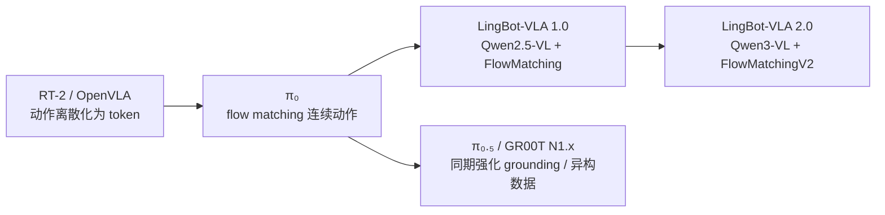

**直觉例子**：把「抓杯子」的关节轨迹看成一条曲线。早期方法把曲线切成离散词表（像打字）；π₀ 起改为学习「从噪声曲线流向真实曲线」的速度场——这就是 flow matching。2.0 继承该范式，并把视觉语言骨干从 Qwen2.5-VL 升到 Qwen3-VL（代码：`LingbotVLAV2Config.vlm_family = "qwen3_vl"`）。

| 阶段 | 优点 | 缺点 | 适合场景 |
|------|------|------|----------|
| 离散 token VLA | 与 LLM 训练栈统一 | 动作精度受词表限制 | 粗粒度导航、简单抓取 |
| π₀ 式 flow matching | 连续、可多步去噪、chunk 预测 | 推理需多步 Euler；对归一化敏感 | 精细操作、高频控制 |
| LingBot-VLA 1.0 | 已有统一训练/部署栈 | 构型覆盖与 grounding 弱于 2.0 | 双臂后训练基线 |
| **LingBot-VLA 2.0** | 更强 VLM + MoE + 未来蒸馏 | 系统复杂、教师模型依赖 | 跨构型、全身、长时域移动操作 |

### 2.2 动作专家容量：Dense → 语义硬分 MoE → Token 稀疏 MoE

跨构型预训练时，同一套网络要同时消化「Franka 单臂」「人形全身」「带底盘移动」等动力学差异。单纯加宽 Dense FFN 成本高；按构型/任务硬分专家又容易过早绑定语义、难迁移。

2.0 选择：**在 action expert 的每一层 MLP 上做 token 级 Top-K 路由**，并保留一个 **shared expert** 承载通用先验；负载均衡用 **routing correction bias**（非辅助损失），与 DeepSeek-V3 / arXiv:2408.15664 同族。

| 路线 | 优点 | 缺点 | 适合场景 |
|------|------|------|----------|
| Dense FFN | 实现简单、路由无抖动 | 同 active 参数下容量利用率低 | 单构型、小数据后训练 |
| 语义硬分 MoE（按构型/任务/场景） | 可解释、易做专家并行 | 专家语义预设错误会伤泛化 | 构型差异极大且标签清晰 |
| **Token 稀疏 MoE（2.0）** | 同 active params 下 loss/误差更低；不预设语义 | 路由需 FP32、需监控死专家 | 大规模异构预训练 |

同期还有 ForceVLA（力觉）、HiMoE-VLA / Being-H0.5（人形异构）、SAMoE-VLA（场景路由）等；2.0 的差异化在于：**路由粒度在 action token，且不预设专家语义**。

### 2.3 预测与表征：世界模型 / 潜在动作 → 双查询代理任务

完整世界模型（预测像素或潜在状态再规划）表达力强，但训练贵、与策略耦合重。2.0 采用更轻的 **proxy task**：在 VLM prefix 里插入可学习 query \([Q_t, Q_{t+T}]\)，分别对齐当前/未来的深度特征与视频特征；动作生成仍走 flow matching，且可通过注意力掩码 **禁止 action suffix 看见未来 query**，避免「偷看答案」。

| 路线 | 优点 | 缺点 | 适合场景 |
|------|------|------|----------|
| 显式世界模型 | 可开环想象、可规划 | 算力与误差累积 | 长时域规划研究 |
| 潜在动作（LDA 等） | 人类视频可迁移 | 潜在空间可解释性弱 | 人类视频预训练 |
| 几何监督（GEM 等） | 提升 3D 感知 | 未必直接提升动作 | 需要深度/接触的操作 |
| **Dual-query 蒸馏（2.0）** | 与 VLA 同栈；教师冻结；可隔离未来泄漏 | 依赖教师质量；权重需调 | 需要时空 grounding 的操作策略 |

---

## 3. 横向对比：同期同类怎么选

### 3.1 GM-100 双臂 generalist（论文 Table）

设定：每构型 **单一策略混合训练全部 9 任务**；指标为 progress / success（%）。

| 平台 | GR00T N1.7 | π₀.₅ | LingBot-VLA-1.0 | **LingBot-VLA-2.0** |
|------|------------|------|-----------------|---------------------|
| Agilex Cobot Magic | 36.3 / 17.8 | 59.1 / 32.2 | 58.2 / 30.0 | **66.2 / 34.4** |
| Galaxea R1 Pro | 16.4 / 5.6 | 27.4 / 8.9 | 32.7 / 15.6 | **34.6 / 15.6** |

亮点任务（Agilex）：Retrieve keychain 100/100（v1: 67.5/60）；Pick out toy bone 95/90（v1: 77.5/70）。论文归因于 **更强 VLM grounding + 未来信息条件化**；同时指出 progress≪success 的任务仍卡在精确放置/释放，且两平台差距大（构型/相机/动作对齐仍难）。

### 3.2 长时域移动操作（vs π₀.₅）

| 构型 / 任务 | 设定 | 2.0 | π₀.₅ |
|-------------|------|-----|------|
| Astribot S1 / 冰箱分拣 | ID | **77.1 / 60.0** | 65.3 / 46.7 |
| Astribot S1 / 冰箱分拣 | OOD（±10cm + 未见物体） | **37.0 / 13.3** | 30.3 / 6.7 |
| Cobot Magic-ARX X5 / 灶台清洁 | ID | **84.3 / 66.7** | 79.9 / 60.0 |
| Cobot Magic-ARX X5 / 灶台清洁 | OOD（±10cm） | **67.5 / 40.0** | 62.5 / 33.3 |

### 3.3 架构维度对照

| 维度 | π₀ / π₀.₅ | GR00T N1.x | 语义 MoE VLA | **LingBot-VLA 2.0** |
|------|-----------|------------|--------------|---------------------|
| 动作空间 | 多为双臂/平台相关 | 人形友好 | 视具体工作 | **55 维全身 canonical** |
| 容量扩展 | Dense / 平台设计 | 平台设计 | 硬语义专家 | **Token MoE + shared** |
| 未来建模 | 视版本 | 视版本 | 少见 | **Dual-query 蒸馏** |
| 人类视频 | 部分系列有 | 有 | 视工作 | **10k h egocentric + MANO/SLAM** |

**选型建议（实践）**：

- 单机型、数据少、要快迭代 → Dense + 相对关节动作即可；
- 构型标签清晰、专家要可解释 → 语义硬分 MoE；
- 大规模异构预训练、全身 DoF、要长时域移动操作 → **2.0 路线**。

---

## 4. 方法精讲：论文公式 ↔ 本仓库代码

### 4.1 数据工程与 55 维统一动作空间

#### 论文侧

- 机器人：原始 ~90k h → 过滤后 **50k h**，20 种构型；过滤含 jerk/Z-score、静止片段、URDF 投影一致性、视频质量。
- 人类：~20k h → **~10k h**；VLM 预过滤 +（有标签）轨迹整理 /（无标签）egocentric SLAM + MANO；世界坐标存储，训练时变到当前相机系：

\[
\mathbf{p}_{\tau}^{C_t} = \mathbf{T}_{C_t \leftarrow W}\,\mathbf{p}_{\tau}^{W}
\]

- 标注：Qwen3.6-27B 做 subtask 切分与语言指令；闭集原子动作 + 对象；`idle` 过滤。

#### 55 维槽位

| 组件 | 维数 | 含义 |
|------|------|------|
| arm.position | 14 | 双臂关节（单臂 pad） |
| end.position | 14 | 末端位姿（每臂 XYZ+quat） |
| effector.position | 2 | 夹爪 |
| hand.position | 12 | 灵巧手 |
| waist.position | 4 | 腰 |
| head.position | 2 | 头 |
| base.position | 3 | 底盘 |
| reserved | 4 | 预留 |
| **合计** | **55** | |

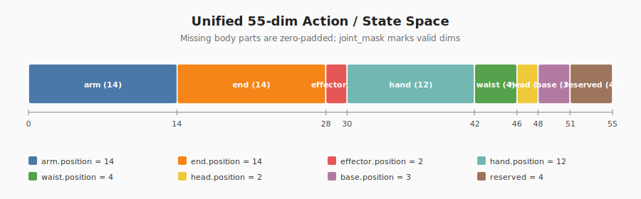

#### 代码侧：两层映射

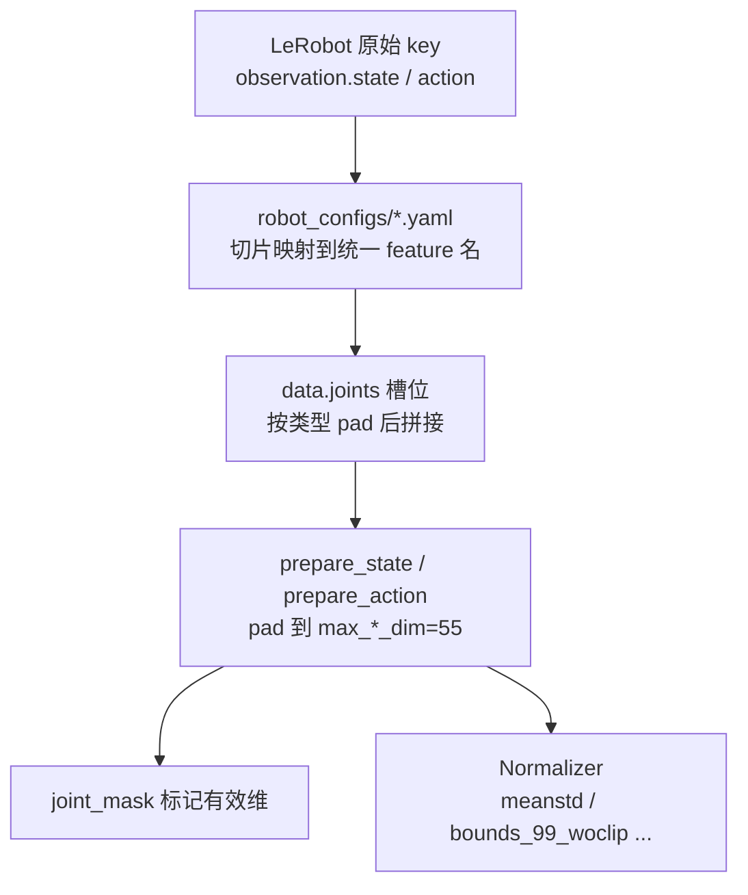

- 映射与 pad：[`lingbotvla/data/vla_data/utils.py`](../../lingbotvla/data/vla_data/utils.py) 中 `FeatureTransform`
- 最终 pad：[`transform.py`](../../lingbotvla/data/vla_data/transform.py) 的 `prepare_action`
- RoboTwin 后训练只用 arm/end/effector 三类（其余维为 0），见 [`configs/vla/robotwin/robotwin.yaml`](../../configs/vla/robotwin/robotwin.yaml)
- 真机常用 `subtract_state: true` 学 **相对关节动作**（见 `agilex_cobot_magic.yaml`）；仿真 RoboTwin 示例为绝对动作

**例子**：AgileX 双臂实际只有 12 维臂关节 + 2 维夹爪。robot config 把原始向量切成 `arm.position` / `effector.position`；`data.joints` 把 arm pad 到 14、end 槽位全 0；最后整体 pad 到 55，并用 `joint_mask` 在 loss 里屏蔽无效维。

---

### 4.2 Flow Matching 动作专家（论文未写公式，以代码为准）

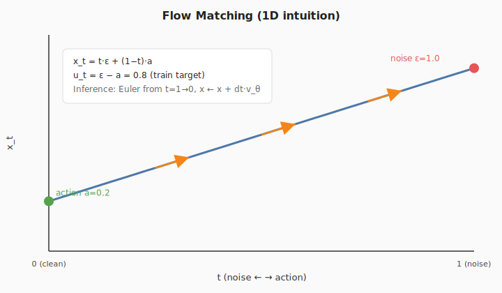

训练时对动作 chunk \(a\) 采样噪声 \(\varepsilon\) 与时间 \(t\sim\mathrm{Beta}(1.5,1)\) 再缩放到 \([0.001,1]\)：

\[
x_t = t\,\varepsilon + (1-t)\,a,\qquad u_t = \varepsilon - a
\]

网络预测速度场 \(v_\theta(x_t,t,\text{obs})\)，损失为 MSE（`fm`）或 L1（`L1_fm`）。

对应实现（`FlowMatchingV2.forward`）：

```793:794:lingbotvla/models/vla/lingbot_vla/modeling_lingbot_vla_v2.py
        x_t = time_expanded * noise + (1 - time_expanded) * actions
        u_t = noise - actions
```

```908:911:lingbotvla/models/vla/lingbot_vla/modeling_lingbot_vla_v2.py
        if loss_type == "fm":
            losses = F.mse_loss(u_t, v_t, reduction="none")
        elif loss_type == "L1_fm":
            losses = F.l1_loss(u_t, v_t, reduction="none")
```

时间采样继承自 v1：

```1055:1058:lingbotvla/models/vla/lingbot_vla/modeling_lingbot_vla.py
    def sample_time(self, bsize, device):
        time_beta = sample_beta(1.5, 1.0, bsize, device)
        time = time_beta * 0.999 + 0.001
        return time.to(dtype=torch.float32, device=device)
```

配置默认（[`configuration_lingbot_vla.py`](../../lingbotvla/models/vla/lingbot_vla/configuration_lingbot_vla.py)）：`chunk_size = n_action_steps = 50`，推理去噪步数 `num_steps = 10`。训练 YAML 将 `max_action_dim` / `max_state_dim` 覆盖为 **55**（类默认值仅为 14）。

**推理**：从 \(x_1=\varepsilon\) 出发，Euler 积分 \(x\leftarrow x+\Delta t\cdot v_\theta\)，\(\Delta t=-1/N\)，默认 \(N=\) `config.num_steps`：

```971:1000:lingbotvla/models/vla/lingbot_vla/modeling_lingbot_vla_v2.py
        dt = torch.tensor(-1.0 / self.config.num_steps, dtype=dtype, device=device)
        x_t = noise
        time = torch.tensor(1.0, dtype=dtype, device=device)
        ...
        while time >= -dt / 2:
            ...
            v_t = predict_velocity_fn(...)
            x_t += dt * v_t
            time += dt
```

**Suffix 构造**（状态 + 噪声动作 + 时间）：`embed_suffix` 将 `state_proj(state)` 与 `action_time_mlp(action_in_proj(x_t), sin_time)` 拼接，再经联合注意力后由 `action_out_proj` 得到 \(v_t\)。

RoboTwin 配置：`loss_type: L1_fm`，`adanorm_time: true`。

---

### 4.3 Token-level MoE

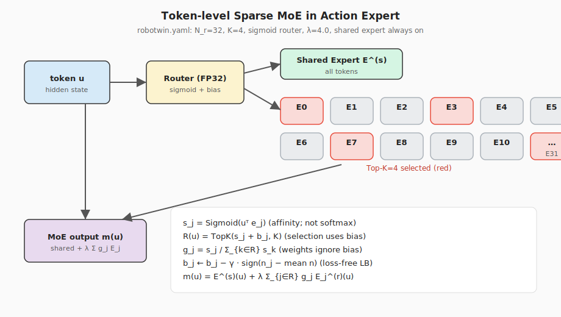

#### 论文公式

专家为 SwiGLU；层 \(\ell\)、token \(t\)：

\[
m_\ell(u_{\ell,t})
= E_\ell^{(s)}(u_{\ell,t})
+ \lambda\sum_{j\in\mathcal{R}(u_{\ell,t})}
g_{\ell,j}(u_{\ell,t})\,E_{\ell,j}^{(r)}(u_{\ell,t})
\]

亲和度用 **Sigmoid**（非 Softmax，减弱强竞争）：

\[
s_{\ell,j}=\sigma(u^\top e_{\ell,j})
\]

选择用偏置、混合权重无偏置：

\[
\mathcal{R}=\mathrm{TopK}(s_j+b_j,K),\quad
g_j=\frac{s_j}{\sum_{k\in\mathcal{R}}s_k}
\]

Bias 更新（loss-free）：

\[
b_j\leftarrow b_j-\gamma\cdot\mathrm{sign}\Big(n_j-\tfrac{1}{N_r}\sum_k n_k\Big)
\]

#### 代码安装与前向

安装：把指定层的 `mlp` 换成 `Qwen2TokenMoeBlock`：

```170:195:lingbotvla/models/vla/lingbot_vla/modeling_lingbot_vla_v2.py
    def _install_moe_blocks(self):
        ...
            for idx in token_moe_layers:
                self.qwen_expert.model.layers[idx].mlp = Qwen2TokenMoeBlock(token_config)
```

路由核心：

```284:301:lingbotvla/models/vla/lingbot_vla/qwen2_action_expert.py
        with torch.amp.autocast(hidden_flat.device.type, enabled=False):
            router_logits = F.linear(hidden_flat.float(), self.gate.weight.float())
        if self._router_activation == 'sigmoid':
            routing_scores = router_logits.sigmoid()
        ...
        scores_for_choice = routing_scores + self.e_score_correction_bias.unsqueeze(0)
        _, selected_experts = torch.topk(scores_for_choice, self.top_k, dim=-1)
        routing_weights = routing_scores.gather(1, selected_experts)
        ...
        if self.routed_scaling_factor != 1.0:
            routing_weights = routing_weights * self.routed_scaling_factor
```

Shared expert 始终加在输出上（可选 gate）：

```356:359:lingbotvla/models/vla/lingbot_vla/qwen2_action_expert.py
        shared_expert_output = self.shared_expert(hidden_flat)
        if self._use_shared_expert_gate:
            shared_expert_output = F.sigmoid(self.shared_expert_gate(hidden_flat)) * shared_expert_output
        final_hidden_states = final_hidden_states + shared_expert_output
```

Bias **不走梯度**，由 optimizer pre-hook 更新：[`moe_load_balance.py`](../../lingbotvla/models/vla/lingbot_vla/moe_load_balance.py) 的 `build_moe_load_balance_hook`。

#### RoboTwin 后训练超参（代码配置）

| 项 | 值 | 含义 |
|----|-----|------|
| `token_moe_layers` | 0..35（全部 36 层） | 全层 MoE |
| `token_num_experts` | 32 | \(N_r\) |
| `token_top_k` | 4 | \(K\) |
| `token_moe_intermediate_size` | 512 | routed 中间维 |
| `token_shared_intermediate_size` | 704 | shared 中间维 |
| `router_activation` | sigmoid | 与论文一致 |
| `routed_scaling_factor` | 4.0 | \(\lambda\) |
| `bias_update_speed` | **0**（后训练） | 冻结 bias，沿用预训练均衡 |
| `sequence_wise_loss_coeff` | 1e-3 | 序列级均衡辅助项 |
| `router_z_loss_coeff` | 1e-4 | router z-loss |
| `use_shared_expert_gate` | false | shared 无额外 gate |
| `moe_implementation` | fused | 融合 kernel |

---

### 4.4 Dual-Query 时空蒸馏

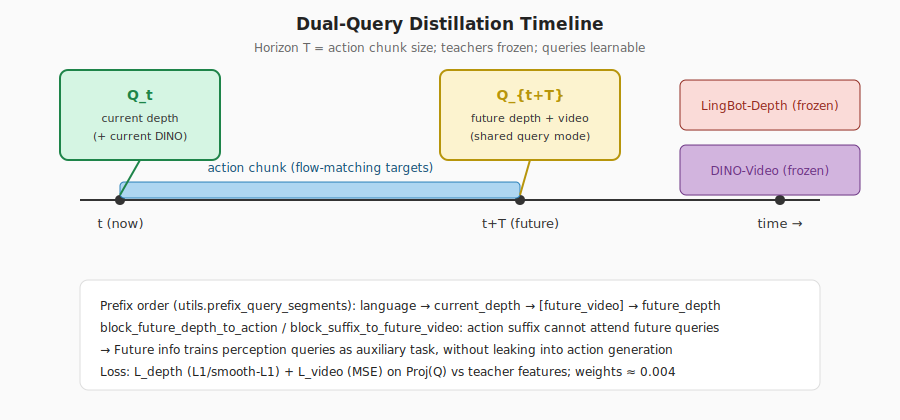

#### 论文

可学习 query \([Q_t, Q_{t+T}]\)，\(T=\) action chunk：

\[
\mathcal{L}_{depth}=\mathbb{E}\big[\|Proj_d(Q_t)-D_t\|_1+\|Proj_d(Q_{t+T})-D_{t+T}\|_1\big]
\]

\[
\mathcal{L}_{video}=\mathbb{E}\big[\|Proj_v(Q_t)-Z_t\|_F^2+\|Proj_v(Q_{t+T})-Z_{t+T}\|_F^2\big]
\]

DINO-Video：DINOv3 + causal temporal attention + 3D-RoPE；LARYBench 上 robot 侧优于 V-JEPA 2 / DINOv3。

#### 代码：prefix 布局与隔离

`prefix_query_segments` 规定语言之后的 query 顺序：

```97:122:lingbotvla/models/vla/lingbot_vla/utils.py
def prefix_query_segments(...):
    segments = ["language"]
    ...
    segments.append("current_depth")
    if use_future_video:
        ...
    if use_future_depth:
        ...
```

训练时用 `block_suffix_to_fv_` / `block_future_depth_to_action` 把 **action suffix → 未来 query** 的注意力置 False，使未来信息只服务蒸馏、不直接泄漏给动作头（见 `FlowMatchingV2.forward` 818–830 行附近）。

教师在 [`module_utils.py`](../../lingbotvla/models/vla/vision_models/module_utils.py) 中 `requires_grad=False` + `eval()`；目标特征 `.detach()` 后与 `TaskTokenDepthHead` 预测对齐。

RoboTwin `align_params` 要点：`num_task_tokens=8`；depth/video 权重均为 **0.004**；`share_future_depth_query=true`；`block_future_depth_to_action=true`；`block_suffix_to_future_video=true`。

---

## 5. 静态架构

### 5.1 组件图

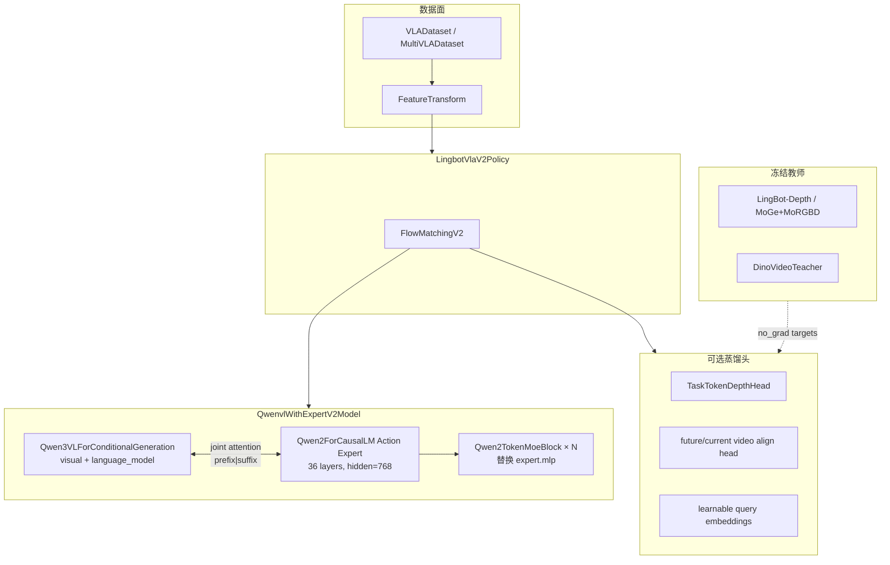

### 5.2 类职责

| 类 | 文件 | 职责 |
|----|------|------|
| `LingbotVLAV2Config` | `configuration_lingbot_vla.py` | Qwen3-VL 默认；`architectures=["LingbotVlaV2Policy"]` |
| `LingbotVlaV2Policy` | `modeling_lingbot_vla_v2.py` | 训练入口：组总损失、暴露 `sample_actions`；`ModelClass` 注册 |
| `FlowMatchingV2` | 同上 | FM 插值、prefix/suffix、蒸馏分支、Euler 采样 |
| `QwenvlWithExpertV2Model` | 同上 | 双塔联合注意力、MoE 安装、`set_requires_grad` |
| `Qwen2TokenMoeBlock` | `qwen2_action_expert.py` | Token 路由 + shared/routed experts |
| `FeatureTransform` | `data/vla_data/utils.py` | 特征映射、归一化、pad、反变换 |
| `LingBotVlaV2InferencePolicy` | `deploy/lingbot_vla_v2_policy.py` | 部署包装 + WebSocket |

### 5.3 包级职责

| 包/目录 | 职责 |
|---------|------|
| `lingbotvla/models/vla/lingbot_vla/` | VLA 模型、MoE、Qwen3 补丁 |
| `lingbotvla/models/vla/vision_models/` | 深度/视频教师与 align head |
| `lingbotvla/data/vla_data/` | LeRobot 加载、变换、多数据集 |
| `lingbotvla/distributed/` | FSDP2、MoE EP、Ulysses |
| `lingbotvla/ops/` | 融合 MoE / attention / loss |
| `tasks/vla/train_lingbotvla.py` | 训练主循环 |
| `deploy/` | 推理服务 |
| `configs/` | YAML 训练与 robot 映射 |

### 5.4 v1 → v2 差异（代码）

| 项 | v1 | v2 |
|----|----|----|
| Policy | `LingbotVlaPolicy` | `LingbotVlaV2Policy` |
| VLM | Qwen2.5-VL | **Qwen3-VL** |
| 核心 | `FlowMatching` | `FlowMatchingV2` |
| 位置编码 | 1D cumsum | Qwen3 MRoPE + deepstack |
| 默认 attention | `flex` | `flex_cached` |

---

## 6. 动态架构

### 6.1 训练数据流与序列

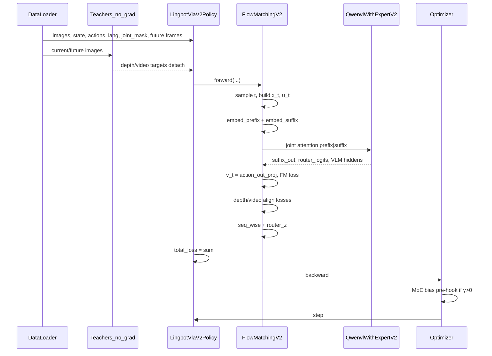

### 6.2 Forward 阶段（组件调用）

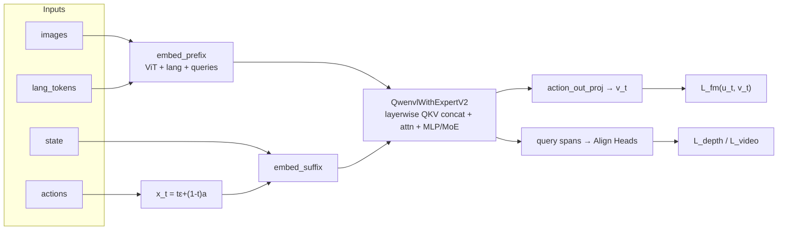

联合注意力要点（`QwenvlWithExpertV2Model.forward`）：每层分别算两塔 Q/K/V → concat → 应用 MRoPE → flex/eager attention → 切回两塔；VLM 侧可 `_apply_deepstack` 注入视觉特征；action 侧 MLP 可能返回 `router_logits`。

### 6.3 总损失

\[
$$\mathcal{L}
=
\mathcal{L}_{\mathrm{fm}}
+\lambda_d\mathcal{L}_{\mathrm{depth}}
+\lambda_{fd}\mathcal{L}_{\mathrm{future\_depth}}
+\lambda_v\mathcal{L}_{\mathrm{video}}
+\mathcal{L}_{\mathrm{seq}}
+\mathcal{L}_{z}$$
\]

```python
#1305:1312:lingbotvla/models/vla/lingbot_vla/modeling_lingbot_vla_v2.py
        total_loss = (
            loss_vla
            + loss_depth
            + loss_future_depth
            + loss_future_video
            + seq_wise_loss
            + router_z_loss
        )
```

`joint_mask` 存在时，对 \(\mathcal{L}_{\mathrm{fm}}\) 按有效关节维掩码平均，避免 pad 维污染梯度。

### 6.4 Backward：谁更新、谁冻结

| 模块 | 默认 | 控制 |
|------|------|------|
| Qwen3-VL ViT | 可训练 | `freeze_vision_encoder` / 训练脚本 `freeze_vit` |
| Qwen3-VL LLM | 可训练 | `train_expert_only=True` 则整塔冻结 |
| Action Expert + MoE | 可训练 | `use_moe_expert_lr` 可独立 LR |
| Align heads + query emb | 可训练（开 align 时） | — |
| `e_score_correction_bias` | **非梯度**；hook 更新 | `bias_update_speed=0` 则固定 |
| Depth / Video 教师 | **冻结** | `torch.no_grad()` 提特征 |
| `state_proj` | 可训练 | `train_state_proj=False` |

```197:205:lingbotvla/models/vla/lingbot_vla/modeling_lingbot_vla_v2.py
    def set_requires_grad(self):
        if self.config.freeze_vision_encoder:
            self.qwenvl.visual.eval()
            for params in self.qwenvl.visual.parameters():
                params.requires_grad = False
        if self.config.train_expert_only:
            self.qwenvl.eval()
            for params in self.qwenvl.parameters():
                params.requires_grad = False
```

**梯度流直觉**：\(\mathcal{L}_{\mathrm{fm}}\) 主要更新 action expert（及未冻结的 VLM，因联合注意力）；蒸馏损失经 query / align head 回传到 VLM hidden（教师无梯度）；MoE bias 在 `optimizer.step` 前由 hook 根据 token 计数符号更新。

### 6.5 推理序列（部署）

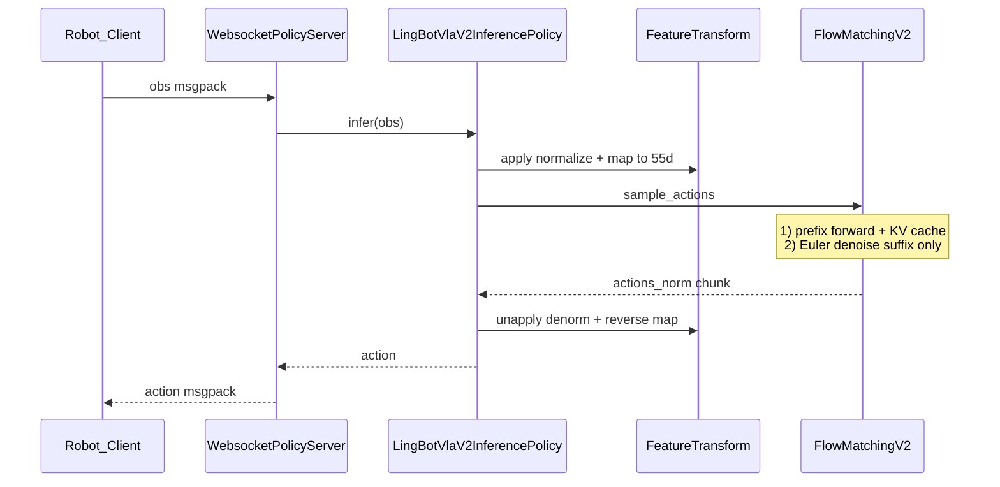

部署入口：`python -m deploy.lingbot_vla_v2_policy`；可 `torch.compile`；推理切 `eager` attention、`use_cache=True`。蒸馏 loss 不计算，但 prefix 仍可含 query token（与训练布局一致）。

---

## 7. 消融分析：什么有效、什么更有效

### 7.1 MoE vs Dense（同 active 参数）

论文图 `fig:vla_loss_dense_vs_moe`：MoE 预训练 loss 更低，GM-100 验证 action error 更低。结论：**增益来自稀疏容量分配，而非单纯堆参数**。代码侧用 32 experts / top-4 / shared，与该结论一致。

### 7.2 动作表示四因素（4 个 GM-100 真机任务平均 Success）

| 因素 | 更优 | SR | 对比 | SR | 相对有效性 |
|------|------|-----|------|-----|------------|
| Action target | **relQpos** | **55.0%** | absQpos | 33.7% | **最显著**（+21.3）；rel 的 std 仅为 abs 的 31%–37% |
| Normalization | **MeanStd** | **55.0%** | MinMax / Q01–Q99 | 47.5% / 47.4% | 高；MeanStd 归一化后 std≈0.95，保留长尾修正 |
| Loss | **L2** | **55.0%** | L1 | 46.4% | 高（relQpos 小幅修正）；Squeeze Ketchup 上 L1 更好 |
| Action space | EEF 略优 | 56.0% | Joint | 55.0% | **弱 / 任务依赖** |

任务级 Joint vs EEF：

| 任务 | 更优 | 说明 |
|------|------|------|
| Barcode Scan | Joint（58.7 vs 24.0） | 扫描姿态更像关节协调 |
| Squeeze Ketchup | EEF（81.7 vs 41.7） | 瓶口朝向更像笛卡尔 |
| Scoop Rice | EEF | 即使 distribution gap 更大仍更好 |
| Take Bowl | Joint | gap 相近时关节仍更稳 |

论文用 distribution alignment gap 解释部分偏好，但 Scoop Rice 表明 **gap 不是唯一决定因素**。

### 7.3 Dual-query 感知结果

`fig:vis_distillation`：因果推理下可可视化当前/未来 depth 与 DINO-Video-PCA，与 GT 对齐。论文强调：感知输出 **不是动作生成的硬依赖**，但证明 query 机制确实学到了语义+几何。代码用注意力隔离强化这一点。

### 7.4 与仓库默认配置的对照（实践配方）

| 旋钮 | 论文消融偏好 | 仓库后训练默认（robotwin） | 建议 |
|------|--------------|---------------------------|------|
| 相对/绝对动作 | relQpos 远强 | 仿真绝对；真机推荐 arm `subtract_state: true` | **真机优先相对关节** |
| 归一化 | MeanStd | `bounds_99_woclip` | 按数据分布选；真机模板多用 meanstd |
| FM 损失 | 消融偏 L2 | `L1_fm` | 两者都合理；以验证集为准 |
| MoE | 有效 | 全开 32/4 | 小数据可关 MoE 降复杂度 |
| 蒸馏权重 | 定性有效 | 0.004 量级 | 先保证 FM 收敛，再微调 λ |
| bias 更新 | 预训练需要 | 后训练 `bias_update_speed: 0` | 后训练冻结 bias 更稳 |

**优先级建议**：数据质量与 rel/abs 选择 ≫ 归一化/损失 ≫ MoE 容量 ≫ 蒸馏权重；Joint/EEF 按任务试，不要一刀切。

---

## 8. 端到端实践地图（本仓库）

### 8.1 环境

```bash
bash tools/create_train_env.sh
# 或
bash tools/create_train_env.sh --env-name lingbotvla --recreate
```

### 8.2 归一化统计

```bash
CUDA_VISIBLE_DEVICES=0 bash train.sh scripts/compute_norm_stats.py \
  ./configs/vla/robotwin/robotwin.yaml \
  --data.data_name multi \
  --data.train_path assets/training_data/robotwin.txt \
  --data.norm_path assets/norm_stats/robotwin.json \
  --data.data_ratio_for_norm_compute 1
```

### 8.3 后训练

```bash
bash train.sh tasks/vla/train_lingbotvla.py ./configs/vla/robotwin/robotwin.yaml \
  --data.train_path assets/training_data/robotwin.txt \
  --data.data_name multi \
  --train.output_dir output/
```

`train.sh`：自动检测 GPU → `torchrun`；默认 `HF_HUB_OFFLINE=1`。并行默认 **FSDP2**。

### 8.4 开环评估 / 部署

```bash
export QWEN3_PATH=Qwen/Qwen3-VL-4B-Instruct
python scripts/open_loop_eval.py \
  --model_path path_to_ckpt --robo_name robotwin \
  --data_path path_to_val_data --use_length 50

export QWEN3VL_PATH=path_to_Qwen3-VL-4B-Instruct
python -m deploy.lingbot_vla_v2_policy \
  --model_path path_to_ckpt --use_compile --use_length 25 --port 8080
```

### 8.5 配置导航

| 文件 | 用途 |
|------|------|
| `configs/vla/robotwin/robotwin.yaml` | 仿真后训练（MoE+蒸馏） |
| `configs/vla/real_robot/real_robot.yaml` | 真机 / 更完整 joints |
| `configs/robot_configs/*.yaml` | 原始特征 → 统一空间 |
| `configs/vla/Training_Config.md` | 训练参数说明 |

多数据集列表格式：`<robot_config_name> <lerobot_path>`，见 `assets/training_data/robotwin.txt`。

---

## 9. 总结与局限

### 9.1 一句话总结

LingBot-VLA 2.0 用 **大规模跨构型数据 + 55 维全身动作空间 + token 稀疏 MoE 动作专家 + 双查询深度/视频蒸馏**，把 VLA 从「实验室双臂演示」推向「可覆盖头/腰/底盘/灵巧手的应用向基础模型」；本仓库以 Qwen3-VL + FlowMatchingV2 实现该设计，并提供从 LeRobot 数据到 WebSocket 部署的完整栈。

### 9.2 论文与代码的已知缺口

- TeX 包 **未包含** `figures/` 实体文件；本文用自绘 SVG（[`asset/`](asset/)）与 mermaid 补齐直觉图。
- 论文 method **未展开** flow matching 公式与 MoE 数值超参；本文以 `modeling_lingbot_vla_v2.py` / `robotwin.yaml` 为准补全。
- 预训练步数、全局 batch、完整学习率日程等未在 TeX 中系统给出；后训练超参以仓库 YAML 为准。
- 消融中 MeanStd/L2 与后训练默认 `bounds_99_woclip`/`L1_fm` 不完全一致——说明 **消融最优 ≠ 所有设定的全局最优**，需按数据域验证。

### 9.3 辅助脚本

| 脚本 | 输出 |
|------|------|
| `asset/plot_55dim_action_space.py` | `action_space_55dim.svg` |
| `asset/plot_flow_matching_1d.py` | `flow_matching_1d.svg` |
| `asset/plot_moe_routing.py` | `moe_routing.svg` |
| `asset/plot_dual_query_timeline.py` | `dual_query_timeline.svg` |

```bash
cd b/d/LingbotVLA2/asset && python3 plot_55dim_action_space.py \
  && python3 plot_flow_matching_1d.py \
  && python3 plot_moe_routing.py \
  && python3 plot_dual_query_timeline.py
```

（仅依赖 Python 标准库。）

---

## 10. 文本与指令处理：条件编码而非 CoT

### 10.1 一句话结论

把「抓红色杯子」这类自然语言指令交给 LingBot-VLA 2.0 时，模型**不会**先写出一段 Chain-of-Thought / thinking / reasoning，再据此生成动作。语言路径是纯 **prefix 条件编码（conditioning）**：

\[
\text{task string}
\;\xrightarrow{\text{chat template + tokenize}}\;
\text{lang\_tokens}
\;\xrightarrow{\text{embed\_tokens}}\;
\text{prefix}
\;\xrightarrow{\text{joint attn}}\;
v_t
\]

最终监督与输出都是 **flow-matching 动作速度场** \(v_t\)（及可选的深度/视频蒸馏），**没有** next-token 语言损失，也**没有**自回归文本生成。

| 范式 | 典型行为 | 本仓库 VLA 主路径 |
|------|----------|-------------------|
| LLM Agent / 部分「先想后做」VLA | 生成中间推理文本，再解析动作 | **否** |
| 带 LM head 的 VLM 微调 | 对 instruction/response 做 CE | **否**（默认删 `lm_head`） |
| **Prefix conditioning VLA** | 指令只作条件，直接预测连续动作 | **是** |

易混淆三点（后文展开）：

1. `num_task_tokens` / depth–video query 是 **蒸馏对齐 query**，不是语言 CoT token；
2. 论文用 Qwen3.6-27B **离线标注** subtask/指令，不在训练 `forward` 里跑推理链；
3. `lingbotvla/data/chat_template.py` 服务于 Omni/多模态 LLM 路径（如 `train_pi0` 相关），**不是** `train_lingbotvla` 主路径。

---

### 10.2 数据侧：instruction 从哪来

#### 10.2.1 LeRobot → `item["task"]`

每帧带有 `task_index`；`LeRobotDataset.__getitem__` 查元数据任务表，写成字符串：

```158:160:lingbotvla/data/vla_data/base_dataset.py
        # Add task as a string
        task_idx = item["task_index"].item()
        item["task"] = _get_task_name(self.meta.tasks, task_idx)
```

`subtask` 虽可能存在于数据集 schema，但在 `VLADataset.get_features` 中与 `task` 一并从「要加载的 feature 列表」里排除（`task` 另由上面逻辑注入）；**没有任何代码把 `subtask` 读进 prompt**。

#### 10.2.2 `FeatureTransform`：固定用全局 task

`pad_and_concat` 把 prompt 设为全局任务名：

```596:606:lingbotvla/data/vla_data/utils.py
        batch_dict =  {
            "image": images,
            "future_image": future_images,
            "state": state,
            "action": action,
            "action_is_pad": item['action_is_pad'],
            'chunk_joint_mask': chunk_joint_mask,
            "action_joint_mask": action_joint_mask,
            "state_joint_mask": state_joint_mask,
            "prompt": [item["task"]],
        }
```

随后 `FeatureTransform.apply` 调用 `prepare_language(...)` 得到 `lang_tokens` / `lang_masks`。

#### 10.2.3 `prompt_type`：配置有意图，接线未完成

[`multi_vla_dataset.py`](../../lingbotvla/data/vla_data/multi_vla_dataset.py) 按 `prompt_type ∈ {global, subtask, both}` 决定是否用 `use_subtask_as_prompt` 复制数据集：

```78:106:lingbotvla/data/vla_data/multi_vla_dataset.py
        if prompt_type =='both':
            use_subtask_as_prompt = [True, False]
        elif prompt_type =='global':
            use_subtask_as_prompt = [False]
        elif prompt_type =='subtask':
            use_subtask_as_prompt = [True]
        ...
                        use_subtask_as_prompt = _use_subtask_as_prompt,
```

但 `VLADataset.__init__` **接收该参数却从未 `self.use_subtask_as_prompt = ...`，也未传给 `FeatureTransform`**。因此：

- RoboTwin 默认 `prompt_type: global` 与当前实现一致（只用全局 `task`）；
- `subtask` / `both` **不会改变实际 prompt 内容**（`both` 仅可能重复同一份数据）。

#### 10.2.4 论文离线标注 vs 训练时加载

论文数据管线用 VLM（Qwen3.6-27B）做 subtask 切分与语言标注，属于 **数据准备阶段**。进入本仓库训练后，模型只消费已写入 LeRobot 的 `task`（及图像/状态/动作）；**训练 step 内不再调用外部 LLM 生成文本**。

---

### 10.3 Tokenization：`prepare_language`

核心实现：

```426:483:lingbotvla/data/vla_data/transform.py
def prepare_language(config, language_tokenizer, observation: dict[str, Tensor]):
    ...
    if prompt is not None and (lang_tokens is None or lang_masks is None):
        if getattr(config, "use_qwen3_chat_template", False):
            prompt = [
                language_tokenizer.apply_chat_template(
                    [{"role": "user", "content": p}],
                    tokenize=False,
                    add_generation_prompt=False,
                )
                for p in prompt
            ]
        else:
            prompt = [p if p.startswith("<bos>") else f"<bos>{p}" for p in prompt]
            prompt = [p if p.endswith("\n") else f"{p}\n" for p in prompt]
        tokenized_prompt = language_tokenizer.__call__(
            prompt,
            padding="max_length",
            padding_side="right",
            max_length=config.tokenizer_max_length,
            truncation=True,
            return_tensors="pt",
        )
        lang_tokens = tokenized_prompt["input_ids"].to(device=device)
        lang_masks = tokenized_prompt["attention_mask"].to(
            device=device, dtype=torch.bool
        )
```

| 项 | V2 行为 |
|----|---------|
| Chat template | `LingbotVLAV2Config` 默认 `use_qwen3_chat_template=True` |
| 对话格式 | **单轮** `role=user`，内容即任务字符串 |
| `add_generation_prompt` | **False** — 不追加 assistant 开头，明确不做「接着生成」 |
| 长度 | `tokenizer_max_length` 右 padding（RoboTwin：**72**） |
| 输出 | `lang_tokens`、`lang_masks`（True=有效 token） |
| 旁路 | 若 observation 已带 `lang_tokens`/`lang_masks`，跳过 tokenize |

Tokenizer 来自 `model.tokenizer_path`（通常为 Qwen3-VL-4B-Instruct）；`LingbotVlaV2Policy` 内也会 `AutoTokenizer.from_pretrained(config.tokenizer_path)`。

**直觉例子**：`task = "pick up the red cup"` 先被包成 Qwen3 的 user 消息模板字符串，再 pad/truncate 到长度 72，得到一串整数 id。这串 id **只进 embedding 表**，不会再经 `lm_head` 解码回文字。

---

### 10.4 静态结构：组件与依赖

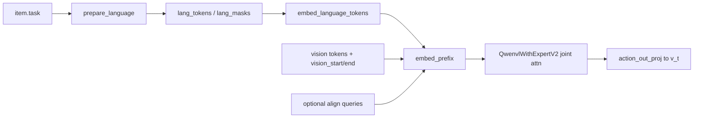

| 组件 | 文件 / 符号 | 职责 |
|------|-------------|------|
| `LeRobotDataset` / `VLADataset` | `base_dataset.py` | 注入 `task`；组样本 |
| `FeatureTransform` | `utils.py` | `prompt=[task]` → 调用 `prepare_language` |
| `prepare_language` | `transform.py` | chat template + tokenize |
| `LingbotVlaV2Policy` | `modeling_lingbot_vla_v2.py` | 持有 tokenizer；组装总损失；**删除 lm_head** |
| `FlowMatchingV2.embed_prefix` | 同上 | 图像 + 语言 +（可选）query → prefix |
| `QwenvlWithExpertV2Model.embed_language_tokens` | 同上 | `language_model.embed_tokens(tokens)` |
| `QwenvlWithExpertV2Model.forward` | 同上 | VLM 与 action expert 联合注意力 |

**`lm_head` 处理（关键）**：

```1224:1226:lingbotvla/models/vla/lingbot_vla/modeling_lingbot_vla_v2.py
        if not getattr(self.config, "use_lm_head", False):
            del self.model.qwenvl_with_expert.qwenvl.lm_head
        del self.model.qwenvl_with_expert.qwen_expert.lm_head
```

默认 `use_lm_head=False`：VLM 的 `lm_head` 被删；action expert 的 `lm_head` **始终删除**。即便打开 `use_lm_head`，当前 VLA `forward` 也 **没有** 调用它做 CE——仅可能 `tie_weights()`，无文本监督路径。

语言嵌入入口：

```257:258:lingbotvla/models/vla/lingbot_vla/modeling_lingbot_vla_v2.py
    def embed_language_tokens(self, tokens: torch.Tensor):
        return self.qwenvl.model.language_model.embed_tokens(tokens)
```

Prefix 中语言与视觉的拼接（无 align 时）：

```706:708:lingbotvla/models/vla/lingbot_vla/modeling_lingbot_vla_v2.py
            embs = torch.cat([img_emb, lang_emb], dim=1)
            pad_masks = torch.cat([image_pad_masks, lang_masks], dim=1)
            prefix_input_ids = torch.cat([fake_image_ids, lang_tokens.to(device)], dim=1)
```

有蒸馏时，`prefix_query_segments` 规定语言段在 query 之前：`language → current_depth → … → future_depth`（见第 4.4 节）。视觉侧另用 `vision_start` / `vision_end` / `image_token_id` 构造 fake ids 以配合 Qwen3 MRoPE。

---

### 10.5 动态结构：训练与推理

#### 训练序列

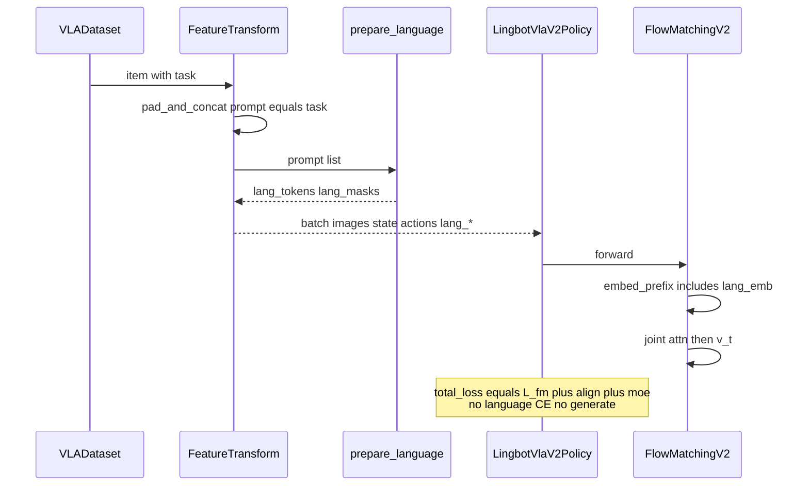

#### 推理序列

1. 观测需含 **`task`** 字段（`FeatureTransform.apply(..., policy_eval=True)` 走同一套 `pad_and_concat`）；
2. tokenize → `sample_actions`：先对 **含语言的 prefix** 做一次前向并填 KV cache，再只对 suffix 做 Euler 去噪；
3. Deploy **不调用** `model.generate()` / 不解码文本。

注意：若 WebSocket 客户端只传 `"prompt"` 而不传 `"task"`，当前 `pad_and_concat` **不会**读取该字段——应以 `task` 为准（或预先提供 `lang_tokens`/`lang_masks`）。

#### 静态长度 vs 动态有效长度

| 静态 | 动态 |
|------|------|
| `tokenizer_max_length` 固定 pad | 有效语言长度 = `lang_masks.sum()` |
| Prefix 段顺序固定 | 每相机 `image_grid_thw` 决定视觉 token 数 |
| Suffix = 1 state + `chunk_size` action tokens | `joint_mask` 随构型变化 |

---

### 10.6 Forward / Backward 细节

#### Forward（语言如何影响动作）

1. `lang_tokens` → `embed_tokens` → `lang_emb`；
2. 与图像 token（及可选 align query）组成 prefix；
3. `vlm_causal`：
   - `False`（类默认）：prefix 内 **双向**（`att_masks` 全 0）；
   - RoboTwin `vlm_causal: true`：prefix 内 **因果**（`att_masks` 全 1）；
4. 每层 VLM `language_model` 与 action expert **拼接 Q/K/V** 做联合注意力，再切回两塔；
5. 仅 suffix 末端经 `action_out_proj` 得到 \(v_t\)；语言 hidden **不**接到 vocab 投影。

因此指令的作用是：通过注意力改变 action expert 的表示，从而改变预测速度场——属于 **条件控制**，不是「先生成中间语言再执行」。

#### Backward（谁收到语言相关梯度）

| 模块 | 默认 | 说明 |
|------|------|------|
| `embed_tokens` + Qwen3-VL `language_model` | 可训练 | 梯度来自 \(\mathcal{L}_{\mathrm{fm}}\)（及 align），经联合注意力回传 |
| Qwen3-VL `visual` | 可训练 | 除非 `freeze_vision_encoder` |
| 整塔 VLM | 可冻结 | `train_expert_only=True` 时语言塔不更新 |
| `lm_head` | **不存在** | 无 vocab CE、无「对 instruction 做 NTP」的反传 |
| `lang_masks` | 非参数 | 只参与 padding / attention mask |

总损失回顾（无语言项）：

```1305:1312:lingbotvla/models/vla/lingbot_vla/modeling_lingbot_vla_v2.py
        total_loss = (
            loss_vla
            + loss_depth
            + loss_future_depth
            + loss_future_video
            + seq_wise_loss
            + router_z_loss
        )
```

训练日志可记录 `avg_lang_length`（有效 token 数统计），那是监控项，不是损失。

---

### 10.7 为何不是 CoT：代码证据清单

| 检查项 | 本仓库事实 |
|--------|------------|
| thinking / reasoning / scratchpad 模块 | **无**（检索命中多为 MoE intermediate 维或视觉 intermediate token） |
| 中间语言 token 自回归展开 | **无** |
| `use_lm_head` | 默认 **False**，且 `del qwenvl.lm_head` |
| `total_loss` 含 language CE | **否** |
| `add_generation_prompt` | **False** |
| 推理 `.generate()` | **未调用** |
| 蒸馏 `num_task_tokens` | 可学习 **视觉对齐 query**，`fake_align_ids` 用 `eos` 占位，**不是**自然语言推理链 |
| 论文 Qwen 标注 | **离线**数据工程，非训练时 CoT |

若把 CoT 比作「考试时先在草稿纸上写步骤再填答案」，本模型更像「读完题干（指令+图像）后直接在答题卡上画连续轨迹（动作）」，草稿纸（文本推理）从未启用。

---

### 10.8 与相关路径的边界

| 路径 | 是否 VLA v2 主训练 | 说明 |
|------|-------------------|------|
| `tasks/vla/train_lingbotvla.py` + `prepare_language` | **是** | 本章描述的条件编码路径 |
| `lingbotvla/data/chat_template.py` / `train_pi0.py` 多模态对话编码 | **否** | 另一套 messages → tokens 流程 |
| `Qwen3VLForConditionalGeneration` 自带 `GenerationMixin` | 类上存在 | 标准 VLA 初始化后 `lm_head` 已删，部署不走 generate |
| `prompt_type=subtask` | 配置存在 | **未接到** `FeatureTransform`；若要启用，需在 `VLADataset`/`FeatureTransform` 按标志选择 `item["subtask"]` vs `item["task"]`，并保证数据含该列 |

---

## 附录 A：关键符号

| 符号 | 含义 |
|------|------|
| \(a, x_t, u_t, v_t\) | 动作、插值状态、目标速度、预测速度 |
| \(N_r, K, \lambda, b_j\) | routed 专家数、Top-K、routed 缩放、负载偏置 |
| \(Q_t, Q_{t+T}\) | 当前/未来可学习 query |
| \(T\) | action chunk / 未来视野 |

## 附录 B：阅读代码的推荐顺序

1. `configs/vla/robotwin/robotwin.yaml` — 先建立超参地图  
2. `FeatureTransform.apply` — 数据如何变成 55 维  
3. `prepare_language`（`transform.py`）— 指令如何变成 `lang_tokens`（见第 10 章）  
4. `FlowMatchingV2.forward` — 一次训练 step  
5. `Qwen2TokenMoeBlock.forward` — MoE  
6. `depth_emb_forward` / `video_emb_forward` — 蒸馏  
7. `sample_actions` + `deploy/lingbot_vla_v2_policy.py` — 推理闭环  
