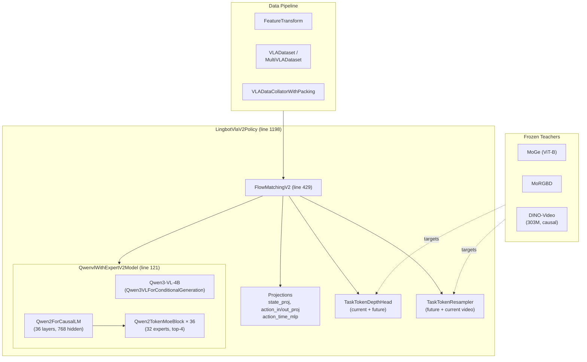
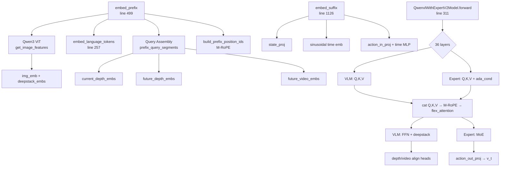
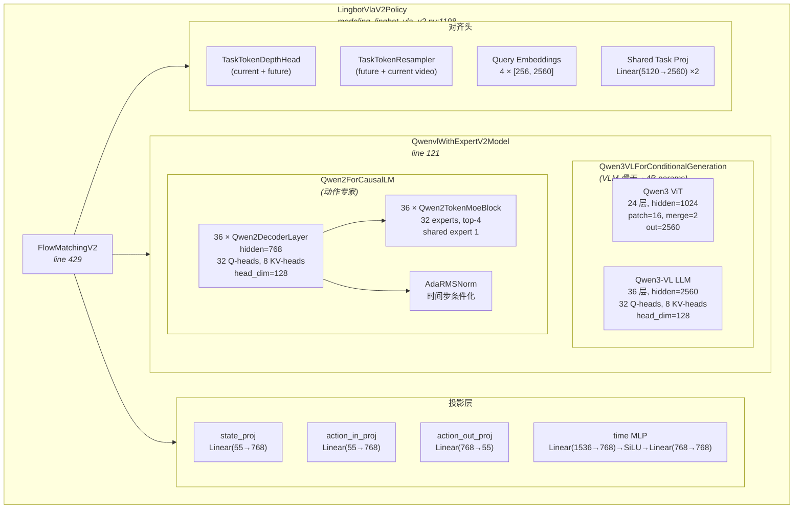
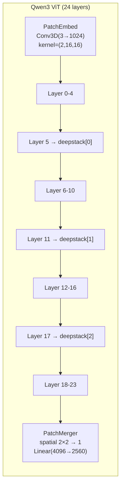
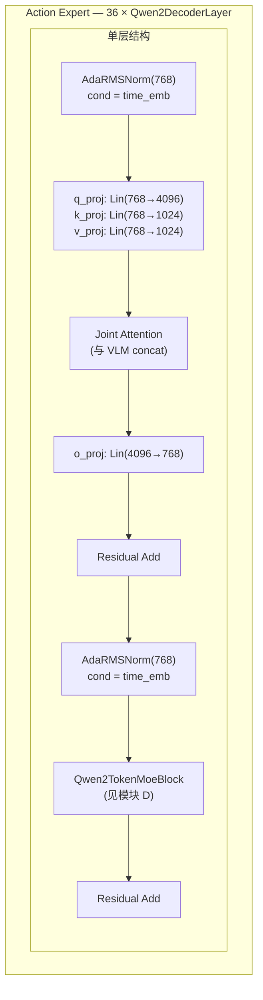
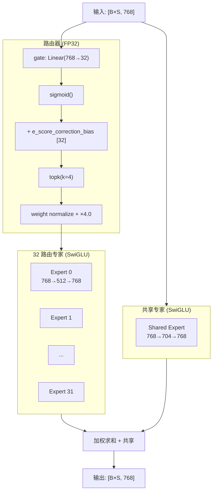
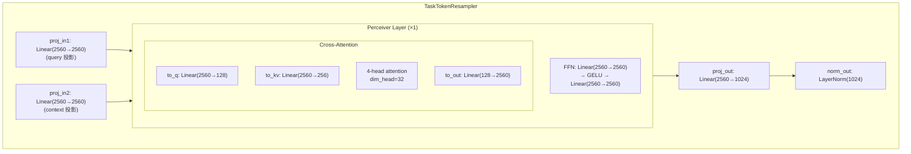

# LingBot-VLA 2.0 深度技术笔记 (改良版)

> **论文**: [From Foundation to Application: Improving VLA Models in Practice](https://arxiv.org/abs/2607.06403)
> **代码库**: [https://github.com/Robbyant/lingbot-vla-v2](https://github.com/Robbyant/lingbot-vla-v2)
> **模型权重**: [https://huggingface.co/robbyant/lingbot-vla-v2-6b](https://huggingface.co/robbyant/lingbot-vla-v2-6b)
> **项目主页**: [https://technology.robbyant.com/lingbot-vla-v2](https://technology.robbyant.com/lingbot-vla-v2)
>
> 本笔记以 **当前代码库** 为准, 深入交叉分析论文 TeX 源码与实现代码. 所有行号均基于当前 commit.

---

## 目录

- [Part I: 总览与背景](#part-i-总览与背景)
  - [1 导读：从实验室到应用的三道鸿沟](#1-导读从实验室到应用的三道鸿沟)
  - [2 纵向演进：三条技术线的来龙去脉](#2-纵向演进三条技术线的来龙去脉)
  - [3 横向对比：同期同类怎么选](#3-横向对比同期同类怎么选)
- [Part II: 数据工程](#part-ii-数据工程)
  - [4 数据工程](#4-数据工程)
- [Part III: 模型架构](#part-iii-模型架构)
  - [5 MoE-based VLA 模型](#5-moe-based-vla-模型)
  - [6 Dual-Query 时空蒸馏](#6-dual-query-时空蒸馏)
- [Part IV: 静态与动态架构](#part-iv-静态与动态架构)
  - [7 静态架构](#7-静态架构)
  - [8 动态架构](#8-动态架构)
- [Part V: 训练基础设施](#part-v-训练基础设施)
  - [9 训练基础设施](#9-训练基础设施)
- [Part VI: 分析](#part-vi-分析)
  - [10 消融分析](#10-消融分析)
- [Part VII: 实践指南](#part-vii-实践指南)
  - [11 端到端实践地图](#11-端到端实践地图)
  - [12 文本与指令处理](#12-文本与指令处理)
  - [13 三模态融合机制](#13-三模态融合机制)
- [附录](#附录)

---

# Part I: 总览与背景

## 1 导读：从实验室到应用的三道鸿沟

VLA (Vision-Language-Action) 模型要从实验室走向真实机器人部署, 需要跨越三道鸿沟:

| 鸿沟 | 问题 | LingBot-VLA 2.0 解法 |
|------|------|---------------------|
| **泛化性** | 不同任务/形态的机器人需要独立训练 | 60,000 小时预训练数据 (50k 机器人 + 10k 自中心视频), 20 种机器人形态, 55 维统一动作空间 |
| **高自由度动作** | 传统 VLA 仅支持 6-7 DoF 单臂 | 扩展至头部(2)、腰部(4)、底盘(3)、灵巧手(12) 等全身关节, 稀疏 MoE 动作专家提供容量 |
| **预测性动力学** | 仅对当前帧做反应, 缺乏时空预测 | 双查询蒸馏 (Dual-Query Distillation): 深度教师 (LingBot-Depth) 提供几何先验, 视频教师 (DINO-Video) 提供时间动态先验 |

三根技术支柱: **数据** (质量过滤 + 自中心 SLAM)、**容量** (DeepSeek-V3 风格的无辅助损失 MoE)、**感知** (双查询代理任务蒸馏).

> 出处: 论文 §1 Introduction (`sections/1_introduction.tex`), §Abstract (`sections/0_abstract.tex`)

---

## 2 纵向演进：三条技术线的来龙去脉

### 2.1 VLA 骨干：从离散 token 到连续流匹配

```
RT-2 / OpenVLA          →  pi0                →  LingBot-VLA 1.0          →  LingBot-VLA 2.0
离散动作 token             连续流匹配 (FM)       Qwen2.5-VL + FM V1          Qwen3-VL + FM V2
autoregressive decode    rectified flow        flex attention              flex_cached + M-RoPE + deepstack
```

- **RT-2 / OpenVLA**: 将动作离散化为语言 token, 用 VLM 的 autoregressive decode 生成. 优点是简单, 缺点是离散化精度损失和序列长度开销.
- **pi0**: 首次将 **Rectified Flow** (条件流匹配) 引入 VLA, 将动作建模为连续向量, 通过学习速度场 $v(x_t, t)$ 来从噪声 $x_1$ 去噪到干净动作 $x_0$. 避免离散化损失.
- **LingBot-VLA 1.0**: 采用 Qwen2.5-VL 作为 VLM 骨干, 配合自定义的 Qwen2 动作专家 (16 q-heads, 2 kv-heads), 使用标准 RoPE. 代码: `LingbotVlaPolicy` (`modeling_lingbot_vla.py:613`).
- **LingBot-VLA 2.0**: 升级至 Qwen3-VL-4B, 动作专家扩展至 32 q-heads / 8 kv-heads, 引入 M-RoPE (Multi-Resolution Rotary Position Embedding) 和 DeepStack 视觉注入. 代码: `LingbotVlaV2Policy` (`modeling_lingbot_vla_v2.py:1198`), 配置: `LingbotVLAV2Config.vlm_family = "qwen3_vl"` (`configuration_lingbot_vla.py:195`).

### 2.2 动作专家容量：Dense → 语义硬分 MoE → Token 稀疏 MoE

| 路线 | 代表 | 路由粒度 | 问题 |
|------|------|---------|------|
| Dense FFN | pi0 | 无 | 参数量固定, 跨形态容量瓶颈 |
| 语义硬分 MoE | ForceVLA, HiMoE-VLA | 预设语义组 (如按形态) | 路由规则僵化, 难以泛化 |
| **Token 稀疏 MoE** | **LingBot-VLA 2.0**, SAMoE-VLA, MoDE-VLA | **每个 token 独立路由** | 灵活, 但需要负载均衡 |

LingBot-VLA 2.0 的 MoE 关键创新:
- **DeepSeek-V3 风格的无辅助损失负载均衡** (Auxiliary-Loss-Free Balancing): 通过 bias 校正项而非额外损失函数来平衡专家负载, 避免主损失与辅助损失的冲突.
- **Sigmoid 路由** (而非 Softmax): 减少专家间的过强竞争, 允许多个专家同时具有高亲和力.
- **Shared Expert Isolation**: 1 个共享专家保持通用先验, $N_r$ 个路由专家提供特化容量.

代码: `Qwen2TokenMoeBlock` (`qwen2_action_expert.py:222`), 路由计算在 lines 284-300.

> 出处: 论文 §2.2, §Method "MoE-based VLA model" (`sections/2_related_work.tex`, `sections/3_method.tex:192-288`)

### 2.3 预测与表征：世界模型/潜在动作 → 双查询代理任务

| 路线 | 代表 | 优点 | 缺点 |
|------|------|------|------|
| 世界模型 | Cosmos 3, DexWorldModel | 全生成式预测 | 训练昂贵, 推理延迟 |
| 潜在动作 | LDA-1B | 动作压缩高效 | 需要额外 decoder |
| **代理任务蒸馏** | **LingBot-VLA 2.0** | 轻量, 推理时不需教师 | 仅学到代理表征, 非显式预测 |

LingBot-VLA 2.0 的方案: 在 VLM 前缀中插入可学习查询 $[Q_t, Q_{t+T}]$, 分别对齐到当前和未来时刻的深度/视频教师特征. 关键: **推理时不需要教师模型**, 查询嵌入本身已内化了时空先验.

代码: `prefix_query_segments()` (`utils.py:97-124`), `depth_emb_forward()` / `video_emb_forward()` (`modeling_lingbot_vla.py:1418-1535`)

> 出处: 论文 §Method "Spatiotemporal-Aware VLA via Dual-Query Distillation" (`sections/3_method.tex:289-333`)

---

## 3 横向对比：同期同类怎么选

### 3.1 GM-100 双臂 generalist 基准

**Agilex Cobot Magic** (9 任务):

| 模型 | Progress Score | Success Rate |
|------|:---:|:---:|
| GR00T N1.7 | 36.3 | 17.8 |
| pi₀.5 | 59.1 | 32.2 |
| LingBot-VLA 1.0 | 58.2 | 30.0 |
| **LingBot-VLA 2.0** | **66.2** | **34.4** |

亮点: "Retrieve keychain" 任务从 v1 的 67.5/60.0 提升至 **100.0/100.0**.

**Galaxea R1 Pro**:

| 模型 | Progress Score | Success Rate |
|------|:---:|:---:|
| GR00T N1.7 | 16.4 | 5.6 |
| pi₀.5 | 27.4 | 8.9 |
| LingBot-VLA 1.0 | 32.7 | 15.6 |
| **LingBot-VLA 2.0** | **34.6** | **15.6** |

> 出处: 论文 §Experiments "Bimanual Manipulation" (`sections/4_experiments.tex`)

### 3.2 长时域移动操作 (vs pi₀.5)

**Astribot S1 — 物品分拣入冰箱**:
- In-domain: LingBot-VLA 2.0 = 77.1/60.0 vs pi₀.5 = 65.3/46.7
- OOD (+/-10cm 初始位置扰动 + 未见物体): LingBot-VLA 2.0 = 37.0/13.3 vs pi₀.5 = 30.3/6.7

**Cobot Magic-ARX X5 — 灶台清洁**:
- In-domain: 84.3/66.7 vs 79.9/60.0
- OOD: 67.5/40.0 vs 62.5/33.3

> 出处: 论文 §Experiments "Long-Horizon Mobile Manipulation" (`sections/4_experiments.tex`)

### 3.3 架构维度对照

| 维度 | LingBot-VLA 2.0 | pi₀.5 | GR00T N1.7 |
|------|:---:|:---:|:---:|
| 动作空间 | 55-dim 全身 | 双臂 + 底盘 | 全身 |
| 容量扩展 | Token MoE (32 experts) | Dense | Dense |
| 未来建模 | 双查询蒸馏 | 无 | 视频生成 |
| 人类视频 | 10k hr 自中心 | 有 | 有 |
| VLM骨干 | Qwen3-VL-4B | PaliGemma | Eagle-2 |
| 动作生成 | Flow Matching | Flow Matching | Diffusion |

---

# Part II: 数据工程

## 4 数据工程

### 4.1 机器人数据：90k → 50k 小时

论文采集了来自 **20 种机器人形态** 的 **90,000 小时** 原始数据, 经过 6 步质量过滤后保留 **50,000 小时**.

**6 步过滤管线** (论文 §Pre-training Dataset "Robotic Data"):

1. **三阶有限差分 (Jerk) 检测**: 对动作和状态信号计算三阶有限差分, 超过每形态阈值的 episode 丢弃.
2. **速度/加速度 Z-score 检测**: 计算速度和加速度的 Z-score, 异常值表示传感器故障或不连续运动.
3. **静态 episode 过滤**: 如果 episode 中 >95% 的时长内状态/动作变化极小, 视为无效数据.
4. **URDF 投影验证**: 利用 URDF 模型 + 记录的关节状态将机器人投影到图像平面, 人工标注检查状态-视频对齐.
5. **视频质量过滤**: 丢弃模糊、严重遮挡、丢帧、多视角不对齐的视频.
6. **人工检查**: 最终的人工质量审核.

### 4.2 自中心数据：20k → 10k 小时

对 **20,000 小时** 自中心 (egocentric) 视频, 经以下管线处理后保留 **10,000 小时**:

1. **VLM 预过滤** (视频级): 使用 VLM 筛除非自中心、非操作、无手部交互的视频.
2. **有动作标签的数据**: 元数据整理、时间戳对齐、坐标变换、轨迹完整性检查.
3. **无动作标签的视频**: 使用 **Egocentric SLAM** 获取相机内外参 + **MANO 手部姿态估计** (相机坐标系下的 MANO 参数) → 将手部运动提升到世界坐标系.
4. **轨迹级质量控制**: 最低 20% 有效帧率、过滤不稳定 SLAM 轨迹、拒绝有不连续性或违反生理约束的轨迹.
5. 所有有效样本存储为 **世界坐标系下的手部轨迹**; 训练时变换为当前相机坐标系.

> 出处: 论文 §Pre-training Dataset "Egocentric Data" (`sections/3_method.tex`)

### 4.3 数据标注：Qwen3.6-27B + 18 类闭合词表

使用 **Qwen3.6-27B** 对操作视频进行自动标注:

- 将视频分段为子任务, 每段生成语言指令.
- 多相机视角 (俯视 + 腕部) 联合处理.
- **18 类闭合词表**: 15 种基本操作 (move, pour, push, pull, rotate, open, close, fold, unfold, wipe, stir, cut, press, attach, detach) + 3 种辅助标签 (transit, idle, other).
- 每段输出: 视频级指令 + 子任务原子动作 + 主体物体 + 精简指令.

> 出处: 论文 §Pre-training Dataset "Data Annotation" (`sections/3_method.tex`)

### 4.4 55 维统一动作空间

#### 4.4.1 维度分配

| 关节组 | 最大维度 | 说明 |
|--------|:------:|------|
| `arm.position` | 14 | 臂关节位置 (双臂 × 7 DoF) |
| `end.position` | 14 | 末端执行器位姿 (双臂 × 7: XYZ + 四元数 XYZW) |
| `effector.position` | 2 | 夹爪开合 (双夹爪) |
| `waist.position` | 4 | 腰部关节 |
| `head.position` | 2 | 头部 (偏航/俯仰) |
| `base.position` | 3 | 底盘 (x, y, θ) |
| `hand.position` | 12 | 灵巧手关节 |
| **已用** | **51** | |
| **保留** | **4** | |
| **总计** | **55** | `max_action_dim = max_state_dim = 55` |

配置来源: `configs/vla/real_robot/real_robot.yaml` lines 15-21.

对于特定机器人, 只有其拥有的关节被填充, 其余置零并通过 `joint_mask` 标记无效. 例如 RoboTwin (双臂仿真) 仅使用 `arm(14) + end(14) + effector(2) = 30` 维 (`configs/vla/robotwin/robotwin.yaml` lines 14-17).

#### 4.4.2 两层映射机制

**第一层: Robot Config YAML → 统一名称**

每个机器人形态有一个 YAML 配置文件 (`configs/robot_configs/*.yaml`), 定义原始特征到统一名称的映射:

```yaml
# 例: configs/robot_configs/robotwin.yaml (简化)
states:
  observation.state.arm.position:        # 统一名称
    origin_keys:                          # 来源: 从 observation.state 中切片拼接
      - observation.state: [0, 6]         # 左臂 6 关节
      - observation.state*: [7, 13]       # 右臂 6 关节 (* 表示同源不同切片)
  observation.state.effector.position:
    origin_keys:
      - observation.state: [6, 7]         # 左夹爪
      - observation.state*: [13, 14]      # 右夹爪

actions:
  action.arm.position:
    subtract_state: false                 # 绝对关节位置
    origin_keys: ...
```

映射引擎: `FeatureTransform.get_feature_mapping()` (`data/vla_data/utils.py:203-299`). 支持:
- **单一来源**: `origin_keys` 为字符串, 直接 1:1 映射
- **多切片拼接**: `origin_keys` 为列表, 从同一原始特征的不同区间切片后拼接
- **`*` 后缀技巧**: 处理同一 origin key 出现多次的情况 (line 243)
- **`convert_from_state`**: 从连续状态帧推导动作 (state-to-action)

**第二层: 零填充至最大维度**

`FeatureTransform.pad_and_concat()` (`utils.py:546-627`) 按照 `feature_config.joints` 中的**固定顺序** (即训练配置 YAML 中 `joints` 列表的顺序) 遍历各关节组:

```python
for k in self.feature_config.joints:
    dim = self.feature_config.joints_max_dim[k]
    real_dim = actual_feature_dim  # 该机器人该关节的真实维度
    # 零填充至 dim, mask 标记 [1]*real_dim + [0]*(dim-real_dim)
    padded_state = F.pad(state_feature, (0, dim - real_dim))
    state_mask = [True]*real_dim + [False]*(dim-real_dim)
```

然后 `torch.cat` 所有关节段, 得到 51 维向量, 再由 `prepare_state()` / `prepare_action()` (`transform.py:398-423`) 填充至 `max_state_dim=55` / `max_action_dim=55`.

#### 4.4.3 四元数相对末端位姿

对于 `end.position` (末端执行器位姿 = XYZ + 四元数 XYZW), 代码支持四元数形式的相对位姿计算:

**`relative_pose_quaternion()`** (`ee_pose_transform.py:67-94`):

对每个臂 (pose_dim=7):
$$\Delta \mathbf{p} = \begin{cases} \mathbf{q}_s^{-1} \otimes (\mathbf{p}_a - \mathbf{p}_s) & \text{local frame} \\ \mathbf{p}_a - \mathbf{p}_s & \text{world frame} \end{cases}$$
$$\Delta \mathbf{q} = \text{canonicalize}(\text{normalize}(\mathbf{q}_s^{-1} \otimes \mathbf{q}_a))$$

其中 $\otimes$ 为 Hamilton 乘积 (`quat_multiply`, line 28), $\mathbf{q}^{-1}$ 为共轭 (`quat_inverse`, line 22), canonicalize 确保 $w \geq 0$ (line 17).

**逆变换** `absolute_pose_quaternion()` (`ee_pose_transform.py:97-123`):
$$\mathbf{p}_a = \begin{cases} \mathbf{p}_s + \mathbf{q}_s \otimes \Delta \mathbf{p} & \text{local} \\ \mathbf{p}_s + \Delta \mathbf{p} & \text{world} \end{cases}$$
$$\mathbf{q}_a = \text{canonicalize}(\text{normalize}(\mathbf{q}_s \otimes \Delta \mathbf{q}))$$

默认使用 `quaternion_local` (`utils.py:230`).

### 4.5 归一化方案

`Normalizer` 类 (`transform.py:42-194`) 支持多种归一化方案, 每个关节组可独立配置:

| 方案 | 公式 | 是否裁剪 | 适用场景 |
|------|------|:------:|---------|
| `meanstd` | $(x - \mu) / (\sigma + \epsilon)$ | 否 | 真实机器人 (推荐) |
| `bounds_99` | $(x - q_{01}) / (q_{99} - q_{01} + \epsilon) \times 2 - 1$ | $[-1.5, 1.5]$ | — |
| `bounds_99_woclip` | 同上 | 否 | 仿真 (RoboTwin 默认) |
| `std` | $x / (\sigma + \epsilon)$ | 否 | — |
| `minmax` | $(x - \min) / (\max - \min + \epsilon) \times 2 - 1$ | $[-1, 1]$ | — |
| `sincos` | $[\cos(x), \sin(x)]$ | 否 | 角度特征 (维度翻倍) |
| `identity` | 直通 | 否 | 图像 |

代码: `normalize()` (lines 74-135), `unnormalize()` (lines 137-194).

**配置对比**: RoboTwin 默认 `bounds_99_woclip`, 真实机器人默认 `meanstd`. 消融实验表明 `meanstd` 最优 (§10.2), 但仿真可用 `bounds_99_woclip` 因为仿真数据分布更规整.

---

# Part III: 模型架构

## 5 MoE-based VLA 模型

### 5.1 VLM 骨干：Qwen3-VL-4B

LingBot-VLA 2.0 使用 `Qwen3VLForConditionalGeneration` 作为 VLM 骨干 (`modeling_lingbot_vla_v2.py:133`), 提供:

- **视觉编码**: Qwen3 ViT 将图像编码为 patch token, 支持动态分辨率 (`image_grid_thw`)
- **语言编码**: Qwen3 语言模型的 `embed_tokens` 层将文本 token 映射为嵌入
- **M-RoPE**: Multi-Resolution Rotary Position Embedding, 3D 位置编码 (temporal, height, width), 通过 `get_rope_index` 构建 (`build_prefix_position_ids`, line 265-273)

**DeepStack 视觉注入** — V2 的新特性 (`_apply_deepstack`, line 298-308):

Qwen3 ViT 在多个中间层产生 `deepstack_image_embeds`, 这些中间视觉特征在 VLM 语言模型的对应 transformer 层被注入 (通过 `_deepstack_process`). 这让语言模型在不同抽象层级获取视觉信息, 而非仅依赖 ViT 的最终输出.

```python
# modeling_lingbot_vla_v2.py:298-308
def _apply_deepstack(self, hidden_states, layer_idx, visual_pos_masks, deepstack_visual_embeds):
    if (deepstack_visual_embeds is not None
        and layer_idx < len(deepstack_visual_embeds)):
        hidden_states = self.qwenvl.model.language_model._deepstack_process(
            hidden_states, visual_pos_masks,
            deepstack_visual_embeds[layer_idx],
        )
    return hidden_states
```

**视觉边界 token**: V2 在每个图像的 patch token 前后插入 `vision_start_token` 和 `vision_end_token` (`embed_prefix`, lines 543-573), 帮助模型定位图像边界. 由 `qwen3vl_use_vision_boundaries=True` (V2 默认) 控制.

### 5.2 动作专家：36 层 Qwen2 Transformer

动作专家是一个 36 层的 Qwen2 Transformer (`Qwen2ForCausalLM`), 与 VLM 骨干等层数 (`modeling_lingbot_vla_v2.py:329-332` 的断言). 核心配置:

| 参数 | V1 默认值 | V2 默认值 | 来源 |
|------|:------:|:------:|------|
| `num_layers` | 36 | 36 | 固定 (`QwenvlWithExpertV2Config:85`) |
| `hidden_size` | 768 | 768 | `expert_hidden_size` |
| `intermediate_size` | 2752 | 2752 | `expert_intermediate_size` |
| `num_attention_heads` | 16 | **32** | `action_num_attention_heads` |
| `num_key_value_heads` | 2 | **8** | `action_num_key_value_heads` |
| `head_dim` | 128 | 128 | `action_head_dim` |
| `attention_implementation` | `"flex"` | **`"flex_cached"`** | |
| `VLM` | Qwen2.5-VL | **Qwen3-VL** | |

V2 配置: `configuration_lingbot_vla.py:181-195`.

**AdaRMSNorm — FiLM 风格时间步条件化** (`modeling_lingbot_vla.py:212-240`):

当 `adanorm_time=True` 时, 动作专家的所有 RMSNorm 层被替换为 AdaRMSNorm, 接收时间步条件 `ada_cond`:

$$\text{AdaRMSNorm}(x, c) = (1 + \gamma(c)) \cdot \frac{x}{\sqrt{\text{Var}(x) + \epsilon}} \cdot w + \beta(c)$$

其中 $\gamma = \text{Linear}(c_{\dim}, h_{\dim})$, $\beta = \text{Linear}(c_{\dim}, h_{\dim})$.

**DiT 风格初始化** (lines 224-227): $\gamma.W = 0, \gamma.b = 0, \beta.W = 0, \beta.b = 0$, 使得初始时 AdaRMSNorm 退化为标准 RMSNorm.

**FixAdaRMSNorm** (`modeling_lingbot_vla.py:242-270`): 与 AdaRMSNorm 相同, 但将 `cond` 显式转为 float32 (line 266), 提高数值稳定性. `replace_lnorm_with_adanorm()` (line 274) 将 `Qwen2RMSNorm` 替换为 `AdaRMSNorm`, `FixQwen2RMSNorm` 替换为 `FixAdaRMSNorm`.

### 5.3 Token-level MoE

#### 5.3.1 论文公式 ↔ 代码

**MoE 层输出公式** (论文 §Method):

$$m_l(\mathbf{u}) = E_l^{(s)}(\mathbf{u}) + \lambda \sum_{j \in R(\mathbf{u})} g_{l,j}(\mathbf{u}) \cdot E_{l,j}^{(r)}(\mathbf{u})$$

其中:
- $E_l^{(s)}$ 为共享专家 (shared expert), $E_{l,j}^{(r)}$ 为第 $j$ 个路由专家 (routed expert)
- $R(\mathbf{u})$ 为 top-K 选出的专家集合
- $\lambda$ 为 `routed_scaling_factor` (RoboTwin: 4.0)
- $g_{l,j}$ 为归一化的路由权重

**路由机制** (`qwen2_action_expert.py:284-300`):

```python
# Step 1: FP32 gate (防止路由抖动)
with torch.amp.autocast(enabled=False):          # line 284
    router_logits = F.linear(x.float(), gate.weight.float())  # line 285

# Step 2: Sigmoid 亲和力 (非 Softmax)
routing_scores = router_logits.sigmoid()           # line 288

# Step 3: 加上 bias 后选 Top-K (bias 用于负载均衡)
scores_for_choice = routing_scores + e_score_correction_bias  # line 292
_, selected_experts = torch.topk(scores_for_choice, top_k)    # line 293

# Step 4: 用原始分数 (不含 bias) 作为路由权重
routing_weights = routing_scores.gather(1, selected_experts)   # line 294

# Step 5: 归一化 + 缩放
routing_weights = routing_weights / (routing_weights.sum(-1, keepdim=True) + 1e-20)  # line 297-298
routing_weights = routing_weights * routed_scaling_factor      # line 299-300
```

**关键设计**: **选择 (selection) 用带 bias 的分数, 权重 (weighting) 用原始分数**. 这解耦了负载均衡和路由质量: bias 仅影响哪些专家被选中, 不影响被选中后的混合权重.

#### 5.3.2 专家 MLP 架构 (SwiGLU)

**路由专家** (`Qwen2MoeRoutedExpertMLP`, line 83-95):
$$E(\mathbf{u}) = W_{\text{down}} \cdot (\text{SiLU}(W_{\text{gate}} \cdot \mathbf{u}) \odot W_{\text{up}} \cdot \mathbf{u})$$
- `gate_proj`: Linear(768 → 512, no bias)
- `up_proj`: Linear(768 → 512, no bias)
- `down_proj`: Linear(512 → 768, no bias)

**共享专家** (`Qwen2MoeSharedExpertMLP`, line 98-110): 同架构, 但使用独立的 `shared_expert_intermediate_size=704`.

**共享专家门控**: 可选 (`use_shared_expert_gate`), 若启用则共享专家输出乘以 $\sigma(\text{Linear}(\mathbf{u}))$; RoboTwin 默认 **禁用** (`use_shared_expert_gate: false`).

#### 5.3.3 RoboTwin 默认 MoE 超参

| 参数 | 值 | 来源 |
|------|:--:|------|
| `token_moe_layers` | [0..35] (全部 36 层) | `robotwin.yaml:38` |
| `token_num_experts` | 32 | `robotwin.yaml:39` |
| `token_top_k` | 4 | `robotwin.yaml:40` |
| `token_moe_intermediate_size` | 512 | `robotwin.yaml:41` |
| `token_shared_intermediate_size` | 704 | `robotwin.yaml:42` |
| `router_activation` | sigmoid | `robotwin.yaml:47` |
| `routed_scaling_factor` | 4.0 | `robotwin.yaml:48` |
| `use_shared_expert_gate` | false | `robotwin.yaml:49` |
| `bias_update_speed` | 0 (冻结) | `robotwin.yaml:43` |
| `sequence_wise_loss_coeff` | 1e-3 | `robotwin.yaml:45` |
| `router_z_loss_coeff` | 1e-4 | `robotwin.yaml:46` |

注: `bias_update_speed=0` 表示 fine-tuning 阶段 bias 冻结, 仅在预训练阶段更新.

#### 5.3.4 Fused MoE 实现

当 `moe_implementation='fused'` 时, 使用 `Qwen2FusedExperts` (`qwen2_action_expert.py:113-195`):
- 所有 32 个专家的权重存为 3D 张量: `gate_proj [32, 512, 768]`, `up_proj [32, 512, 768]`, `down_proj [32, 768, 512]`
- 使用 Triton group GEMM 内核 (`ops/fused_moe.py`) 进行批量专家计算
- 非 EP 路径: `FusedMoeExpertFunction.apply()` — 自定义 autograd (line 28-271):
  1. `moe_scatter()` 按专家重排 token
  2. 三次 `group_gemm_same_nk()`: fc1_1, fc1_2, fc2
  3. SwiGLU 激活 + 路由权重加权
  4. `moe_gather()` 恢复 token 顺序
- EP 路径: `preprocess()` → `token_pre_all2all()` → `EPGroupGemm.apply()` → `tokens_post_all2all()` (lines 308-359)

### 5.4 联合注意力机制

VLM 和动作专家**逐层**联合运行, 通过拼接 QKV 实现交叉注意力.

**逐层 forward** (`QwenvlWithExpertV2Model.forward`, line 311-414):

```
for layer_idx in range(36):
    # Phase 1: 各自计算 Q, K, V
    (q_vlm, k_vlm, v_vlm) = vlm_layer.forward(prefix_embs, compute_kqv=True)
    (q_exp, k_exp, v_exp) = expert_layer.forward(suffix_embs, ada_cond=time_emb, compute_kqv=True)
    
    # 拼接
    Q = cat([q_vlm, q_exp], dim=seq)
    K = cat([k_vlm, k_exp], dim=seq)
    V = cat([v_vlm, v_exp], dim=seq)
    
    # 联合 M-RoPE
    Q, K = apply_mrope(Q, K, position_ids)
    
    # 联合注意力 (含 2D attention mask)
    attn_out = flex_attention(Q, K, V, block_mask)
    
    # 拆分
    vlm_out, exp_out = split(attn_out)
    
    # Phase 2: 各自 MLP + 残差
    vlm_out = vlm_layer.mlp(vlm_out) + residual  # 标准 FFN
    exp_out = expert_layer.moe(exp_out) + residual  # MoE FFN, 返回 router_logits
    
    # DeepStack 注入 (仅 VLM 路径)
    vlm_out = _apply_deepstack(vlm_out, layer_idx, ...)
```

**信息流方向**: Suffix (动作 token) 可以看到 Prefix (视觉 + 语言 + 查询), 但 Prefix **不能**看到 Suffix (通过 2D attention mask 实现). 这意味着动作读取视觉信息是单向的.

#### 5.4.1 Flex Cached 注意力

V2 默认使用 `flex_cached` 模式 (`flex_attention.py`), 核心优化:

- **`build_block_mask()`** (line 132-181): 将 3D attention mask `[B, Q, KV]` 扩展为 4D `[B, H, Q, KV]`, 填充至 `FLEX_SPARSE_BLOCK_SIZE=128` 的整数倍, 构建可复用的 `BlockMask`.
- **一次构建, 36 层复用**: 在 layer 0 调用 `build_block_mask()`, 之后所有层直接使用缓存的 mask (lines 363-371).
- **Kernel 参数**: `BLOCK_M=32, BLOCK_N=64, num_warps=4, num_stages=2` (line 21). 所有计算在 **float32** 下进行.
- **GQA 支持**: `enable_gqa=True` (line 216), 自动处理 Q-heads > KV-heads 的情况.

对比: `"flex"` 模式每层重建 BlockMask (开销大), `"eager"` 模式使用标准 einsum 注意力 + GQA repeat (`our_eager_attention_forward`, line 225-277).

### 5.5 Flow Matching

#### 5.5.1 训练：条件流匹配

**插值** (`FlowMatchingV2.forward`, lines 793-794):
$$x_t = t \cdot \epsilon + (1 - t) \cdot a$$
$$u_t = \epsilon - a$$

其中 $\epsilon \sim \mathcal{N}(0, I)$ 为噪声, $a$ 为真实动作, $t$ 为时间步.

**时间采样** (`sample_time`, `modeling_lingbot_vla.py:1055-1058`):
$$t \sim \text{Beta}(1.5, 1.0) \times 0.999 + 0.001 \in [0.001, 1.0]$$

使用逆 CDF 采样: `sample_beta()` (`utils.py:58-61`).

Beta(1.5, 1) 偏向 $t \approx 0.6$, 意味着训练更多关注接近干净动作端的中间状态, 而非极端噪声.

**损失** (lines 908-912):
- MSE (默认 `loss_type="fm"`): $\mathcal{L}_{\text{fm}} = \|u_t - v_t\|_2^2$
- L1 (可选 `loss_type="L1_fm"`): $\mathcal{L}_{\text{fm}} = \|u_t - v_t\|_1$

其中 $v_t = \text{action\_out\_proj}(\text{suffix\_out}[:, -n:\text{])$ (line 900-906).

**后缀嵌入** (`embed_suffix`, `modeling_lingbot_vla.py:1126-1169`):
1. 状态投影: $h_s = \text{state\_proj}(\text{state})$ — Linear(55 → 768)
2. 正弦时间嵌入: `create_sinusoidal_pos_embedding(t, 768, min_period=4e-3, max_period=4.0)` (line 1135-1141)
3. 动作-时间融合: $h_{at} = \text{MLP}(\text{cat}[h_a, h_t])$ — `[cat → Linear(1536→768) → SiLU → Linear(768→768)]`
4. Suffix = $[h_s, h_{at}]$, 形状 `[B, 1+chunk_size, 768]`

#### 5.5.2 推理：Euler 积分

`sample_actions()` (`modeling_lingbot_vla_v2.py:920-1002`):

1. **前缀前向 + KV 缓存**: `embed_prefix()` → `qwenvl_with_expert.forward(fill_kv_cache=True)` (lines 949-969)
2. **Euler 积分** (lines 971-1001):
   ```python
   x_t = noise  # 从纯噪声开始
   time = 1.0
   dt = -1.0 / num_steps  # 默认 num_steps=10
   while time >= -dt / 2:
       v_t = predict_velocity(x_t, state, time, past_key_values)
       x_t += dt * v_t
       time += dt
   return x_t  # 去噪后的动作
   ```
3. **torch.compile 优化**: `predict_velocity` 可被 `torch.compile` 编译缓存 (lines 976-985).

#### 5.5.3 FlowMatchScheduler (替代调度器)

`lingbotvla/schedulers/flow_match.py:18-98` 提供了一种替代的推理调度:

**Shift 公式** (line 49):
$$\sigma' = \frac{s \cdot \sigma}{1 + (s - 1) \cdot \sigma}, \quad s = 3.0$$

**训练权重** (bell-shaped, lines 53-58):
$$w(t) = \exp\left(-2 \left(\frac{t - N/2}{N}\right)^2\right)$$
归一化后 $\sum w = N$. 这使得中间时间步获得更高的训练权重.

---

## 6 Dual-Query 时空蒸馏

### 6.1 深度教师 (LingBot-Depth / MoRGBD)

**教师架构**: MoGe + MoRGBD 组合 (`vision_models/module_utils.py:71-88`):

```python
moge_model = MoGeModel.from_pretrained(moge_path)    # line 77
morgbd_model = MDMModel.from_pretrained(morgbd_path)  # line 83
# 两者均冻结, eval 模式
```

**`get_depth_target()`** (lines 426-447):
1. 取第一帧: `pil_images[:, :1]` → `[B, C, H, W]`
2. 归一化至 [0,1]
3. MoGe 推理: `resolution_level=3, num_tokens=256` → 深度预测
4. MoRGBD `infer_feat()`: 从 RGB + 深度特征产生 `[B, 256, feat_dim]` 特征
5. 输出: `depth_target` — bfloat16

**学生端对齐头** (`FlowMatching.init_depth_heads`, line 774):
- `depth_align_embs`: 可学习参数 `[256, 2560]` (256 = `num_backbone_tokens`, 2560 = `llm.dim_out`)
- 平均为 8 个 task token: `[256, 2560]` → reshape → avg → `[8, 2560]` (每个 token 对应 32 个 backbone token)
- `TaskTokenDepthHead` (包裹 `TaskTokenResampler`):
  - `proj_in1`: Linear(2560, 2560) — 查询投影
  - `proj_in2`: Linear(2560, 2560) — 图像特征投影
  - 1 层 Perceiver 交叉注意力 + FFN (4 heads, dim_head=32)
  - `proj_out`: Linear(2560, 1024) → LayerNorm(1024)
  - 输出: `[B, 256, 1024]`

**损失** (论文公式):
$$\mathcal{L}_{\text{depth}} = \mathbb{E}\left[\|\text{Proj}_{\text{depth}}(Q_t) - D_t\|_1\right]$$

代码: `_emb_loss()` (`modeling_lingbot_vla.py:1604-1606`): `F.smooth_l1_loss(preds.float(), targets.float().detach())`, 权重 `depth_loss_weight=0.004`.

### 6.2 视频教师 (DINO-Video)

**DINO-Video 架构** (论文 §Method):

基于 DINOv3 (303.13M 参数), 扩展了:
- **Block-wise causal temporal attention**: 每个时间步的特征仅依赖当前和过去的观测
- **3D Rotary Position Embedding (3D-RoPE)**: 时间 + 高度 + 宽度三维位置编码
- 训练: 5M 视频剪辑, 每个采样 16 帧, video-adapted DINO + iBOT 自蒸馏目标

**LARYBench 结果**:

| 模型 | Params (M) | Composite Human | Composite Robot | RoboCOIN | AgiBotWorld |
|------|:---:|:---:|:---:|:---:|:---:|
| V-JEPA 2 | 303.89 | **80.35** | 70.43 | 0.32 | 0.33 |
| DINOv3 | 303.13 | 76.19 | 69.06 | 0.22 | 0.24 |
| **DINO-Video** | 303.13 | 80.21 | **71.97** | **0.20** | **0.19** |

DINO-Video 在 4 项 LARYBench 指标中有 3 项最优.

**`get_video_target()`** (`module_utils.py:345-424`):
1. 帧组装: current frame + future frames (from `future_pil_images`)
2. 若 `use_warmup_frame=True`: 在 index 0 复制当前帧作为 warmup → 输入 = `[warmup, current, future]` (3 帧)
3. ImageNet 归一化: mean=[0.485,0.456,0.406], std=[0.229,0.224,0.225]
4. 堆叠为 `video [B, C, T, H, W]`
5. `video_teacher.get_future_feature(video, ...)` → patch 级特征 + CLS token

**损失** (论文公式):
$$\mathcal{L}_{\text{video}} = \mathbb{E}\left[\|\text{Proj}_{\text{video}}(Q_t) - Z_t\|_F^2\right]$$

代码: `_video_emb_loss()` (`modeling_lingbot_vla.py:1537-1570`):
- MSE: `F.mse_loss(preds, targets)` × `mse_loss_weight=1.0`
- Cosine: `1 - cos_sim(preds, targets).mean()` × `cosine_loss_weight=0.2`
- 总权重: `future_video_loss_weight=0.004`

> 出处: 论文 §Method "Spatiotemporal-Aware VLA via Dual-Query Distillation", Table (DINO-Video LARYBench)

### 6.3 当前帧蒸馏 (Current-Frame Alignment)

除了未来帧蒸馏, V2 还支持**当前帧**的 DINO 特征对齐:

- `current_video_align_embs`: 可学习参数 `[256, 2560]`
- `current_video_align_head`: 独立的 `TaskTokenDepthHead`
- **当前帧深度/视频查询共享**: `current_shared_task_proj` (Linear(5120, 2560)) 融合 current_depth + current_video 的查询嵌入 (`embed_prefix`, lines 602-610)

代码: `current_video_emb_forward()` (`modeling_lingbot_vla.py:1509-1535`), 使用 `current_video_align_embs` 作为查询, 与当前帧图像特征做交叉注意力.

### 6.4 查询共享机制

当 `share_future_depth_query=True` (RoboTwin 默认) 时:
- **未来深度和未来视频共享同一组查询 token 位置** (在前缀中不占用额外位置)
- 但各自有**独立的可学习嵌入** (`future_depth_align_embs` vs `future_video_align_embs`)
- 通过 `future_shared_task_proj` (Linear(5120, 2560)) 将两组嵌入拼接并融合 (lines 636-642)
- **损失分离**: 两个教师各自计算独立的损失

同理, `use_current_shared_task_proj=True` 时当前帧的深度和视频查询也做类似融合.

### 6.5 注意力遮蔽

```
┌─────────┬──────┬──────────┬──────────┬──────────┬─────────┐
│         │ RGB  │ Language  │ Cur Depth│ Fut Depth│ Suffix  │
├─────────┼──────┼──────────┼──────────┼──────────┼─────────┤
│ RGB     │ ✓/△  │ ✓/△      │ ✓/△      │ ✓/△      │ ✗       │
│ Language│ ✓    │ ✓/△      │ ✓/△      │ ✓/△      │ ✗       │
│ Cur Dep │ ✓    │ ✓        │ ✓        │ ✓/△      │ ✗       │
│ Fut Dep │ ✓    │ ✓        │ ✓        │ ✓        │ ✗       │
│ Suffix  │ ✓    │ ✓        │ ✓        │ (可选)    │ ✓       │
└─────────┴──────┴──────────┴──────────┴──────────┴─────────┘
✓ = 可见, ✗ = 不可见, △ = 取决于 vlm_causal 设置
```

关键遮蔽:
- `block_suffix_to_future_video`: 阻止 suffix 看到 future video 查询 → 防止未来信息泄漏到动作 (`block_suffix_to_fv_`, `utils.py:172-201`)
- `block_future_depth_to_action`: 阻止 suffix 看到 future depth 查询 → 同上
- Prefix **永远不能**看到 Suffix (单向: 动作读取视觉, 非反向)

RoboTwin 默认 `block_suffix_to_future_video=false`, `block_future_depth_to_action=false` — 即**不遮蔽**, suffix 可以看到所有查询. 论文消融中可能尝试了遮蔽.

### 6.6 前缀查询布局

`prefix_query_segments()` (`utils.py:97-124`) 定义了前缀中查询 token 的精确顺序:

```
[vision_start | RGB patches | vision_end] × N_cam
→ language tokens
→ current_depth (8 tokens)
→ future_video_cls (1 token, 可选)
→ future_video (8 tokens, 可选, 仅当不与 depth 共享时)
→ future_depth (8 tokens, 可选)
```

`prefix_query_token_spans()` (`utils.py:127-159`) 返回每个段的 `(start, end)` 位置, 用于从 hidden states 中精确提取对应段的嵌入.

---

# Part IV: 静态与动态架构

## 7 静态架构

### 7.1 组件图



### 7.2 类职责表

| 类 | 文件:行 | 职责 |
|----|---------|------|
| `LingbotVlaV2Policy` | `modeling_lingbot_vla_v2.py:1198` | 顶层策略: 组装损失, joint mask 处理, 提供 `forward()` / `reset()` / `get_optim_params()` |
| `FlowMatchingV2` | `modeling_lingbot_vla_v2.py:429` | 流匹配封装: 投影层, embed_prefix/suffix, 训练forward, 推理 sample_actions |
| `QwenvlWithExpertV2Model` | `modeling_lingbot_vla_v2.py:121` | VLM+Expert 联合模型: 逐层 forward, 联合注意力, MoE 安装, deepstack |
| `QwenvlWithExpertV2Config` | `modeling_lingbot_vla_v2.py:53` | 联合模型配置: 构建 Qwen2 expert config |
| `Qwen2TokenMoeBlock` | `qwen2_action_expert.py:222` | MoE 层: 路由, 专家计算, 共享专家, 负载统计 |
| `Qwen2FusedExperts` | `qwen2_action_expert.py:113` | 融合专家: 3D 权重存储, Triton group GEMM |
| `Qwen2DecoderLayer` | `qwen2_action_expert.py:365` | 动作专家解码器层: 两阶段 forward (QKV / MLP+residual) |
| `AdaRMSNorm` | `modeling_lingbot_vla.py:212` | FiLM 风格自适应归一化 |
| `FixAdaRMSNorm` | `modeling_lingbot_vla.py:242` | 同上 + fp32 条件投射 |
| `FlowMatching` (V1) | `modeling_lingbot_vla.py:703` | V1 基类: embed_suffix, sample_time, depth/video forward |
| `LingbotVLAConfig` | `configuration_lingbot_vla.py:21` | V1 基础配置 |
| `LingbotVLAV2Config` | `configuration_lingbot_vla.py:181` | V2 配置: 覆盖默认值 |
| `FeatureTransform` | `data/vla_data/utils.py:66` | 特征变换: YAML 映射 → 归一化 → 填充 → 图像处理 |
| `Normalizer` | `data/vla_data/transform.py:42` | 归一化: 7 种方案的正/反变换 |
| `VLADataset` | `data/vla_data/base_dataset.py:152` | 单数据集: LeRobot 封装, delta_timestamps, future image |
| `MultiVLADataset` | `data/vla_data/multi_vla_dataset.py:35` | 多数据集: 二分查找索引, 200 次重试, FeatureTransform 共享 |
| `FlowMatchScheduler` | `schedulers/flow_match.py:18` | 替代调度器: shift 公式, bell-shaped 权重 |

### 7.3 包级职责

| 包 | 职责 |
|----|------|
| `lingbotvla/models/vla/lingbot_vla/` | 核心 VLA v1/v2 架构, 动作专家, MoE, flex attention |
| `lingbotvla/models/vla/vision_models/` | 深度/视频教师模型构建与推理 |
| `lingbotvla/models/vla/pi0/` | 替代 Pi0 VLA 架构 (独立路径) |
| `lingbotvla/data/vla_data/` | VLA 数据集, 特征变换, 视频解码, EE 位姿变换 |
| `lingbotvla/distributed/` | FSDP1/FSDP2, MoE 专家并行, Ulysses 序列并行 |
| `lingbotvla/ops/` | 自定义算子: fused MoE, group GEMM (Triton), attention, loss |
| `lingbotvla/schedulers/` | Flow matching 调度器 |
| `lingbotvla/checkpoint/` | DCP 和 ByteCheckpoint 保存/加载 |
| `lingbotvla/optim/` | AdamW, Muon 优化器; cosine/constant LR 调度 |
| `tasks/vla/` | 训练入口 (`train_lingbotvla.py`, `train_pi0.py`) |
| `deploy/` | WebSocket 策略服务器 |
| `configs/vla/` | 训练 YAML 配置; `configs/robot_configs/` 机器人特征映射 |

### 7.4 v1 → v2 差异表

| 维度 | V1 | V2 |
|------|-----|-----|
| Policy 类 | `LingbotVlaPolicy` (line 613) | `LingbotVlaV2Policy` (line 1198) |
| FlowMatching | `FlowMatching` (line 703) | `FlowMatchingV2` (line 429) |
| Combined Model | `QwenvlWithExpertModel` (line 292) | `QwenvlWithExpertV2Model` (line 121) |
| VLM | Qwen2.5-VL | Qwen3-VL |
| 位置编码 | `apply_rope` (1D RoPE) | `apply_mrope` (3D M-RoPE) |
| 注意力 | `"flex"` / `"eager"` | `"flex_cached"` (默认) |
| Q-heads | 16 | 32 |
| KV-heads | 2 | 8 |
| DeepStack | 不支持 | 支持 (ViT 中间特征注入) |
| 视觉边界 token | 无 | `vision_start/end_token` |
| 前缀查询排序 | 硬编码 | `prefix_query_segments()` 结构化 |
| Current Video | 不支持 | `current_video_emb_forward()` |
| Forward 返回 | 5 元素 | 11 元素 |
| 总损失项 | fm + depth + seq_wise | fm + depth + fut_depth + fut_video + cur_video + seq_wise + z_loss |
| Language embed | `qwenvl.model.embed_tokens` | `qwenvl.model.language_model.embed_tokens` |

### 7.5 Config Registry 机制

`_ConfigRegistry` (`lingbotvla/models/config_registry.py:35-77`) 通过 `pkgutil.walk_packages()` 自动遍历 `lingbotvla.models.vla` 下所有子模块, 查找带 `ConfigClass` 属性的模块:

```python
# config_registry.py:54-77
def _mapping_config_key_to_cls(self):
    for importer, modname, ispkg in pkgutil.walk_packages(...):
        module = importlib.import_module(modname)
        if hasattr(module, 'ConfigClass'):
            config_classes = module.ConfigClass  # 可为单个类或列表
            for cls in (config_classes if isinstance(config_classes, list) else [config_classes]):
                self.config_key_to_cls[cls.__name__] = cls
```

例如, `configuration_lingbot_vla.py` 末尾的 `ConfigClass = [LingbotVLAConfig, LingbotVLAV2Config]` (line 198) 注册了两个配置类. 训练脚本通过 `config_key="LingbotVLAV2Config"` 查找到 V2 配置.

---

## 8 动态架构

### 8.1 训练数据流

```mermaid
sequenceDiagram
    participant DL as DataLoader
    participant T as Teachers (frozen)
    participant P as LingbotVlaV2Policy
    participant FM as FlowMatchingV2
    participant QwE as QwenvlWithExpertV2Model
    participant Opt as Optimizer
    
    DL->>P: images, state, actions, lang_tokens, ...
    P->>T: pil_images (no_grad)
    T-->>P: depth_targets, video_targets
    P->>FM: forward(images, state, actions, targets)
    FM->>FM: sample_time (Beta(1.5,1))
    FM->>FM: x_t = t*noise + (1-t)*actions
    FM->>FM: embed_prefix (ViT + deepstack + lang + queries)
    FM->>FM: embed_suffix (state + noisy_action + time)
    FM->>QwE: forward(prefix, suffix, block_mask, ada_cond)
    QwE->>QwE: 36 layers: joint attn + MoE + deepstack
    QwE-->>FM: vlm_out, suffix_out, router_logits
    FM->>FM: v_t = action_out_proj(suffix_out)
    FM->>FM: L_fm = MSE(u_t, v_t)
    FM->>FM: L_depth, L_video (alignment heads)
    FM->>FM: L_moe (z-loss + seq-wise)
    FM-->>P: all losses
    P->>P: L_total = L_fm + Σ(distill) + Σ(moe)
    P->>Opt: backward + step
```

### 8.2 Forward 组件调用链



### 8.3 总损失公式

$$\mathcal{L}_{\text{total}} = \mathcal{L}_{\text{fm}} + \lambda_d \mathcal{L}_{\text{depth}} + \lambda_{fd} \mathcal{L}_{\text{fut\_depth}} + \lambda_{fv} \mathcal{L}_{\text{fut\_video}} + \lambda_{cv} \mathcal{L}_{\text{cur\_video}} + \lambda_s \mathcal{L}_{\text{seq\_wise}} + \lambda_z \mathcal{L}_{\text{z\_loss}}$$

代码: `LingbotVlaV2Policy.forward()` lines 1305-1312.

| 损失项 | 公式 | 权重 (RoboTwin) |
|--------|------|:------:|
| $\mathcal{L}_{\text{fm}}$ | MSE 或 L1 (流匹配) | 1.0 |
| $\mathcal{L}_{\text{depth}}$ | smooth L1 (当前深度对齐) | 0.004 |
| $\mathcal{L}_{\text{fut\_depth}}$ | smooth L1 (未来深度对齐) | 0.004 |
| $\mathcal{L}_{\text{fut\_video}}$ | MSE + cosine (未来视频) | 0.004 |
| $\mathcal{L}_{\text{cur\_video}}$ | MSE + cosine (当前视频) | 包含在 fut\_video 中 |
| $\mathcal{L}_{\text{seq\_wise}}$ | DeepSeek-V3 序列级均衡 | 1e-3 |
| $\mathcal{L}_{\text{z\_loss}}$ | `logsumexp(logits)²` | 1e-4 |

**MoE 辅助损失详解**:

- **Router Z-loss** (`_moe_losses_and_metrics`, lines 1074-1082): $\mathcal{L}_z = \frac{1}{L} \sum_l \text{mean}(\text{logsumexp}(\text{logits}_l)^2)$. 防止 router logits 过大.
- **Sequence-wise balance loss** (`ops/triton_moe_loss.py:341-425`): DeepSeek-V3 风格, 每个序列独立计算:
  - $f_i = \frac{E}{K} \cdot \frac{\text{count}(\text{topK hits for expert } i)}{T_s}$ (no gradient, 计数)
  - $P_i = \text{mean}(\text{softmax}(\text{logits})_i)$ (with gradient)
  - $\mathcal{L}_{\text{seq}} = \text{mean}_l \text{mean}_s \sum_i f_i \cdot P_i$

### 8.4 Backward：梯度可达矩阵

| 损失 → 参数 | ViT | VLM LLM | Expert | MoE Experts | Align Heads | Query Embs |
|:------------|:---:|:-------:|:------:|:-----------:|:-----------:|:----------:|
| $\mathcal{L}_{\text{fm}}$ | ✓* | ✓ | ✓ | ✓ | ✗ | △ |
| $\mathcal{L}_{\text{depth}}$ | ✗ | ✓ | ✗ | ✗ | ✓ | ✓ |
| $\mathcal{L}_{\text{video}}$ | ✗ | ✓ | ✗ | ✗ | ✓ | ✓ |
| $\mathcal{L}_{\text{seq\_wise}}$ | ✗ | ✗ | ✗ | ✓(gate) | ✗ | ✗ |
| $\mathcal{L}_{\text{z\_loss}}$ | ✗ | ✗ | ✗ | ✓(gate) | ✗ | ✗ |

*: 取决于 `freeze_vision_encoder`.
△: $\mathcal{L}_{\text{fm}}$ 理论上通过联合注意力的反向传播可达 query embs, 但 future queries 被 attention mask 遮蔽后几乎不可达.

**关键洞察**:
- $\mathcal{L}_{\text{fm}}$ 同时更新 VLM 和 Expert (通过联合注意力的反向传播: suffix → attention → prefix)
- $\mathcal{L}_{\text{depth/video}}$ 只更新 prefix 端 (align heads + query embs + VLM), **不**更新 Expert (因为 prefix 不能看到 suffix)
- `e_score_correction_bias` **不通过梯度更新**, 而是通过 `moe_load_balance_hook` 的 sign-based 规则更新

### 8.5 推理序列

```mermaid
sequenceDiagram
    participant R as Robot Client
    participant WS as WebSocket Server
    participant IP as LingBotVlaV2InferencePolicy
    participant FT as FeatureTransform
    participant FM as FlowMatchingV2
    
    R->>WS: {images, state, instruction}
    WS->>IP: raw observation
    IP->>FT: apply() → unified features
    IP->>FM: sample_actions()
    
    Note over FM: Step 1: Prefix forward (cached)
    FM->>FM: embed_prefix(images, lang, queries)
    FM->>FM: qwenvl_with_expert.forward(fill_kv_cache=True)
    
    Note over FM: Step 2: Euler integration (10 steps)
    loop N = 10 steps
        FM->>FM: embed_suffix(state, x_t, time)
        FM->>FM: predict_velocity(suffix, past_key_values)
        FM->>FM: x_t += dt * v_t; time += dt
    end
    
    FM-->>IP: actions [chunk_size, 55]
    IP->>FT: unapply() → robot-specific actions
    IP-->>WS: action command
    WS-->>R: motor commands
```

**推理优化要点**:
1. **KV Cache**: 前缀只计算一次, 后续 10 步仅计算 suffix (大幅减少计算量)
2. **torch.compile**: `predict_velocity` 可被编译 (line 976-985), 加速 Euler 步
3. **固定步数**: 默认 `num_steps=10`, 平衡速度与精度

---

# Part V: 训练基础设施

## 9 训练基础设施

### 9.1 Muon 优化器

LingBot-VLA 2.0 使用 **Muon** (Momentum-based μParameterization) 优化器 (`lingbotvla/optim/muon.py`), 核心创新:

**Newton-Schulz 正交化** (替代 AdamW 的一阶/二阶矩估计):

对每个 2D/3D 权重矩阵, 使用五次 Newton-Schulz (NS) 迭代来近似正交化梯度:

$$X_{n+1} = a X_n + b A X_n + c A^2 X_n, \quad A = X_n X_n^T$$

默认系数: $a=3.4445, b=-4.7750, c=2.0315$, 5 次迭代 (line 67).

**参数分流** (`split_muon_adamw_params`, line 144-188):
- 2D/3D 权重 → Muon (正交化更新)
- 1D 偏置/归一化/嵌入 → AdamW (标准更新)
- 模式匹配 (lines 69-73): `embed_tokens`, `embedding`, `lm_head` 等强制 AdamW

**FSDP2 Mega-batching** (lines 417-553): 将同形状的 FSDP2 sharded 2D 参数堆叠, 一次 NCCL `all_gather` + 一次批量 NS 正交化, 减少通信次数.

**Expert LR Scaling** (`get_moe_param_groups`, `train_lingbotvla.py:69-116`):

当 `use_moe_expert_lr=True`, 路由专家参数获得放大的学习率:

$$\text{expert\_lr} = \text{base\_lr} \times \sqrt{\frac{N_{\text{experts}}}{K}} = \text{base\_lr} \times \sqrt{\frac{32}{4}} \approx 2.83 \times \text{base\_lr}$$

正则匹配: `r'\.layers\.(\d+)\.mlp\.experts\.'` (line 99) 识别路由专家参数. Gate, shared expert, dense 参数保持 base_lr.

### 9.2 FSDP2 分布式训练

**并行维度** (`distributed/parallel_state.py:431-548`):

`init_parallel_state()` 创建多维 `DeviceMesh`: `[pp, dp_replicate, dp_shard, ulysses, cp, tp]`, 仅保留 size > 1 的维度.

**FSDP2 配置** (`distributed/torch_parallelize.py:80-522`):

| 配置项 | 说明 | RoboTwin 默认 |
|--------|------|:------:|
| `data_parallel_mode` | FSDP1 或 FSDP2 | `fsdp2` |
| `module_fsdp_enable` | 模块级 FSDP 包裹 | `true` |
| `enable_full_shard` | 完全分片 | `false` |
| `vlm_fsdp` | VLM 骨干也做 FSDP | `true` |
| `enable_fp32` | 全 fp32 训练 | `true` |

**MoE Expert FSDP Split** (lines 173-201): `collect_fused_expert_modules()` 找到所有 `Qwen2FusedExperts` 实例. 当 `split_fused_experts_from_decoder_fsdp=True` 时, 专家模块被包裹为独立 FSDP2 单元.

**Expert Parallelism (EP)**: 当 EP 启用时 (lines 270-281), 专家模块使用 `ep_fsdp_kwargs` (EP-FSDP mesh) 分片, `gradient_divide_factor = world_size`.

**EP 梯度裁剪** (`distributed/fsdp2/clip_grad_norm.py:20-89`): 分离 EP 和非 EP 参数, 分别在不同 process group 做 all-reduce, 再应用统一的全局 clip 系数.

### 9.3 梯度管理

**Gradient Checkpointing**: `enable_gradient_checkpointing` 可选 (RoboTwin 默认 `false`, 但 GPU 显存不足时可设为 `true`).

**梯度范数衰减** (lines 872-888): 当 `global_step > stable_train_steps` 后, 使用 `decayed_max_grad_norm` 替代 `max_grad_norm`. 这允许在训练初期用较宽松的裁剪阈值保证稳定性, 后期收紧以提高精度.

### 9.4 MoE 负载均衡

`build_moe_load_balance_hook()` (`moe_load_balance.py:30-119`):

1. 注册时收集所有 `Qwen2TokenMoeBlock` 实例 (line 66-69)
2. 作为 `optimizer.register_step_pre_hook` 注册 (train_lingbotvla.py:540)
3. 每 `update_interval` 步:
   - 堆叠所有层的 `tokens_per_expert` → `[num_layers, num_experts]` (line 91)
   - 单次 `dist.all_reduce(SUM)` 跨所有 rank (lines 93-94)
   - 逐层更新:
     $$b_{l,j} \leftarrow b_{l,j} - \gamma \cdot \text{sign}(n_{l,j} - \bar{n}_l)$$
     (line 109), 其中 $\gamma$ = `bias_update_speed`, $\bar{n}_l$ = 该层平均负载
   - 可选 bias 中心化: $b_{l,j} \leftarrow b_{l,j} - \bar{b}_l$ (line 114), 防止漂移
   - 清零累加器 (line 117)

**注意**: RoboTwin fine-tuning 设置 `bias_update_speed=0`, 即 **bias 冻结** — 使用预训练阶段学到的 bias, fine-tuning 不再更新.

### 9.5 训练配置对比

| 配置项 | RoboTwin (仿真) | Real Robot (真实) |
|--------|:------:|:------:|
| 活跃动作维度 | 30 (arm+end+effector) | 51 (全关节) |
| 归一化 | `bounds_99_woclip` | `meanstd` |
| 损失类型 | `L1_fm` | `fm` (MSE) |
| 学习率 | 1e-4 (cosine decay) | 5e-5 (constant) |
| LR min | 5e-5 | — |
| 全局 batch | 1024 (32 GPUs) | 256 |
| 最大步数 | 50,000 | 60,000 |
| 优化器 | Muon | Muon |
| MoE 配置 | 相同 | 相同 |
| 对齐参数 | 相同 | 相同 |

**配置文件**: `configs/vla/robotwin/robotwin.yaml`, `configs/vla/real_robot/real_robot.yaml`.

**YAML + CLI 合并逻辑** (`lingbotvla/utils/arguments.py:926-972`): 如果第一个 CLI 参数是 `.yaml` 文件, 其值被注入为 CLI 参数, 但**已在命令行显式提供的参数优先** (line 941).

---

# Part VI: 分析

## 10 消融分析

### 10.1 MoE vs Dense (同 active 参数)

在严格匹配 active 参数量的条件下, MoE 始终取得更低的训练 loss 和 GM-100 验证误差. 这证明稀疏激活能更有效地分配模型容量.

> 出处: 论文 §Ablation "MoE-based VLA model" (`sections/4_experiments.tex`)

### 10.2 动作表示四因素

消融实验按影响力排序 (最重要 → 最不重要):

**1. 相对 vs 绝对关节动作 (relQpos vs absQpos)**

| 方案 | 平均成功率 | Pooled Std |
|------|:------:|:------:|
| relQpos | 55.0 | ~0.28 |
| absQpos | 33.7 | ~0.80 |

**+21.3% 绝对提升**, 是最显著的单一因素. relQpos 标准差仅为 absQpos 的 31%-37%.

代码对应: `subtract_state: true` 在 robot config YAML 中, `FeatureTransform.apply()` line 384-398 执行减法.

**2. 归一化方案**

| 方案 | Avg SR | Effective Std | 1st-99th Range |
|------|:------:|:---:|:---:|
| MeanStd | **55.0** | 0.95 | [-3.22, 3.30] |
| Q01-Q99 | 47.4 | 0.32 | — |
| MinMax | 47.5 | 0.15 | — |

MeanStd 提供最大有效动态范围, 避免过度压缩.

**3. 损失函数**

| 损失 | Avg SR |
|------|:------:|
| L2 (MSE) | **55.0** |
| L1 | 46.4 |

L2 在小幅连续修正的场景更优 (更好拟合动作分布的高密度区域). 但在接触丰富的任务 (如 Squeeze Ketchup) 中, L1 更鲁棒 (81.7 vs L2 的分数).

**4. EEF vs Joint**

| 方案 | Avg SR |
|------|:------:|
| EEF | 56.0 |
| Joint | 55.0 |

差异不大, 且**任务相关**: Joint 在 Barcode Scan 更优 (58.7 vs 24.0), EEF 在接触任务更优.

> 出处: 论文 §Ablation Studies (`sections/4_experiments.tex:342-404`)

### 10.3 Dual-Query 感知可视化

深度/视频蒸馏的效果可通过因果推断可视化: 深度查询的 PCA 反映几何结构理解, DINO-Video 查询的 PCA 反映时间动态. 但这些**感知输出不是动作生成的硬依赖** — 推理时不需要教师.

### 10.4 配置默认值 vs 消融最优

| 因素 | 消融最优 | RoboTwin 默认 | Real Robot 默认 |
|------|:------:|:------:|:------:|
| 归一化 | MeanStd | bounds_99_woclip | **MeanStd** ✓ |
| 损失 | L2 (MSE) | L1_fm | **fm (MSE)** ✓ |
| 动作目标 | relQpos | (由 YAML 配置) | (由 YAML 配置) |

**解读**: 消融最优与 Real Robot 默认吻合, 但 RoboTwin 仿真使用 `bounds_99_woclip + L1_fm`, 可能是因为仿真数据分布更规整, `bounds_99` 不会过度压缩, 而 L1 对仿真中偶尔的离群值更鲁棒.

**影响力排序**: 数据质量与 rel/abs 选择 >> 归一化/损失选择 >> MoE 容量 >> 蒸馏权重.

---

# Part VII: 实践指南

## 11 端到端实践地图

### 11.1 环境搭建

```bash
bash tools/create_train_env.sh          # 创建 conda env "lingbotvla"
pip install -e . --no-deps              # 可编辑安装
```

### 11.2 归一化统计

```bash
python scripts/compute_norm_stats.py \
    --robot_config configs/robot_configs/your_robot.yaml \
    --data_path your_dataset_path \
    --output_path assets/norm_stats/your_robot.json
```

### 11.3 后训练 (Fine-tuning)

```bash
# RoboTwin 仿真
bash train.sh tasks/vla/train_lingbotvla.py configs/vla/robotwin/robotwin.yaml

# 真实机器人
bash train.sh tasks/vla/train_lingbotvla.py configs/vla/real_robot/real_robot.yaml

# CLI 覆盖
bash train.sh tasks/vla/train_lingbotvla.py configs/vla/robotwin/robotwin.yaml --lr 5e-5
```

### 11.4 开环评估 / 部署

```bash
python scripts/open_loop_eval.py            # 开环评估 (MSE/MAE)
python -m deploy.lingbot_vla_v2_policy \
    --model_path <path> --port <port>        # WebSocket 部署
```

### 11.5 配置导航

| 配置 | 路径 | 用途 |
|------|------|------|
| RoboTwin 训练 | `configs/vla/robotwin/robotwin.yaml` | 仿真 fine-tuning |
| Real Robot 训练 | `configs/vla/real_robot/real_robot.yaml` | 真实机器人训练 |
| 机器人映射 | `configs/robot_configs/*.yaml` | 原始特征 → 统一名称 |
| 训练参数文档 | `configs/vla/Training_Config.md` | 全参数参考 |
| 归一化统计 | `assets/norm_stats/*.json` | 每个形态的统计值 |
| 训练数据列表 | `assets/training_data/*.txt` | 数据集名称与路径 |

---

## 12 文本与指令处理

### 12.1 核心结论：语言是前缀条件编码, 非 CoT

LingBot-VLA 2.0 将自然语言指令作为**前缀条件** (prefix conditioning) 注入 VLM, 而**非**链式思维 (Chain-of-Thought) 或自回归文本生成:

**代码证据**:
1. `lm_head` 被删除 (`LingbotVlaV2Policy.__init__`, line 1228 附近)
2. 无语言 CE 损失 — 总损失仅含 fm + distill + moe 项
3. `add_generation_prompt=False` (`prepare_language`, `transform.py:454-462`)
4. 无 `model.generate()` 调用
5. `num_task_tokens` 是视觉对齐查询, 非语言 token
6. Suffix (动作) 不能看到 prefix, prefix 也不产生文本输出

### 12.2 指令来源

`LeRobotDataset.__getitem__()` 从 metadata 中获取 `item["task"]` 字符串 (`base_dataset.py:147-148`). 指令内容来自数据集的 task/subtask 标注.

**`prompt_type` / `use_subtask_as_prompt` 的现状**: `MultiVLADataset.__init__()` 接受 `prompt_type` 参数 (line 59), 但在当前代码中**未实际使用** — 该参数被接受但不影响行为.

### 12.3 Tokenization

`prepare_language()` (`transform.py:426-483`):

```python
# Qwen3 chat template (V2 默认)
messages = [{"role": "user", "content": prompt}]
text = tokenizer.apply_chat_template(messages, add_generation_prompt=False, ...)
# 右填充至 tokenizer_max_length=72
lang_tokens = tokenizer(text, padding="max_length", padding_side="right", max_length=72)
```

---

## 13 三模态融合机制

### 13.1 三种模态的不对等地位

| 模态 | 进入模型的方式 | 是否在计算图中 | 是否被训练 |
|------|-------------|:------:|:------:|
| **RGB 图像** | Qwen3 ViT → prefix visual tokens | ✓ | ViT 可训/可冻 |
| **文本** | embed_tokens → prefix language tokens | ✓ | VLM LLM 可训 |
| **深度** (教师) | MoGe+MoRGBD → targets (no_grad) | ✗ | 冻结 |
| **视频** (教师) | DINO-Video → targets (no_grad) | ✗ | 冻结 |
| **深度/视频查询** | 可学习嵌入 → prefix query tokens | ✓ | ✓ |

**关键区分**: 教师模型**不在计算图中** (torch.no_grad), 仅提供目标; **查询嵌入和对齐头在计算图中**, 通过蒸馏损失被训练.

### 13.2 推理时的行为

推理时:
- 查询 token 仍存在于前缀中 (来自训练好的嵌入)
- **不需要教师前向**, 不计算蒸馏损失
- 查询嵌入已内化了时空先验, 通过注意力机制影响 suffix 的动作生成

### 13.3 前缀实际布局 (RoboTwin 示例)

```
[vis_start | cam_top patches | vis_end]
[vis_start | cam_wrist_L patches | vis_end]
[vis_start | cam_wrist_R patches | vis_end]
→ language tokens (max 72)
→ current_depth query (8 tokens, 深度+视频共享投影)
→ future_depth query (8 tokens, 深度+视频共享投影)
→ | SUFFIX: state(1) + action_time(chunk_size) |
```

注: 因为 `share_future_depth_query=True`, future_video 不占独立位置, 与 future_depth 共享.

---

# 附录

## 附录 A：关键符号表

| 符号 | 含义 | 代码对应 |
|------|------|---------|
| $a$ | 真实动作 | `actions` |
| $\epsilon$ | 高斯噪声 | `noise` |
| $x_t$ | 时间 $t$ 的插值样本 | `noisy_actions` |
| $u_t$ | 目标速度场 $\epsilon - a$ | `u_t` |
| $v_t$ | 预测速度场 | `v_t = action_out_proj(suffix_out)` |
| $t$ | 流匹配时间步 ∈ [0.001, 1] | `time` |
| $Q_t, Q_{t+T}$ | 当前/未来感知查询 | `depth_align_embs`, `future_depth_align_embs` |
| $D_t$ | 深度教师特征 | `depth_targets` |
| $Z_t$ | 视频教师特征 | `video_targets` |
| $s_{l,j}$ | 路由亲和力 (sigmoid) | `routing_scores` |
| $b_{l,j}$ | 负载均衡校正 bias | `e_score_correction_bias` |
| $g_{l,j}$ | 归一化路由权重 | `routing_weights` |
| $\lambda$ | 路由输出缩放因子 | `routed_scaling_factor` |
| $\gamma$ | Bias 更新速度 | `bias_update_speed` |
| $E^{(s)}$ | 共享专家 | `shared_expert` |
| $E^{(r)}_j$ | 第 $j$ 个路由专家 | `experts[j]` |

## 附录 B：代码阅读推荐顺序

1. `configs/vla/robotwin/robotwin.yaml` — 理解配置结构
2. `configs/robot_configs/robotwin.yaml` — 理解特征映射
3. `data/vla_data/utils.py:FeatureTransform.apply()` — 数据变换管线
4. `data/vla_data/transform.py:prepare_language()` — 文本 tokenization
5. `vision_models/module_utils.py:get_depth_target()` + `get_video_target()` — 教师推理
6. `modeling_lingbot_vla_v2.py:FlowMatchingV2.embed_prefix()` (line 499) — 前缀构建
7. `modeling_lingbot_vla_v2.py:FlowMatchingV2.forward()` (line 767) — 训练前向
8. `modeling_lingbot_vla_v2.py:QwenvlWithExpertV2Model.forward()` (line 311) — 联合注意力
9. `qwen2_action_expert.py:Qwen2TokenMoeBlock.forward()` (line 274) — MoE 路由
10. `modeling_lingbot_vla_v2.py:FlowMatchingV2.sample_actions()` (line 920) — 推理
11. `tasks/vla/train_lingbotvla.py:main()` (line 332) — 训练循环

## 附录 C：VLM 与 ActionExpert 联合训练 Q&A

**Q: VLM 和 Action Expert 是如何连接的?**

A: 通过**逐层联合注意力** — 不是权重共享. 每层中, 两个模型各自计算 Q,K,V, 然后拼接在一起做联合注意力, 再拆分回各自的 MLP/MoE. 代码: `QwenvlWithExpertV2Model.forward()` (line 311), 核心循环 lines 334-403.

**Q: VLM 在训练中会被更新吗?**

A: 默认是, 除非设置 `train_expert_only=True` 或 `freeze_vision_encoder=True`. 代码: `set_requires_grad()` (line 197-205).

**Q: 信息流方向是什么?**

A: **主要是单向的**: Suffix (动作 token) → 通过注意力读取 → Prefix (视觉/语言). Prefix **不能**读取 Suffix (由 attention mask 阻止). 但 VLM 仍通过 $\mathcal{L}_{\text{fm}}$ 的反向传播路径获得梯度 (注意力的 backward 路径).

**Q: Expert 有自己的视觉编码器吗?**

A: 可选. 当 `enable_expert_vision=True` 时, 使用 DINOv3 作为 expert 独立的视觉编码器 (`modeling_lingbot_vla_v2.py:156-165`), 通过 2 层 MLP 投影到 expert 维度. 默认**不启用**.

## 附录 D：深度教师详解

**模型链**: MoGe (单目几何) → MoRGBD (RGB-D 特征)

1. MoGe (`moge.model.v2`): 从单张 RGB 图像预测单目深度/法线, 输出 `num_tokens=256` 个特征 token
2. MoRGBD (`mdm.model.v2`): 接收 MoGe 的深度预测和原始 RGB, 产生联合 RGB-D 特征

**学生端**: 可学习查询 (8 个 task token) 通过 Perceiver 交叉注意力与 VLM 前缀中的图像 token 交互, 输出对齐到教师的 1024 维特征空间.

**训练时**: 教师在 `torch.no_grad()` 下运行, 输出作为 `detach()`-ed target (`train_lingbotvla.py:755-783`).

**论文的 "相对/绝对深度" 辨析**: 论文消融中的 "relative/absolute" 指的是**关节动作** (relQpos/absQpos), 而非深度. 追溯引用链, LingBot-Depth 教师产生的是**绝对/度量深度** (metric depth), 而非相对深度. 学生对齐的是教师的潜在特征, 而非深度图本身.

## 附录 E：视频蒸馏详解

### DINO-Video 架构

基于 DINOv3 (ViT-B/14, 303.13M 参数), 扩展:
- **Block-wise causal temporal attention**: 每个 token 仅关注当前帧及之前帧的 token (因果性)
- **3D-RoPE**: 时间维 + 空间高度维 + 空间宽度维, 三维旋转位置编码
- **训练**: 5M 视频剪辑, 16 帧/剪辑, video-adapted DINO + iBOT 自蒸馏

### 教师输入

论文提到 16 帧是 DINO-Video **自身预训练**时的设置. VLA 学生训练时, 教师只看 2-3 帧:
- `use_warmup_frame=True`: `[warmup(=current), current, future]` = 3 帧
- `use_warmup_frame=False`: `[current, future]` = 2 帧
- future frame 对应 action chunk 的终点: `(chunk_size-1)/fps` 秒后

### 深度 vs 视频：分离的损失, 可共享的查询

- 两个教师, 两个损失, 两个前向路径
- 当 `share_future_depth_query=True` (RoboTwin 默认): 查询位置共享, 但嵌入和对齐头独立
- 当 `share_future_depth_query=False`: 各自占用独立的前缀位置

### 学生不生成视频

学生**不**生成视频. 它通过可学习查询与 VLM 前缀交互, 输出的特征被训练为对齐到冻结教师的 patch 级特征. 这是**表征对齐**, 不是生成.

## 附录 F：20 种机器人形态表

论文 Table 1 列出了 20 种机器人形态, 涵盖:
- **单臂** (2): Franka (8 DoF), Flexiv (8 DoF)
- **双臂** (3): Agilex Cobot Magic (14 DoF), Galaxea R1 Pro (16 DoF), Galaxea R1 Lite (14 DoF)
- **半人形** (8): 含灵巧手的 Cobot Magic-DEX (30 DoF), 含底盘的 Cobot Magic-ARX X5 (18 DoF), Agilex Ranger Mini (24 DoF), 各种 S1/ARX 配置
- **全人形/自中心** (7): Fourier GR-2 (32 DoF — 最高), 各种自中心配置 (8-30 Hz)

总 DoF 范围: 8 (单臂) 到 32 (全人形), 策略频率: 15-60 Hz.

> 出处: 论文 §Pre-training Dataset Table 1

## 附录 G：参考文献与出处

本文的内容来源:

| 来源 | 用途 |
|------|------|
| `b/d/LingbotVLA2/TeX_Source/sections/*.tex` | 论文原文: 方法描述, 实验数据, 架构细节 |
| `lingbotvla/models/vla/lingbot_vla/modeling_lingbot_vla_v2.py` (1330 lines) | V2 核心模型代码 |
| `lingbotvla/models/vla/lingbot_vla/modeling_lingbot_vla.py` (1610 lines) | V1 基类 + AdaRMSNorm |
| `lingbotvla/models/vla/lingbot_vla/qwen2_action_expert.py` (526 lines) | MoE 动作专家 |
| `lingbotvla/models/vla/lingbot_vla/flex_attention.py` (230 lines) | Flex attention 实现 |
| `lingbotvla/models/vla/lingbot_vla/utils.py` (311 lines) | 查询段排序, 工具函数 |
| `lingbotvla/models/vla/lingbot_vla/moe_load_balance.py` (119 lines) | 负载均衡 hook |
| `lingbotvla/models/vla/lingbot_vla/configuration_lingbot_vla.py` (199 lines) | 配置类 |
| `lingbotvla/models/vla/vision_models/module_utils.py` (584 lines) | 教师模型构建 |
| `lingbotvla/data/vla_data/utils.py` (627 lines) | FeatureTransform |
| `lingbotvla/data/vla_data/transform.py` (512 lines) | Normalizer, tokenization |
| `lingbotvla/data/vla_data/base_dataset.py` (285 lines) | VLADataset |
| `lingbotvla/data/vla_data/ee_pose_transform.py` (165 lines) | 四元数 EE 变换 |
| `lingbotvla/ops/fused_moe.py` (374 lines) | Triton fused MoE |
| `lingbotvla/ops/triton_moe_loss.py` (657 lines) | MoE 负载均衡损失 |
| `lingbotvla/schedulers/flow_match.py` (98 lines) | FlowMatchScheduler |
| `lingbotvla/optim/muon.py` (586 lines) | Muon 优化器 |
| `tasks/vla/train_lingbotvla.py` (1205 lines) | 训练循环 |
| `configs/vla/robotwin/robotwin.yaml` | RoboTwin 训练配置 |
| `configs/vla/real_robot/real_robot.yaml` | 真实机器人训练配置 |
| `lingbotvla/models/config_registry.py` (81 lines) | 配置注册表 |
| 论文引用的相关工作: pi0, pi0.5, GR00T N1, DeepSeek-V3, DINOv3, V-JEPA 2, LARYBench, GM-100 等 | 横向对比背景 |

---

# Part VIII: 模型神经网络结构深入解析

> 本章以 RoboTwin 训练配置 (`configs/vla/robotwin/robotwin.yaml`) 的实际数值为例, 对 LingBot-VLA 2.0 的完整神经网络结构进行逐模块、逐层、逐张量的精确解析. 以 `B` 代表 batch size, 其余符号含义见各小节说明.

## 14 全局模型结构

### 14.1 顶层嵌套关系



### 14.2 关键维度常量表

以下常量贯穿整个模型, 在后续各模块的张量形状描述中反复出现:

| 符号 | 含义 | RoboTwin 值 | 来源 |
|:----:|------|:------:|------|
| $D_{\text{vlm}}$ | VLM 隐藏维度 | 2560 | Qwen3-VL-4B config |
| $D_{\text{expert}}$ | 动作专家隐藏维度 | 768 | `expert_hidden_size` |
| $D_{\text{action}}$ | 动作维度 | 55 | `max_action_dim` |
| $D_{\text{state}}$ | 状态维度 | 55 | `max_state_dim` |
| $D_{\text{head}}$ | 注意力头维度 | 128 | `action_head_dim` |
| $H_q$ | Q-头数 (VLM 和 Expert 相同) | 32 | |
| $H_{kv}$ | KV-头数 (VLM 和 Expert 相同) | 8 | |
| $N_{\text{layers}}$ | Transformer 层数 (VLM 和 Expert 相同) | 36 | |
| $T$ | 动作 chunk 步数 | 50 | `chunk_size` |
| $N_{\text{cam}}$ | 相机数量 | 3 | |
| $P$ | 每张图的 patch token 数 (merge 后) | 49 | $\frac{(224/16)^2}{2^2} = 49$ |
| $S_{\text{lang}}$ | 语言 token 最大长度 | 72 | `tokenizer_max_length` |
| $N_{\text{task}}$ | 每组 task query token 数 | 8 | `num_task_tokens` |
| $N_{\text{bb}}$ | Backbone query 数 (Resampler) | 256 | `num_backbone_tokens` |
| $E$ | MoE 专家数 | 32 | `token_num_experts` |
| $K$ | MoE top-K | 4 | `token_top_k` |
| $D_{\text{moe}}$ | 路由专家中间维度 | 512 | `token_moe_intermediate_size` |
| $D_{\text{shared}}$ | 共享专家中间维度 | 704 | `token_shared_intermediate_size` |
| $D_{\text{align}}$ | 对齐输出维度 | 1024 | `depth.dim_out` |

**序列长度推导**:

$$S_{\text{prefix}} = \underbrace{N_{\text{cam}} \times (P + 2)}_{\text{图像+边界}} + \underbrace{S_{\text{lang}}}_{\text{语言}} + \underbrace{N_{\text{task}}}_{\text{cur\_depth}} + \underbrace{N_{\text{task}}}_{\text{fut\_depth}} = 3 \times 51 + 72 + 8 + 8 = 241$$

$$S_{\text{suffix}} = \underbrace{1}_{\text{state}} + \underbrace{T}_{\text{actions}} = 1 + 50 = 51$$

注: 当 `share_future_depth_query=True` 时, future video 不占独立位置, 与 future depth 共享 8 个 token 位. 上式中已合并.

---

## 15 模块 A：Qwen3 Vision Transformer (ViT)

### 15.1 职责

将原始 RGB 图像编码为 patch 级视觉 token, 同时在指定中间层输出 DeepStack 特征用于 VLM 语言模型的多层级视觉注入.

### 15.2 结构图



### 15.3 各层规格

| 组件 | 层数 | 结构 | 参数形状 |
|------|:----:|------|---------|
| PatchEmbed | 1 | Conv3D(in=3, out=1024, kernel=(2,16,16), stride=(2,16,16)) | weight: [1024, 3, 2, 16, 16] |
| ViT Layer (×24) | 24 | Attention + FFN (见下) | — |
| PatchMerger | 1 | `reshape(2×2)` → Linear(4×1024=4096, 2560) | weight: [2560, 4096] |

**ViT Layer 内部** (每层相同):

| 子组件 | 参数形状 | 输入 → 输出 |
|--------|---------|------------|
| `norm1` | LayerNorm(1024) | [*, 1024] → [*, 1024] |
| `attn.qkv` | Linear(1024, 3072) | [*, 1024] → [*, 3072] → split → Q,K,V 各 [*, 16, 64] |
| `attn.proj` | Linear(1024, 1024) | [*, 1024] → [*, 1024] |
| `norm2` | LayerNorm(1024) | [*, 1024] → [*, 1024] |
| `mlp.fc1` | Linear(1024, 4096) | [*, 1024] → [*, 4096] |
| `mlp.act` | GELU | — |
| `mlp.fc2` | Linear(4096, 1024) | [*, 4096] → [*, 1024] |

### 15.4 输入/输出张量

| 张量 | 形状 | 维度含义 |
|------|------|---------|
| **输入** `pixel_values` | `[B×N_cam, C, T_v, H, W]` | B×3 张图, 3通道, T_v=1 时序, 224×224 |
| **中间** patch tokens (merge 前) | `[total_patches, 1024]` | 每图 196 个 patch, 扁平化 |
| **DeepStack** (layer 5,11,17) | 3 × `[total_patches, 1024]` | merge 前的中间表征 |
| **输出** `image_embeds` (merge 后) | `[total_patches/4, 2560]` | 49 patches/图, 每 patch 2560 维 |
| **输出** deepstack_embeds (merge 后) | 3 × `[total_patches/4, 2560]` | 经同样 merger 后的中间层特征 |

**示例** (B=2, 3 cameras, 224×224):
- 输入: `[6, 3, 1, 224, 224]`
- Patch tokens: `[6×196, 1024]` = `[1176, 1024]`
- Merge 后: `[6×49, 2560]` = `[294, 2560]`
- 按图拆分: 每图 `[49, 2560]`

---

## 16 模块 B：Qwen3-VL 语言模型 (LLM)

### 16.1 职责

处理文本和视觉 token 的融合理解, 为动作专家提供多模态语义上下文. 在联合注意力中作为 prefix 端的 Transformer.

### 16.2 各层规格

**36 层 Qwen3 Decoder Layer**, 每层结构:

| 子组件 | 参数形状 | 输入 → 输出 |
|--------|---------|------------|
| `input_layernorm` | RMSNorm(2560) | `[B, S_prefix, 2560]` → `[B, S_prefix, 2560]` |
| `self_attn.q_proj` | Linear(2560, 4096) | `[B, S_prefix, 2560]` → `[B, S_prefix, 4096]` → view `[B, S_prefix, 32, 128]` |
| `self_attn.k_proj` | Linear(2560, 1024) | `[B, S_prefix, 2560]` → `[B, S_prefix, 1024]` → view `[B, S_prefix, 8, 128]` |
| `self_attn.v_proj` | Linear(2560, 1024) | `[B, S_prefix, 2560]` → `[B, S_prefix, 1024]` → view `[B, S_prefix, 8, 128]` |
| `self_attn.o_proj` | Linear(4096, 2560) | `[B, S_prefix, 4096]` → `[B, S_prefix, 2560]` |
| `post_attention_layernorm` | RMSNorm(2560) | `[B, S_prefix, 2560]` → `[B, S_prefix, 2560]` |
| `mlp.gate_proj` | Linear(2560, 9728) | `[B, S_prefix, 2560]` → `[B, S_prefix, 9728]` |
| `mlp.up_proj` | Linear(2560, 9728) | `[B, S_prefix, 2560]` → `[B, S_prefix, 9728]` |
| `mlp.down_proj` | Linear(9728, 2560) | `[B, S_prefix, 9728]` → `[B, S_prefix, 2560]` |

MLP 公式: $\text{down\_proj}(\text{SiLU}(\text{gate\_proj}(x)) \odot \text{up\_proj}(x))$

**DeepStack 注入**: 在 layer 5, 11, 17 处 (对应 ViT 的 `deepstack_visual_indexes`), 中间 ViT 特征通过 `_deepstack_process` 被融合到 LLM 的 hidden states 中:

```python
# modeling_lingbot_vla_v2.py:298-308
hidden_states[visual_positions] += deepstack_visual_embeds[layer_idx]
```

### 16.3 M-RoPE 位置编码

Qwen3-VL 使用 3D 多分辨率旋转位置编码, 将 $D_{\text{head}} = 128$ 分为 3 段:

| 段 | 维度数 | 编码内容 |
|----|:------:|---------|
| temporal | 24 | 时间位置 (帧) |
| height | 20 | 空间纵向位置 |
| width | 20 | 空间横向位置 |
| **共计** | **64** | = $D_{\text{head}}/2$ (RoPE 使用成对) |

`build_prefix_position_ids()` (`modeling_lingbot_vla_v2.py:265-273`) 输出: `[3, B, S_{\text{prefix}}]`, 3 个通道分别对应 temporal, height, width.

### 16.4 输入/输出张量

| 张量 | 形状 | 维度含义 |
|------|------|---------|
| **输入** hidden_states | `[B, S_prefix, 2560]` | 图像+语言+查询嵌入 |
| **输出** hidden_states | `[B, S_prefix, 2560]` | 编码后的多模态表征 |
| **Q** (每层) | `[B, S_prefix, 32, 128]` | 32个查询头, 每头128维 |
| **K, V** (每层) | `[B, S_prefix, 8, 128]` | 8个KV头, GQA 4:1 ratio |

---

## 17 模块 C：动作专家 (Action Expert)

### 17.1 职责

接收时间步条件化的 state+noised action 嵌入 (suffix), 通过与 VLM 的联合注意力融合多模态信息, 经 MoE 层提供跨形态容量, 最终输出去噪速度场.

### 17.2 结构图



### 17.3 各层规格

**36 层 Qwen2 Decoder Layer**, 每层结构 (`qwen2_action_expert.py:365-436`):

| 子组件 | 参数形状 | 输入 → 输出 |
|--------|---------|------------|
| `input_layernorm` | **AdaRMSNorm**(768, cond=768) | `[B, S_suffix, 768]` × `[B, 768]` → `[B, S_suffix, 768]` |
| `self_attn.q_proj` | Linear(768, 4096) | `[B, S_suffix, 768]` → view `[B, S_suffix, 32, 128]` |
| `self_attn.k_proj` | Linear(768, 1024) | `[B, S_suffix, 768]` → view `[B, S_suffix, 8, 128]` |
| `self_attn.v_proj` | Linear(768, 1024) | `[B, S_suffix, 768]` → view `[B, S_suffix, 8, 128]` |
| `self_attn.o_proj` | Linear(4096, 768) | `[B, S_suffix, 4096]` → `[B, S_suffix, 768]` |
| `post_attention_layernorm` | **AdaRMSNorm**(768, cond=768) | `[B, S_suffix, 768]` × `[B, 768]` → `[B, S_suffix, 768]` |
| `mlp` | **Qwen2TokenMoeBlock** | `[B, S_suffix, 768]` → `[B, S_suffix, 768]` + router_logits |

**关键观察: Q/K/V 的维度匹配**

尽管 VLM ($D=2560$) 和 Expert ($D=768$) 的 hidden_size 不同, 它们的 **Q/K/V 投影后的维度完全相同**:

| | VLM 侧 | Expert 侧 |
|--|:------:|:--------:|
| Q | Linear(2560→4096) → [B, S, 32, 128] | Linear(768→4096) → [B, S, 32, 128] |
| K | Linear(2560→1024) → [B, S, 8, 128] | Linear(768→1024) → [B, S, 8, 128] |
| V | Linear(2560→1024) → [B, S, 8, 128] | Linear(768→1024) → [B, S, 8, 128] |

这意味着 Expert 的 Q/K/V 投影是**升维**的 (768→4096/1024), 而 VLM 的是降维的 (2560→1024 for K/V). 这使得联合注意力在**统一的 $H_q \times D_{\text{head}}$ 空间**中进行, 而不受两侧 hidden_size 差异的影响.

### 17.4 AdaRMSNorm 内部结构

每个 AdaRMSNorm 包含 (`modeling_lingbot_vla.py:212-240`):

| 参数 | 形状 | 说明 |
|------|------|------|
| `weight` | `[768]` | 标准 RMSNorm 缩放 |
| `gamma` (Linear) | `weight [768, 768]` + `bias [768]` | FiLM 缩放分支 |
| `beta` (Linear) | `weight [768, 768]` + `bias [768]` | FiLM 偏移分支 |

每层有 2 个 AdaRMSNorm (pre-attn + post-attn), 再加 1 个最终层 norm, 共 $36 \times 2 + 1 = 73$ 个 AdaRMSNorm 实例.

### 17.5 输入/输出张量

| 张量 | 形状 | 维度含义 |
|------|------|---------|
| **输入** suffix_embs | `[B, 51, 768]` | 1 state + 50 action-time tokens |
| **输入** ada_cond (time) | `[B, 768]` | 时间步嵌入, 用于 AdaRMSNorm |
| **输出** suffix_out | `[B, 51, 768]` | 编码后的动作表征 |
| **输出** router_logits | 36 × `[B×51, 32]` | 每层的路由 logits |

---

## 18 模块 D：Token-level MoE Block

### 18.1 职责

替代动作专家中的标准 FFN, 通过 32 个路由专家 + 1 个共享专家提供稀疏激活的大容量, 以 top-4 路由实现跨形态知识的隐式分配.

### 18.2 结构图



### 18.3 各组件规格

**Gate (路由器)** (`qwen2_action_expert.py:251`):

| 参数 | 形状 | 说明 |
|------|------|------|
| `gate.weight` | `[32, 768]` | 无 bias, 在 FP32 下计算 |
| `e_score_correction_bias` | `[32]` | buffer, 不参与梯度, 由 hook 更新 |

**路由专家** × 32 (`Qwen2MoeRoutedExpertMLP`, line 83):

| 参数 | 形状 | 说明 |
|------|------|------|
| `gate_proj.weight` | `[512, 768]` | 无 bias |
| `up_proj.weight` | `[512, 768]` | 无 bias |
| `down_proj.weight` | `[768, 512]` | 无 bias |

每个专家参数量: $512 \times 768 \times 2 + 768 \times 512 = 1,\!179,\!648$ ≈ 1.18M

**融合模式** (`Qwen2FusedExperts`, line 113) 将 32 个专家存为 3D 张量:

| 参数 | 形状 | 说明 |
|------|------|------|
| `gate_proj` | `[32, 512, 768]` | 所有专家的 gate 权重 |
| `up_proj` | `[32, 512, 768]` | 所有专家的 up 权重 |
| `down_proj` | `[32, 768, 512]` | 所有专家的 down 权重 |

**共享专家** (`Qwen2MoeSharedExpertMLP`, line 98):

| 参数 | 形状 | 说明 |
|------|------|------|
| `gate_proj.weight` | `[704, 768]` | 无 bias |
| `up_proj.weight` | `[704, 768]` | 无 bias |
| `down_proj.weight` | `[768, 704]` | 无 bias |

共享专家参数量: $704 \times 768 \times 2 + 768 \times 704 = 1,\!622,\!016$ ≈ 1.62M

### 18.4 数据流与张量形状

```
输入: [B, S_suffix, 768]
  │
  ├─ reshape → [B×S_suffix, 768]          # 扁平化
  │
  ├─ Gate (FP32):
  │    [B×51, 768] → Linear → [B×51, 32]  # router_logits
  │    → sigmoid → [B×51, 32]              # routing_scores
  │    + bias → [B×51, 32]                 # scores_for_choice
  │    → topk(k=4) → indices [B×51, 4]    # selected_experts
  │    → gather原始scores → [B×51, 4]     # routing_weights
  │    → normalize(sum=1) → ×4.0           # 最终权重
  │
  ├─ 路由专家 (top-4):
  │    每个被选中的 token 发送到 4 个专家
  │    Expert_j(x): [token, 768] → SwiGLU → [token, 768]
  │    加权求和: [B×51, 768]
  │
  ├─ 共享专家:
  │    [B×51, 768] → SwiGLU → [B×51, 768]
  │
  └─ 输出 = routed_output + shared_output → reshape → [B, S_suffix, 768]
  
返回: ([B, S_suffix, 768], router_logits [B×S_suffix, 32])
```

### 18.5 每层参数量分析

| 组件 | 参数量 | 计算量 (每 token) |
|------|:------:|:------:|
| 32 路由专家 | 32 × 1.18M = **37.7M** | 仅 4 个 active = **4.7M** |
| 1 共享专家 | **1.62M** | **1.62M** (always active) |
| Gate | 768 × 32 = **24.6K** | **24.6K** |
| **合计** | **39.3M** | **6.35M** (active) |

对比 Dense FFN (768→2752→768): $768 \times 2752 \times 2 + 2752 \times 768 = 6.34\text{M}$. MoE 的 **active 参数量与 Dense FFN 几乎相同** (6.35M vs 6.34M), 但总参数量是 6.2 倍.

---

## 19 模块 E：联合注意力机制

### 19.1 职责

在每一层中, 将 VLM (prefix) 和 Action Expert (suffix) 的 Q/K/V 拼接, 在统一的注意力空间中实现跨模态信息交换.

### 19.2 逐步张量追踪

```
                    ┌── VLM 侧 ──────────────────────────────┐
                    │ hidden: [B, S_pre, 2560]                │
                    │ → RMSNorm → Q,K,V proj                  │
                    │ Q_vlm: [B, S_pre, 32, 128]              │
                    │ K_vlm: [B, S_pre, 8, 128]               │
                    │ V_vlm: [B, S_pre, 8, 128]               │
                    └─────────────────────────────────────────┘
                                      │
                                      ▼ concat on dim=seq
                    ┌─────────────────────────────────────────┐
                    │ Q_full: [B, S_pre+S_suf, 32, 128]       │
                    │ K_full: [B, S_pre+S_suf, 8, 128]        │
                    │ V_full: [B, S_pre+S_suf, 8, 128]        │
                    │                                         │
                    │ → apply_mrope(Q, K, position_ids_3d)    │
                    │ → flex_attention(Q, K, V, BlockMask)    │
                    │   GQA: 8 KV-heads serve 32 Q-heads      │
                    │   全 float32 计算                        │
                    │                                         │
                    │ attn_out: [B, S_pre+S_suf, 32, 128]     │
                    │ → reshape: [B, S_pre+S_suf, 4096]       │
                    └─────────────────────────────────────────┘
                                      │
                            ┌─────────┴──────────┐
                            ▼ split              ▼ split
                    VLM 侧 [B,S_pre,4096]   Expert 侧 [B,S_suf,4096]
                    → o_proj(4096→2560)     → o_proj(4096→768)
                    → residual              → residual
                    → MLP(2560→9728→2560)   → MoE(768→512/704→768)
                    → deepstack inject      → AdaRMSNorm
                    → residual              → residual
                                      │
                    ┌── Expert 侧 ────────────────────────────┐
                    │ hidden: [B, S_suf, 768]                 │
                    │ → AdaRMSNorm(cond=time_emb) → Q,K,V     │
                    │ Q_exp: [B, S_suf, 32, 128]              │
                    │ K_exp: [B, S_suf, 8, 128]               │
                    │ V_exp: [B, S_suf, 8, 128]               │
                    └─────────────────────────────────────────┘
```

### 19.3 Attention Mask 结构

2D attention mask 形状: `[B, S_pre+S_suf, S_pre+S_suf]`

```
             ┌─── S_prefix ───┬── S_suffix ──┐
             │  img│lang│query│ state│actions │
    ─────────┼─────────────────┼──────────────┤
    img      │   causal/bi     │      0       │
    lang     │   causal/bi     │      0       │
    query    │   causal/bi     │      0       │  ← prefix 不看 suffix
    ─────────┼─────────────────┼──────────────┤
    state    │       1         │    causal    │  ← suffix 看 prefix
    actions  │       1         │   bidir      │
    ─────────┴─────────────────┴──────────────┘
```

Flex cached 模式下, `build_block_mask()` 在 layer 0 将此 2D mask 转换为 `BlockMask` (block size=128), 后续 35 层复用.

---

## 20 模块 F：前缀嵌入 (embed_prefix)

### 20.1 职责

将原始图像、语言文本和可学习查询 token 组装成 VLM 输入序列, 构建 M-RoPE 位置编码.

### 20.2 张量组装流程

```
输入:
  images     [B, 3, C, H, W]    3 个相机的图像
  img_masks  [B, 3]              有效相机掩码
  lang_tokens[B, 72]             token IDs
  lang_masks [B, 72]             token 掩码
  image_grid_thw [B×3, 3]        每图的 T,H,W grid

Step 1: ViT 编码
  pixel_values → Qwen3 ViT → img_emb [B, 3, 49, 2560]
                            + deepstack 3×[B, 3, 49, 2560]

Step 2: 视觉边界 token
  start_emb = embed_special(vision_start_id) → [B, 3, 1, 2560]
  end_emb   = embed_special(vision_end_id)   → [B, 3, 1, 2560]
  img_chunks = cat[start, img, end]          → [B, 3, 51, 2560]

Step 3: 扁平化图像
  flatten(dim 1,2) → [B, 153, 2560]   # 3×51 = 153

Step 4: 语言嵌入
  embed_tokens(lang_tokens) → [B, 72, 2560]

Step 5: 查询 token (depth/video)
  depth_align_embs [256,2560] → reshape [8,32,2560] → mean → [8,2560] → repeat → [B,8,2560]
  future_depth_align_embs  同上 → [B, 8, 2560]
  (future_video 与 future_depth 共享, 通过 future_shared_task_proj 融合)

  共享投影: future_shared_task_proj(cat[fut_depth, fut_video]) → [B, 8, 2560]
  共享投影: current_shared_task_proj(cat[cur_depth, cur_video]) → [B, 8, 2560]

Step 6: 按 prefix_query_segments() 顺序拼接
  cat[img_tokens, lang_tokens, cur_depth, fut_depth] → [B, 241, 2560]
     153       +    72      +    8     +    8    = 241

Step 7: M-RoPE 位置 IDs
  build_prefix_position_ids() → [3, B, 241]

输出:
  embs:               [B, 241, 2560]
  pad_masks:          [B, 241]
  att_masks:          [B, 241]
  prefix_position_ids:[3, B, 241]
  visual_pos_masks:   [B, 241]
  deepstack_embeds:   list of [147, 2560] per deepstack layer
                      (147 = 3×49, 仅视觉 patch 位置)
```

---

## 21 模块 G：后缀嵌入 (embed_suffix)

### 21.1 职责

将机器人状态、带噪动作和时间步嵌入融合为动作专家的输入序列.

### 21.2 张量组装流程

```
输入:
  state:         [B, 55]       当前机器人状态
  noisy_actions: [B, 50, 55]   流匹配插值后的带噪动作 x_t
  timestep:      [B]            时间步标量

Step 1: 状态投影
  state_proj(state) → [B, 768]  → unsqueeze → [B, 1, 768]

Step 2: 正弦时间嵌入
  create_sinusoidal_pos_embedding(
      time=[B], dim=768,
      min_period=0.004, max_period=4.0
  ) → [B, 768]

Step 3: 动作投影
  action_in_proj(noisy_actions) → [B, 50, 768]

Step 4: 动作-时间融合
  time_broadcast = repeat(time_emb, "b d → b 50 d")           → [B, 50, 768]
  fused = cat([action_emb, time_broadcast], dim=-1)            → [B, 50, 1536]
  fused = action_time_mlp_in(fused)                            → [B, 50, 768]
  fused = SiLU(fused)
  fused = action_time_mlp_out(fused)                           → [B, 50, 768]

Step 5: 拼接
  suffix = cat([state_emb, fused], dim=1) → [B, 51, 768]
                1 state + 50 action-time tokens

输出:
  time_emb:     [B, 768]       → 作为 AdaRMSNorm 的 ada_cond
  suffix_embs:  [B, 51, 768]
  pad_masks:    [B, 51]         全 True
  att_masks:    [B, 51]         [:,:2]=True (state+1st action causal), 其余 False (bidir)
```

---

## 22 模块 H：对齐头 (Alignment Heads)

### 22.1 职责

将 VLM 前缀输出中的可学习查询 token 特征投影到与冻结教师特征相同的空间, 计算蒸馏损失.

### 22.2 TaskTokenResampler 结构图



### 22.3 各组件参数形状

**TaskTokenResampler** 各层 (`align_heads/resampler.py`):

| 组件 | 参数形状 | 输入 → 输出 |
|------|---------|------------|
| `proj_in1` (query proj) | Linear(2560, 2560) | `[B, 256, 2560]` → `[B, 256, 2560]` |
| `proj_in2` (context proj) | Linear(2560, 2560) | `[B, 57, 2560]` → `[B, 57, 2560]` |
| **PerceiverAttention**: | | |
| &emsp; `norm1` | LayerNorm(2560) | query norm |
| &emsp; `norm2` | LayerNorm(2560) | context norm |
| &emsp; `to_q` | Linear(2560, 128, no bias) | `[B, 256, 2560]` → `[B, 4, 256, 32]` |
| &emsp; `to_kv` | Linear(2560, 256, no bias) | `[B, 57, 2560]` → K `[B, 4, 57, 32]` + V `[B, 4, 57, 32]` |
| &emsp; attention | scale=$32^{-0.5}$ | `[B, 4, 256, 57]` × V → `[B, 4, 256, 32]` |
| &emsp; `to_out` | Linear(128, 2560, no bias) | `[B, 256, 128]` → `[B, 256, 2560]` |
| **FeedForward**: | | |
| &emsp; `LayerNorm` | LayerNorm(2560) | |
| &emsp; `Linear` | Linear(2560, 2560, no bias) | |
| &emsp; `GELU` | — | |
| &emsp; `Linear` | Linear(2560, 2560, no bias) | |
| `proj_out` | Linear(2560, 1024) | `[B, 256, 2560]` → `[B, 256, 1024]` |
| `norm_out` | LayerNorm(1024) | `[B, 256, 1024]` → `[B, 256, 1024]` |

### 22.4 四个对齐头实例

| 对齐头 | Query 来源 | Context 来源 | 输出 → 对齐目标 |
|--------|-----------|-------------|:------:|
| `depth_align_head` | `depth_align_embs` [256, 2560] | 第 1 相机图像 token + 当前深度 task token | `[B, 256, 1024]` → MoRGBD depth |
| `future_depth_align_head` | `future_depth_align_embs` [256, 2560] | 第 1 相机图像 token (可 detach) + future depth task token | `[B, 256, 1024]` → MoRGBD future depth |
| `future_video_align_head` | `future_video_align_embs` [256, 2560] | 图像 token + future video task token | `[B, 256, 1024]` → DINO-Video future |
| `current_video_align_head` | `current_video_align_embs` [256, 2560] | 图像 token + current depth task token | `[B, 256, 1024]` → DINO-Video current |

**共享 Task 投影** (当 `use_shared_future_task_proj=True`):
- `future_shared_task_proj`: Linear(5120, 2560) — 将 future_depth + future_video 嵌入 cat 后投影
- `current_shared_task_proj`: Linear(5120, 2560) — 将 current_depth + current_video 嵌入 cat 后投影

**CLS 对齐** (可选):
- `future_video_cls_align_emb`: Embedding(1, 2560) — 单个 CLS token
- `future_video_cls_head`: Sequential(LayerNorm(2560), Linear(2560, 1024))

### 22.5 对齐头数据流张量追踪

以 `depth_emb_forward` 为例 (`modeling_lingbot_vla.py:1418-1443`):

```
输入:
  outputs_embeds (VLM output): [B, S_prefix, 2560]
  depth_targets (from MoRGBD):  [B, 256, 1024]

Step 1: 提取第 1 相机的图像 token
  image_embs = outputs_embeds[:, 1:50, :]         → [B, 49, 2560]
  (跳过 index 0 的 vision_start token)

Step 2: 提取当前深度 task token
  task_tokens = _current_depth_task_tokens(outputs_embeds)
                                                    → [B, 8, 2560]

Step 3: 拼接为 context
  context = cat([image_embs, task_tokens], dim=1)   → [B, 57, 2560]

Step 4: 准备 queries (从 learnable embs)
  queries = depth_align_embs.repeat(B, 1, 1)        → [B, 256, 2560]

Step 5: TaskTokenResampler forward
  proj_in2(context)                                  → [B, 57, 2560]
  proj_in1(queries)                                  → [B, 256, 2560]
  cross-attention(Q=queries, KV=context)             → [B, 256, 2560]
  FFN                                                → [B, 256, 2560]
  proj_out                                           → [B, 256, 1024]
  norm_out                                           → [B, 256, 1024]

Step 6: 损失
  loss = smooth_l1_loss(preds [B,256,1024], targets [B,256,1024])
```

---

## 23 模块 I：流匹配投影层

### 23.1 职责

将原始状态/动作在 55 维机器人空间与 768 维专家空间之间转换, 并将时间步信息融合到动作嵌入中.

### 23.2 各投影层规格

| 层 | 参数形状 | 输入 → 输出 |
|----|---------|------------|
| `state_proj` | Linear(55, 768) | `[B, 55]` → `[B, 768]` |
| `action_in_proj` | Linear(55, 768) | `[B, 50, 55]` → `[B, 50, 768]` |
| `action_out_proj` | Linear(768, 55) | `[B, 50, 768]` → `[B, 50, 55]` |
| `action_time_mlp_in` | Linear(1536, 768) | `[B, 50, 1536]` → `[B, 50, 768]` |
| `action_time_mlp_out` | Linear(768, 768) | `[B, 50, 768]` → `[B, 50, 768]` |

**正弦时间嵌入** (`utils.py:32-55`):

$$\text{emb}(t) = [\sin(t \cdot s_0), \ldots, \sin(t \cdot s_{383}), \cos(t \cdot s_0), \ldots, \cos(t \cdot s_{383})]$$

其中 $s_i = \frac{2\pi}{p_{\min} \cdot (p_{\max}/p_{\min})^{i/(384-1)}}$, $p_{\min}=0.004$, $p_{\max}=4.0$, 输出维度 = 768 (384 对 sin/cos).

---

## 24 训练前向与推理前向的完整张量流

### 24.1 训练前向

```
┌─────────────────────────────────────────────────────────────────────────┐
│ 输入                                                                     │
│   images:      [B, 3, C, 224, 224]    3 个相机的 RGB 图像                  │
│   state:       [B, 55]                当前关节状态                         │
│   actions:     [B, 50, 55]            ground truth 动作序列               │
│   lang_tokens: [B, 72]                语言指令 token IDs                  │
│   depth_targets:  [B, 256, 1024]      MoRGBD 深度教师特征 (no_grad)       │
│   video_targets:  [B, 256, 1024]      DINO-Video 视频教师特征 (no_grad)   │
├─────────────────────────────────────────────────────────────────────────┤
│ Step 1: 采样噪声与时间                                                     │
│   noise ~ N(0,I):  [B, 50, 55]                                          │
│   time ~ Beta(1.5,1)*0.999+0.001: [B]                                   │
│   x_t = t*noise + (1-t)*actions:  [B, 50, 55]                           │
│   u_t = noise - actions:          [B, 50, 55]  ← 目标速度场               │
├─────────────────────────────────────────────────────────────────────────┤
│ Step 2: embed_prefix                                                     │
│   → ViT + 边界 token + 语言 embed + 查询 token → [B, 241, 2560]          │
│   → M-RoPE position_ids: [3, B, 241]                                    │
│   → deepstack_embeds: 3 × [147, 2560]                                   │
├─────────────────────────────────────────────────────────────────────────┤
│ Step 3: embed_suffix                                                     │
│   → state_proj + action_in_proj + time_mlp → [B, 51, 768]               │
│   → ada_cond (time_emb): [B, 768]                                       │
├─────────────────────────────────────────────────────────────────────────┤
│ Step 4: 构建 attention mask                                              │
│   → att_2d_masks: [B, 292, 292]  (241+51 = 292)                         │
│   → flex_cached BlockMask (layer 0 构建, block=128)                      │
├─────────────────────────────────────────────────────────────────────────┤
│ Step 5: 36 层联合 Transformer                                            │
│   for layer in 0..35:                                                    │
│     VLM: [B,241,2560] → Q[B,241,32,128] K[B,241,8,128] V[B,241,8,128]  │
│     Expert: [B,51,768] → Q[B,51,32,128] K[B,51,8,128] V[B,51,8,128]    │
│     concat Q → [B,292,32,128], K → [B,292,8,128], V → [B,292,8,128]    │
│     M-RoPE → flex_attention → split                                      │
│     VLM: o_proj(4096→2560) → MLP(2560→9728→2560) → deepstack            │
│     Expert: o_proj(4096→768) → MoE(768→512/704→768) + AdaRMSNorm        │
├─────────────────────────────────────────────────────────────────────────┤
│ Step 6: 输出投影                                                          │
│   VLM output:  [B, 241, 2560]  → 对齐头提取深度/视频特征                    │
│   Expert output: [B, 51, 768]                                            │
│   v_t = action_out_proj(suffix[:, -50:]) → [B, 50, 55]                  │
├─────────────────────────────────────────────────────────────────────────┤
│ Step 7: 损失计算                                                          │
│   L_fm = MSE(u_t, v_t):          [B, 50, 55] → scalar (joint_mask 加权) │
│   L_depth:  smooth_l1([B,256,1024], [B,256,1024]) × 0.004               │
│   L_fut_depth: 同上 × 0.004                                              │
│   L_fut_video: MSE+cosine([B,256,1024], [B,256,1024]) × 0.004           │
│   L_seq_wise: DeepSeek-V3 balance loss × 1e-3                           │
│   L_z_loss:   logsumexp(logits)² × 1e-4                                 │
│   L_total = L_fm + L_depth + L_fut_depth + L_fut_video                  │
│             + L_seq_wise + L_z_loss                                      │
└─────────────────────────────────────────────────────────────────────────┘
```

### 24.2 推理前向

```
┌──────────────────────────────────────────────────────────────────────┐
│ Step 1: Prefix 前向 (仅执行 1 次)                                      │
│   embed_prefix → [B, 241, 2560]                                      │
│   QwenvlWithExpertV2Model.forward(fill_kv_cache=True)                │
│   缓存: past_key_values[layer] = {                                   │
│       "key_states":  [B, 241, 8, 128],                               │
│       "value_states": [B, 241, 8, 128]                               │
│   } × 36 layers                                                      │
├──────────────────────────────────────────────────────────────────────┤
│ Step 2: Euler 积分 (执行 10 次)                                        │
│   x_t = noise [B, 50, 55], time = 1.0, dt = -0.1                    │
│                                                                       │
│   for step in 0..9:                                                   │
│     embed_suffix(state, x_t, time)  → [B, 51, 768]                  │
│     predict_velocity:                                                 │
│       suffix Q: [B, 51, 32, 128]                                     │
│       K = cat(cached_K, suffix_K): [B, 241+51, 8, 128]              │
│       V = cat(cached_V, suffix_V): [B, 241+51, 8, 128]              │
│       flex_attention → split → o_proj → MoE                          │
│       v_t = action_out_proj(out[:, -50:]) → [B, 50, 55]             │
│     x_t += dt * v_t → [B, 50, 55]                                   │
│     time += dt                                                        │
│                                                                       │
│   output: x_0 [B, 50, 55] → 去归一化 → 机器人动作                     │
└──────────────────────────────────────────────────────────────────────┘
```

### 24.3 推理计算量对比

| 阶段 | Q 序列长度 | K/V 序列长度 | 执行次数 | 相对计算量 |
|------|:------:|:------:|:------:|:------:|
| Prefix 前向 | 292 | 292 | 1 | $292^2 = 85,\!264$ |
| Euler 每步 | 51 | 292 | 10 | $51 \times 292 = 14,\!892$ × 10 |
| **总计** | | | | $85,\!264 + 148,\!920 = 234,\!184$ |
| **无缓存假设** | 292 | 292 | 10 | $292^2 \times 10 = 852,\!640$ |
| **KV Cache 节省** | | | | **72.5%** |

---

## 25 全模型参数量估算

| 模块 | 参数量 | 说明 |
|------|:------:|------|
| **Qwen3 ViT** | ~300M | 24 层 ViT + PatchMerger |
| **Qwen3-VL LLM** | ~3.5B | 36 层, 2560 hidden, 9728 inter |
| **Action Expert (骨架)** | ~260M | 36 层 attn (q/k/v/o_proj) + norms |
| **MoE (36 层)** | 36 × 39.3M = **1.41B** | 32 路由专家 + 共享专家 + gate |
| **MoE active** | 36 × 6.35M = **229M** | top-4 路由 + 共享 |
| **AdaRMSNorm** | 73 × ~1.2M = **88M** | 每个含 2 个 Linear(768,768) |
| **投影层** | ~0.2M | state/action/time projections |
| **对齐头** | 4 × ~14M = **56M** | 4 个 TaskTokenResampler |
| **Query 嵌入** | 4 × 256 × 2560 = **2.6M** | 4 组可学习查询 |
| **总参数** | **~5.6B** | |
| **Active 参数** | **~4.4B** | 扣除未激活的 28 个 MoE 路由专家 |

---

## 26 模型结构总览图

下图展示了从原始输入到最终动作输出的完整数据流, 以及各模块间的张量形状:

```
                            ┌──────────────────┐
                            │   RGB Images     │
                            │ [B, 3, 3,224,224]│
                            └────────┬─────────┘
                                     │
                                     ▼
                    ┌────────────────────────────────┐
                    │        Qwen3 ViT (24层)         │
                    │   1024 hidden → merge → 2560    │
                    │   deepstack @ layer 5,11,17     │
                    └────────┬───────────┬────────────┘
                             │           │
                    img tokens       deepstack
                  [B,3×51,2560]    3×[B,3×49,2560]
                             │           │
         ┌───────────────────┼───────────┘
         │                   │
         │    ┌──────────────┼──────────────────┐
         │    │ Language      │  Query Tokens    │
         │    │ [B,72,2560]  │  [B, 8+8, 2560]  │
         │    └──────┬───────┴───────┬───────────┘
         │           │               │
         │           ▼               │
         │    ┌─────────────────────────────────┐
         │    │     Prefix Assembly              │
         │    │  cat → [B, 241, 2560]            │
         │    │  + M-RoPE [3, B, 241]            │
         │    └────────────┬────────────────────┘
         │                 │
         │    ┌────────────┤  ┌──────────────────────────────┐
         │    │ Prefix     │  │ Suffix                       │
         │    │[B,241,2560]│  │ state [B,55]→proj→[B,1,768]  │
         │    │            │  │ x_t [B,50,55]→proj+time MLP  │
         │    │            │  │     → [B,50,768]              │
         │    │            │  │ cat→ [B, 51, 768]             │
         │    └─────┬──────┘  └──────────┬───────────────────┘
         │          │                    │
         │          ▼                    ▼
         │    ┌─────────────────────────────────────────────┐
         │    │     36 × Joint Transformer Layer             │
         │    │                                              │
         │    │  VLM side:          Expert side:             │
         │    │  [B,241,2560]        [B,51,768]              │
         │    │       │                   │                  │
         │    │  Q[B,241,32,128]   Q[B,51,32,128]           │
         │    │  K[B,241,8,128]    K[B,51,8,128]            │
         │    │  V[B,241,8,128]    V[B,51,8,128]            │
         │    │       │                   │                  │
         │    │       └────── concat ─────┘                  │
         │    │         [B, 292, 32/8, 128]                  │
         │    │              ↓ M-RoPE                        │
         │    │         flex_attention                        │
         │    │              ↓ split                          │
         │    │       ┌──────┴──────┐                        │
         │    │  [B,241,4096]  [B,51,4096]                   │
         │    │  o_proj→2560   o_proj→768                    │
         │    │  MLP 9728      MoE 512/704                   │
         ├────┤  +deepstack    +AdaRMSNorm                   │
         │    │  [B,241,2560]  [B,51,768]                    │
         │    └─────────────────────────────────────────────┘
         │          │                    │
         │          ▼                    ▼
         │   VLM Output            Expert Output
         │   [B,241,2560]          [B,51,768]
         │          │                    │
         │          ▼                    ▼
         │   ┌──────────────┐    ┌──────────────────┐
         │   │ 对齐头 ×4     │    │ action_out_proj   │
         │   │ [B,256,1024] │    │ [B,50,768]→[B,50,55]│
         │   └──────────────┘    └──────────────────┘
         │     ↓                        ↓
         │   蒸馏损失                  v_t (预测速度)
         │   L_depth, L_video          L_fm = MSE(u_t, v_t)
         │     ↓                        ↓
         │   ┌──────────────────────────────────────┐
         │   │  L_total = L_fm + Σ蒸馏 + Σ MoE辅助  │
         │   └──────────────────────────────────────┘
```
