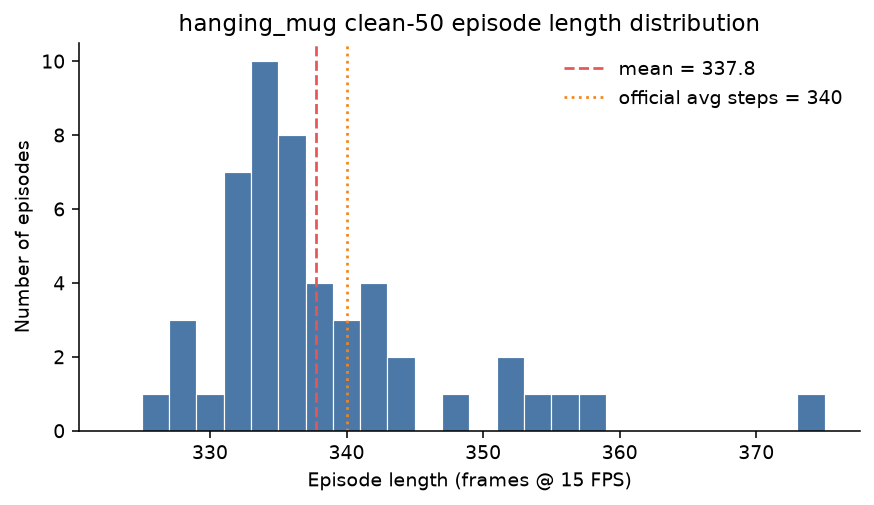
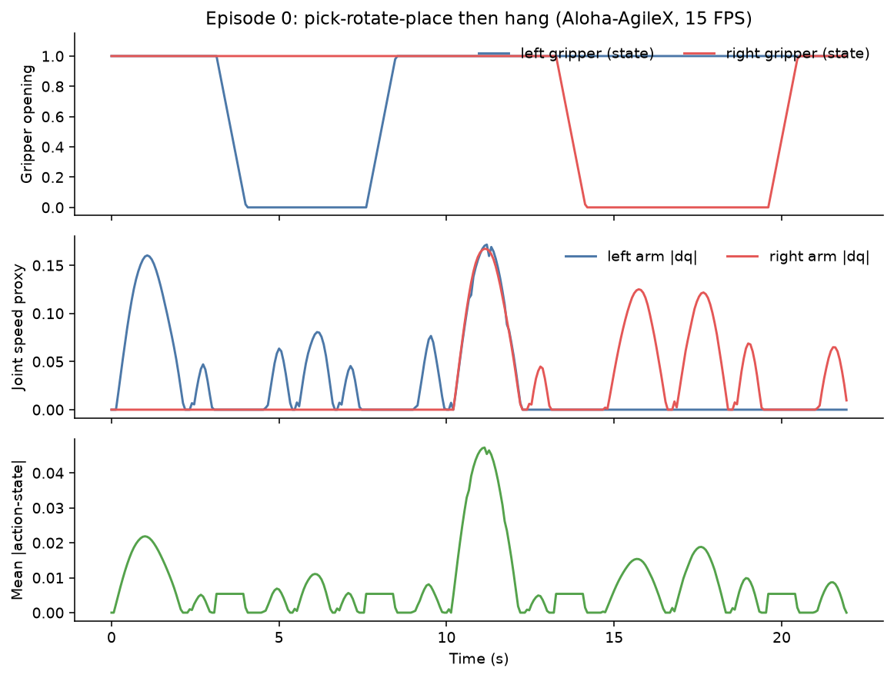
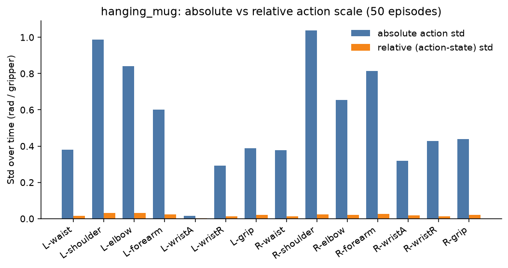
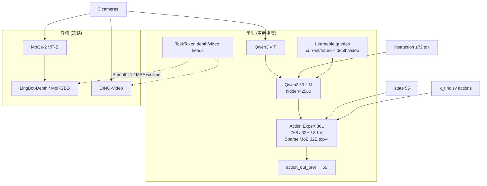
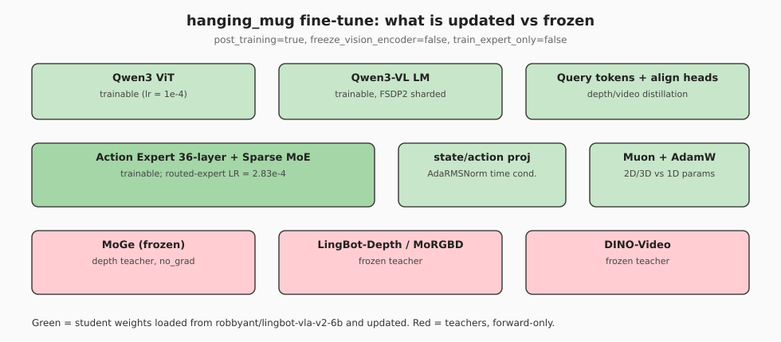
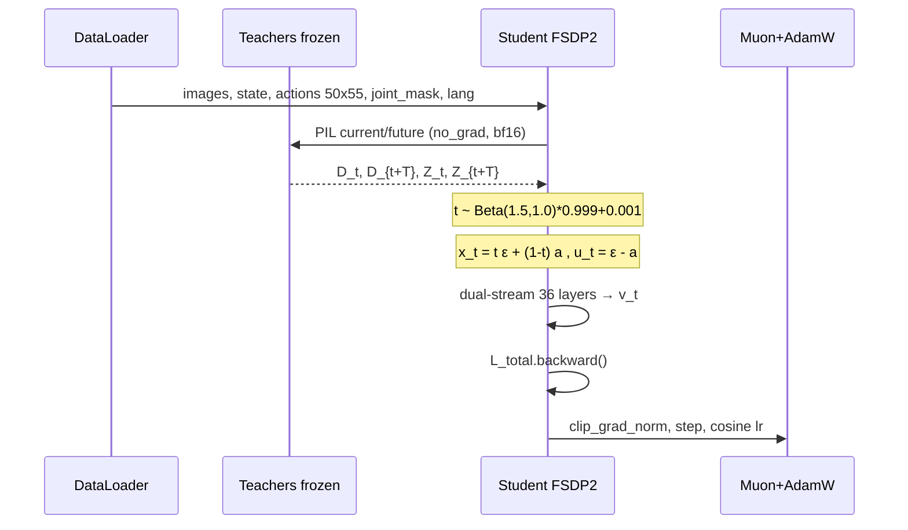
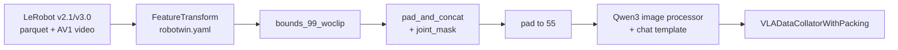
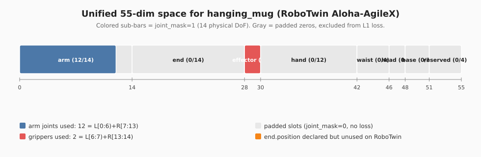

# LingBot-VLA 2.0 单任务微调实施手册：RoboTwin `hanging_mug`

以预训练权重 [`robbyant/lingbot-vla-v2-6b`](https://huggingface.co/robbyant/lingbot-vla-v2-6b) 为起点，在 RoboTwin 2.0 仿真任务 **hanging_mug**（挂马克杯）的 clean-50 专家轨迹上做 post-training（全参数微调）。本文同时给出：**为什么这样训、数据与模型如何对齐、本机如何一步步落地、以及前人踩过的坑**。

配套配置已写入仓库：

- 训练：[`configs/vla/robotwin/hanging_mug_ft.yaml`](../../configs/vla/robotwin/hanging_mug_ft.yaml)
- 归一化：[`configs/vla/robotwin/hanging_mug_norm.yaml`](../../configs/vla/robotwin/hanging_mug_norm.yaml)
- 本页插图脚本：[`asset/`](asset/)

---

## 0. 一页纸：目标、路径、本机结论

| 项目 | 取值 |
|------|------|
| 基础权重 | `robbyant/lingbot-vla-v2-6b`（HF snapshot `11c703bf`，约 27 GB） |
| 任务 | RoboTwin 2.0 `hanging_mug`，Aloha-AgileX，clean 50 条 |
| 数据 | `/tmp/Dta/RoboTwin-Clean/hanging_mug/`（LeRobot **v2.1**，50 ep / 16889 frames / 15 FPS） |
| 代码 | `/tmp/SRC/lingbot-vla-v2` |
| 虚拟环境 | `/tmp/itnvla15rbt20/`（Python **3.11.9**，与官方 3.12 不一致，见 §6） |
| `HF_HOME` | `/tmp/itnvla15rbt20/var/hf_home/` |
| GPU | 8 × NVIDIA A800-SXM4-80GB |
| 推荐 batch | `micro_batch_size=8`，`gradient_accumulation_steps=2`，`global_batch_size=128` |
| 步数 | `max_steps=10000`（约 75.8 epoch，见 §8） |
| 优化器 | Muon（2D/3D）+ AdamW（1D），`lr=1e-4 → 5e-5` cosine |
| 损失 | L1 Flow Matching + Depth/Video 蒸馏 + MoE 辅助损失 |
| 训练输出 | `/tmp/Ckp/lingbot-vla-v2-ft-hanging_mug/`（venv+HF_HOME 已迁到 `/tmp`，checkpoint 也写 `/tmp/Ckp`） |

### 关键权重落地路径（已下载并建好 symlink）

| 用途 | 路径 |
|------|------|
| VLA safetensors（`model.model_path`） | `/tmp/itnvla15rbt20/var/hf_home/ckpts/lingbot-vla-v2-6b/hf_ckpt` |
| LingBot-Depth 教师 | `.../ckpts/lingbot-vla-v2-6b/depth/model.pt` |
| DINO-Video 教师 | `.../ckpts/lingbot-vla-v2-6b/dino_video/teacher_step_10000.pth` |
| Qwen3 tokenizer / processor | `/tmp/itnvla15rbt20/var/hf_home/ckpts/Qwen3-VL-4B-Instruct` |
| MoGe | `.../ckpts/moge-2-vitb-normal/moge2-vitb-normal.pt` → `model.pt` |
| 缓存本体 | `$HF_HOME/models--robbyant--lingbot-vla-v2-6b/`（27G）、`models--Qwen--Qwen3-VL-4B-Instruct/`（8.3G）、`models--Ruicheng--moge-2-vitb-normal/`（400M） |

`train.sh` 会设置 `HF_HUB_OFFLINE=1`，因此 **必须走本地路径**，不能在训练时再访问 Hub。

---

## 1. 任务画像：hanging_mug 在学什么

官方任务定义（[RoboTwin hanging_mug](https://robotwin-platform.github.io/doc/tasks/hanging_mug.html)）：

> 左臂抓起桌上的马克杯，旋转后放到桌面中央，右臂再把杯子挂到金属架上。Aloha-AgileX 平均约 **340 步**（`save_freq=15`）。物体：`039_mug`、`040_rack`。数据生成成功率：Aloha-AgileX **63%**。

本机数据与官方数字一致：50 条轨迹，总帧 16889，均值 **337.8** 帧（约 22.5 s @ 15 FPS），最短 325、最长 373。



语言指令不是单一模板。`meta/tasks.jsonl` 里 **每条 episode 一条 paraphrased 英文指令**（50 条不同措辞），例如：

- *Pick the mug with rounded handle up, twist it, place it back, then hang it onto the metal rack.*
- *Use the left arm to pick the starbucks green mug, turn it, place it, then hang on the smooth rack.*

训练配置使用 `prompt_type=global`，模型看到的是整条任务描述，而不是子步骤标签。这对 hanging_mug 很关键：同一套双臂时序（左抓→旋转→放置→右挂）被多种物体外观/颜色描述覆盖，属于 **指令多样、动作结构高度同质** 的少样本设定。

### 1.1 双臂时序结构（从第 0 条轨迹读出）



Episode 0 把任务拆成两段（时间单位秒）：

1. **0–约 10 s，左臂主导**：左夹爪闭合抓杯、旋转、放到中央后张开。
2. **约 10–12 s，交接过渡**：双臂关节速度同时出现尖峰。
3. **约 12–22 s，右臂主导**：右夹爪闭合、把杯子挂上架子后张开。

这不是简单的 pick-and-place。失败模式在 RoboTwin 2.0 论文里非常刺眼（[arXiv:2506.18088](https://arxiv.org/abs/2506.18088) 附录，Aloha-AgileX clean / randomized）：

| 方法 | hanging_mug Easy | hanging_mug Hard |
|------|------------------|------------------|
| ACT | 23% | 16% |
| DP | 11% | 3% |
| RDT | 8% | 0% |
| π₀ | 17% | 1% |
| DP3 | — | — |

挂杯是 50 任务里最难的之一：需要 **旋转对准杯耳 + 双臂交接 + 把杯耳套进细杆**。单任务微调的意义，是把预训练里学到的几何/时序先验，压到这条窄而深的操作流上。

### 1.2 原始观测 / 动作格式

`meta/info.json`（LeRobot v2.1）：

| 字段 | 形状 | 含义 |
|------|------|------|
| `observation.state` | 14 | 左 6 关节 + 左夹爪 + 右 6 关节 + 右夹爪 |
| `action` | 14 | 同上，位置控制目标（下一步关节角） |
| `observation.images.cam_high` | video 3×480×640，AV1，15 FPS | 顶部相机 |
| `observation.images.cam_left_wrist` | 同上 | 左腕 |
| `observation.images.cam_right_wrist` | 同上 | 右腕 |

`meta/modality.json` 的切片与仓库 [`configs/robot_configs/robotwin.yaml`](../../configs/robot_configs/robotwin.yaml) **完全同构**：臂关节是 `[0:6)+[7:13)`（12 维），夹爪是 `[6:7)+[13:14)`（2 维）。

本机第 0 条上 `|action − state|` 的逐维均值约 0.006–0.014 rad，说明专家数据是 **近乎下一状态的绝对关节目标**，而不是大步相对增量。这与论文在真实 GM-100 上“相对动作更好”的消融 **并不矛盾**——仿真专家轨迹已经平滑，RoboTwin 官方配方坚持 `subtract_state: False`（绝对动作）。



---

## 2. 方法从哪来、和谁比、哪些点被证明有效

### 2.1 纵向：VLA 如何走到 “flow matching + MoE + 未来查询”

| 阶段 | 代表 | 动作头 | 适合的场景 | 代价 |
|------|------|--------|------------|------|
| 离散 token | RT-1 / OpenVLA | 动作分桶 + 自回归 | 数据少、要借 LLM 对齐 | 分辨率低，精细挂杯困难 |
| 连续扩散 | Diffusion Policy / RDT | 去噪网络 | 多峰动作 | 步数多、延迟高 |
| 流匹配 | π₀ / π₀.₅ / LingBot-VLA | 速度场 ODE | 连续控制、少步积分 | 要对齐噪声时间表 |
| 跨本体统一空间 | GR00T、LingBot-VLA | 规范动作向量 | 多机器人 | 大量 padding |
| 稀疏专家 | LingBot-VLA 2.0 Action Expert MoE | token-level top-4 | 多本体/多任务共享算力 | 路由坍缩风险 |
| 未来预测代理任务 | LingBot-VLA 2.0 Dual-Query | 当前+未来 query 蒸馏 | 需要预判几何与时序 | 训练要跑冻结教师 |

论文 [From Foundation to Application: Improving VLA Models in Practice](https://arxiv.org/abs/2607.06403) 把 2.0 相对 1.0 的改动收成三件事（项目页 [technology.robbyant.com/lingbot-vla-v2](https://technology.robbyant.com/lingbot-vla-v2)）：

1. **数据**：约 60,000 小时预训练（50,000 机器人轨迹 / 20 种本体 + 10,000 第一人称人手视频）。
2. **55 维统一动作空间**：臂、末端位姿、夹爪、灵巧手、腰、头、底盘。
3. **预测动态**：未来帧作为代理任务，DINO-Video 给语义时序，LingBot-Depth 给几何。

hanging_mug 微调 **不改这三项结构**，只把数据从“50 任务混合”缩成“1 任务 50 条”，把并行从论文配方的 32 GPU 缩到本机 8×A800。

### 2.2 横向：同类 post-training 路线

| 路线 | 起点 | 数据 | 优点 | 缺点 | 何时用 |
|------|------|------|------|------|--------|
| 本手册 | `lingbot-vla-v2-6b` 预训练 | hanging_mug clean-50 | 真正从 foundation 适应单任务 | 50 条很少；未吃过 RoboTwin 域随机 | 要复现“预训练→单任务” |
| 官方 50 任务 | 同上 | clean+randomized 50 任务 | 论文 RoboTwin 数字（clean **93.52%** / rand **92.80%**） | 不是单任务；算力大 | 要对齐论文仿真表 |
| 已发布 robotwin 权重 | [`lingbot-vla-v2-6b-robotwin`](https://huggingface.co/robbyant/lingbot-vla-v2-6b-robotwin) | 再在 hanging_mug 上短训 | 已经见过该任务 | 不是本手册设定 | 只想尽快把挂杯成功率拉满 |
| π₀.₅ / GR00T 单任务 | 各自预训练 | 同一 50 条 | 可做横向对照 | 动作空间/相机约定不同 | 公平对比时 |

官方 README 的 RoboTwin 分数来自 **50 任务联合 post-training**，不是 hanging_mug 单任务。不要拿 93% 去当本实验的成功标准。单任务挂杯的历史基线更接近上表的 10%–20% 量级。

### 2.3 消融：论文里什么有效，本配方为什么有时“反着来”

论文 §6 在 **真实 GM-100、相对关节** 上的结论（[HTML](https://arxiv.org/html/2607.06403v1)）：

| 因素 | 更有效 | 相对较弱 | 说明 |
|------|--------|----------|------|
| 动作目标 | **相对关节**（成功率 55.0 vs 绝对 33.7） | 绝对关节 | 相对标准差只有绝对的 31%–37% |
| 归一化 | **MeanStd**（55.0） | MinMax / Q01–Q99（约 47） | MeanStd 保留长尾修正 |
| 损失 | **L2 / MSE fm**（55.0 vs L1 46.4） | L1 | 相对动作集中在 0 附近 |
| 动作空间 | EEF 与关节总体接近（56.0 vs 55.0） | 视任务 | 接触丰富偏 EEF，构型约束偏关节 |
| MoE vs Dense | 同等激活参数下 MoE 训练损失与 GM-100 误差更低 | Dense | 来自预训练 scaling 曲线，非 hanging_mug |
| Dual-Query | 定性上当前/未来深度与 DINO 特征可对齐 | 无定量成功率表 | 论文 Fig.13 |

**RoboTwin 仿真官方配方与上述消融并不相同**，本手册 **跟随仿真配方**（[`configs/vla/robotwin/robotwin.yaml`](../../configs/vla/robotwin/robotwin.yaml) 与已跑通的 [`stack_bowls_three_ft.yaml`](../../configs/vla/robotwin/stack_bowls_three_ft.yaml)）：

- `subtract_state: False`（绝对动作）
- `norm_type: bounds_99_woclip`
- `loss_type: L1_fm`

原因：仿真专家轨迹方差小、关节限位清楚；`bounds_99_woclip` 用 1%/99% 分位缩放到 $[-1,1]$ 且 **不做 clip**，避免把挂杯时的极限腕部角度剪掉。真实机器人消融里 MeanStd+相对动作更好，那是另一套数据分布，不要直接搬到 hanging_mug。

GitHub 社区损失量级可参考 [issue #23](https://github.com/Robbyant/lingbot-vla-v2/issues/23)：有人 10k step 时 VLA loss 中位约 0.05；另有人 50k 收到 0.05 但闭环仍差。**开环 MSE 下降 ≠ 挂杯成功**，必须以 RoboTwin rollout 为准。

---

## 3. 静态架构：组件、职责、数据契约

学生网络是 `QwenvlWithExpertV2Model` / `LingbotVlaV2Policy`（[`modeling_lingbot_vla_v2.py`](../../lingbotvla/models/vla/lingbot_vla/modeling_lingbot_vla_v2.py)）。教师在 `lingbotvla/models/vla/vision_models/`，训练时 `torch.no_grad()`。





### 3.1 类与配置职责

| 符号 / 模块 | 职责 |
|-------------|------|
| `LingbotVLAV2Config` | 注册键 `config_key: LingbotVLAV2Config` |
| `FeatureTransform` | robot YAML → 统一关节名 → 归一化 → pad 到 55 → `joint_mask` |
| `VLADataset` | 包一层 `LeRobotDataset`，`chunk_size=50` |
| `VLADataCollatorWithPacking` | 变长 packing |
| `build_parallelize_model` | FSDP2，按 decoder layer / AdaRMSNorm 分片 |
| `CombinedOptimizer` | Muon + AdamW |
| `Checkpointer` | DCP，每 `save_steps` 写盘 |

### 3.2 Token 排列与注意力

Prefix（VLM 流）与 Suffix（Action Expert 流）共享 KV，但 FFN/MoE 独立（双流注意力）：

```
Prefix:  [image tokens] [current shared query ×8] [future video? ×8] [future shared query ×8] [language ≤72]
Suffix:  [state ×1] [noisy action ×50]
```

| 区域 | 模式 | 配置来源 |
|------|------|----------|
| Prefix→Prefix | causal | `vlm_causal: true` |
| Action→Action | **双向** | flow matching 需要整段 chunk |
| Suffix→Prefix | 全交叉注意 | 动作看到图像/语言/query |
| Prefix→Suffix | 阻断 | VLM 不看动作 |

位置编码是 Qwen3 **mRoPE**（时间、高、宽三维）。注意力实现 `flex_cached`：第 0 层建 FlexAttention `BlockMask` 并缓存。

### 3.3 MoE（Action Expert 每一层）

论文公式（符号：$u_{\ell,t}$ 为第 $\ell$ 层 token $t$ 的 FFN 输入，$E^{(s)}$ 共享专家，$E^{(r)}_j$ 第 $j$ 个路由专家，$\lambda$ 为 `routed_scaling_factor`，$\mathcal{R}$ 为 top-$K$ 集合）：

$$
m_{\ell}(u_{\ell,t})=E_{\ell}^{(s)}(u_{\ell,t})+\lambda\sum_{j\in\mathcal{R}(u_{\ell,t})} g_{\ell,j}(u_{\ell,t})\,E_{\ell,j}^{(r)}(u_{\ell,t})
$$

亲和度用 **sigmoid** 而非 softmax，避免专家互斥过强。负载均衡在预训练用 loss-free bias $b_{\ell,j}$；**本微调把 `bias_update_speed` 设为 0**，冻结预训练学到的 bias，改用序列级辅助损失 + router z-loss（与 `robotwin.yaml` / `stack_bowls_three_ft.yaml` 一致）。

路由专家学习率放大：

$$
\mathrm{expert\_lr}=\mathrm{lr}\times\sqrt{N_r/K}=10^{-4}\times\sqrt{32/4}\approx 2.83\times 10^{-4}
$$

其中 $N_r=32$ 为路由专家数，$K=4$ 为每 token 激活数。实现见 [`get_moe_param_groups`](../../tasks/vla/train_lingbotvla.py)。

---

## 4. 动态架构：训练一步与推理一步

### 4.1 Forward / Backward（训练）



教师前向在 [`train_lingbotvla.py`](../../tasks/vla/train_lingbotvla.py) 中显式 `torch.no_grad()`。学生侧 `freeze_vision_encoder=false`、`train_expert_only=false`，因此 **ViT、语言模型、Action Expert、query、对齐头全部更新**。`post_training=true` 要求 checkpoint 键与模型 **完全对齐**，缺键直接 assert；`adanorm_time=true` 时 AdaNorm 的时间门控在加载后零初始化（见 [`load_model_weights`](../../lingbotvla/models/module_utils.py)）。

时间采样（$t$ 为流匹配时间，偏大 $t$ 更接近纯噪声）：

$$
t \sim \mathrm{Beta}(1.5,1.0)\times 0.999 + 0.001 \in [0.001,1]
$$

线性插值与目标速度（$a$ 为 GT 动作，$\varepsilon\sim\mathcal{N}(0,I)$）：

$$
x_t = t\,\varepsilon + (1-t)\,a,\qquad u_t=\varepsilon-a
$$

L1 流匹配只在 `joint_mask=1` 的维度上平均（hanging_mug 实际只有 14 个物理自由度）：

$$
\mathcal{L}_{\mathrm{vla}}=\frac{1}{|\mathcal{M}|}\sum_{(i,j)\in\mathcal{M}} \lvert u_t^{(i,j)}-v_t^{(i,j)}\rvert
$$

蒸馏（权重 $\alpha=0.004$；$Q_t,Q_{t+T}$ 为当前/未来 query，$D,Z$ 为教师特征，$\mathrm{Proj}$ 为交叉注意力投影头）：

$$
\mathcal{L}_{\mathrm{depth}}=\mathbb{E}\big[\lVert\mathrm{Proj}_d(Q_t)-D_t\rVert_1+\lVert\mathrm{Proj}_d(Q_{t+T})-D_{t+T}\rVert_1\big]
$$

$$
\mathcal{L}_{\mathrm{video}}=\mathbb{E}\big[\lVert\mathrm{Proj}_v(Q_t)-Z_t\rVert_F^2+\lVert\mathrm{Proj}_v(Q_{t+T})-Z_{t+T}\rVert_F^2\big]
$$

配置里 video 还加了 cosine（权重 0.2）。总损失：

$$
\mathcal{L}=\mathcal{L}_{\mathrm{vla}}+\alpha(\mathcal{L}_{\mathrm{depth}}+\mathcal{L}_{\mathrm{f\_depth}}+\mathcal{L}_{\mathrm{f\_video}})+\beta_s\mathcal{L}_{\mathrm{seq}}+\beta_z\mathcal{L}_{z}
$$

其中 $\beta_s=10^{-3}$，$\beta_z=10^{-4}$。

**已知缺口**（[issue #19](https://github.com/Robbyant/lingbot-vla-v2/issues/19)）：`action_is_pad`（越过 episode 边界的时间步）在 `LingbotVlaV2Policy.forward` 里被接收但 **未参与 mask**。hanging_mug 每条约 338 帧、chunk=50，只有靠近结尾的样本会把 pad 步算进损失。不必为此改代码也能训，但解释 loss 时要知道末尾有轻微污染。

### 4.2 推理（Euler 积分）

`sample_actions`（同文件）从 $t=1$ 的噪声出发，用 `num_steps=10` 做

$$
x \leftarrow x + \Delta t\cdot v_\theta(x,t),\quad \Delta t=-1/10
$$

直到 $t\approx 0$。部署脚本 [`deploy/lingbot_vla_v2_policy.py`](../../deploy/lingbot_vla_v2_policy.py) 默认 chunk `n_action_steps=50`，实际执行前 `use_length` 步再重规划。README 写 4090D 上约 130 ms / 10 步。

训练时教师参与；**闭环推理不需要 MoGe / DINO-Video**，query 已经编进学生权重。

---

## 5. 数据管线：从 parquet 到 55 维





### 5.1 重映射（12+2，不是 14 维一次性切片）

[`configs/robot_configs/robotwin.yaml`](../../configs/robot_configs/robotwin.yaml)：

- `arm.position`：`state/action[0:6)` ∪ `[7:13)` → **12 维**，再 pad 到配置的 14
- `effector.position`：`[6:7)` ∪ `[13:14)` → **2 维**
- 相机：`cam_high`→`camera_top`，`cam_left_wrist`→`camera_wrist_left`，`cam_right_wrist`→`camera_wrist_right`

`end.position: 14` 在 RoboTwin 上全零，只为了和预训练 55 维头对齐。

### 5.2 归一化

$$
\hat{x}=\frac{x-q_{01}}{q_{99}-q_{01}}\times 2-1
$$

$q_{01},q_{99}$ 来自 `assets/norm_stats/robotwin.json`（50 任务全局统计）。**推荐直接用这份全局统计**：hanging_mug 是 50 任务之一，分布被覆盖；单任务重算在 `compute_norm_stats` 上还容易踩多进程死锁（见 §10）。

`bounds_99_woclip` 允许 $\hat{x}$ 超出 $[-1,1]$。

### 5.3 图像与语言

- 训练 `img_size=256`；Depth 教师 224；DINO-Video 256。
- `use_future_image=true`：再取 `chunk_size-1` 步后的未来帧（约 49/15 ≈ 3.3 s），对应挂杯这种长时序特别有用——当前 query 看“杯子在左手”，未来 query 看“杯子已经挂上”。
- 指令 `tokenizer_max_length=72`。hanging_mug 的 paraphrases 偏长，72 对多数句子够用，超长会被截断。

### 5.4 训练 / 推理 I/O 对照

**训练一个 micro-batch（本配置）**

| 张量 | 典型 shape | 说明 |
|------|------------|------|
| 三路图像 | `[8, 3, 3, H, W]` | micro=8，3 相机 |
| `state` | `[8, 55]` | 当前帧 |
| `actions` | `[8, 50, 55]` | 未来 50 步 |
| `joint_mask` | `[8, 50, 55]` | 仅 14 维为 1 |
| `input_ids` | `[8, ≤72]` | 任务指令 |

**推理一次**

输入：当前三相机 + 14 维状态 + 文本。输出：50×55 的绝对动作，经 `joint_mask` 逆变换回 14 维 Aloha 关节，执行 `use_length` 步（评测脚本默认 50，真机 README 常用 25）。

---

## 6. 本机环境审计（必须先读）

该环境由 `/b/VENV/itnvla15rbt20` **整目录 move** 到 `/tmp/itnvla15rbt20`（原 `pyvenv.cfg` / `bin/activate` / `hf` shebang 本来就指向 `/tmp/itnvla15rbt20`）。overlay 腾出约 93G；checkpoint 写 `/tmp/Ckp/`。`/b/VENV/itnvla15rbt20` 保留为指向新路径的 symlink，避免旧绝对链接断裂。

激活：

```bash
source /tmp/itnvla15rbt20/bin/activate
export HF_HOME="/tmp/itnvla15rbt20/var/hf_home/"
```

| 项 | 官方 `tools/create_train_env.sh` | 本 venv 实测 | 风险 |
|----|----------------------------------|--------------|------|
| Python | 3.12 | **3.11.9** | ABI / wheel |
| torch | 2.8.0 | **2.10.0+cu128** | compile / FSDP 行为可能变 |
| transformers | 4.57.3 | **5.2.0** | Qwen3-VL 加载约定 |
| numpy | 1.26.4 | **2.2.6** | MoGe 不喜欢 2.x |
| lerobot | 0.4.2（v3.0） | **无法 import** | 数据加载 |
| muon / tensorboard / qwen_vl_utils / peft / timm / moge / mdm | 需要 | **缺失** | 训练直接起不来 |
| flash_attn | 2.8.3 | 2.8.3 | OK |
| lingbotvla | editable | 可从仓库 import `0.0.1` | OK |
| torchcodec | 0.6.0 | 装了但缺 `libnppicc.so.12` | 视频解码可能失败 |

**结论**：该 venv 更像 InternVLA 实验环境，**不能直接 `bash train.sh`**。本实施走 **路线 B**：在 `/tmp/itnvla15rbt20` 上补依赖（不降 torch；transformers 5.2 与官方 4.57.3 不一致，若加载失败再钉版本）。

补依赖：

```bash
export PATH="/tmp/itnvla15rbt20/bin:$PATH"
export HF_HOME="/tmp/itnvla15rbt20/var/hf_home/"
python -m pip install tensorboard qwen-vl-utils peft timm
python -m pip install numpy==1.26.4
python -m pip install --no-deps "lerobot @ https://github.com/huggingface/lerobot/archive/refs/tags/v0.4.2.tar.gz"
python -m pip install -e /tmp/SRC/lingbot-vla-v2 --no-deps
python -m pip install -e /tmp/SRC/lingbot-vla-v2/lingbotvla/models/vla/vision_models/lingbot-depth --no-deps
python -m pip install -e /tmp/SRC/lingbot-vla-v2/lingbotvla/models/vla/vision_models/MoGe
# muon 随仓库 lingbotvla.optim.muon，一般不必独立包
```

若 `LeRobotDataset` 因 torchcodec/ffmpeg 失败，优先修 CUDA npp 库或改用官方 3.12 环境。

磁盘：venv+权重在 `/tmp/itnvla15rbt20`（约 93G）；overlay 迁出后约 232G 可用。DCP 写 `/tmp/Ckp/lingbot-vla-v2-ft-hanging_mug/`。

---

## 7. 权重：缓存布局与兼容 symlink

本地原先 **没有** `lingbot-vla-v2-6b`。已用本 venv 的 `huggingface_hub.snapshot_download` 写入 `HF_HOME`（注意：调用时传了 `cache_dir=$HF_HOME`，因此仓库在 `$HF_HOME/models--*`，而不是常见的 `$HF_HOME/hub/models--*`）。

| repo | snapshot | 体积 |
|------|----------|------|
| `robbyant/lingbot-vla-v2-6b` | `11c703bf6a5c1f45b3b69168482da11fdbba53d7` | 27G（6 shard F32，约 6.38B 参数） |
| `Qwen/Qwen3-VL-4B-Instruct` | `ebb281ec70b05090aa6165b016eac8ec08e71b17` | 8.3G |
| `Ruicheng/moge-2-vitb-normal` | `54ad3a693e61907ea4633d13dec6ee682fa09419` | 400M，文件名是 `model.pt` |

HF 仓库把权重放在 **根目录**，没有文档里的 `hf_ckpt/`；MoGe 叫 `model.pt` 而不是 `moge2-vitb-normal.pt`。已按 stack_bowls 经验建兼容链接（见 §0 表）。复现命令：

```bash
export PATH="/tmp/itnvla15rbt20/bin:$PATH"
export HF_HOME="/tmp/itnvla15rbt20/var/hf_home/"
python - <<'PY'
import os
from huggingface_hub import snapshot_download
hf = os.environ["HF_HOME"]
for repo in [
    "robbyant/lingbot-vla-v2-6b",
    "Qwen/Qwen3-VL-4B-Instruct",
    "Ruicheng/moge-2-vitb-normal",
]:
    print(snapshot_download(repo_id=repo, cache_dir=hf))
PY
```

不要用 `python scripts/download_hf_model.py --local_dir $HF_HOME/ckpts` 再拷一份，会再占 36 GB。

---

## 8. 超参设计（相对 50 任务配方与 stack_bowls 单任务）

| 参数 | 官方 50 任务 / 32 GPU | stack_bowls 8×H200 | **本 hanging_mug 8×A800** | 理由 |
|------|----------------------|--------------------|---------------------------|------|
| `data.data_name` | `multi` | `robotwin` | `robotwin` | 单目录用 robot 配置名 |
| `train_path` | `robotwin.txt` | stack_bowls 目录 | hanging_mug 目录 | |
| `micro_batch_size` | 32 | 16 | **8** | A800 80GB；H200 上 16 约 57GB，本机再加教师更紧 |
| `gradient_accumulation_steps` | 1 | 1 | **2** | 保持 global=128 |
| `global_batch_size` | 1024 | 128 | **128** | 与已跑通单任务一致 |
| `max_steps` | 50000 | 10000 | **10000** | 16889/128≈132 step/epoch → 约 75.8 epoch |
| `save_steps` | 10000 | 5000 | 5000 | 中途可评 |
| `use_compile` | true | **false** | **false** | H200 上 compile 导致 rank0 静默退出 |
| `enable_gradient_checkpointing` | false | true | **true** | 换显存 |
| `optimizer` | muon | muon | muon | 可改 adamw 换速度 |
| `freeze_vision_encoder` | false | false | false | 全参微调 |
| `bias_update_speed` | 0（robotwin.yaml） | 0 | 0 | 微调冻路由 bias |
| 图像分辨率（数据） | — | 文档写 320×240 | **480×640** | hanging_mug `info.json` |

`max_steps` 与 `num_train_epochs: 29000` 同时存在时，**先到者停**；实际 10000 step 就会停（[issue #22](https://github.com/Robbyant/lingbot-vla-v2/issues/22) 也问过这一点）。

若 A800 上 micro=8 仍 OOM：先 `micro_batch_size=4` 且 `gradient_accumulation_steps=4`，保持 global=128。若显存很宽裕，可试 micro=16、accum=1。

学习率 cosine（$T=10000$，$\mathrm{lr}=10^{-4}$，$\mathrm{lr}_{\min}=5\times10^{-5}$，warmup 比例默认 0）：

$$
\mathrm{lr}(t)=\mathrm{lr}_{\min}+\frac12(\mathrm{lr}-\mathrm{lr}_{\min})\big(1+\cos(\pi t/T)\big)
$$

---

## 9. 实施步骤

以下命令默认 cwd=`/tmp/SRC/lingbot-vla-v2`。

### Step 0 — 环境变量

```bash
source /tmp/itnvla15rbt20/bin/activate
export HF_HOME="/tmp/itnvla15rbt20/var/hf_home/"
export PYTHONUNBUFFERED=1
export PYTHONFAULTHANDLER=1
export TORCH_SHOW_CPP_STACKTRACES=1
export TOKENIZERS_PARALLELISM=false
cd /tmp/SRC/lingbot-vla-v2
```

按 §6 补齐依赖，确认：

```bash
python -c "import torch, flash_attn, lerobot, lingbotvla; print(torch.__version__, lerobot.__version__)"
nvidia-smi -L
```

### Step 1 — 数据：v2.1 → v3.0

当前 `meta/info.json` 的 `codebase_version` 是 **v2.1**。lerobot 0.4.2 会抛 `BackwardCompatibilityError`（仓库 README 写“支持 v2.1/v3.0”，但 0.4.2 实际拒绝 major≠3）。与 stack_bowls 相同：

```bash
# 备份
cp -a /tmp/Dta/RoboTwin-Clean/hanging_mug /tmp/Dta/RoboTwin-Clean/hanging_mug_v21_backup

python -m lerobot.datasets.v30.convert_dataset_v21_to_v30 \
  --repo-id=hanging_mug \
  --root=/tmp/Dta/RoboTwin-Clean \
  --push-to-hub=false
```

转换后训练路径仍是 `/tmp/Dta/RoboTwin-Clean/hanging_mug/`。若转换工具把数据写到 `$HF_HOME/lerobot/`，再把 YAML `train_path` 改过去，或把转换结果移回原目录。

### Step 2 — 归一化（可选）

**默认：不要重算**，训练时：

```bash
--data.norm_stats_file assets/norm_stats/robotwin.json
```

并保证 [`configs/robot_configs/robotwin.yaml`](../../configs/robot_configs/robotwin.yaml) 的 `norm_stats:` 指向同一文件。

若坚持单任务统计，**不要**把带 `model:` 的 `hanging_mug_ft.yaml` 传给 `compute_norm_stats.py`（[issue #20](https://github.com/Robbyant/lingbot-vla-v2/issues/20)）。用已准备的 norm YAML，且 `num_workers=1`：

```bash
CUDA_VISIBLE_DEVICES=0 bash train.sh scripts/compute_norm_stats.py \
  ./configs/vla/robotwin/hanging_mug_norm.yaml \
  --data.norm_path assets/norm_stats/hanging_mug.json \
  --data.data_ratio_for_norm_compute 1
```

也可改用官方 [`configs/vla/norm_compute/post_data.yaml`](../../configs/vla/norm_compute/post_data.yaml)。多进程在含视频的 dataset 上可能 futex 卡死（stack_bowls Error-5）。

### Step 3 — 启动训练

```bash
mkdir -p /tmp/Ckp/lingbot-vla-v2-ft-hanging_mug
export CUDA_VISIBLE_DEVICES=0,1,2,3,4,5,6,7

setsid bash -c 'bash train.sh tasks/vla/train_lingbotvla.py \
  ./configs/vla/robotwin/hanging_mug_ft.yaml \
  --data.norm_stats_file assets/norm_stats/robotwin.json \
  --train.use_compile false \
  > /tmp/Ckp/lingbot-vla-v2-ft-hanging_mug/train_stdout.log 2>&1' </dev/null &
```

`train.sh` 用 `torchrun --nproc-per-node $NPROC_PER_NODE`，并 `tee log.txt` 到仓库根目录。

健康启动后应看到 micro batch 的 `actions` shape `[8, 50, 55]`。对照 stack_bowls：step 1 总 loss 约 0.39，数十步后 VLA loss 降到 0.07 量级。hanging_mug 帧数更少、任务更难，loss 曲线形状应类似，但 **不要用 0.05 当停训条件**。

监控：

```bash
rg -N 'Step [0-9]+/' /tmp/Ckp/lingbot-vla-v2-ft-hanging_mug/train_stdout.log | tail
nvidia-smi --query-gpu=index,memory.used,utilization.gpu --format=csv
tensorboard --logdir /tmp/Ckp/lingbot-vla-v2-ft-hanging_mug/runs --port 6006
```

断点续训：`enable_resume: true` 会扫描 `output_dir/checkpoints/global_step_*`。

### Step 4 — 开环评测

```bash
export QWEN3_PATH=/tmp/itnvla15rbt20/var/hf_home/ckpts/Qwen3-VL-4B-Instruct
python scripts/open_loop_eval.py \
  --model_path /tmp/Ckp/lingbot-vla-v2-ft-hanging_mug/checkpoints/global_step_10000 \
  --robo_name robotwin \
  --data_path /tmp/Dta/RoboTwin-Clean/hanging_mug/ \
  --use_length 50
```

`--robo_name robotwin` 读取 `configs/robot_configs/robotwin.yaml`。

### Step 5 — RoboTwin 闭环

需要单独的仿真环境与模型推理依赖对齐（见 [`experiment/robotwin/start_robotwin_infer_and_eval.sh`](../../experiment/robotwin/start_robotwin_infer_and_eval.sh)）。单任务时把 `--num_tasks` 换成只跑 hanging_mug 的任务列表（脚本默认 50 任务队列）。建议：

```bash
export QWEN3VL_PATH=/tmp/itnvla15rbt20/var/hf_home/ckpts/Qwen3-VL-4B-Instruct
export EVAL_WORKDIR=/path/to/RoboTwin
bash experiment/robotwin/start_robotwin_infer_and_eval.sh \
  --model_path /tmp/Ckp/lingbot-vla-v2-ft-hanging_mug/checkpoints/global_step_10000 \
  --output_base /tmp/Ckp/lingbot-vla-v2-ft-hanging_mug/eval \
  --num_per_gpu 1 \
  --use_length 50 \
  --task_config demo_clean
```

[issue #29](https://github.com/Robbyant/lingbot-vla-v2/issues/29) 指出公开评测客户端与发布 checkpoint 的成功率可能对不齐。评测时固定随机种子、相机、`use_length` 和是否 `use_compile`。

---

## 10. 故障表（本任务会重复遇到的）

| # | 阶段 | 现象 | 根因 | 处理 |
|---|------|------|------|------|
| 1 | 权重 | 找不到 `hf_ckpt/` 或 `moge2-vitb-normal.pt` | HF 布局与早期文档不一致 | 已建 symlink，见 §7 |
| 2 | 启动 | `hf: bad interpreter` | 旧位置 `/b/VENV` 与 shebang `/tmp/itnvla15rbt20` 不一致 | 已把 venv move 回 `/tmp/itnvla15rbt20`，`source bin/activate` 可用 |
| 3 | Norm | `arguments are not used --model.*` | `compute_norm_stats` 的 Arguments 无 `model` | 用 `hanging_mug_norm.yaml` 或 `post_data.yaml`（issue #20） |
| 4 | 数据 | `BackwardCompatibilityError` 2.1 | lerobot 0.4.2 只要 v3 | `convert_dataset_v21_to_v30` |
| 5 | Norm | 多进程卡死 | fork + 视频 dataset | `num_workers=1` 或改用全局 `robotwin.json` |
| 6 | 训练 | rank0 消失、其余卡 NCCL | `torch.compile` 首步 | `use_compile: false` |
| 7 | 训练 | OOM | A800 80GB + 三教师 | 降 micro batch，保持 global 用 accum |
| 8 | 训练 | 离线报错连 Hub | `train.sh` 里 `HF_HUB_OFFLINE=1` | 全部路径本地化 |
| 9 | 损失 | pad 步也进 loss | `action_is_pad` 未用（issue #19） | 已知限制，条末影响有限 |
| 10 | 评测 | 开环低 MSE、闭环挂不上 | 挂杯对杯耳/杆几何极敏感 | 看 wrist 相机、加 randomized 数据、或从 robotwin 权重再短训 |

---

## 11. 检查清单

- [ ] `HF_HOME` 下 27G+8.3G+400M 权重齐全，`ckpts/` symlink 可解析
- [ ] Python 能 `import lerobot, flash_attn, lingbotvla`；MoGe/mdm 可加载
- [ ] hanging_mug 已转为 LeRobot v3.0，三相机与 14 维 state/action 仍在
- [ ] `hanging_mug_ft.yaml` 的 `model_path` / 教师路径 / `output_dir` 指向本机
- [ ] `global_batch_size == micro_batch_size × 8 × gradient_accumulation_steps`
- [ ] `use_compile=false`，`enable_gradient_checkpointing=true`
- [ ] 训练 log 出现 `actions` `[8,50,55]`，8 卡显存稳定且无 rank0 掉线
- [ ] step 5000 / 10000 有 DCP；开环脚本能跑；再做 hanging_mug 仿真 rollout

---

## 12. 参考

### 本仓库与论文

- 论文：[arXiv:2607.06403](https://arxiv.org/abs/2607.06403)（[HTML](https://arxiv.org/html/2607.06403v1)）
- 项目页：https://technology.robbyant.com/lingbot-vla-v2
- GitHub：https://github.com/Robbyant/lingbot-vla-v2
- 权重：https://huggingface.co/robbyant/lingbot-vla-v2-6b ；50 任务后训练：https://huggingface.co/robbyant/lingbot-vla-v2-6b-robotwin
- 数据与 robot 配置：[lingbotvla/data/vla_data/README.md](../../lingbotvla/data/vla_data/README.md)
- 训练参数：[configs/vla/Training_Config.md](../../configs/vla/Training_Config.md)、[docs/config/lingbotvla_config_doc.md](../../docs/config/lingbotvla_config_doc.md)
- 同系列已跑通实验：[b/d/reprd_rbtwn_stackb3.md](../reprd_rbtwn_stackb3.md)、[b/d/reprd_rbtwn_stackb3_trn_design_rec.md](../reprd_rbtwn_stackb3_trn_design_rec.md)

### RoboTwin

- 任务页：https://robotwin-platform.github.io/doc/tasks/hanging_mug.html
- 论文：[RoboTwin 2.0, arXiv:2506.18088](https://arxiv.org/abs/2506.18088)
- 原始 zip：https://huggingface.co/datasets/TianxingChen/RoboTwin2.0/tree/main/dataset/hanging_mug

### GitHub issues（实施时直接相关）

- [#19](https://github.com/Robbyant/lingbot-vla-v2/issues/19) `action_is_pad` 未进损失
- [#20](https://github.com/Robbyant/lingbot-vla-v2/issues/20) `compute_norm_stats` 拒绝 `model:`
- [#22](https://github.com/Robbyant/lingbot-vla-v2/issues/22) RoboTwin `max_steps` vs `num_train_epochs`
- [#23](https://github.com/Robbyant/lingbot-vla-v2/issues/23) 损失收敛量级
- [#27](https://github.com/Robbyant/lingbot-vla-v2/issues/27) 官方路径无 LoRA 示例（本手册为全参微调）
- [#29](https://github.com/Robbyant/lingbot-vla-v2/issues/29) 公开评测客户端与发布权重的可复现性质疑

代码以本仓库本地文件为准；上述 issue 仅作排障与超参参考，不改变 `hanging_mug_ft.yaml` 已选定的仿真配方。
