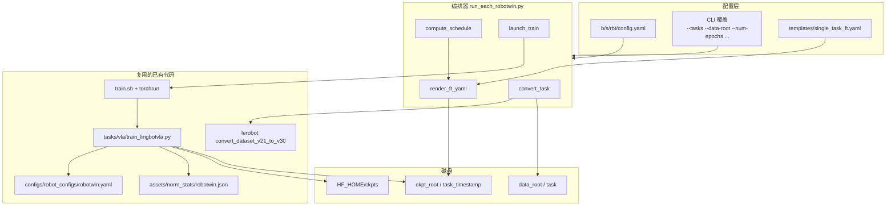
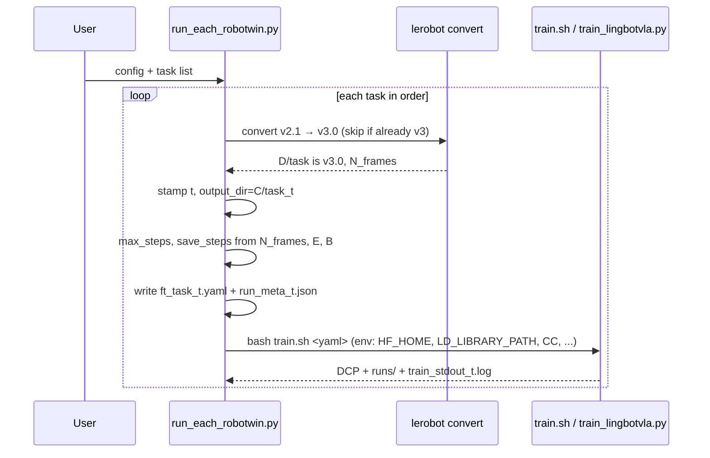
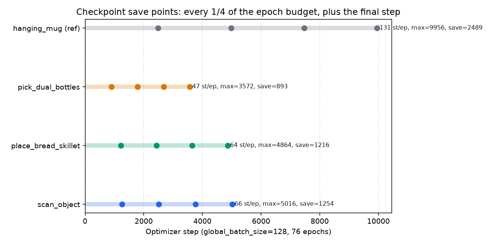
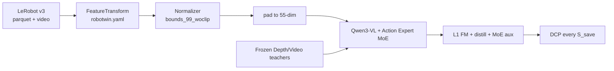

# 循环处理 RoboTwin 2.0 任务列表：LeRobot v3 转换 + 单任务微调

本文描述一个**可配置、可重复跑**的程序：输入一份 RoboTwin 2.0 任务名列表，按顺序对每个任务 (1) 把数据转成 LeRobot **v3.0**；(2) 以有效全局 batch **128**、有效训练 **76 epoch**（均可改）做 LingBot-VLA 2.0 全参微调。

实现代码在 [`b/s/rbt/`](../../s/rbt/)。本文同时给出：**为什么这样拆、和已有单任务手册差在哪、保存点如何随数据量变、以及在不同机器上如何改路径**。

配套：

- 默认配置：[`b/s/rbt/config.yaml`](../../s/rbt/config.yaml)
- 入口：[`b/s/rbt/run_each_robotwin.py`](../../s/rbt/run_each_robotwin.py)
- 训练 YAML 模板：[`b/s/rbt/templates/single_task_ft.yaml`](../../s/rbt/templates/single_task_ft.yaml)
- 插图：[`asset/save_schedule.png`](asset/save_schedule.png)

参考（实施细节与坑）：

- hanging_mug 手册 [`b/d/p/reprd_rbtwn_hngMg.md`](../p/reprd_rbtwn_hngMg.md) 与执行日志 [`reprd_rbtwn_hngMgLOG.md`](../p/reprd_rbtwn_hngMgLOG.md)
- stack_bowls_three 设计 [`b/d/reprd_rbtwn_stackb3_trn_design_rec.md`](../reprd_rbtwn_stackb3_trn_design_rec.md) 与日志 [`reprd_rbtwn_stackb3.md`](../reprd_rbtwn_stackb3.md)
- 论文 [From Foundation to Application: Improving VLA Models in Practice](https://arxiv.org/abs/2607.06403)（HTML：[arxiv.org/html/2607.06403v1](https://arxiv.org/html/2607.06403v1)）
- 项目页 [technology.robbyant.com/lingbot-vla-v2](https://technology.robbyant.com/lingbot-vla-v2)
- 代码仓库约定：[`train.sh`](../../../train.sh)、[`tasks/vla/train_lingbotvla.py`](../../../tasks/vla/train_lingbotvla.py)、[`lingbotvla/utils/arguments.py`](../../../lingbotvla/utils/arguments.py)

---

## 0. 一页纸：目标与本机默认值

| 项 | 默认（均可改） | 符号 |
|----|----------------|------|
| 任务列表 | `scan_object`, `place_bread_skillet`, `pick_dual_bottles` | $\mathcal{T}$ |
| 原始数据根 | `~/Dta/RoboTwin-Clean/` | $D$ |
| Python 环境 | `/tmp/itnvla15rbt20` | — |
| `HF_HOME` | `/tmp/itnvla15rbt20/var/hf_home/` | — |
| Checkpoint 根 | `~/Ckp/lbRbt/` | $C$ |
| 有效全局 batch | **128** | $B_{\mathrm{global}}$ |
| 有效 epoch | **76** | $E$ |
| 保存节奏 | 每 $E/4$ 个 epoch 一次，训完再存一次 | $\alpha=1/4$ |
| 基础权重 | `robbyant/lingbot-vla-v2-6b` 本地 symlink | — |
| 归一化 | `assets/norm_stats/robotwin.json`（不重算单任务） | — |

同一任务可能跑多次。每次调用为该任务生成时间戳 $t$（`YYYYMMDD_HHMMSS`），所有产出都带 $t$：

```
~/Ckp/lbRbt/pipeline_{t_batch}.log
~/Ckp/lbRbt/{task}_{t}/
  ft_{task}_{t}.yaml
  run_meta_{t}.json
  train_stdout_{t}.log
  train_sh_tee_{t}.log
  runs/                          # TensorBoard
  checkpoints/global_step_*      # DCP
  inductor_cache/
```

WandB run name（若打开）为 `{task}_{t}`。

---

## 1. 问题从哪来、和谁比、哪些点已经验证过

### 1.1 纵向：从「手写一个任务」到「列表驱动」

| 阶段 | 做法 | 优点 | 缺点 | 适用 |
|------|------|------|------|------|
| 论文 50 任务联合 post-train | 一份 `robotwin.txt` + 32 GPU / $B=1024$ / 50k step | 对齐论文 RoboTwin 表 | 不是单任务；算力大 | 复现官方仿真分数 |
| 单任务手册（stack_bowls / hanging_mug） | 人手改 YAML、人手 convert、人手算 `max_steps=10000` | 可把坑写死 | 换任务要重算步数、路径写死、无时间戳隔离 | 第一次把某机训通 |
| **本程序** | 任务列表 + 按 $N_{\mathrm{frames}}$ 算 step / save | 换机器改 config；同一任务可重跑 | 仍串行占满 8 卡；不替代评测闭环 | 批量单任务 FT |

hanging_mug 把 **10000 step** 当成「约 75.8 epoch」：

$$
\left\lfloor \frac{16889}{128} \right\rfloor \times 75.8 \approx 131 \times 75.8 \approx 9930 \approx 10000.
$$

其中 $16889$ 是该任务总帧数，$128$ 是全局 batch。本程序把这个经验**显式化**：先定 $E$（默认 76），再反推每个任务的 `max_steps`，而不是所有任务共用 10000 step（短轨迹会被「过训」、长轨迹会「欠训」）。

### 1.2 横向：同类批量微调

| 路线 | 数据 | 优点 | 缺点 | 何时用 |
|------|------|------|------|--------|
| 本程序：逐任务全参 FT | 每任务 clean-50 | 任务间 checkpoint 隔离；保存点随数据量变 | 墙钟时间 ≈ $\sum_i$ 单任务时间 | 要每任务一条独立权重 |
| 50 任务联合 | 全任务混合 | 一篇权重打所有任务 | 无法单独早停/单独评某一任务的中间 ckpt | 对齐论文 |
| 已发布 `lingbot-vla-v2-6b-robotwin` 再短训 | 已见过该域 | 更快 | 不是「从 foundation 单任务」设定 | 只想拉成功率 |
| LoRA / 冻 ViT | 同数据 | 省显存 | 本仓库单任务配方是全参（`freeze_vision_encoder: false`） | 显存不够时再改 config |

### 1.3 消融：哪些旋钮被实践证明该锁死

来源：论文 §6（真机 GM-100）vs RoboTwin 仿真官方 YAML vs hanging_mug / stack_bowls 实跑（见上述手册）。

| 点 | 本程序默认 | 依据 |
|----|------------|------|
| $B_{\mathrm{global}}=128$（8 卡） | 锁死，可改 | hanging_mug / stack_bowls 均用 128，不是论文的 1024 |
| $E=76$ | 可配 | hanging_mug：10000 step ≈ 75.8 epoch |
| `bounds_99_woclip` + 绝对动作 | 锁死 | 仿真官方配方；真机消融更爱 MeanStd+相对，**不要混用** |
| `L1_fm` | 锁死 | 仿真默认；真机消融 L2 更好 |
| 全局 `robotwin.json` | 锁死 | stack_bowls Error-5：单任务重算 + 视频多进程易卡死 |
| `use_compile: false` | 锁死 | stack_bowls / hanging_mug：compile 导致 rank0 崩 |
| 全参、Muon、FSDP2、Dual-Query | 沿用模板 | 与预训练同结构 |
| 每 $E/4$ 存盘 | 相对 epoch，不是写死 5000 step | hanging_mug 的 `save_steps=5000` 只对「约 1 万 step」有意义 |

---

## 2. 程序输入 / 输出，以及中间做了什么

### 2.1 程序级 I/O

**输入**

- 任务名列表 $\mathcal{T}$（config 或 `--tasks`）。名字必须等于 $D/\langle\mathrm{task}\rangle$ 目录名（RoboTwin-Clean 布局）。
- 路径：数据根 $D$、权重 `HF_HOME`、输出根 $C$、venv。
- 训练预算：$B_{\mathrm{global}}$、$E$、保存比例 $\alpha$（默认 $1/4$）、`micro_batch_size`。

**每个任务的中间产物**

1. $D/\langle\mathrm{task}\rangle$：LeRobot **v3.0**（若原先是 v2.1，转换器把旧树挪到 $\langle\mathrm{task}\rangle\_old/$）。
2. $C/\langle\mathrm{task}\rangle\_t/$：当次 run 的 YAML、meta、日志、TB、DCP。

**输出（训练）**

- DCP：`checkpoints/global_step_{k}`，$k \in \{\alpha E, 2\alpha E, 3\alpha E, E\}$ 对应的 optimizer step（见 §4）。
- TensorBoard：`runs/`（训练代码写死 `output_dir/runs/`，见 `train_lingbotvla.py`）。
- 可选 WandB：`wandb_name={task}_{t}`。

**训练时模型 I/O（每个 micro batch，沿用 VLA 配方）**

- 入：三相机图像、14 维 Aloha 状态、英文任务指令、50 步动作 chunk。
- 出：55 维统一动作上的 flow-matching 速度场 + depth/video 蒸馏。
- 形状健康标志（hanging_mug 已验证）：`actions` 为 `[micro, 50, 55]`，8 卡时 micro=8。

`data_name` **必须保持 `robotwin`**：它指向 [`configs/robot_configs/robotwin.yaml`](../../../configs/robot_configs/robotwin.yaml) 的特征映射，不是任务名。任务身份只体现在 `data.train_path`。

### 2.2 转换器 I/O

复用 lerobot 0.4.2：

```bash
python -m lerobot.datasets.v30.convert_dataset_v21_to_v30 \
  --repo-id=<task> --root=<data_root> --push-to-hub=false
```

- 读：$D/\langle\mathrm{task}\rangle$（v2.1 parquet + 每 episode mp4）。
- 写：同路径 v3.0（共享 mp4 + `file-*.parquet`）；原树 → $\langle\mathrm{task}\rangle\_old/$。
- 已是 v3.0 则跳过（`skip_if_v3: true`）。**不要**对 v3 再跑一遍：转换器在「root 与 `_old` 同时存在」时会删当前树把 `_old` 搬回来（hanging_mug 日志）。

---

## 3. 静态架构

### 3.1 组件



职责：

| 组件 | 职责 | 不做什么 |
|------|------|----------|
| `config.yaml` | 机器相关路径、任务列表、$E$、$B$ | 不写死某个任务的 `max_steps` |
| `run_each_robotwin.py` | 顺序循环、convert、算 schedule、填模板、设环境变量、调 `train.sh` | 不改 VLA 前向；不重算 norm |
| `single_task_ft.yaml` | 与 hanging_mug_ft 同构的超参骨架 | 路径与 step 全是占位符 |
| `train.sh` | `HF_HUB_OFFLINE=1` + `torchrun` | 仍 `tee log.txt` 到仓库根，编排器会再拷一份带时间戳的 |

### 3.2 关键路径如何适配别的机器

全部在 `config.yaml` 的 `paths` / `model` / `runtime`：

| 键 | 本机默认 | 换机时 |
|----|----------|--------|
| `data_root` | `~/Dta/RoboTwin-Clean` | 指向该机 RoboTwin-Clean |
| `ckpt_root` | `~/Ckp/lbRbt` | 大磁盘；DCP 单份约 20G+ |
| `venv` / `hf_home` | `/tmp/itnvla15rbt20` 及其 `var/hf_home` | 指向已装 lerobot 0.4.2 + torchrun shim 的环境 |
| `model.*` | `{hf_home}/ckpts/...` | 与 hanging_mug 相同的 symlink 布局 |
| `runtime.cuda_visible_devices` | `0,1,2,3,4,5,6,7` | 改 GPU 列表；`micro_batch_size * n_gpus` 必须整除 128 |
| `runtime.cc` / `cxx` | `/usr/bin/gcc` | 无 gcc 时 Inductor flex-attention 会挂（hanging_mug Error-I） |

`repo_root` 留空则按本文件位置自动推：`b/s/rbt/ → 仓库根`。

---

## 4. 动态架构与保存点计算

### 4.1 一次 pipeline 的序列



训练进程内部（已有代码，本程序不改）：

1. `VLADataset` 长度 = LeRobot 帧数 $N_{\mathrm{frames}}$。
2. `TrainingArguments.compute_train_steps`：`drop_last=True` 时

$$
S_{\mathrm{epoch}} = \left\lfloor \frac{N_{\mathrm{frames}}}{B_{\mathrm{global}}} \right\rfloor.
$$

$S_{\mathrm{epoch}}$：每个 epoch 的 optimizer step 数。$B_{\mathrm{global}}$：全局有效 batch（默认 128）。

3. 停训：`min(S_{\mathrm{epoch}} \cdot N_{\mathrm{epoch}}^{\mathrm{yaml}}, \mathrm{max\_steps})`。本程序设 `num_train_epochs = E` 且 `max_steps = S_{\mathrm{epoch}} \cdot E`，两者一致。
4. 周期性存盘：`global_step % save_steps == 0`。
5. `max_steps` 到达时若该步不是周期点，再存一次（`train_lingbotvla.py` 约 1127–1144 行）。

### 4.2 由 epoch 预算反推 step（核心）

给定任务帧数 $N_{\mathrm{frames}}$、全局 batch $B_{\mathrm{global}}$、目标 epoch $E$、保存比例 $\alpha$（默认 $1/4$）：

$$
\begin{aligned}
S_{\mathrm{epoch}} &= \left\lfloor N_{\mathrm{frames}} / B_{\mathrm{global}} \right\rfloor, \\
S_{\mathrm{max}} &= S_{\mathrm{epoch}} \cdot E, \\
S_{\mathrm{save}} &= \max\bigl(1,\ \lfloor S_{\mathrm{max}} \cdot \alpha \rfloor\bigr)
\quad (\alpha=1/4 \text{ 时用 } \lfloor S_{\mathrm{max}}/4 \rfloor).
\end{aligned}
$$

$S_{\mathrm{max}}$：本次 run 的 `max_steps`。$S_{\mathrm{save}}$：`save_steps`。  
周期点 $S_{\mathrm{save}}, 2S_{\mathrm{save}}, \ldots$，若最后一点不是 $S_{\mathrm{max}}$，再补 $S_{\mathrm{max}}$（对应「完全训完再存」）。

$\alpha=1/4$ 且 $S_{\mathrm{max}}$ 能被 4 整除时，恰好 4 个点 = 1/4、2/4、3/4、4/4 epoch。

8 卡上的 batch 分解（与 hanging_mug 相同，可配）：

$$
B_{\mathrm{global}} = B_{\mathrm{micro}} \times N_{\mathrm{GPU}} \times G,
$$

$B_{\mathrm{micro}}$：每卡 micro batch（默认 8）；$N_{\mathrm{GPU}}$：可见 GPU 数；$G$：`gradient_accumulation_steps`。默认 $8 \times 8 \times 2 = 128$。不整除则拒绝启动。

### 4.3 第一批任务的数字（$B=128$，$E=76$，$\alpha=1/4$）

本机 `~/Dta/RoboTwin-Clean/<task>/meta/info.json`（v2.1，50 episode）实测：

| 任务 | $N_{\mathrm{frames}}$ | $S_{\mathrm{epoch}}$ | $S_{\mathrm{max}}$ | $S_{\mathrm{save}}$ | 存盘 step |
|------|----------------------|----------------------|--------------------|---------------------|-----------|
| `scan_object` | 8463 | 66 | 5016 | 1254 | 1254, 2508, 3762, 5016 |
| `place_bread_skillet` | 8277 | 64 | 4864 | 1216 | 1216, 2432, 3648, 4864 |
| `pick_dual_bottles` | 6129 | 47 | 3572 | 893 | 893, 1786, 2679, 3572 |
| hanging_mug（对照，不在默认列表） | 16889 | 131 | 9956 | 2489 | 若用本公式，不再是写死的 10000/5000 |



若改 `num_epochs: 40`，所有 $S_{\mathrm{max}}$、$S_{\mathrm{save}}$ 按上式重算，无需改代码。

`visual_steps` 与 $S_{\mathrm{save}}$ 对齐，避免短任务（如 3572 step）永远走不到模板里写死的 5000。

### 4.4 训练内部数据流（简图，细节见 hanging_mug 手册 §3–5）



Frozen：Depth / Video / MoGe 教师。更新：VLM + Action Expert（含 MoE）。Backward：标准 FSDP2 + Muon/AdamW。本编排器不改变这条图，只改变 `train_path`、步数与 `output_dir`。

---

## 5. 环境约定（本机踩过的坑，程序已写入 `build_train_env`）

来源：[`reprd_rbtwn_hngMgLOG.md`](../p/reprd_rbtwn_hngMgLOG.md)。换机时若环境干净（官方 `create_train_env.sh`），多数可省略，但 **LD_LIBRARY_PATH / gcc / torchrun** 仍建议保留。

| 问题 | 程序侧处理 |
|------|------------|
| `train.sh` 找不到 `torchrun` | PATH 前缀 `venv/bin`（本 venv 已有 shim） |
| torchcodec 缺 `libnppicc` / `CXXABI_1.3.15` | `LD_LIBRARY_PATH` = `venv/lib` + `nvidia/npp/lib` |
| Inductor 无 gcc | `CC`/`CXX`；`TORCHINDUCTOR_CACHE_DIR` 放在该次 `output_dir` |
| `HF_HUB_OFFLINE` | 沿用 `train.sh`；权重必须已在 `HF_HOME/ckpts` |
| 仓库根 `log.txt` 被 `tee` 覆盖 | 每任务拷到 `train_sh_tee_{t}.log` |
| 端口占用 | 第 $i$ 个任务用 `master_port + i` |

不要在另一场 8 卡 FT（例如正在跑的 hanging_mug）未结束时启动本 pipeline。

---

## 6. 落地：文件、命令、配置

### 6.1 新增文件

| 路径 | 作用 |
|------|------|
| `b/s/rbt/config.yaml` | 任务列表与全部可配路径 / $E$ / $B$ |
| `b/s/rbt/run_each_robotwin.py` | 编排器 |
| `b/s/rbt/run_each_robotwin.sh` | 用默认 venv python 调编排器 |
| `b/s/rbt/templates/single_task_ft.yaml` | 由 hanging_mug_ft 抽出的模板 |
| `b/d/rbt/asset/plot_save_schedule.py` | 生成上图 |

未改 `train_lingbotvla.py`：保存逻辑已支持「周期 + 终局」。

### 6.2 怎么跑

仓库根：

```bash
# 先看计划（不写盘、不开训）
/tmp/itnvla15rbt20/bin/python b/s/rbt/run_each_robotwin.py --dry-run

# 只转换三个任务
/tmp/itnvla15rbt20/bin/python b/s/rbt/run_each_robotwin.py --convert-only

# 按默认列表顺序：convert + 76 epoch FT
/tmp/itnvla15rbt20/bin/python b/s/rbt/run_each_robotwin.py

# 换任务 / 换 epoch / 换数据盘
/tmp/itnvla15rbt20/bin/python b/s/rbt/run_each_robotwin.py \
  --tasks hanging_mug scan_object \
  --num-epochs 40 \
  --data-root ~/Dta/RoboTwin-Clean \
  --ckpt-root ~/Ckp/lbRbt
```

或：`bash b/s/rbt/run_each_robotwin.sh --dry-run`。

配置里改 `tasks:` 即可换第一批以后的列表。`num_epochs`、`global_batch_size`、`save_every_epoch_fraction` 都在 `train:` 段。

### 6.3 健康检查

每任务日志 `train_stdout_{t}.log`：

- `codebase_version v3.0`
- `actions's shape: torch.Size([8, 50, 55])`（micro=8 时）
- `Step k/S_epoch` 与 `max_steps=S_max`
- 存盘：`Distributed checkpoint saved at .../global_step_{S_save}`

TensorBoard：`tensorboard --logdir ~/Ckp/lbRbt/<task>_<t>/runs`。

### 6.4 失败策略

默认 `continue_on_error: false`：一个任务训练非 0 退出则中止列表（避免 8 卡空转）。`--continue-on-error` 可继续下一个。

---

## 7. 与 hanging_mug / stack_bowls 配方对齐检查

| 项 | hanging_mug 实跑 | 本程序默认 |
|----|------------------|------------|
| 起点权重 | `lingbot-vla-v2-6b` 本地 | 同，路径可配 |
| 数据 | 单任务 clean-50 | 列表中每个同样是该目录下的 clean 集 |
| LeRobot | 先 v3.0 | 自动 convert / skip |
| $B_{\mathrm{global}}$ | 128 | 128 |
| micro / acc / GPU | 8 / 2 / 8 | 同，可配 |
| epoch | ≈75.8（用 10000 step 近似） | **76，按帧数精确** |
| save | 固定 5000 | **按 $E/4$ 与 $N_{\mathrm{frames}}$** |
| norm | `robotwin.json` | 同 |
| compile | false | false |
| 输出 | `/tmp/Ckp/lingbot-vla-v2-ft-hanging_mug` | `~/Ckp/lbRbt/{task}_{t}` |

---

## 8. 限制

- 串行：同一时刻只训一个任务（8 卡）。
- 不包含开环 / RoboTwin 仿真评测（可另接 `scripts/open_loop_eval.py`）。
- 不把 DCP 清掉：多次重跑会堆磁盘，需人工删旧 `{task}_{t}`。
- 转换就地改 $D/\langle\mathrm{task}\rangle$；v2.1 备份在 `_old/`。若 $D$ 与 `/tmp/Dta/RoboTwin-Clean` 是两份拷贝，只改 config 里那一份。
- `train.sh` 仍写仓库根 `log.txt`；以 `ckpt_root` 下带时间戳的日志为准。
