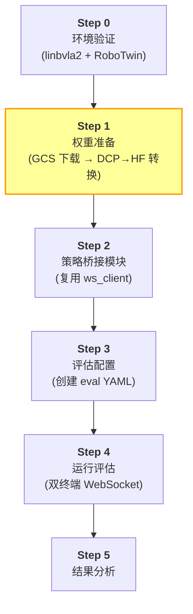
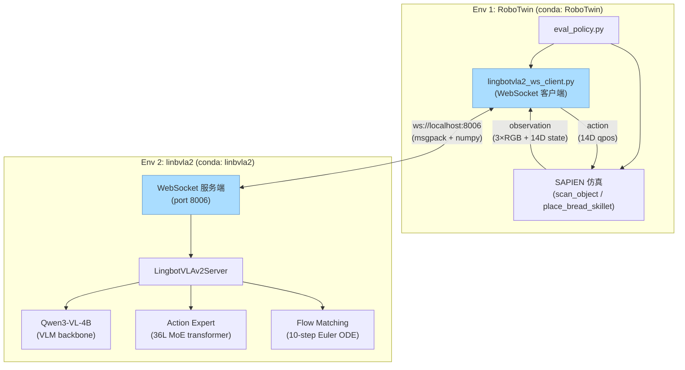
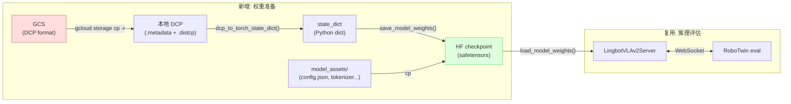
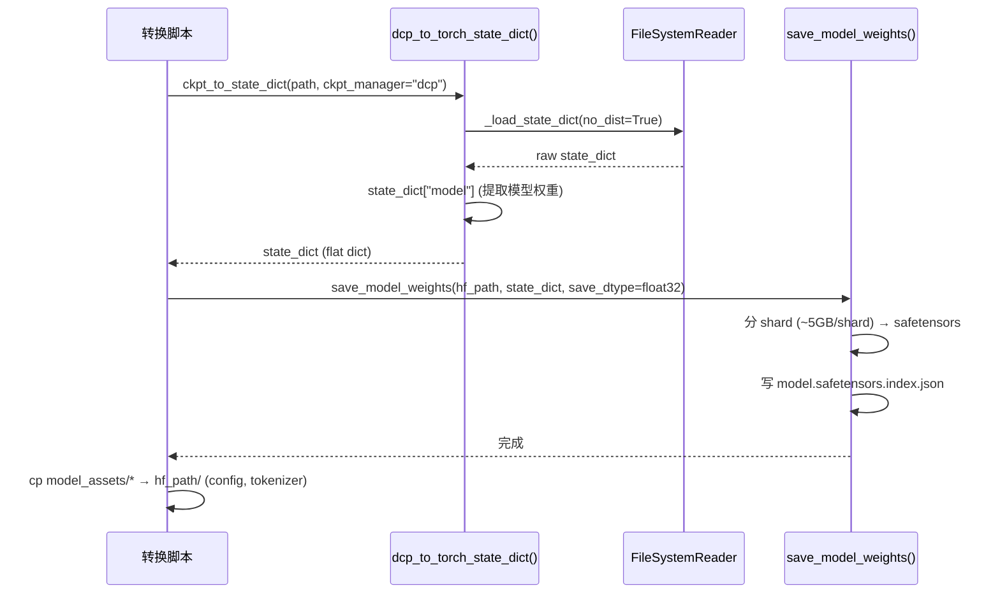
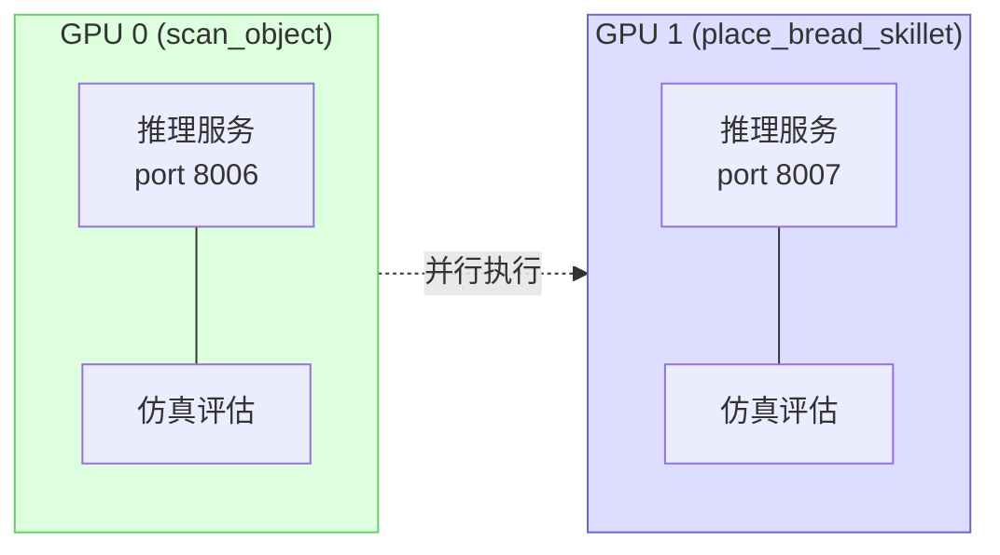
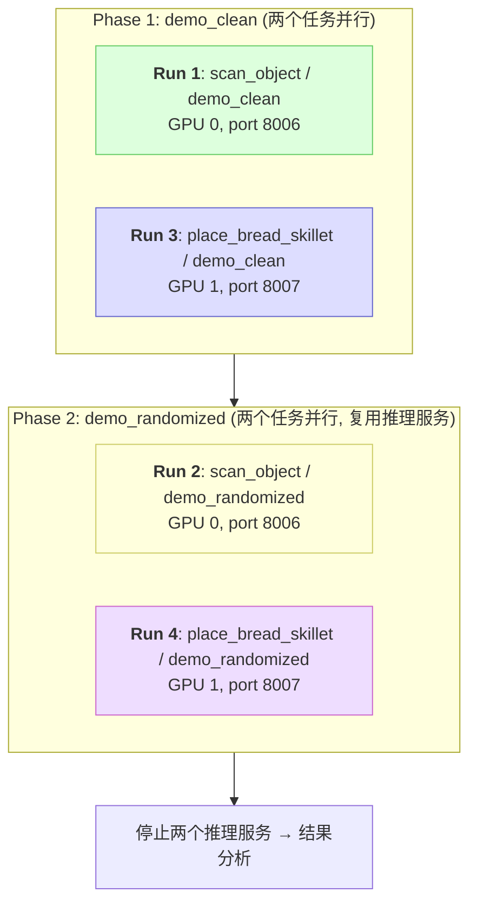

# LingBot-VLA v2 RoboTwin 2.0 scan_object & place_bread_skillet 闭环评估 — 实施方案与操作手册

> **文档定位**: 这是一份可由第三方工程师独立执行的、端到端的评估操作手册. 按本文档的步骤顺序操作, 即可完成从 checkpoint 下载到评估结果分析的全部流程. 每个步骤给出了完整的命令、预期输出和常见问题处理方法.
>
> **前置条件**: 本文档假设以下基础设施已就绪 (首次搭建请参考 [stack_bowls_three 评估方案](reprd_rbtwn_stackb3_linb_eval6000.md)):
> - conda 环境 `linbvla2` (推理) 和 `RoboTwin` (仿真) 已创建
> - Qwen3-VL-4B-Instruct 已下载到 `/home/luogang/CKPT/VLM/Qwen3-VL-4B-Instruct/`
> - SAPIEN/mplib patch 已应用
> - RoboTwin 源码在 `/home/luogang/share/zwy/Projects/RoboTwin/`
> - lingbot-vla-v2 代码库在 `/home/luogang/SRC/Robot/lingbot-vla-v2/`
>
> **核心差异**: stack_bowls_three 评估时 checkpoint 已是 HuggingFace 格式; 本次 checkpoint 在 GCS 上以 DCP (Distributed Checkpoint) 格式存储, 需要下载后转换为 HuggingFace 格式.

---

## 1. 评估概览与目标

### 1.1 评估目标

在 RoboTwin 2.0 仿真平台上, 对 LingBot-VLA v2 在 `scan_object` 和 `place_bread_skillet` 两个任务上微调得到的 checkpoint 进行闭环评估, 在 `demo_clean` (无域随机化) 和 `demo_randomized` (带域随机化) 两种评估设定下各跑 100 episodes, 获取成功率指标.

**评估矩阵** (共 4 轮评估):

| # | 任务 | 评估设定 | Episodes | 说明 |
|---|------|---------|----------|------|
| 1 | scan_object | demo_clean | 100 | 固定背景/光照/桌高, 无杂物 |
| 2 | scan_object | demo_randomized | 100 | 随机背景/光照/桌高/杂物 |
| 3 | place_bread_skillet | demo_clean | 100 | 固定背景/光照/桌高, 无杂物 |
| 4 | place_bread_skillet | demo_randomized | 100 | 随机背景/光照/桌高/杂物 |

### 1.2 评估对象

| 项目 | scan_object | place_bread_skillet |
|------|-------------|---------------------|
| **GCS 根目录** | `gs://physical-ai-data-eu/VENV/tmp/lbvla2_3tsk08280828/scan_object_20260827_233219/` | `gs://physical-ai-data-eu/VENV/tmp/lbvla2_3tsk08280828/place_bread_skillet_20260828_104222/` |
| **DCP checkpoint** | `checkpoints/global_step_5016/model/` | `checkpoints/global_step_4864/model/` |
| **训练步数** | 5016 | 4864 |
| **任务描述** | 一臂拿扫描仪, 一臂拿物体, 用扫描仪扫描物体 | 一臂抓取桌上的面包放入煎锅 |
| **评估步数上限** | 500 | 500 |
| **评估配置** | `demo_clean` + `demo_randomized` (各 100 episodes) | `demo_clean` + `demo_randomized` (各 100 episodes) |
| **指标** | 成功率 (success rate) | 成功率 (success rate) |

### 1.3 评估流程总览



> 黄色高亮的 **Step 1 (权重准备)** 是本次评估相比 stack_bowls_three 的主要新增步骤.

### 1.4 基线参考

| 模型 | 任务 | demo_clean | demo_randomized | 备注 |
|------|------|-----------|----------------|------|
| LingBot-VLA v2 (10000 steps) | stack_bowls_three | 78% | 20% | 已完成评估 |
| LingBot-VLA v2 (5016 steps) | scan_object | **待评估** | **待评估** | 本文档 |
| LingBot-VLA v2 (4864 steps) | place_bread_skillet | **待评估** | **待评估** | 本文档 |

> **参考**: stack_bowls_three 任务的 demo_clean 与 demo_randomized 成功率差距为 58 个百分点 (78% vs 20%), 域随机化显著增加了评估难度.

---

## 2. 系统架构

### 2.1 双环境 WebSocket 集成架构

本次评估复用 stack_bowls_three 评估中搭建的双环境 WebSocket 架构. 核心设计: RoboTwin 仿真和 lingbot-vla-v2 推理分别运行在独立 conda 环境中, 通过 localhost WebSocket 通信.



### 2.2 本次评估的完整流水线

与 stack_bowls_three 相比, 本次在模型加载之前新增了 **GCS 下载 + DCP→HF 转换** 步骤:



### 2.3 DCP→HF 转换管线详解

训练时, `AsyncHFCheckpointSaver` ([async_hf_checkpoint.py:297](lingbotvla/utils/async_hf_checkpoint.py#L297)) 自动将 DCP checkpoint 转换为 HF 格式. 由于本次 checkpoint 仅有 DCP 格式 (训练结束时未生成 HF 格式), 需要手动执行等效转换:



核心函数:

| 函数 | 文件 | 职责 |
|------|------|------|
| `ckpt_to_state_dict()` | [format_utils.py:40](lingbotvla/checkpoint/format_utils.py#L40) | 路由: 根据 `ckpt_manager` 选择转换器 |
| `dcp_to_torch_state_dict()` | [format_utils.py:97](lingbotvla/checkpoint/format_utils.py#L97) | DCP → PyTorch state_dict, 使用 `no_dist=True` 单机加载 |
| `save_model_weights()` | [module_utils.py:391](lingbotvla/models/module_utils.py#L391) | state_dict → safetensors (sharded) + index.json |
| `_save_one_hf_checkpoint()` | [async_hf_checkpoint.py:297](lingbotvla/utils/async_hf_checkpoint.py#L297) | 完整转换流程参考 (含 atomic rename) |

> **注意**: DCP 中 MoE 的 expert 权重以 fused 3D 格式存储 (`experts.gate_proj [E, I, H]`), 转换后在 HF safetensors 中保持相同格式. deploy 端的 `load_model_weights()` ([lingbot_vla_v2_policy.py:227](deploy/lingbot_vla_v2_policy.py#L227)) 直接 `load_state_dict(strict=True)` 加载, 无需 per-expert 拆分.

### 2.4 目录结构约束

deploy 服务端 `load_vla()` ([lingbot_vla_v2_policy.py:276](deploy/lingbot_vla_v2_policy.py#L276)) 通过以下路径解析训练配置:

```python
training_config_path = Path(model_path).parent.parent.parent / 'lingbotvla_cli.yaml'
```

即 `lingbotvla_cli.yaml` 必须位于 `model_path` 的**三层父目录**. 因此本地目录结构设计为:

```
/home/luogang/CKPT/VLA/
├── linbVLA2_scanobj/                          # scan_object 根目录
│   ├── lingbotvla_cli.yaml                    # ← parent×3
│   └── checkpoints/
│       └── global_step_5016/
│           └── hf_ckpt/                       # ← model_path
│               ├── model-00001-of-*.safetensors
│               ├── model.safetensors.index.json
│               ├── config.json
│               ├── tokenizer.json
│               └── ...
│
└── linbVLA2_plcbrd/                           # place_bread_skillet 根目录
    ├── lingbotvla_cli.yaml                    # ← parent×3
    └── checkpoints/
        └── global_step_4864/
            └── hf_ckpt/                       # ← model_path
                └── ...
```

两任务使用**独立根目录**, 避免共享 `lingbotvla_cli.yaml` 导致的配置冲突.

---

## 3. Step 0: 环境验证

> 以下环境已在 stack_bowls_three 评估时搭建, 此处仅做验证.

### 3.1 Env 1: RoboTwin 仿真环境 (已有)

```bash
conda activate RoboTwin
python -c "
import sapien; print(f'sapien: {sapien.__version__}')
import mplib; print('mplib: OK')
import websockets; print(f'websockets: {websockets.__version__}')
import msgpack; print(f'msgpack: {msgpack.version}')
import numpy; print(f'numpy: {numpy.__version__}')
print('--- RoboTwin 环境验证通过 ---')
"
```

期望输出:
```
sapien: 3.0.0b1
mplib: OK
websockets: 15.0.1
msgpack: (1, 1, 2)
numpy: 1.26.4
--- RoboTwin 环境验证通过 ---
```

**验证 scan_object 和 place_bread_skillet 任务存在**:

```bash
ls /home/luogang/share/zwy/Projects/RoboTwin/envs/scan_object.py
ls /home/luogang/share/zwy/Projects/RoboTwin/envs/place_bread_skillet.py
ls /home/luogang/share/zwy/Projects/RoboTwin/description/task_instruction/scan_object.json
ls /home/luogang/share/zwy/Projects/RoboTwin/description/task_instruction/place_bread_skillet.json
```

**SAPIEN/mplib patch 验证** (已在 stack_bowls_three 时 patch, 此处确认):

```bash
SAPIEN_LOCATION=$(pip show sapien | grep 'Location' | awk '{print $2}')/sapien
grep -c 'encoding="utf-8"' "${SAPIEN_LOCATION}/wrapper/urdf_loader.py" && echo "SAPIEN patch: OK" || echo "SAPIEN patch: MISSING"

MPLIB_LOCATION=$(pip show mplib | grep 'Location' | awk '{print $2}')/mplib
grep -c 'or collide ' "${MPLIB_LOCATION}/planner.py" && echo "mplib patch: NEEDS APPLY" || echo "mplib patch: OK"
```

### 3.2 Env 2: linbvla2 推理环境 (已有)

```bash
conda activate linbvla2
python -c "
import torch; print(f'torch: {torch.__version__}, CUDA: {torch.cuda.is_available()}')
import flash_attn; print(f'flash_attn: {flash_attn.__version__}')
import transformers; print(f'transformers: {transformers.__version__}')
import lingbotvla; print('lingbotvla: OK')
import numpy; print(f'numpy: {numpy.__version__}')
from safetensors.torch import load_file; print('safetensors: OK')
import websockets; print(f'websockets: {websockets.__version__}')
import msgpack; print('msgpack: OK')
print('--- linbvla2 推理环境验证通过 ---')
"
```

期望输出:
```
torch: 2.8.0+cu128, CUDA: True
flash_attn: 2.8.3
transformers: 4.57.3
lingbotvla: OK
numpy: 1.26.4
safetensors: OK
websockets: ...
msgpack: OK
--- linbvla2 推理环境验证通过 ---
```

### 3.3 Qwen3-VL-4B-Instruct (已下载)

```bash
ls /home/luogang/CKPT/VLM/Qwen3-VL-4B-Instruct/config.json && echo "Qwen3-VL: OK"
```

### 3.4 验证 gcloud CLI

```bash
gcloud --version | head -1
gcloud storage ls gs://physical-ai-data-eu/VENV/tmp/lbvla2_3tsk08280828/ 2>/dev/null | head -5 && echo "GCS access: OK"
```

如果 gcloud 未安装或未认证:
```bash
# 安装
curl https://sdk.cloud.google.com | bash
# 认证
gcloud auth login
gcloud config set project <your-project-id>
```

---

## 4. Step 1: 权重准备

这是本次评估的**核心新增步骤**. 需要从 GCS 下载 DCP 格式 checkpoint, 转换为 HuggingFace 格式, 并建立正确的目录结构.

### 4.1 创建本地目录结构

```bash
# scan_object
mkdir -p /home/luogang/CKPT/VLA/linbVLA2_scanobj/checkpoints/global_step_5016/hf_ckpt
mkdir -p /home/luogang/CKPT/VLA/linbVLA2_scanobj/dcp_raw

# place_bread_skillet
mkdir -p /home/luogang/CKPT/VLA/linbVLA2_plcbrd/checkpoints/global_step_4864/hf_ckpt
mkdir -p /home/luogang/CKPT/VLA/linbVLA2_plcbrd/dcp_raw
```

### 4.2 从 GCS 下载

#### 4.2.1 scan_object

```bash
GCS_SCANOBJ="gs://physical-ai-data-eu/VENV/tmp/lbvla2_3tsk08280828/scan_object_20260827_233219"
LOCAL_SCANOBJ="/home/luogang/CKPT/VLA/linbVLA2_scanobj"

# 下载 DCP checkpoint (16 个 .distcp shard + .metadata, 约 10-20 GB)
gcloud storage cp -r \
    "${GCS_SCANOBJ}/checkpoints/global_step_5016/model/" \
    "${LOCAL_SCANOBJ}/dcp_raw/"

# 下载 model_assets (config.json, tokenizer 文件等, ~1 MB)
gcloud storage cp -r \
    "${GCS_SCANOBJ}/model_assets/" \
    "${LOCAL_SCANOBJ}/model_assets/"

# 下载训练配置
gcloud storage cp \
    "${GCS_SCANOBJ}/lingbotvla_cli.yaml" \
    "${LOCAL_SCANOBJ}/lingbotvla_cli_gcs.yaml"
```

#### 4.2.2 place_bread_skillet

```bash
GCS_PLCBRD="gs://physical-ai-data-eu/VENV/tmp/lbvla2_3tsk08280828/place_bread_skillet_20260828_104222"
LOCAL_PLCBRD="/home/luogang/CKPT/VLA/linbVLA2_plcbrd"

# 下载 DCP checkpoint
gcloud storage cp -r \
    "${GCS_PLCBRD}/checkpoints/global_step_4864/model/" \
    "${LOCAL_PLCBRD}/dcp_raw/"

# 下载 model_assets
gcloud storage cp -r \
    "${GCS_PLCBRD}/model_assets/" \
    "${LOCAL_PLCBRD}/model_assets/"

# 下载训练配置
gcloud storage cp \
    "${GCS_PLCBRD}/lingbotvla_cli.yaml" \
    "${LOCAL_PLCBRD}/lingbotvla_cli_gcs.yaml"
```

#### 4.2.3 验证下载

```bash
# scan_object: 确认 DCP 文件完整
echo "=== scan_object DCP ==="
ls ${LOCAL_SCANOBJ}/dcp_raw/model/ | head -20
ls ${LOCAL_SCANOBJ}/dcp_raw/model/.metadata && echo ".metadata: OK"
ls ${LOCAL_SCANOBJ}/dcp_raw/model/*.distcp | wc -l  # 应为 16+

echo "=== scan_object model_assets ==="
ls ${LOCAL_SCANOBJ}/model_assets/

# place_bread_skillet: 同理
echo "=== place_bread_skillet DCP ==="
ls ${LOCAL_PLCBRD}/dcp_raw/model/ | head -20
ls ${LOCAL_PLCBRD}/dcp_raw/model/.metadata && echo ".metadata: OK"
ls ${LOCAL_PLCBRD}/dcp_raw/model/*.distcp | wc -l

echo "=== place_bread_skillet model_assets ==="
ls ${LOCAL_PLCBRD}/model_assets/
```

> **注意**: `gcloud storage cp -r` 会将 `model/` 目录下载为 `dcp_raw/model/`. DCP 文件包括 `.metadata` 和若干 `__N_M.distcp` shard 文件. 如果下载中断, 重新执行同一命令即可 (rsync 模式).

### 4.3 DCP → HuggingFace 转换

代码库中没有独立的 DCP→HF 转换脚本. 以下脚本基于 `AsyncHFCheckpointSaver._save_one_hf_checkpoint()` 的逻辑编写, 使用 `dcp_to_torch_state_dict()` 和 `save_model_weights()` 两个核心函数.

#### 4.3.1 转换脚本

```bash
conda activate linbvla2
cd /home/luogang/SRC/Robot/lingbot-vla-v2
```

**scan_object 转换**:

```bash
python -c "
import os, shutil, torch
from lingbotvla.checkpoint.format_utils import ckpt_to_state_dict
from lingbotvla.models.module_utils import save_model_weights

# ---- 配置 ----
DCP_PATH = '/home/luogang/CKPT/VLA/linbVLA2_scanobj/dcp_raw'
HF_PATH  = '/home/luogang/CKPT/VLA/linbVLA2_scanobj/checkpoints/global_step_5016/hf_ckpt'
ASSETS   = '/home/luogang/CKPT/VLA/linbVLA2_scanobj/model_assets'

# ---- Step 1: DCP → state_dict ----
print('[1/3] Loading DCP checkpoint (this may take a few minutes and ~30GB RAM) ...')
state_dict = ckpt_to_state_dict(
    save_checkpoint_path=DCP_PATH,
    output_dir=HF_PATH,
    ckpt_manager='dcp',
)
print(f'  Loaded {len(state_dict)} tensors')

# ---- Step 2: state_dict → safetensors ----
print('[2/3] Saving HF checkpoint (safetensors, float32) ...')
save_model_weights(
    output_dir=HF_PATH,
    state_dict=state_dict,
    save_dtype='float32',
)
del state_dict
torch.cuda.empty_cache() if torch.cuda.is_available() else None
print(f'  Saved to {HF_PATH}')

# ---- Step 3: 复制 model_assets ----
print('[3/3] Copying model_assets ...')
for f in os.listdir(ASSETS):
    src = os.path.join(ASSETS, f)
    dst = os.path.join(HF_PATH, f)
    if os.path.isfile(src):
        shutil.copy2(src, dst)
        print(f'  {f}')

print('Done! HF checkpoint ready at:', HF_PATH)
print('Files:', os.listdir(HF_PATH))
"
```

**place_bread_skillet 转换**:

```bash
python -c "
import os, shutil, torch
from lingbotvla.checkpoint.format_utils import ckpt_to_state_dict
from lingbotvla.models.module_utils import save_model_weights

DCP_PATH = '/home/luogang/CKPT/VLA/linbVLA2_plcbrd/dcp_raw'
HF_PATH  = '/home/luogang/CKPT/VLA/linbVLA2_plcbrd/checkpoints/global_step_4864/hf_ckpt'
ASSETS   = '/home/luogang/CKPT/VLA/linbVLA2_plcbrd/model_assets'

print('[1/3] Loading DCP checkpoint ...')
state_dict = ckpt_to_state_dict(
    save_checkpoint_path=DCP_PATH,
    output_dir=HF_PATH,
    ckpt_manager='dcp',
)
print(f'  Loaded {len(state_dict)} tensors')

print('[2/3] Saving HF checkpoint (safetensors, float32) ...')
save_model_weights(
    output_dir=HF_PATH,
    state_dict=state_dict,
    save_dtype='float32',
)
del state_dict
torch.cuda.empty_cache() if torch.cuda.is_available() else None
print(f'  Saved to {HF_PATH}')

print('[3/3] Copying model_assets ...')
for f in os.listdir(ASSETS):
    src = os.path.join(ASSETS, f)
    dst = os.path.join(HF_PATH, f)
    if os.path.isfile(src):
        shutil.copy2(src, dst)
        print(f'  {f}')

print('Done! HF checkpoint ready at:', HF_PATH)
print('Files:', os.listdir(HF_PATH))
"
```

#### 4.3.2 转换原理

转换过程等价于训练时 `AsyncHFCheckpointSaver._save_one_hf_checkpoint()` ([async_hf_checkpoint.py:297](lingbotvla/utils/async_hf_checkpoint.py#L297)) 的逻辑:

1. **`ckpt_to_state_dict(path, output_dir, ckpt_manager="dcp")`** → 调用 `dcp_to_torch_state_dict()` ([format_utils.py:97](lingbotvla/checkpoint/format_utils.py#L97)):
   - 检测 `model/` 子目录, 自动追加路径
   - 使用 `FileSystemReader` 读取 `.metadata` 和所有 `.distcp` shard
   - `no_dist=True`: 单机加载, 不需要 `dist.init_process_group()`
   - 返回 `state_dict["model"]` (提取 model 部分, 丢弃 optimizer/scheduler)

2. **`save_model_weights(output_dir, state_dict, save_dtype="float32")`** ([module_utils.py:391](lingbotvla/models/module_utils.py#L391)):
   - 按 ~5GB 分 shard → `model-00001-of-NNNNN.safetensors`
   - 生成 `model.safetensors.index.json` (shard 索引)
   - `save_dtype="float32"`: 保持 float32 精度 (与训练时 `enable_fp32: true` 一致)

3. **复制 model_assets**: config.json, tokenizer.json, tokenizer_config.json, preprocessor_config.json 等 — 模型加载时 `AutoProcessor.from_pretrained()` 需要这些文件

> **内存需求**: DCP 加载会将所有权重读入内存. lingbot-vla-v2-6b 的 float32 state_dict 约 ~25GB. 确保机器有足够 RAM (建议 ≥ 40GB 可用). 转换过程不需要 GPU (CPU-only 即可), 但可能耗时 5-15 分钟.
>
> **OOM 应对**: 如果内存不足, 可在更大内存的机器上执行转换, 或设置 `save_dtype="bfloat16"` 减少内存占用 (但推理精度可能略有差异).

### 4.4 创建 lingbotvla_cli.yaml

GCS 上的 `lingbotvla_cli.yaml` 是训练时的配置, 需要修改本机路径. 两个任务的 `lingbotvla_cli.yaml` 配置相同 (同一机器人、同一归一化方案、同一模型架构), 仅 `model_path` 和 `train_path` 不同.

> **格式说明**: GCS 上的 `lingbotvla_cli.yaml` 中 `joints` 和 `norm_type` 已是字符串引号格式 (如 `"{'arm.position': 14}"`), 无需像 stack_bowls_three 评估时那样手动修复 ([Error #3](reprd_rbtwn_stackb3_linb_eval6000LOG.md)).

#### 4.4.1 scan_object 的 lingbotvla_cli.yaml

```bash
cat > /home/luogang/CKPT/VLA/linbVLA2_scanobj/lingbotvla_cli.yaml << 'YAML_EOF'
model:
  model_path: /home/luogang/CKPT/VLA/linbVLA2_scanobj/checkpoints/global_step_5016/hf_ckpt
  tokenizer_path: /home/luogang/CKPT/VLM/Qwen3-VL-4B-Instruct
  post_training: true
  adanorm_time: true
  config_key: LingbotVLAV2Config
  moe_implementation: fused

data:
  datasets_type: vla
  data_name: robotwin
  train_path: placeholder
  robot_config_root: ./configs/robot_configs
  joints:
    - "{'arm.position': 14}"
    - "{'end.position': 14}"
    - "{'effector.position': 2}"
  cameras:
    - camera_top
    - camera_wrist_left
    - camera_wrist_right
  norm_type:
    - "{'arm.position': 'bounds_99_woclip'}"
    - "{'end.position': 'bounds_99_woclip'}"
    - "{'effector.position': 'bounds_99_woclip'}"
  norm_stats_file: /home/luogang/SRC/Robot/lingbot-vla-v2/assets/norm_stats/robotwin.json
  num_workers: 8
  use_future_image: true

train:
  output_dir: /home/luogang/CKPT/VLA/linbVLA2_scanobj
  moe_monitor_interval: 500
  enable_gradient_checkpointing: false
  precompute_grid_thw: true
  vlm_causal: true
  vlm_fsdp: false
  attention_implementation: flex_cached
  use_moe: true
  token_moe_layers: [0,1,2,3,4,5,6,7,8,9,10,11,12,13,14,15,16,17,18,19,20,21,22,23,24,25,26,27,28,29,30,31,32,33,34,35]
  token_num_experts: 32
  token_top_k: 4
  token_moe_intermediate_size: 512
  token_shared_intermediate_size: 704
  bias_update_speed: 0
  sequence_wise_mode: "per_sequence"
  sequence_wise_loss_coeff: 1e-3
  router_z_loss_coeff: 1e-4
  router_activation: "sigmoid"
  routed_scaling_factor: 4.0
  use_shared_expert_gate: false
  loss_type: L1_fm
  use_compile: false
  use_wandb: false
  rmpad: false
  rmpad_with_pos_ids: false
  ulysses_parallel_size: 1
  freeze_vision_encoder: false
  tokenizer_max_length: 72
  action_dim: 55
  max_action_dim: 55
  max_state_dim: 55
  chunk_size: 50
  n_action_steps: 50
  n_obs_steps: 1
  num_steps: 10
  lr: 1.0e-4
  lr_min: 5.0e-5
  lr_decay_style: cosine
  optimizer: muon
  num_train_epochs: 29000
  micro_batch_size: 16
  global_batch_size: 128
  max_steps: 10000
  ckpt_manager: dcp
  save_steps: 5000
  save_epochs: 29000
  enable_fp32: true
  enable_resume: true
  align_params:
    mode: 'query'
    num_task_tokens: 8
    depth_loss_weight: 0.004
    future_depth_loss_weight: 0.004
    use_future_video: true
    llm:
      dim_out: 2560
      image_token_size: 8
      image_input_size: 224
    depth:
      model_type: MoRGBD
      moge_path: /mnt/r/CKPT/moge-2-vitb-normal/moge2-vitb-normal.pt
      morgbd_path: /mnt/r/CKPT/lingbot-vla-v2-6b/depth/model.pt
      num_layers: 1
      num_heads: 4
      dim_head: 32
      ff_mult: 1
      num_backbone_tokens: 256
      token_size: 16
      dim_out: 1024
      input_size: 224
      use_future_depth: true
      block_future_depth_to_action: false
      detach_future_image_feats: true
    video:
      ckpt_path: /mnt/r/CKPT/lingbot-vla-v2-6b/dino_video/teacher_step_10000.pth
      config_path: /mnt/r/CKPT/lingbot-vla-v2-6b/dino_video/config.yaml
      attention_mode: flex_block_causal
      input_size: 256
      block_suffix_to_future_video: false
      share_future_depth_query: true
      use_shared_future_task_proj: true
      use_current_shared_task_proj: true
      num_future_frames: 1
      use_warmup_frame: true
      effective_fps: 1.0
      n_blocks: 1
      cls_pool: last
      detach_image_feats: true
      num_layers: 1
      num_heads: 4
      dim_head: 32
      ff_mult: 1
      num_backbone_tokens: 256
      dim_out: 1024
      future_video_loss_weight: 0.004
      use_smooth_l1_loss: false
      use_mse_loss: true
      mse_loss_weight: 1.0
      use_patch_loss: true
      use_current_patch_loss: true
      use_cosine_loss: true
      cosine_loss_weight: 0.2
      use_cls_loss: false
      cls_loss_type: mse
      cls_loss_weight: 0.2
      log_max_samples: 32
      log_scale: 16
    visual_steps: 5000
YAML_EOF
```

> **注意**: `align_params` 中的 `moge_path`, `morgbd_path`, `ckpt_path`, `config_path` 指向训练机器的路径. 推理时这些路径 **不会被访问** — `init_depth_heads()` 和 `init_video_heads()` 只创建 `nn.Module` 架构 (learnable embeddings + projection heads), 权重从 safetensors 加载. 但这些 key 必须存在于 config 中, 否则初始化会报 key 缺失.

#### 4.4.2 place_bread_skillet 的 lingbotvla_cli.yaml

与 scan_object 完全相同, 仅修改 `model_path` 和 `output_dir`:

```bash
cat > /home/luogang/CKPT/VLA/linbVLA2_plcbrd/lingbotvla_cli.yaml << 'YAML_EOF'
model:
  model_path: /home/luogang/CKPT/VLA/linbVLA2_plcbrd/checkpoints/global_step_4864/hf_ckpt
  tokenizer_path: /home/luogang/CKPT/VLM/Qwen3-VL-4B-Instruct
  post_training: true
  adanorm_time: true
  config_key: LingbotVLAV2Config
  moe_implementation: fused

data:
  datasets_type: vla
  data_name: robotwin
  train_path: placeholder
  robot_config_root: ./configs/robot_configs
  joints:
    - "{'arm.position': 14}"
    - "{'end.position': 14}"
    - "{'effector.position': 2}"
  cameras:
    - camera_top
    - camera_wrist_left
    - camera_wrist_right
  norm_type:
    - "{'arm.position': 'bounds_99_woclip'}"
    - "{'end.position': 'bounds_99_woclip'}"
    - "{'effector.position': 'bounds_99_woclip'}"
  norm_stats_file: /home/luogang/SRC/Robot/lingbot-vla-v2/assets/norm_stats/robotwin.json
  num_workers: 8
  use_future_image: true

train:
  output_dir: /home/luogang/CKPT/VLA/linbVLA2_plcbrd
  moe_monitor_interval: 500
  enable_gradient_checkpointing: false
  precompute_grid_thw: true
  vlm_causal: true
  vlm_fsdp: false
  attention_implementation: flex_cached
  use_moe: true
  token_moe_layers: [0,1,2,3,4,5,6,7,8,9,10,11,12,13,14,15,16,17,18,19,20,21,22,23,24,25,26,27,28,29,30,31,32,33,34,35]
  token_num_experts: 32
  token_top_k: 4
  token_moe_intermediate_size: 512
  token_shared_intermediate_size: 704
  bias_update_speed: 0
  sequence_wise_mode: "per_sequence"
  sequence_wise_loss_coeff: 1e-3
  router_z_loss_coeff: 1e-4
  router_activation: "sigmoid"
  routed_scaling_factor: 4.0
  use_shared_expert_gate: false
  loss_type: L1_fm
  use_compile: false
  use_wandb: false
  rmpad: false
  rmpad_with_pos_ids: false
  ulysses_parallel_size: 1
  freeze_vision_encoder: false
  tokenizer_max_length: 72
  action_dim: 55
  max_action_dim: 55
  max_state_dim: 55
  chunk_size: 50
  n_action_steps: 50
  n_obs_steps: 1
  num_steps: 10
  lr: 1.0e-4
  lr_min: 5.0e-5
  lr_decay_style: cosine
  optimizer: muon
  num_train_epochs: 29000
  micro_batch_size: 16
  global_batch_size: 128
  max_steps: 10000
  ckpt_manager: dcp
  save_steps: 5000
  save_epochs: 29000
  enable_fp32: true
  enable_resume: true
  align_params:
    mode: 'query'
    num_task_tokens: 8
    depth_loss_weight: 0.004
    future_depth_loss_weight: 0.004
    use_future_video: true
    llm:
      dim_out: 2560
      image_token_size: 8
      image_input_size: 224
    depth:
      model_type: MoRGBD
      moge_path: /mnt/r/CKPT/moge-2-vitb-normal/moge2-vitb-normal.pt
      morgbd_path: /mnt/r/CKPT/lingbot-vla-v2-6b/depth/model.pt
      num_layers: 1
      num_heads: 4
      dim_head: 32
      ff_mult: 1
      num_backbone_tokens: 256
      token_size: 16
      dim_out: 1024
      input_size: 224
      use_future_depth: true
      block_future_depth_to_action: false
      detach_future_image_feats: true
    video:
      ckpt_path: /mnt/r/CKPT/lingbot-vla-v2-6b/dino_video/teacher_step_10000.pth
      config_path: /mnt/r/CKPT/lingbot-vla-v2-6b/dino_video/config.yaml
      attention_mode: flex_block_causal
      input_size: 256
      block_suffix_to_future_video: false
      share_future_depth_query: true
      use_shared_future_task_proj: true
      use_current_shared_task_proj: true
      num_future_frames: 1
      use_warmup_frame: true
      effective_fps: 1.0
      n_blocks: 1
      cls_pool: last
      detach_image_feats: true
      num_layers: 1
      num_heads: 4
      dim_head: 32
      ff_mult: 1
      num_backbone_tokens: 256
      dim_out: 1024
      future_video_loss_weight: 0.004
      use_smooth_l1_loss: false
      use_mse_loss: true
      mse_loss_weight: 1.0
      use_patch_loss: true
      use_current_patch_loss: true
      use_cosine_loss: true
      cosine_loss_weight: 0.2
      use_cls_loss: false
      cls_loss_type: mse
      cls_loss_weight: 0.2
      log_max_samples: 32
      log_scale: 16
    visual_steps: 5000
YAML_EOF
```

#### 4.4.3 验证 lingbotvla_cli.yaml

```bash
for YAML in /home/luogang/CKPT/VLA/linbVLA2_scanobj/lingbotvla_cli.yaml \
             /home/luogang/CKPT/VLA/linbVLA2_plcbrd/lingbotvla_cli.yaml; do
    echo "=== ${YAML} ==="
    python -c "
import yaml
with open('${YAML}') as f:
    cfg = yaml.safe_load(f)
print('model_path:', cfg['model']['model_path'])
print('tokenizer_path:', cfg['model']['tokenizer_path'])
print('norm_stats_file:', cfg['data']['norm_stats_file'])
print('joints:', cfg['data']['joints'])
print('norm_type:', cfg['data']['norm_type'])
"
done
```

### 4.5 验证 HF Checkpoint

转换完成后, 验证 safetensors 文件:

```bash
for TASK in scanobj plcbrd; do
    if [ "$TASK" = "scanobj" ]; then
        CKPT="/home/luogang/CKPT/VLA/linbVLA2_scanobj/checkpoints/global_step_5016/hf_ckpt"
    else
        CKPT="/home/luogang/CKPT/VLA/linbVLA2_plcbrd/checkpoints/global_step_4864/hf_ckpt"
    fi

    echo "=== ${TASK}: ${CKPT} ==="
    conda activate linbvla2
    python -c "
from pathlib import Path
from safetensors import safe_open

ckpt_dir = Path('${CKPT}')
safetensors_files = sorted(ckpt_dir.glob('model-*.safetensors'))
print(f'Found {len(safetensors_files)} safetensors shards')

total_params = 0
for f in safetensors_files:
    with safe_open(str(f), framework='pt', device='cpu') as sf:
        n = len(sf.keys())
        total_params += n
        print(f'  {f.name}: {n} tensors')
print(f'Total tensors: {total_params}')

# 检查关键文件
import os
for name in ['config.json', 'tokenizer.json', 'model.safetensors.index.json']:
    path = ckpt_dir / name
    print(f'{name}: {\"OK\" if path.exists() else \"MISSING\"} ({path.stat().st_size if path.exists() else 0} bytes)')
"
done
```

期望输出: 5-6 个 safetensors shard, 约 500-700 个 tensor, config.json / tokenizer.json / model.safetensors.index.json 均存在.

### 4.6 模型加载验证 (可选, 推荐)

在正式评估前, 验证模型可以成功加载:

```bash
conda activate linbvla2
cd /home/luogang/SRC/Robot/lingbot-vla-v2

python -c "
import os
os.chdir('/home/luogang/SRC/Robot/lingbot-vla-v2')

from deploy.lingbot_vla_v2_policy import LingbotVLAv2Server

# 测试 scan_object
server = LingbotVLAv2Server(
    path_to_pi_model='/home/luogang/CKPT/VLA/linbVLA2_scanobj/checkpoints/global_step_5016/hf_ckpt',
    use_length=20, chunk_ret=False, use_bf16=True, use_fp32=False, use_compile=False,
)
server.reset('robotwin')
print('scan_object: Model loaded successfully!')
print(f'  action_key: {server.action_key}')

import numpy as np
obs = {
    'observation.images.cam_high': np.random.randint(0, 255, (240, 320, 3), dtype=np.uint8),
    'observation.images.cam_left_wrist': np.random.randint(0, 255, (240, 320, 3), dtype=np.uint8),
    'observation.images.cam_right_wrist': np.random.randint(0, 255, (240, 320, 3), dtype=np.uint8),
    'observation.state': np.zeros(14, dtype=np.float32),
    'task': 'scan the object with the scanner',
}
result = server.infer(obs)
print(f'  Result keys: {list(result.keys())}')
for k, v in result.items():
    if hasattr(v, 'shape'):
        print(f'    {k}: shape={v.shape}, dtype={v.dtype}')
del server
"
```

> **注意**: 此验证会加载完整模型到 GPU, 需要一张可用 GPU (~12GB bfloat16). 如果仅验证文件完整性, 可跳过此步.

---

## 5. Step 2: 策略桥接模块

### 5.1 复用 lingbotvla2_ws_client.py

现有的 WebSocket 客户端策略模块 (`/home/luogang/share/zwy/Projects/RoboTwin/policy/lingbotvla2_ws_client.py`) **无需修改**, 可直接复用.

**关键**: 模块中的 `INSTRUCTION` 硬编码为 `"stack three bowls"` ([lingbotvla2_ws_client.py:98](file:///home/luogang/share/zwy/Projects/RoboTwin/policy/lingbotvla2_ws_client.py#L98)), 但 `eval()` 函数通过 `getattr(TASK_ENV, "instruction", INSTRUCTION)` 获取指令 ([line 114](file:///home/luogang/share/zwy/Projects/RoboTwin/policy/lingbotvla2_ws_client.py#L114)):

```python
def eval(TASK_ENV, model, observation):
    instruction = getattr(TASK_ENV, "instruction", INSTRUCTION)  # 优先使用 TASK_ENV 的指令
```

RoboTwin 的 `eval_policy.py` ([line 264](file:///home/luogang/share/zwy/Projects/RoboTwin/script/eval_policy.py#L264)) 在每个 episode 开始时调用:

```python
instruction = np.random.choice(results[0][instruction_type])
TASK_ENV.set_instruction(instruction=instruction)
```

其中 `results[0]` 来自任务对应的 instruction JSON 文件 (`description/task_instruction/{task_name}.json`), `instruction_type` 由 eval config 指定 (如 `unseen`).

因此, 对于 `scan_object` 和 `place_bread_skillet` 任务, 语言指令会自动从以下文件获取:
- `description/task_instruction/scan_object.json` — 如 `"Pick the scanner, grab the object, and scan it with the scanner."`
- `description/task_instruction/place_bread_skillet.json` — 如 `"Grab the bread and place it inside the skillet"`

**INSTRUCTION 硬编码不会被使用**, 除非 `TASK_ENV.instruction` 未设置 (正常评估流程不会发生).

### 5.2 验证策略模块存在

```bash
ls /home/luogang/share/zwy/Projects/RoboTwin/policy/lingbotvla2_ws_client.py && echo "ws_client: OK"
```

---

## 6. Step 3: 评估配置

### 6.1 scan_object 评估配置

```bash
cat > /home/luogang/share/zwy/Projects/RoboTwin/policy/eval_linbvla2_scanobj.yaml << 'YAML_EOF'
task_name: scan_object
task_config: demo_clean
ckpt_setting: linbvla2_scanobj_5016
policy_name: lingbotvla2_ws_client
instruction_type: unseen
seed: 42
YAML_EOF
```

### 6.2 place_bread_skillet 评估配置

```bash
cat > /home/luogang/share/zwy/Projects/RoboTwin/policy/eval_linbvla2_plcbrd.yaml << 'YAML_EOF'
task_name: place_bread_skillet
task_config: demo_clean
ckpt_setting: linbvla2_plcbrd_4864
policy_name: lingbotvla2_ws_client
instruction_type: unseen
seed: 42
YAML_EOF
```

### 6.3 参数说明

| 参数 | scan_object 值 | place_bread_skillet 值 | 说明 |
|------|----------------|----------------------|------|
| `task_name` | `scan_object` | `place_bread_skillet` | 对应 `envs/{task_name}.py` |
| `task_config` | `demo_clean` | `demo_clean` | 无域随机化 |
| `ckpt_setting` | `linbvla2_scanobj_5016` | `linbvla2_plcbrd_4864` | checkpoint 标识 (用于结果目录命名) |
| `policy_name` | `lingbotvla2_ws_client` | `lingbotvla2_ws_client` | WebSocket 客户端策略 |
| `instruction_type` | `unseen` | `unseen` | 未见过的语言表述 |
| `seed` | `42` | `42` | 起始 seed = 100000 × (1+42) = 4300000 |

### 6.4 demo_clean 配置 (复用)

`task_config/demo_clean.yml` 关键参数 (两个任务共用):

| 参数 | 值 | 说明 |
|------|-----|------|
| `render_freq` | 0 | headless 模式 |
| `domain_randomization.random_background` | false | 固定背景 |
| `domain_randomization.cluttered_table` | false | 无杂物 |
| `domain_randomization.random_light` | false | 固定光照 |
| `eval_video_log` | true | 录制视频 |
| `clear_cache_freq` | 5 | 每 5 episode 清缓存 |

### 6.5 demo_randomized 评估配置

域随机化评估与 demo_clean 配对进行, 用于衡量模型在视觉扰动下的鲁棒性.

```bash
cat > /home/luogang/share/zwy/Projects/RoboTwin/policy/eval_linbvla2_scanobj_rand.yaml << 'YAML_EOF'
task_name: scan_object
task_config: demo_randomized
ckpt_setting: linbvla2_scanobj_5016
policy_name: lingbotvla2_ws_client
instruction_type: unseen
seed: 42
YAML_EOF

cat > /home/luogang/share/zwy/Projects/RoboTwin/policy/eval_linbvla2_plcbrd_rand.yaml << 'YAML_EOF'
task_name: place_bread_skillet
task_config: demo_randomized
ckpt_setting: linbvla2_plcbrd_4864
policy_name: lingbotvla2_ws_client
instruction_type: unseen
seed: 42
YAML_EOF
```

### 6.6 demo_randomized 配置说明

`task_config/demo_randomized.yml` 与 `demo_clean.yml` 的关键差异:

| 参数 | demo_clean | demo_randomized | 影响 |
|------|-----------|----------------|------|
| `random_background` | false | true | 随机背景纹理 |
| `cluttered_table` | false | true | 桌面添加干扰物 |
| `random_light` | false | true | 随机光照方向/强度 |
| `random_table_height` | 0 | >0 | 桌面高度随机偏移 |
| `clean_background_rate` | 1 | <1 | 允许杂乱背景 |

> **意义**: demo_randomized 模拟 sim-to-real 转移中常见的视觉域偏移. clean 与 randomized 的成功率差距越小, 模型的视觉鲁棒性越强.

### 6.7 验证所有评估配置文件

```bash
echo "=== 评估配置文件列表 ==="
for f in eval_linbvla2_scanobj.yaml eval_linbvla2_scanobj_rand.yaml \
         eval_linbvla2_plcbrd.yaml eval_linbvla2_plcbrd_rand.yaml; do
    path="/home/luogang/share/zwy/Projects/RoboTwin/policy/${f}"
    if [ -f "$path" ]; then
        echo "  OK: $f"
        echo "      task=$(grep task_name $path | awk '{print $2}'), config=$(grep task_config $path | awk '{print $2}')"
    else
        echo "  MISSING: $f"
    fi
done
```

期望输出:
```
=== 评估配置文件列表 ===
  OK: eval_linbvla2_scanobj.yaml
      task=scan_object, config=demo_clean
  OK: eval_linbvla2_scanobj_rand.yaml
      task=scan_object, config=demo_randomized
  OK: eval_linbvla2_plcbrd.yaml
      task=place_bread_skillet, config=demo_clean
  OK: eval_linbvla2_plcbrd_rand.yaml
      task=place_bread_skillet, config=demo_randomized
```

---

## 7. Step 4: 运行评估 (双 GPU 并行)

### 7.0 评估执行总览

本机配备 **2× NVIDIA RTX PRO 6000 Blackwell** (各 97887 MiB), 采用双 GPU 并行策略: 两个任务各占一块 GPU, **同时**运行, 总耗时减半.

**GPU 与端口分配**:

| 资源 | scan_object (Task A) | place_bread_skillet (Task B) |
|------|---------------------|---------------------------|
| GPU | `CUDA_VISIBLE_DEVICES=0` | `CUDA_VISIBLE_DEVICES=1` |
| WebSocket 端口 | `8006` | `8007` |
| 推理服务 | GPU 0, port 8006 | GPU 1, port 8007 |
| 仿真评估 | GPU 0, 连接 port 8006 | GPU 1, 连接 port 8007 |

> **为什么可以并行**: 两个任务使用不同的 checkpoint、不同的 `lingbotvla_cli.yaml`、不同的 GPU、不同的 WebSocket 端口. 模型推理和 SAPIEN 仿真渲染各自绑定到自己的 GPU, 互不干扰. WebSocket 客户端通过 `WS_PORT` 环境变量指定连接端口.



共 **4 轮评估**, 分 2 个阶段并行执行:



| 阶段 | 轮次 | 任务 | GPU | 端口 | 设定 | eval config | 预估耗时 |
|------|------|------|-----|------|------|------------|---------|
| Phase 1 | Run 1 | scan_object | 0 | 8006 | demo_clean | `eval_linbvla2_scanobj.yaml` | 1.5-3h |
| Phase 1 | Run 3 | place_bread_skillet | 1 | 8007 | demo_clean | `eval_linbvla2_plcbrd.yaml` | 1.5-3h |
| Phase 2 | Run 2 | scan_object | 0 | 8006 | demo_randomized | `eval_linbvla2_scanobj_rand.yaml` | 2-4h |
| Phase 2 | Run 4 | place_bread_skillet | 1 | 8007 | demo_randomized | `eval_linbvla2_plcbrd_rand.yaml` | 2-4h |

> **总预估时间**: 3.5-7 小时 (相比单 GPU 串行的 7-14 小时减半).
>
> **Phase 2 无需重启推理服务**: 域随机化 (随机背景/光照/杂物等) 完全在 RoboTwin 仿真侧实施, 模型推理侧不受影响. Phase 1 完成后直接启动 Phase 2 的评估客户端即可.

### 7.1 前置检查清单

```bash
echo "=== scan_object ==="
ls /home/luogang/CKPT/VLA/linbVLA2_scanobj/checkpoints/global_step_5016/hf_ckpt/model-00001-of-*.safetensors 2>/dev/null && echo "  HF checkpoint: OK" || echo "  HF checkpoint: MISSING"
ls /home/luogang/CKPT/VLA/linbVLA2_scanobj/lingbotvla_cli.yaml 2>/dev/null && echo "  lingbotvla_cli.yaml: OK" || echo "  lingbotvla_cli.yaml: MISSING"

echo "=== place_bread_skillet ==="
ls /home/luogang/CKPT/VLA/linbVLA2_plcbrd/checkpoints/global_step_4864/hf_ckpt/model-00001-of-*.safetensors 2>/dev/null && echo "  HF checkpoint: OK" || echo "  HF checkpoint: MISSING"
ls /home/luogang/CKPT/VLA/linbVLA2_plcbrd/lingbotvla_cli.yaml 2>/dev/null && echo "  lingbotvla_cli.yaml: OK" || echo "  lingbotvla_cli.yaml: MISSING"

echo "=== 共用资源 ==="
ls /home/luogang/CKPT/VLM/Qwen3-VL-4B-Instruct/config.json 2>/dev/null && echo "  Qwen3-VL: OK" || echo "  Qwen3-VL: MISSING"
ls /home/luogang/share/zwy/Projects/RoboTwin/policy/lingbotvla2_ws_client.py 2>/dev/null && echo "  ws_client: OK" || echo "  ws_client: MISSING"
ls /home/luogang/share/zwy/Projects/RoboTwin/policy/eval_linbvla2_scanobj.yaml 2>/dev/null && echo "  eval_scanobj.yaml: OK" || echo "  eval_scanobj.yaml: MISSING"
ls /home/luogang/share/zwy/Projects/RoboTwin/policy/eval_linbvla2_scanobj_rand.yaml 2>/dev/null && echo "  eval_scanobj_rand.yaml: OK" || echo "  eval_scanobj_rand.yaml: MISSING"
ls /home/luogang/share/zwy/Projects/RoboTwin/policy/eval_linbvla2_plcbrd.yaml 2>/dev/null && echo "  eval_plcbrd.yaml: OK" || echo "  eval_plcbrd.yaml: MISSING"
ls /home/luogang/share/zwy/Projects/RoboTwin/policy/eval_linbvla2_plcbrd_rand.yaml 2>/dev/null && echo "  eval_plcbrd_rand.yaml: OK" || echo "  eval_plcbrd_rand.yaml: MISSING"

echo "=== GPU ==="
nvidia-smi --query-gpu=index,name,memory.used,memory.total --format=csv
```

### 7.2 Task A: scan_object 评估

#### 7.2.1 环境变量脚本

```bash
# 推理服务端
cat > /home/luogang/SRC/Robot/lingbot-vla-v2/b/d/eval_server_scanobj_env.sh << 'BASH_EOF'
#!/bin/bash
# scan_object 推理服务端环境变量
export LINGBOT_ROOT=/home/luogang/SRC/Robot/lingbot-vla-v2
export CKPT_PATH=/home/luogang/CKPT/VLA/linbVLA2_scanobj/checkpoints/global_step_5016/hf_ckpt
export QWEN3VL_PATH=/home/luogang/CKPT/VLM/Qwen3-VL-4B-Instruct
export WS_PORT=8006
export PYTHONPATH="${LINGBOT_ROOT}:${PYTHONPATH:-}"
export CUDA_HOME="/usr/local/cuda-12.8"
export LD_LIBRARY_PATH="${CUDA_HOME}/lib64:${LD_LIBRARY_PATH:-}"
export CUDA_VISIBLE_DEVICES=0
export HF_HOME=/home/luogang/.cache/huggingface
export TOKENIZERS_PARALLELISM=false
echo "[Server-scanobj] CKPT=${CKPT_PATH}, PORT=${WS_PORT}"
BASH_EOF
chmod +x /home/luogang/SRC/Robot/lingbot-vla-v2/b/d/eval_server_scanobj_env.sh

# 仿真评估端
cat > /home/luogang/SRC/Robot/lingbot-vla-v2/b/d/eval_client_scanobj_env.sh << 'BASH_EOF'
#!/bin/bash
# scan_object 仿真评估端环境变量
export LINGBOT_ROOT=/home/luogang/SRC/Robot/lingbot-vla-v2
export ROBOTWIN_ROOT=/home/luogang/share/zwy/Projects/RoboTwin
export WS_PORT=8006
export PYTHONPATH="${ROBOTWIN_ROOT}:${PYTHONPATH:-}"
export CUDA_VISIBLE_DEVICES=0
export PYOPENGL_PLATFORM=egl
export MESA_GL_VERSION_OVERRIDE=4.1
export SAPIEN_DISABLE_VULKAN_VALIDATION=1
echo "[Client-scanobj] WS_PORT=${WS_PORT}"
BASH_EOF
chmod +x /home/luogang/SRC/Robot/lingbot-vla-v2/b/d/eval_client_scanobj_env.sh
```

#### 7.2.2 冒烟测试 (5 episodes)

**Terminal 1: 启动推理服务**

```bash
conda activate linbvla2
source /home/luogang/SRC/Robot/lingbot-vla-v2/b/d/eval_server_scanobj_env.sh
cd ${LINGBOT_ROOT}

CUDA_VISIBLE_DEVICES=0 python -m deploy.lingbot_vla_v2_policy \
    --model_path ${CKPT_PATH} \
    --use_length 20 \
    --chunk_ret false \
    --use_bf16 true \
    --use_compile false \
    --port ${WS_PORT}
```

等待输出 `Model initialized ...` 后, 服务端已就绪.

**Terminal 2: 冒烟评估**

```bash
conda activate RoboTwin
source /home/luogang/SRC/Robot/lingbot-vla-v2/b/d/eval_client_scanobj_env.sh
cd ${ROBOTWIN_ROOT}

python script/eval_policy.py \
    --config policy/eval_linbvla2_scanobj.yaml \
    --policy_ckpt_path /home/luogang/CKPT/VLA/linbVLA2_scanobj/checkpoints/global_step_5016/hf_ckpt \
    --overrides --seed 0
```

**预期行为**:
1. `[lingbotvla2_ws] Connected and reset for robotwin` → 连接成功
2. 每个 episode: expert planner 验证 → policy 评估 (步上限 500)
3. 打印 `step: N / 500` 进度
4. 每 episode 结束打印 `Success!` 或 `Fail!`

#### 7.2.3 Run 1: scan_object / demo_clean (100 episodes)

**Terminal 1: 后台启动推理服务**

```bash
conda activate linbvla2
source /home/luogang/SRC/Robot/lingbot-vla-v2/b/d/eval_server_scanobj_env.sh
cd ${LINGBOT_ROOT}

CUDA_VISIBLE_DEVICES=0 nohup python -m deploy.lingbot_vla_v2_policy \
    --model_path ${CKPT_PATH} \
    --use_length 20 \
    --chunk_ret false \
    --use_bf16 true \
    --use_compile false \
    --port ${WS_PORT} \
    > /home/luogang/CKPT/VLA/linbVLA2_scanobj/eval_server.log 2>&1 &

echo "Server PID: $!"
sleep 10
curl -s http://localhost:${WS_PORT}/healthz && echo " Server ready" || echo " Server not ready yet"
```

**Terminal 2: 后台启动评估**

```bash
conda activate RoboTwin
source /home/luogang/SRC/Robot/lingbot-vla-v2/b/d/eval_client_scanobj_env.sh
cd ${ROBOTWIN_ROOT}

curl -s http://localhost:${WS_PORT}/healthz

nohup python script/eval_policy.py \
    --config policy/eval_linbvla2_scanobj.yaml \
    --policy_ckpt_path /home/luogang/CKPT/VLA/linbVLA2_scanobj/checkpoints/global_step_5016/hf_ckpt \
    > /home/luogang/CKPT/VLA/linbVLA2_scanobj/eval_client_demo_clean.log 2>&1 &

echo "Eval PID: $!"
```

**监控**:

```bash
# 查看评估进度
tail -f /home/luogang/CKPT/VLA/linbVLA2_scanobj/eval_client_demo_clean.log

# 查看当前成功率
grep -oP 'Success rate: \K[^\n]+' /home/luogang/CKPT/VLA/linbVLA2_scanobj/eval_client_demo_clean.log | tail -5

# 查看 GPU 占用
nvidia-smi

# 查看两个进程
pgrep -af "eval_policy\|lingbot_vla_v2_policy"
```

**预估时间**: 100 episodes × 500 步上限 ≈ 1.5-3 小时

#### 7.2.4 Run 2: scan_object / demo_randomized (100 episodes)

> **推理服务无需重启** — 域随机化在 RoboTwin 仿真侧实施, 推理服务不感知.
>
> 等待 Run 1 (demo_clean) 完成后再开始 Run 2.

**确认 Run 1 已完成**:

```bash
# 检查评估进程是否已结束
pgrep -af "eval_policy" && echo "Run 1 仍在运行, 请等待完成" || echo "Run 1 已完成, 可以开始 Run 2"

# 查看 Run 1 结果
RESULT_DIR=$(ls -dt /home/luogang/share/zwy/Projects/RoboTwin/eval_result/scan_object/lingbotvla2_ws_client/demo_clean/linbvla2_scanobj_5016/*/ 2>/dev/null | head -1)
echo "Run 1 demo_clean 成功率: $(cat ${RESULT_DIR}/_result.txt 2>/dev/null || echo '未找到')"
```

**确认推理服务仍在运行**:

```bash
pgrep -af "deploy.lingbot_vla_v2_policy" && echo "推理服务运行中" || echo "推理服务已停止, 需重启 (见 7.2.3 Terminal 1)"
```

**Terminal 2: 启动 demo_randomized 评估**:

```bash
conda activate RoboTwin
source /home/luogang/SRC/Robot/lingbot-vla-v2/b/d/eval_client_scanobj_env.sh
cd ${ROBOTWIN_ROOT}

nohup python script/eval_policy.py \
    --config policy/eval_linbvla2_scanobj_rand.yaml \
    --policy_ckpt_path /home/luogang/CKPT/VLA/linbVLA2_scanobj/checkpoints/global_step_5016/hf_ckpt \
    > /home/luogang/CKPT/VLA/linbVLA2_scanobj/eval_client_demo_randomized.log 2>&1 &

echo "Eval PID: $!"
```

**监控**:

```bash
tail -f /home/luogang/CKPT/VLA/linbVLA2_scanobj/eval_client_demo_randomized.log
grep -oP 'Success rate: \K[^\n]+' /home/luogang/CKPT/VLA/linbVLA2_scanobj/eval_client_demo_randomized.log | tail -5
```

**预估时间**: 100 episodes × 500 步上限 ≈ 2-4 小时 (域随机化通常导致更多超时 episode, 因此耗时更长)

#### 7.2.5 停止 scan_object 推理服务

**等待 Run 2 (demo_randomized) 完成后再停止**:

```bash
# 确认评估已完成
pgrep -af "eval_policy" && echo "评估仍在运行, 请等待" || echo "评估已完成"

# 查看 Run 2 结果
RESULT_DIR=$(ls -dt /home/luogang/share/zwy/Projects/RoboTwin/eval_result/scan_object/lingbotvla2_ws_client/demo_randomized/linbvla2_scanobj_5016/*/ 2>/dev/null | head -1)
echo "Run 2 demo_randomized 成功率: $(cat ${RESULT_DIR}/_result.txt 2>/dev/null || echo '未找到')"

# 停止推理服务
kill $(pgrep -f "deploy.lingbot_vla_v2_policy")
echo "scan_object 推理服务已停止"

# 等待进程完全退出
sleep 3
pgrep -af "deploy.lingbot_vla_v2_policy" && echo "WARNING: 服务未完全停止" || echo "服务已完全停止"
```

### 7.3 Task B: place_bread_skillet 评估 (GPU 1, port 8007)

> **双 GPU 并行**: Task B 使用 GPU 1 和端口 8007, 与 Task A (GPU 0, port 8006) **同时**运行. 无需等待 Task A 完成.

#### 7.3.1 环境变量脚本

```bash
# 推理服务端 — GPU 1, port 8007
cat > /home/luogang/SRC/Robot/lingbot-vla-v2/b/d/eval_server_plcbrd_env.sh << 'BASH_EOF'
#!/bin/bash
# place_bread_skillet 推理服务端环境变量 — GPU 1, port 8007
export LINGBOT_ROOT=/home/luogang/SRC/Robot/lingbot-vla-v2
export CKPT_PATH=/home/luogang/CKPT/VLA/linbVLA2_plcbrd/checkpoints/global_step_4864/hf_ckpt
export QWEN3VL_PATH=/home/luogang/CKPT/VLM/Qwen3-VL-4B-Instruct
export WS_PORT=8007
export PYTHONPATH="${LINGBOT_ROOT}:${PYTHONPATH:-}"
export CUDA_HOME="/usr/local/cuda-12.8"
export LD_LIBRARY_PATH="${CUDA_HOME}/lib64:${LD_LIBRARY_PATH:-}"
export CUDA_VISIBLE_DEVICES=1
export HF_HOME=/home/luogang/.cache/huggingface
export TOKENIZERS_PARALLELISM=false
echo "[Server-plcbrd] CKPT=${CKPT_PATH}, GPU=1, PORT=${WS_PORT}"
BASH_EOF
chmod +x /home/luogang/SRC/Robot/lingbot-vla-v2/b/d/eval_server_plcbrd_env.sh

# 仿真评估端 — GPU 1, 连接 port 8007
cat > /home/luogang/SRC/Robot/lingbot-vla-v2/b/d/eval_client_plcbrd_env.sh << 'BASH_EOF'
#!/bin/bash
# place_bread_skillet 仿真评估端环境变量 — GPU 1, 连接 port 8007
export LINGBOT_ROOT=/home/luogang/SRC/Robot/lingbot-vla-v2
export ROBOTWIN_ROOT=/home/luogang/share/zwy/Projects/RoboTwin
export WS_PORT=8007
export PYTHONPATH="${ROBOTWIN_ROOT}:${PYTHONPATH:-}"
export CUDA_VISIBLE_DEVICES=1
export PYOPENGL_PLATFORM=egl
export MESA_GL_VERSION_OVERRIDE=4.1
export SAPIEN_DISABLE_VULKAN_VALIDATION=1
echo "[Client-plcbrd] GPU=1, WS_PORT=${WS_PORT}"
BASH_EOF
chmod +x /home/luogang/SRC/Robot/lingbot-vla-v2/b/d/eval_client_plcbrd_env.sh
```

#### 7.3.2 冒烟测试 (Run 3 前, 可与 Task A 冒烟测试并行)

**Terminal 3: 启动推理服务 (GPU 1, port 8007)**

```bash
conda activate linbvla2
source /home/luogang/SRC/Robot/lingbot-vla-v2/b/d/eval_server_plcbrd_env.sh
cd ${LINGBOT_ROOT}

CUDA_VISIBLE_DEVICES=1 python -m deploy.lingbot_vla_v2_policy \
    --model_path ${CKPT_PATH} \
    --use_length 20 \
    --chunk_ret false \
    --use_bf16 true \
    --use_compile false \
    --port ${WS_PORT}
```

等待输出 `Model initialized ...` 后, 服务端已就绪.

**Terminal 4: 冒烟评估 (连接 port 8007)**

```bash
conda activate RoboTwin
source /home/luogang/SRC/Robot/lingbot-vla-v2/b/d/eval_client_plcbrd_env.sh
cd ${ROBOTWIN_ROOT}

WS_PORT=8007 python script/eval_policy.py \
    --config policy/eval_linbvla2_plcbrd.yaml \
    --policy_ckpt_path /home/luogang/CKPT/VLA/linbVLA2_plcbrd/checkpoints/global_step_4864/hf_ckpt \
    --overrides --seed 0
```

**预期行为**: 与 scan_object 冒烟测试类似 — WebSocket 连接到 port 8007 成功, 每 episode 打印 Success/Fail.

#### 7.3.3 Run 3: place_bread_skillet / demo_clean (100 episodes, 与 Run 1 并行)

> **与 Run 1 同时启动**: 此轮评估在 GPU 1 上运行, 与 GPU 0 上的 Run 1 (scan_object/demo_clean) 完全并行.

**Terminal 3: 后台启动推理服务 (GPU 1, port 8007)**:

```bash
conda activate linbvla2
source /home/luogang/SRC/Robot/lingbot-vla-v2/b/d/eval_server_plcbrd_env.sh
cd ${LINGBOT_ROOT}

CUDA_VISIBLE_DEVICES=1 nohup python -m deploy.lingbot_vla_v2_policy \
    --model_path ${CKPT_PATH} \
    --use_length 20 \
    --chunk_ret false \
    --use_bf16 true \
    --use_compile false \
    --port 8007 \
    > /home/luogang/CKPT/VLA/linbVLA2_plcbrd/eval_server.log 2>&1 &

echo "Server PID: $!"
sleep 60
ss -tlnp | grep 8007 && echo " Server ready on port 8007" || echo " Server not ready yet"
```

**Terminal 4: 后台启动评估 (连接 port 8007)**:

```bash
conda activate RoboTwin
source /home/luogang/SRC/Robot/lingbot-vla-v2/b/d/eval_client_plcbrd_env.sh
cd ${ROBOTWIN_ROOT}

CUDA_VISIBLE_DEVICES=1 WS_PORT=8007 nohup python script/eval_policy.py \
    --config policy/eval_linbvla2_plcbrd.yaml \
    --policy_ckpt_path /home/luogang/CKPT/VLA/linbVLA2_plcbrd/checkpoints/global_step_4864/hf_ckpt \
    > /home/luogang/CKPT/VLA/linbVLA2_plcbrd/eval_client_demo_clean.log 2>&1 &

echo "Eval PID: $!"
```

**监控**:

```bash
tail -f /home/luogang/CKPT/VLA/linbVLA2_plcbrd/eval_client_demo_clean.log
grep -oP 'Success rate: \K[^\n]+' /home/luogang/CKPT/VLA/linbVLA2_plcbrd/eval_client_demo_clean.log | tail -5
```

**预估时间**: 100 episodes × 500 步上限 ≈ 1.5-3 小时

#### 7.3.4 Run 4: place_bread_skillet / demo_randomized (100 episodes, 与 Run 2 并行)

> **推理服务无需重启** — 与 Run 3 使用同一 checkpoint.
>
> 等待 Run 3 (demo_clean) 完成后再开始. 可与 Run 2 (scan_object/demo_randomized) 并行.

**确认 Run 3 已完成**:

```bash
# 检查 place_bread_skillet 评估是否完成 (注意不要与 scan_object 评估混淆)
RESULT_DIR=$(ls -dt /home/luogang/share/zwy/Projects/RoboTwin/eval_result/place_bread_skillet/lingbotvla2_ws_client/demo_clean/linbvla2_plcbrd_4864/*/ 2>/dev/null | head -1)
echo "Run 3 demo_clean 成功率: $(cat ${RESULT_DIR}/_result.txt 2>/dev/null || echo '未找到')"
```

**确认 port 8007 推理服务仍在运行**:

```bash
ss -tlnp | grep 8007 && echo "推理服务运行中 (port 8007)" || echo "推理服务已停止, 需重启"
```

**Terminal 4: 启动 demo_randomized 评估 (GPU 1, 连接 port 8007)**:

```bash
conda activate RoboTwin
source /home/luogang/SRC/Robot/lingbot-vla-v2/b/d/eval_client_plcbrd_env.sh
cd ${ROBOTWIN_ROOT}

CUDA_VISIBLE_DEVICES=1 WS_PORT=8007 nohup python script/eval_policy.py \
    --config policy/eval_linbvla2_plcbrd_rand.yaml \
    --policy_ckpt_path /home/luogang/CKPT/VLA/linbVLA2_plcbrd/checkpoints/global_step_4864/hf_ckpt \
    > /home/luogang/CKPT/VLA/linbVLA2_plcbrd/eval_client_demo_randomized.log 2>&1 &

echo "Eval PID: $!"
```

**监控**:

```bash
tail -f /home/luogang/CKPT/VLA/linbVLA2_plcbrd/eval_client_demo_randomized.log
grep -oP 'Success rate: \K[^\n]+' /home/luogang/CKPT/VLA/linbVLA2_plcbrd/eval_client_demo_randomized.log | tail -5
```

**预估时间**: 100 episodes × 500 步上限 ≈ 2-4 小时

#### 7.3.5 停止 place_bread_skillet 推理服务

**等待 Run 4 完成后再停止**:

```bash
RESULT_DIR=$(ls -dt /home/luogang/share/zwy/Projects/RoboTwin/eval_result/place_bread_skillet/lingbotvla2_ws_client/demo_randomized/linbvla2_plcbrd_4864/*/ 2>/dev/null | head -1)
echo "Run 4 demo_randomized 成功率: $(cat ${RESULT_DIR}/_result.txt 2>/dev/null || echo '未找到')"

# 仅停止 port 8007 的推理服务 (不影响 port 8006 的 scan_object 服务)
kill $(lsof -ti :8007) 2>/dev/null
echo "place_bread_skillet 推理服务已停止 (port 8007)"
```

### 7.4 服务端生命周期管理 (双 GPU 并行)

完整的评估序列 (两个 GPU 并行):

```
┌─── GPU 0 (scan_object, port 8006) ──────────────────────────────────────┐
│ 启动推理服务                                                             │
│ Run 1: demo_clean (100 episodes)  → Run 2: demo_randomized (100 ep.)   │
│ → 停止推理服务                                                           │
└─────────────────────────────────────────────────────────────────────────┘
                    ↕ 完全并行
┌─── GPU 1 (place_bread_skillet, port 8007) ──────────────────────────────┐
│ 启动推理服务                                                             │
│ Run 3: demo_clean (100 episodes)  → Run 4: demo_randomized (100 ep.)   │
│ → 停止推理服务                                                           │
└─────────────────────────────────────────────────────────────────────────┘
                              ↓
                         结果分析 (Step 5)
```

**监控两个任务 (统一视图)**:

```bash
echo "=== scan_object (GPU 0, port 8006) ==="
grep -oP 'Success rate: \K[^\n]+' /home/luogang/CKPT/VLA/linbVLA2_scanobj/eval_client_demo_clean.log 2>/dev/null | tail -1
grep -oP 'Success rate: \K[^\n]+' /home/luogang/CKPT/VLA/linbVLA2_scanobj/eval_client_demo_randomized.log 2>/dev/null | tail -1

echo "=== place_bread_skillet (GPU 1, port 8007) ==="
grep -oP 'Success rate: \K[^\n]+' /home/luogang/CKPT/VLA/linbVLA2_plcbrd/eval_client_demo_clean.log 2>/dev/null | tail -1
grep -oP 'Success rate: \K[^\n]+' /home/luogang/CKPT/VLA/linbVLA2_plcbrd/eval_client_demo_randomized.log 2>/dev/null | tail -1

echo "=== GPU 使用 ==="
nvidia-smi --query-gpu=index,memory.used,memory.total --format=csv,noheader

echo "=== 进程 ==="
pgrep -af "deploy.lingbot_vla_v2_policy"
pgrep -af "eval_policy"
```

> **替代方案**: 如有两张 GPU, 可并行评估两个任务 — 使用不同端口和不同 GPU:
> ```bash
> # Task A (GPU 0): CUDA_VISIBLE_DEVICES=0, WS_PORT=8006
> # Task B (GPU 1): CUDA_VISIBLE_DEVICES=1, WS_PORT=8007
> ```
> 此时需修改 eval_client 的 `WS_PORT` 环境变量, 或在评估命令中加 `--overrides --ws_port 8007`. 但每个任务内的 demo_clean 和 demo_randomized 仍需顺序执行.

### 7.5 use_length 调参说明

`use_length` 控制每 N 步重新推理一次, 对成功率有显著影响:

| use_length | 含义 | 适用场景 |
|------------|------|---------|
| 1 | 每步推理 | 最高反应性, 但最慢 |
| 10 | 每 10 步 | 平衡推理速度与反应性 |
| **20** | **每 20 步** | **默认推荐, 与 stack_bowls_three 评估一致** |
| 50 | 每 50 步 | 最快, 但可能错过纠错窗口 |

修改 `use_length` 需要**重启推理服务** (服务端参数).

---

## 8. Step 5: 结果分析

### 8.1 结果文件结构

4 轮评估结果保存在 RoboTwin 的 `eval_result/` 目录下:

```
${ROBOTWIN_ROOT}/eval_result/
├── scan_object/
│   └── lingbotvla2_ws_client/
│       ├── demo_clean/
│       │   └── linbvla2_scanobj_5016/
│       │       └── <timestamp>/
│       │           ├── _result.txt        # 成功率 (如 "0.45")
│       │           ├── episode0.mp4       # 每 episode 视频
│       │           └── ...
│       └── demo_randomized/
│           └── linbvla2_scanobj_5016/
│               └── <timestamp>/
│                   ├── _result.txt
│                   └── ...
└── place_bread_skillet/
    └── lingbotvla2_ws_client/
        ├── demo_clean/
        │   └── linbvla2_plcbrd_4864/
        │       └── <timestamp>/
        │           ├── _result.txt
        │           └── ...
        └── demo_randomized/
            └── linbvla2_plcbrd_4864/
                └── <timestamp>/
                    ├── _result.txt
                    └── ...
```

### 8.2 一键收集所有结果

运行以下脚本一次性收集全部 4 轮评估的成功率:

```bash
ROBOTWIN_ROOT=/home/luogang/share/zwy/Projects/RoboTwin

echo "=============================================="
echo "  LingBot-VLA v2 RoboTwin 2.0 评估结果汇总"
echo "=============================================="
echo ""

for TASK in scan_object place_bread_skillet; do
    for CONFIG in demo_clean demo_randomized; do
        if [ "$TASK" = "scan_object" ]; then
            CKPT_SETTING="linbvla2_scanobj_5016"
        else
            CKPT_SETTING="linbvla2_plcbrd_4864"
        fi

        RESULT_DIR=$(ls -dt ${ROBOTWIN_ROOT}/eval_result/${TASK}/lingbotvla2_ws_client/${CONFIG}/${CKPT_SETTING}/*/ 2>/dev/null | head -1)

        if [ -n "$RESULT_DIR" ] && [ -f "${RESULT_DIR}/_result.txt" ]; then
            RATE=$(cat "${RESULT_DIR}/_result.txt")
            PCT=$(echo "$RATE * 100" | bc 2>/dev/null || python3 -c "print(f'{float(\"$RATE\")*100:.0f}')")
            echo "  ${TASK} / ${CONFIG}: ${PCT}% (${RESULT_DIR})"
        else
            echo "  ${TASK} / ${CONFIG}: 未完成"
        fi
    done
    echo ""
done
```

### 8.3 结果填写模板

将评估结果填入以下表格:

#### 8.3.1 成功率总表

| 任务 | demo_clean | demo_randomized | clean-rand 差距 | 训练步数 |
|------|-----------|----------------|----------------|---------|
| scan_object | ___% | ___% | ___pp | 5016 |
| place_bread_skillet | ___% | ___% | ___pp | 4864 |

> **填写说明**: `clean-rand 差距` = demo_clean 成功率 - demo_randomized 成功率 (单位: 百分点 pp). 差距越小, 模型对视觉扰动的鲁棒性越强.

#### 8.3.2 跨任务 & 跨模型对比

| 模型 | 任务 | demo_clean | demo_randomized | 备注 |
|------|------|-----------|----------------|------|
| LingBot-VLA v2 (10000 steps) | stack_bowls_three | 78% | 20% | 已完成评估 |
| LingBot-VLA v2 (5016 steps) | scan_object | ___% | ___% | **本次评估** |
| LingBot-VLA v2 (4864 steps) | place_bread_skillet | ___% | ___% | **本次评估** |
| GR00T (14d, 30k steps) | stack_bowls_three | 55% | — | 参考基线 |

### 8.4 结果分析要点

完成上述表格后, 按以下维度进行分析:

#### 8.4.1 训练步数 vs 成功率

scan_object (5016 steps) 和 place_bread_skillet (4864 steps) 的训练步数约为 stack_bowls_three (10000 steps) 的一半. 分析:
- 如果 demo_clean 成功率显著低于 stack_bowls_three (78%), 可能是训练不足, 建议增加训练步数
- 如果 demo_clean 成功率接近甚至高于 stack_bowls_three, 说明这两个任务可能比 stack_bowls_three 更简单, 或者数据质量更高

#### 8.4.2 域随机化鲁棒性

以 stack_bowls_three 的 78% → 20% (差距 58pp) 为参考:
- **差距 < 30pp**: 鲁棒性较好, 模型对视觉扰动不敏感
- **差距 30-60pp**: 典型水平, 符合单任务微调模型的预期
- **差距 > 60pp**: 鲁棒性较差, 模型过度拟合了 clean 环境的视觉特征

#### 8.4.3 任务难度对比

不同任务对机器人能力的要求不同:
- **scan_object**: 需要双臂协调 (一臂拿扫描仪, 一臂拿物体), 动作序列较复杂
- **place_bread_skillet**: 单臂抓放任务, 动作序列相对简单, 但要求放置精度
- **stack_bowls_three**: 需要精确堆叠 3 个碗, 对 Z 轴控制精度要求最高

### 8.5 日志分析 (定量)

从评估日志中提取更详细的统计信息:

```bash
for TASK in scanobj plcbrd; do
    for CONFIG in demo_clean demo_randomized; do
        if [ "$TASK" = "scanobj" ]; then
            LOG="/home/luogang/CKPT/VLA/linbVLA2_scanobj/eval_client_${CONFIG}.log"
        else
            LOG="/home/luogang/CKPT/VLA/linbVLA2_plcbrd/eval_client_${CONFIG}.log"
        fi

        if [ -f "$LOG" ]; then
            echo "=== ${TASK} / ${CONFIG} ==="
            # 统计成功/失败
            SUCCESS=$(grep -c "Success!" "$LOG" 2>/dev/null || echo 0)
            FAIL=$(grep -c "Fail!" "$LOG" 2>/dev/null || echo 0)
            TOTAL=$((SUCCESS + FAIL))
            echo "  Success: ${SUCCESS}/${TOTAL}"

            # 统计 UnStableError 跳过的 seed 数
            UNSTABLE=$(grep -c "UnStableError\|unstable" "$LOG" 2>/dev/null || echo 0)
            echo "  UnStableError 跳过: ${UNSTABLE} seeds"

            # 统计超时 episode (达到步数上限)
            TIMEOUT=$(grep -c "step: .*/500" "$LOG" 2>/dev/null || echo "N/A")
            echo "  含步数信息的行: ${TIMEOUT}"
            echo ""
        fi
    done
done
```

### 8.6 视频定性分析

评估视频可用于分析成功和失败的具体行为模式:

```bash
# 列出所有评估视频 (按任务和设定)
for TASK in scan_object place_bread_skillet; do
    for CONFIG in demo_clean demo_randomized; do
        if [ "$TASK" = "scan_object" ]; then
            CKPT_SETTING="linbvla2_scanobj_5016"
        else
            CKPT_SETTING="linbvla2_plcbrd_4864"
        fi
        VIDEO_DIR=$(ls -dt ${ROBOTWIN_ROOT}/eval_result/${TASK}/lingbotvla2_ws_client/${CONFIG}/${CKPT_SETTING}/*/ 2>/dev/null | head -1)
        if [ -n "$VIDEO_DIR" ]; then
            COUNT=$(ls "${VIDEO_DIR}"episode*.mp4 2>/dev/null | wc -l)
            echo "${TASK} / ${CONFIG}: ${COUNT} videos in ${VIDEO_DIR}"
        fi
    done
done

# 提取特定 episode 的关键帧 (每 30 帧取一张)
# ffmpeg -i episode0.mp4 -vf "select=not(mod(n\,30))" -vsync vfr frames/frame_%04d.png
```

**scan_object 常见失败模式**:
| 失败类型 | 表现 | 可能原因 | 改善方向 |
|---------|------|---------|---------|
| 扫描仪抓取不稳 | 扫描仪滑落或抓偏 | 夹爪控制不精确 | 增加训练数据多样性 |
| 物体未被拾起 | 一臂空抓 | 双臂协调不足 | 增加训练步数 |
| 扫描动作不完整 | 拿起后不扫描 | 动作序列规划不充分 | 调整 use_length |
| 超时 (500 步) | 循环或静止 | 策略陷入局部循环 | 检查 action chunk 缓存重置 |

**place_bread_skillet 常见失败模式**:
| 失败类型 | 表现 | 可能原因 | 改善方向 |
|---------|------|---------|---------|
| 面包抓取失败 | 手臂靠近但未抓住 | 抓取位置/角度不准 | 增加训练数据 |
| 放置偏移 | 面包放到煎锅旁边 | XY 定位精度不足 | 增加训练步数 |
| 面包掉落 | 搬运途中松手 | 夹爪力不稳定 | 检查 effector 控制维度 |
| 超时 (500 步) | 反复尝试但不成功 | 策略效率低 | 调整 use_length |

### 8.7 结果持久化

将评估结果复制到固定位置, 便于后续参考:

```bash
# 创建结果汇总目录
SUMMARY_DIR="/home/luogang/CKPT/VLA/eval_summary_scanobj_plcbrd"
mkdir -p ${SUMMARY_DIR}

# 复制 _result.txt 文件
for TASK in scan_object place_bread_skillet; do
    for CONFIG in demo_clean demo_randomized; do
        if [ "$TASK" = "scan_object" ]; then
            CKPT_SETTING="linbvla2_scanobj_5016"
        else
            CKPT_SETTING="linbvla2_plcbrd_4864"
        fi
        RESULT_DIR=$(ls -dt ${ROBOTWIN_ROOT}/eval_result/${TASK}/lingbotvla2_ws_client/${CONFIG}/${CKPT_SETTING}/*/ 2>/dev/null | head -1)
        if [ -n "$RESULT_DIR" ] && [ -f "${RESULT_DIR}/_result.txt" ]; then
            cp "${RESULT_DIR}/_result.txt" "${SUMMARY_DIR}/${TASK}_${CONFIG}_result.txt"
            echo "Copied: ${TASK}_${CONFIG}_result.txt → $(cat ${RESULT_DIR}/_result.txt)"
        fi
    done
done

# 复制评估日志
cp /home/luogang/CKPT/VLA/linbVLA2_scanobj/eval_client_demo_clean.log ${SUMMARY_DIR}/ 2>/dev/null
cp /home/luogang/CKPT/VLA/linbVLA2_scanobj/eval_client_demo_randomized.log ${SUMMARY_DIR}/ 2>/dev/null
cp /home/luogang/CKPT/VLA/linbVLA2_plcbrd/eval_client_demo_clean.log ${SUMMARY_DIR}/ 2>/dev/null
cp /home/luogang/CKPT/VLA/linbVLA2_plcbrd/eval_client_demo_randomized.log ${SUMMARY_DIR}/ 2>/dev/null

echo "结果已汇总到: ${SUMMARY_DIR}"
ls -la ${SUMMARY_DIR}
```

---

## 9. 问题排查与预案

### 9.1 新增 Error 类型 (DCP→HF 转换相关)

| # | 阶段 | Error | 根因 | Fix |
|---|------|-------|------|-----|
| N1 | 下载 | `gcloud storage cp` 超时/中断 | 网络不稳定 | 重新运行同一命令 (支持断点续传); 或用 `gsutil -m cp -r` 多线程下载 |
| N2 | 转换 | `MemoryError` / OOM killed | DCP 加载需 ~30GB RAM | 确保可用内存 ≥ 40GB; 关闭其他占用内存的进程; 或在更大内存的机器上执行 |
| N3 | 转换 | `FileNotFoundError: .metadata` | DCP 目录结构不正确 | 确认 `.metadata` 文件在 `dcp_raw/model/` 下; 检查 `gcloud storage cp -r` 是否将 `model/` 正确下载为子目录 |
| N4 | 转换 | `KeyError: 'model'` in `dcp_to_torch_state_dict` | DCP 格式异常 | 检查 `state_dict` 的顶层 key (可能是 `state` → `model` 嵌套), 参考 [format_utils.py:124-127](lingbotvla/checkpoint/format_utils.py#L124) |
| N5 | 加载 | `RuntimeError: Error(s) in loading state_dict` | HF safetensors key 与模型不匹配 | 检查 config.json 中的模型参数与 state_dict key 前缀是否一致; 可能需要 `strict=False` |
| N6 | 加载 | `lingbotvla_cli.yaml not found` | 目录层级不满足 parent×3 约束 | 检查 `model_path` 到 `lingbotvla_cli.yaml` 的路径层级 (hf_ckpt → global_step_N → checkpoints → root) |

### 9.2 已知 Error 类型 (复用 stack_bowls_three 经验)

以下 Error 在 stack_bowls_three 评估中已遇到并解决, 本次评估可能复现:

#### 服务端 (Env 2: linbvla2)

| # | 阶段 | Error | Fix |
|---|------|-------|-----|
| 1 | 环境 | `ModuleNotFoundError: No module named 'flash_attn'` | `pip install flash-attn --no-build-isolation` |
| 2 | 加载 | `FileNotFoundError: lingbotvla_cli.yaml` | 执行 4.4 创建 |
| 3 | 加载 | `ValueError: malformed node or string` (joints/norm_type) | GCS 上的 yaml 已是 string 格式, 不应再出现; 如出现, 用引号包裹 |
| 4 | 加载 | 连锁 `ModuleNotFoundError` | 逐步安装: `pip install psutil ninja omegaconf qwen-vl-utils ...` |
| 5 | 推理 | `CUDA OOM` | `--use_bf16 true`; 或降低 `img_size: 224` |
| 6 | 推理 | `robot_config_root` 路径错误 | `cd ${LINGBOT_ROOT}` 确保相对路径正确 |

#### 客户端 (Env 1: RoboTwin)

| # | 阶段 | Error | Fix |
|---|------|-------|-----|
| 7 | 连接 | `ConnectionRefusedError` | 先启动服务端, 等待就绪 |
| 8 | 连接 | `websockets.ConnectionClosed` | 重启服务端 + 评估 |
| 9 | 评估 | `UnicodeDecodeError` (SAPIEN URDF) | 执行 3.1 SAPIEN patch |
| 10 | 评估 | `UnStableError` | 正常行为, eval_policy.py 自动跳过 |
| 11 | 评估 | `RuntimeError: Failed to create EGL context` | `export PYOPENGL_PLATFORM=egl` |

### 9.3 调试方法

#### 打印推理返回值

在 `lingbotvla2_ws_client.py` 的 `eval()` 函数中临时添加 (注意: 会产生大量日志):

```python
result = model.call(obs_converted)
# === 调试 ===
print(f"[DEBUG] result keys: {list(result.keys())}")
for k, v in result.items():
    if hasattr(v, 'shape'):
        print(f"  {k}: shape={v.shape}, dtype={v.dtype}, range=[{v.min():.4f}, {v.max():.4f}]")
# === 调试结束 ===
```

#### 单独测试服务端

```bash
conda activate linbvla2
cd /home/luogang/SRC/Robot/lingbot-vla-v2

python -c "
import os
os.chdir('/home/luogang/SRC/Robot/lingbot-vla-v2')

from deploy.lingbot_vla_v2_policy import LingbotVLAv2Server

# 替换为要测试的 checkpoint 路径
server = LingbotVLAv2Server(
    path_to_pi_model='/home/luogang/CKPT/VLA/linbVLA2_scanobj/checkpoints/global_step_5016/hf_ckpt',
    use_length=20, chunk_ret=False, use_bf16=True, use_fp32=False, use_compile=False,
)
server.reset('robotwin')
print('Model loaded successfully!')
print(f'action_key: {server.action_key}')

import numpy as np
obs = {
    'observation.images.cam_high': np.random.randint(0, 255, (240, 320, 3), dtype=np.uint8),
    'observation.images.cam_left_wrist': np.random.randint(0, 255, (240, 320, 3), dtype=np.uint8),
    'observation.images.cam_right_wrist': np.random.randint(0, 255, (240, 320, 3), dtype=np.uint8),
    'observation.state': np.zeros(14, dtype=np.float32),
    'task': 'scan the object with the scanner',
}
result = server.infer(obs)
print(f'Result keys: {list(result.keys())}')
for k, v in result.items():
    if hasattr(v, 'shape'):
        print(f'  {k}: shape={v.shape}, dtype={v.dtype}')
"
```

### 9.4 回退方案

#### 内存不足 (DCP 转换)

1. 在更大内存的机器上执行 DCP→HF 转换, 然后将 hf_ckpt/ 目录 scp 到本机
2. 使用 `save_dtype="bfloat16"` 减少内存占用 (权重精度从 float32 降为 bfloat16)
3. 如果 GCS 上有其他 step 的 checkpoint 且已转换为 HF 格式, 可直接使用

#### 显存不足 (推理)

1. `--use_bf16 true` (已默认)
2. 在 `lingbotvla_cli.yaml` 的 `data` 段加 `img_size: 224`
3. 使用更大显存的 GPU

---

## 10. 关键代码路径参考

### 10.1 DCP→HF 转换相关 (本次新增)

| 组件 | 文件 | 关键行/函数 |
|------|------|------------|
| DCP 转换入口 | [format_utils.py](lingbotvla/checkpoint/format_utils.py) | `ckpt_to_state_dict()` :40 |
| DCP → state_dict | 同上 | `dcp_to_torch_state_dict()` :97 |
| state_dict → safetensors | [module_utils.py](lingbotvla/models/module_utils.py) | `save_model_weights()` :391 |
| 训练时自动 HF 转换 (参考) | [async_hf_checkpoint.py](lingbotvla/utils/async_hf_checkpoint.py) | `_save_one_hf_checkpoint()` :297 |
| Fused MoE 格式转换 (不需要) | [format_utils.py](lingbotvla/checkpoint/format_utils.py) | `fused_to_per_expert_state_dict()` :135 |

### 10.2 lingbot-vla-v2 推理服务 (复用 stack_bowls_three)

| 组件 | 文件 | 关键行/函数 |
|------|------|------------|
| WebSocket 服务端 | [websocket_policy_server.py](deploy/websocket_policy_server.py) | `WebsocketPolicyServer`, `_handler()` |
| 策略服务器 | [lingbot_vla_v2_policy.py](deploy/lingbot_vla_v2_policy.py) | `LingbotVLAv2Server`, `main()` :546 |
| 模型加载 | 同上 | `load_vla()` :272, `load_model_weights()` :227 |
| 训练配置读取 | 同上 | `training_config_path = Path(...).parent.parent.parent / 'lingbotvla_cli.yaml'` :276 |
| 推理入口 | 同上 | `infer()` :461, `_infer_batch()` :435 |
| 动作后处理 | 同上 | `_unapply_batched_actions()` :374 |
| 特征转换 | [vla_data/utils.py](lingbotvla/data/vla_data/utils.py) | `FeatureTransform` class |
| 归一化 | [vla_data/transform.py](lingbotvla/data/vla_data/transform.py) | `Normalizer` class |
| VLA v2 模型 | [modeling_lingbot_vla_v2.py](lingbotvla/models/vla/lingbot_vla/modeling_lingbot_vla_v2.py) | `LingbotVlaV2Policy` :430 |
| 流匹配推理 | [modeling_lingbot_vla.py](lingbotvla/models/vla/lingbot_vla/modeling_lingbot_vla.py) | `FlowMatchingV2.sample_actions()` |
| RoboTwin robot 配置 | [configs/robot_configs/robotwin.yaml](configs/robot_configs/robotwin.yaml) | 相机/状态/动作映射 |
| 归一化统计量 | [assets/norm_stats/robotwin.json](assets/norm_stats/robotwin.json) | 50-task 全局统计 |

### 10.3 RoboTwin 仿真评估 (复用 + 新增任务)

| 组件 | 文件 | 说明 |
|------|------|------|
| 评估主脚本 | `script/eval_policy.py` | `main()`, `eval_policy()` |
| 基础环境 | `envs/_base_task.py` | `get_obs()`, `take_action()`, `set_instruction()` |
| **scan_object 任务** | `envs/scan_object.py` | `check_success()` :116 |
| **place_bread_skillet 任务** | `envs/place_bread_skillet.py` | `check_success()` :192 |
| 任务指令 (scan_object) | `description/task_instruction/scan_object.json` | 语言指令模板 (seen/unseen) |
| 任务指令 (place_bread_skillet) | `description/task_instruction/place_bread_skillet.json` | 语言指令模板 |
| Clean 评估配置 | `task_config/demo_clean.yml` | 无域随机化 |
| Randomized 评估配置 | `task_config/demo_randomized.yml` | 带域随机化 (随机背景/光照/杂物) |
| 步数限制 | `task_config/_eval_step_limit.yml` | scan_object: 500, place_bread_skillet: 500 |
| 策略模块 | `policy/lingbotvla2_ws_client.py` | WebSocket 客户端策略 (复用) |

### 10.4 需要创建的文件清单

| 文件 | 创建步骤 | 运行环境 | 说明 |
|------|---------|---------|------|
| `/home/luogang/CKPT/VLA/linbVLA2_scanobj/lingbotvla_cli.yaml` | Step 1 (4.4.1) | linbvla2 服务端读取 | scan_object 训练配置 |
| `/home/luogang/CKPT/VLA/linbVLA2_plcbrd/lingbotvla_cli.yaml` | Step 1 (4.4.2) | linbvla2 服务端读取 | place_bread_skillet 训练配置 |
| `/home/luogang/CKPT/VLA/linbVLA2_scanobj/checkpoints/global_step_5016/hf_ckpt/` | Step 1 (4.3) | — | DCP→HF 转换输出 |
| `/home/luogang/CKPT/VLA/linbVLA2_plcbrd/checkpoints/global_step_4864/hf_ckpt/` | Step 1 (4.3) | — | DCP→HF 转换输出 |
| `policy/eval_linbvla2_scanobj.yaml` | Step 3 (6.1) | RoboTwin 客户端 | scan_object / demo_clean 评估配置 |
| `policy/eval_linbvla2_scanobj_rand.yaml` | Step 3 (6.5) | RoboTwin 客户端 | scan_object / demo_randomized 评估配置 |
| `policy/eval_linbvla2_plcbrd.yaml` | Step 3 (6.2) | RoboTwin 客户端 | place_bread_skillet / demo_clean 评估配置 |
| `policy/eval_linbvla2_plcbrd_rand.yaml` | Step 3 (6.5) | RoboTwin 客户端 | place_bread_skillet / demo_randomized 评估配置 |
| `b/d/eval_server_scanobj_env.sh` | Step 4 (7.2.1) | linbvla2 | scan_object 服务端环境变量 |
| `b/d/eval_client_scanobj_env.sh` | Step 4 (7.2.1) | RoboTwin | scan_object 客户端环境变量 |
| `b/d/eval_server_plcbrd_env.sh` | Step 4 (7.3.2) | linbvla2 | place_bread_skillet 服务端环境变量 |
| `b/d/eval_client_plcbrd_env.sh` | Step 4 (7.3.2) | RoboTwin | place_bread_skillet 客户端环境变量 |

### 10.5 已有可复用的文件 (无需创建)

| 文件 | 说明 |
|------|------|
| `policy/lingbotvla2_ws_client.py` | WebSocket 策略桥接模块 (stack_bowls_three 时创建) |
| conda env `linbvla2` | 推理环境 (已存在) |
| conda env `RoboTwin` | 仿真环境 (已存在) |
| `/home/luogang/CKPT/VLM/Qwen3-VL-4B-Instruct/` | Base VLM (已下载) |
| `assets/norm_stats/robotwin.json` | 归一化统计量 (代码库自带) |
| SAPIEN/mplib patches | 已应用 |

---

## 参考资料

- **LingBot-VLA v2 论文**: [From Foundation to Application: Improving VLA Models in Practice](https://arxiv.org/abs/2607.06403) ([HTML](https://arxiv.org/html/2607.06403v1))
- **LingBot-VLA v2 GitHub**: https://github.com/Robbyant/lingbot-vla-v2
- **LingBot-VLA v2 模型权重**: https://huggingface.co/robbyant/lingbot-vla-v2-6b
- **RoboTwin 2.0 项目主页**: https://robotwin-platform.github.io/
- **stack_bowls_three 评估方案**: [reprd_rbtwn_stackb3_linb_eval6000.md](reprd_rbtwn_stackb3_linb_eval6000.md) (本文档模板来源)
- **stack_bowls_three 评估日志**: [reprd_rbtwn_stackb3_linb_eval6000LOG.md](reprd_rbtwn_stackb3_linb_eval6000LOG.md) (已知 Error 参考)
- **微调方案设计**: [reprd_rbtwn_stackb3_trn_design_rec.md](reprd_rbtwn_stackb3_trn_design_rec.md)
