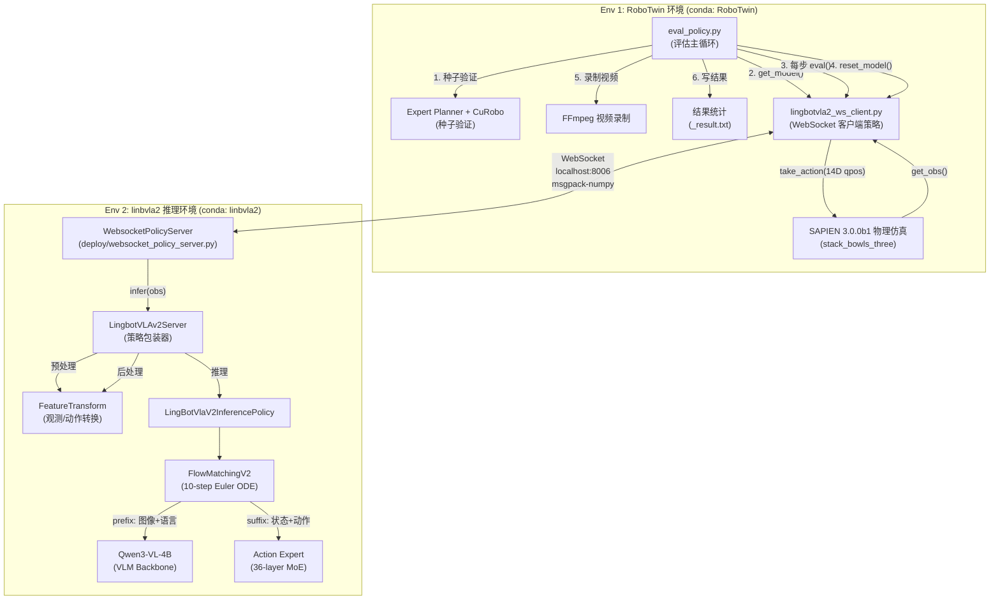
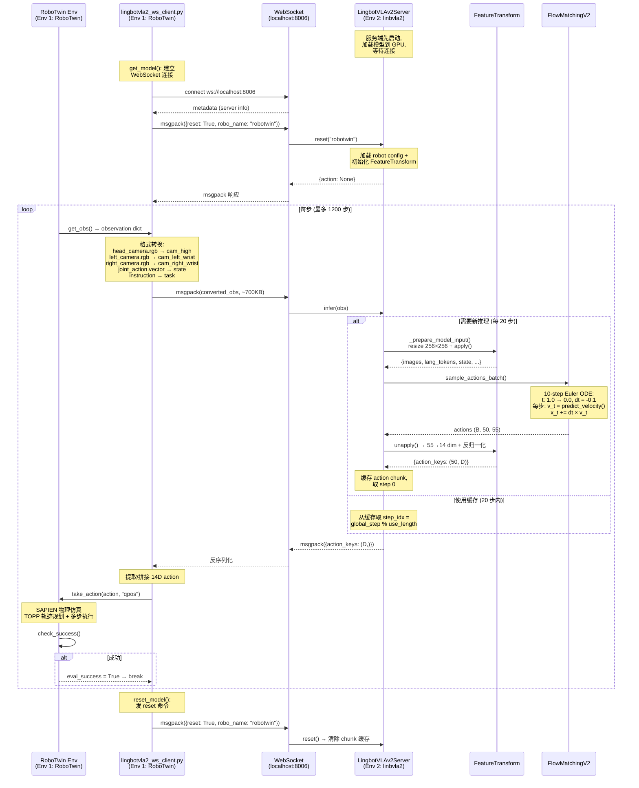

# LingBot-VLA 2.0 闭环评估: RoboTwin stack_bowls_three — 实施方案与操作手册

在 GCP Blackwell 实例上使用 [RoboTwin 2.0](https://robotwin-platform.github.io/) 仿真平台的 `stack_bowls_three` 任务, 闭环评估 lingbot-vla-v2 微调 checkpoint.

本文件包含: **实施方案** (系统架构分析、集成设计、关键决策) 和 **操作手册** (可直接上手的逐步操作、完整代码、问题预案).

---

## 目录

- [1. 目标与环境概览](#1-目标与环境概览)
- [2. 系统架构分析](#2-系统架构分析)
- [3. Step 0: 环境搭建](#3-step-0-环境搭建)
- [4. Step 1: 权重与依赖准备](#4-step-1-权重与依赖准备)
- [5. Step 2: 策略桥接模块](#5-step-2-策略桥接模块)
- [6. Step 3: 评估配置](#6-step-3-评估配置)
- [7. Step 4: 运行评估](#7-step-4-运行评估)
- [8. Step 5: 结果分析](#8-step-5-结果分析)
- [9. 问题排查与预案](#9-问题排查与预案)
- [10. 关键代码路径参考](#10-关键代码路径参考)
- [参考资料](#参考资料)

---

## 1. 目标与环境概览

### 1.1 评估目标

| 项目 | 值 |
|------|-----|
| 待评估模型 | LingBot-VLA v2 (6B 参数, Qwen3-VL-4B backbone + Sparse MoE Action Expert) |
| Checkpoint | `/home/luogang/CKPT/VLA/linbVLA2/rbtwn2/10000/hf_ckpt/` (10000 steps fine-tune on stack_bowls_three) |
| 评估任务 | `stack_bowls_three` (三碗堆叠) |
| 评估平台 | RoboTwin 2.0 (SAPIEN 3.0.0b1 物理仿真) |
| 评估配置 | `demo_clean` (无域随机化) |
| 评估轮次 | 100 episodes (论文标准协议) |
| 成功判定 | 三碗按高度堆叠, XY 对齐 < 4cm, Z 高度误差 < 2cm, 双夹爪张开 |
| 每 episode 步数上限 | 1200 steps (来自 `_eval_step_limit.yml`) |
| conda 环境 | **双环境**: `RoboTwin` (已有, 仿真) + `linbvla2` (新建, 推理) |

### 1.2 机器配置

| 项目 | 值 |
|------|-----|
| 实例 | GCP Blackwell |
| GPU | NVIDIA B200 (或同系列) |
| CUDA | 12.8 |
| 系统 Python | 3.10.12 |
| OS | Linux 6.8.0-1064-gcp |
| 已有 conda 环境 | `RoboTwin` (sapien 3.0.0b1), `ivla15` (sapien + InternVLA), `starVLA` |

### 1.3 关键路径速查

| 类型 | 路径 |
|------|------|
| lingbot-vla-v2 代码库 | `/home/luogang/SRC/Robot/lingbot-vla-v2/` |
| RoboTwin 代码库 | `/home/luogang/share/zwy/Projects/RoboTwin/` |
| Checkpoint (HF safetensors) | `/home/luogang/CKPT/VLA/linbVLA2/rbtwn2/10000/hf_ckpt/` |
| 训练配置 (需创建) | `/home/luogang/CKPT/VLA/linbVLA2/lingbotvla_cli.yaml` |
| Qwen3-VL-4B-Instruct (需下载) | `/home/luogang/CKPT/VLM/Qwen3-VL-4B-Instruct/` |
| 归一化统计量 | `/home/luogang/SRC/Robot/lingbot-vla-v2/assets/norm_stats/robotwin.json` |
| Robot 配置 (RoboTwin) | `/home/luogang/SRC/Robot/lingbot-vla-v2/configs/robot_configs/robotwin.yaml` |
| 策略桥接模块 (需创建) | `/home/luogang/share/zwy/Projects/RoboTwin/policy/lingbotvla2_ws_client.py` |
| 评估 config (需创建) | `/home/luogang/share/zwy/Projects/RoboTwin/policy/eval_linbvla2_stackb3.yaml` |
| WebSocket 服务端 (已有) | `deploy/lingbot_vla_v2_policy.py` + `deploy/websocket_policy_server.py` |
| WebSocket 序列化 (已有) | `deploy/msgpack_numpy.py` |
| 评估结果输出 | `eval_result/stack_bowls_three/lingbotvla2_ws_client/demo_clean/...` |

### 1.4 与 InternVLA 评估方案的关键差异

| 差异点 | InternVLA-A1.5 | LingBot-VLA v2 |
|--------|----------------|----------------|
| 模型加载 | 直接 `from_pretrained()` | 通过 `LingbotVLAv2Server` 包装器 |
| 配置文件 | `config.json` 自包含 | 需要 `lingbotvla_cli.yaml` (训练 config) |
| 动作维度 | 14→16→14 (有 reorder/compact) | 14→55→14 (统一动作空间 pad) |
| 归一化方式 | `meanstd` | `bounds_99_woclip` (q01/q99 边界映射, 无裁剪) |
| 动作统计文件 | `stats.json` (checkpoint 内) | `assets/norm_stats/robotwin.json` (代码库内) |
| 推理管线 | 单次 forward | 10 步 Euler ODE 流匹配去噪 |
| 图像分辨率 | 320×240 → 224×224 (padding) | 320×240 → 256×256 (resize) |
| 图像预处理 | 自定义 `ResizeImagesWithPadFn` | Qwen3-VL `image_processor` |
| Action chunk | 50 步, 使用前 20 步 | 50 步, 使用前 20 步 (可配置) |
| 语言模板 | Qwen3.5 chat template | Qwen3 chat template |
| 集成方式 | 自写 `inference.py` (进程内) | **双环境 WebSocket**: RoboTwin env 跑仿真 + linbvla2 env 跑推理服务 |
| Base VLM | Qwen3.5 (需 patch transformers) | Qwen3-VL-4B-Instruct (原生支持) |

---

## 2. 系统架构分析

### 2.1 整体集成架构

本方案采用 **双环境 WebSocket 模式**: RoboTwin 仿真在已有的 `RoboTwin` conda 环境中运行, lingbot-vla-v2 推理服务在新建的 `linbvla2` conda 环境中运行, 两者通过 localhost WebSocket 通信.

选择理由:
- **零污染**: RoboTwin 环境完全不动, 不需要安装 transformers、flash-attn 等 ML 推理包, 避免升级 huggingface-hub 等带来的依赖冲突风险
- **客户端依赖已满足**: RoboTwin 环境已有 `websockets 15.0.1` + `msgpack 1.1.2` + `numpy 1.26.4`, 策略桥接模块零安装即可运行
- **代码已就绪**: lingbot-vla-v2 代码库自带完整 WebSocket 通信三件套 (`deploy/websocket_policy_server.py` + `deploy/websocket_client_policy.py` + `deploy/msgpack_numpy.py`), 服务端无需任何开发
- **环境隔离**: 推理环境可自由选择 torch 版本、flash-attn 版本, 不受 sapien 约束



#### 通信协议

| 项目 | 说明 |
|------|------|
| 协议 | WebSocket (`ws://localhost:8006`) |
| 序列化 | msgpack + 自定义 numpy 扩展 (`deploy/msgpack_numpy.py`) |
| 单帧数据量 | ~700 KB (3 cameras × 320×240×3 uint8 + 14D state + 字符串指令) |
| 单步延迟开销 | ~5-10 ms (localhost 序列化/反序列化, 可忽略) |
| 健康检查 | `GET /healthz` → HTTP 200 |
| 连接管理 | 客户端自动重连 (`_wait_for_server()` 循环等待) |
| 特殊命令 | `{"reset": True, "robo_name": "robotwin"}` → 重置模型状态 |

### 2.2 推理数据流详解



### 2.3 观测与动作映射

#### 观测映射 (RoboTwin → lingbot-vla-v2)

RoboTwin 的 `get_obs()` (定义在 `envs/_base_task.py:462`) 返回嵌套字典:

```python
{
    "observation": {
        "head_camera":  {"rgb": np.ndarray(240, 320, 3), "intrinsic_cv": ..., ...},
        "left_camera":  {"rgb": np.ndarray(240, 320, 3), ...},
        "right_camera": {"rgb": np.ndarray(240, 320, 3), ...},
    },
    "joint_action": {
        "left_arm": [j1, j2, j3, j4, j5, j6],      # 6 个关节角 (rad)
        "left_gripper": float,                        # 夹爪值
        "right_arm": [j1, j2, j3, j4, j5, j6],
        "right_gripper": float,
        "vector": np.ndarray(14,),  # [left_arm(6), left_gripper(1), right_arm(6), right_gripper(1)]
    },
    "endpose": {...},
    "pointcloud": [...],
}
```

lingbot-vla-v2 的 `LingbotVLAv2Server.infer()` 期望平铺字典 (key 来自 `configs/robot_configs/robotwin.yaml` 的 `origin_keys`):

```python
{
    "observation.images.cam_high":       np.ndarray(240, 320, 3),  # HWC uint8
    "observation.images.cam_left_wrist": np.ndarray(240, 320, 3),
    "observation.images.cam_right_wrist":np.ndarray(240, 320, 3),
    "observation.state":                 np.ndarray(14,),          # float32
    "task":                              "stack three bowls ...",   # 语言指令
}
```

转换核心逻辑:

```python
def convert_obs(robotwin_obs, instruction):
    return {
        "observation.images.cam_high":        robotwin_obs["observation"]["head_camera"]["rgb"],
        "observation.images.cam_left_wrist":  robotwin_obs["observation"]["left_camera"]["rgb"],
        "observation.images.cam_right_wrist": robotwin_obs["observation"]["right_camera"]["rgb"],
        "observation.state":                  robotwin_obs["joint_action"]["vector"].astype(np.float32),
        "task":                               instruction,
    }
```

#### 动作映射 (lingbot-vla-v2 → RoboTwin)

lingbot-vla-v2 输出经过 `FeatureTransform.unapply()` 处理:
1. 从 55-dim 统一空间提取有效维度 (通过 `joint_mask`)
2. 反归一化 (`bounds_99_woclip`: `x = x_norm * (q99 - q01) + q01`)
3. 反特征映射: 统一 key → 原始 key

最终返回:

```python
{"action": np.ndarray(50, 14)}  # chunk_ret=True 时
# 或
{"action": np.ndarray(14,)}     # chunk_ret=False 时 (使用 use_length 分步返回)
```

14-dim 格式: `[left_arm(6), left_gripper(1), right_arm(6), right_gripper(1)]`

与 RoboTwin `take_action(action, action_type="qpos")` 完全匹配, 可直接传入.

#### 归一化方式: bounds_99_woclip

lingbot-vla-v2 使用 `bounds_99_woclip` 归一化 (不同于 InternVLA 的 `meanstd`):

$$x_{\text{norm}} = \frac{x - q_{01}}{q_{99} - q_{01}} \times 2 - 1$$

$$x = \frac{x_{\text{norm}} + 1}{2} \times (q_{99} - q_{01}) + q_{01}$$

其中 $q_{01}$, $q_{99}$ 为 1% 和 99% 分位数, 来自 `assets/norm_stats/robotwin.json` (50 个 RoboTwin 任务的全局统计, 共 6,062,592 帧).

`woclip` 表示不对归一化后的值做裁剪 (不同于 `bounds_99` 会裁剪到 $[-1.5, 1.5]$).

### 2.4 lingbot-vla-v2 模型加载流程

`LingbotVLAv2Server` 的 `load_vla()` 方法 (定义在 `deploy/lingbot_vla_v2_policy.py:272`) 有一个关键假设:

```python
training_config_path = Path(path_to_pi_model).parent.parent.parent / 'lingbotvla_cli.yaml'
```

即 checkpoint 路径上三级目录下必须有 `lingbotvla_cli.yaml`. 对于我们的 checkpoint:

```
/home/luogang/CKPT/VLA/linbVLA2/rbtwn2/10000/hf_ckpt/
                                ↑ parent.parent.parent = linbVLA2/
```

因此需要在 `/home/luogang/CKPT/VLA/linbVLA2/` 创建 `lingbotvla_cli.yaml`.

加载流程:
1. 读取 `lingbotvla_cli.yaml` 中的 `model` + `train` 段 → 构建 `LingbotVLAV2Config`
2. 从 `model.tokenizer_path` 确定 base VLM (Qwen3-VL)
3. 加载 Qwen3-VL config → 合并 text_config 和 vision_config 到 VLA config
4. 实例化 `LingBotVlaV2InferencePolicy(config, eval=True)` (含 alignment modules 的架构)
5. 从 checkpoint 的 `*.safetensors` 加载所有权重 → `load_state_dict(strict=True)`
6. 设置 `FeatureTransform` (在 `reset()` 中, 使用 robot config + norm stats)

> **重要**: `align_params` 中的 depth/video teacher 路径 (`moge_path`, `morgbd_path`, `ckpt_path`) 仅用于训练时计算 distillation loss. 推理时 `init_depth_heads()` 和 `init_video_heads()` 只创建模型架构 (learnable embeddings + projection heads), 这些参数从 checkpoint 加载, **不会**加载 teacher 模型文件. 因此这些路径不需要在本机存在.

---

## 3. Step 0: 环境搭建

双环境方案中, 两个 conda 环境各司其职:

| 环境 | 用途 | 关键包 | 操作 |
|------|------|--------|------|
| `RoboTwin` | 物理仿真 + 评估循环 + WebSocket 客户端 | sapien, mplib, curobo, websockets, msgpack | 已有, 仅验证 |
| `linbvla2` | 模型推理 + WebSocket 服务端 | torch, transformers, flash-attn, lingbotvla | 新建 |

### 3.1 Env 1: RoboTwin 环境 (已有, 无需改动)

RoboTwin 环境位于 `/home/luogang/miniforge3/envs/RoboTwin/`, 已包含仿真评估所需的全部依赖. 策略桥接模块只需 `websockets` + `msgpack` + `numpy`, 这三个包已安装.

**验证已有依赖**:

```bash
conda activate RoboTwin
python -c "
import sapien; print(f'sapien: {sapien.__version__}')
import mplib; print('mplib: OK')
import websockets; print(f'websockets: {websockets.__version__}')
import msgpack; print(f'msgpack: {msgpack.version}')
import numpy; print(f'numpy: {numpy.__version__}')
print('--- RoboTwin 环境验证通过 ---')
"
```

期望输出:
```
sapien: 3.0.0b1
mplib: OK
websockets: 15.0.1
msgpack: (1, 1, 2)
numpy: 1.26.4
--- RoboTwin 环境验证通过 ---
```

**SAPIEN/mplib patch 验证** (如已 patch 则跳过):

```bash
conda activate RoboTwin

# 检查 SAPIEN encoding patch
SAPIEN_LOCATION=$(pip show sapien | grep 'Location' | awk '{print $2}')/sapien
URDF_LOADER="${SAPIEN_LOCATION}/wrapper/urdf_loader.py"
if grep -q 'encoding="utf-8"' "${URDF_LOADER}" 2>/dev/null; then
    echo "SAPIEN: encoding patch OK"
else
    sed -i -E 's/("r")(\))( as)/\1, encoding="utf-8") as/g' "${URDF_LOADER}"
    echo "SAPIEN: encoding patch applied"
fi

# 检查 mplib collide patch
MPLIB_LOCATION=$(pip show mplib | grep 'Location' | awk '{print $2}')/mplib
PLANNER="${MPLIB_LOCATION}/planner.py"
if grep -q 'or collide ' "${PLANNER}" 2>/dev/null; then
    sed -i -E 's/(if np.linalg.norm\(delta_twist\) < 1e-4 )(or collide )(or not within_joint_limit:)/\1\3/g' "${PLANNER}"
    echo "mplib: collide patch applied"
else
    echo "mplib: collide patch OK (already patched or pattern not found)"
fi
```

**SAPIEN 渲染测试**:

```bash
cd /home/luogang/share/zwy/Projects/RoboTwin
python script/test_render.py
```

如果报 Vulkan/EGL 错误, 设置:
```bash
export PYOPENGL_PLATFORM=egl
export MESA_GL_VERSION_OVERRIDE=4.1
export SAPIEN_DISABLE_VULKAN_VALIDATION=1
```

### 3.2 Env 2: linbvla2 推理环境 (新建)

此环境只装模型推理链, **不装** sapien、mplib、curobo、open3d 等仿真依赖.

#### 3.2.1 创建环境

```bash
conda create -n linbvla2 python=3.10 -y
conda activate linbvla2
pip install -U pip setuptools wheel
```

#### 3.2.2 安装 PyTorch

```bash
pip install torch==2.8.0 torchvision==0.23.0 torchaudio==2.8.0 \
    --index-url https://download.pytorch.org/whl/cu128
```

**验证**:
```bash
python -c "import torch; print(torch.__version__, torch.cuda.is_available())"
# 期望: 2.8.0+cu128 True
```

#### 3.2.3 安装推理依赖

```bash
# transformers + tokenizers (Qwen3-VL 模型加载)
pip install transformers==4.57.3

# flash-attn (Qwen3-VL 和 Action Expert 的 attention 实现)
pip install flash-attn --no-build-isolation

# 其他推理必需
pip install einops safetensors sentencepiece

# WebSocket 服务端依赖
pip install websockets msgpack

# lingbot-vla-v2 模型代码 (editable install, 不拉额外依赖)
cd /home/luogang/SRC/Robot/lingbot-vla-v2
pip install -e . --no-deps

# depth alignment modules (推理时只需架构代码, 不需要 teacher 权重)
pip install -e lingbotvla/models/vla/vision_models/lingbot-depth --no-deps

# 确保 numpy 是 1.x (与 RoboTwin 环境一致)
pip install numpy==1.26.4
```

> **注意**: 不需要安装 `requirements-depth.txt` 中的大部分包 (如 timm, kornia 等), 因为推理时 depth/video teacher 不会被加载. 只需要 `lingbot-depth` 的 Python 包注册 (纯架构代码).

#### 3.2.4 完整性验证

```bash
conda activate linbvla2
python -c "
import torch; print(f'torch: {torch.__version__}, CUDA: {torch.cuda.is_available()}')
import flash_attn; print(f'flash_attn: {flash_attn.__version__}')
import transformers; print(f'transformers: {transformers.__version__}')
import lingbotvla; print('lingbotvla: OK')
import numpy; print(f'numpy: {numpy.__version__}')
from safetensors.torch import load_file; print('safetensors: OK')
import websockets; print(f'websockets: {websockets.__version__}')
import msgpack; print('msgpack: OK')
print('--- linbvla2 推理环境验证通过 ---')
"
```

期望输出:
```
torch: 2.8.0+cu128, CUDA: True
flash_attn: 2.8.3
transformers: 4.57.3
lingbotvla: OK
numpy: 1.26.4
safetensors: OK
websockets: ...
msgpack: OK
--- linbvla2 推理环境验证通过 ---
```

---

## 4. Step 1: 权重与依赖准备

### 4.1 下载 Qwen3-VL-4B-Instruct

lingbot-vla-v2 使用 Qwen3-VL-4B-Instruct 作为 base VLM. 模型加载时需要其 config 和 processor (image processor + tokenizer).

```bash
conda activate linbvla2
export HF_HOME=/home/luogang/.cache/huggingface

# 方法 A: 使用 lingbot-vla-v2 的下载脚本
cd /home/luogang/SRC/Robot/lingbot-vla-v2
python scripts/download_hf_model.py \
    --repo_id Qwen/Qwen3-VL-4B-Instruct \
    --local_dir /home/luogang/CKPT/VLM

# 方法 B: 使用 huggingface-cli (如方法 A 失败)
huggingface-cli download Qwen/Qwen3-VL-4B-Instruct \
    --local-dir /home/luogang/CKPT/VLM/Qwen3-VL-4B-Instruct
```

**验证**:
```bash
ls /home/luogang/CKPT/VLM/Qwen3-VL-4B-Instruct/config.json
python -c "
from transformers import AutoProcessor
p = AutoProcessor.from_pretrained('/home/luogang/CKPT/VLM/Qwen3-VL-4B-Instruct', trust_remote_code=True)
print(f'Tokenizer vocab: {p.tokenizer.vocab_size}, Image processor: {type(p.image_processor).__name__}')
"
```

> **备选方案**: 如果下载困难, checkpoint 目录 (`hf_ckpt/`) 本身包含 tokenizer 文件 (`tokenizer.json`, `vocab.json`, `config.json` 等). 但这些文件来自 VLA 模型而非原始 Qwen3-VL, 可能缺少 image processor 的完整配置. 优先使用独立下载的 Qwen3-VL-4B-Instruct.

### 4.2 创建 lingbotvla_cli.yaml

`LingbotVLAv2Server.load_vla()` 从 `Path(model_path).parent.parent.parent / 'lingbotvla_cli.yaml'` 读取训练配置. 对于 checkpoint 路径 `/home/luogang/CKPT/VLA/linbVLA2/rbtwn2/10000/hf_ckpt/`, 需要在 `/home/luogang/CKPT/VLA/linbVLA2/` 创建此文件.

此文件基于训练时使用的 `configs/vla/robotwin/stack_bowls_three_ft.yaml`, 关键修改:
- `tokenizer_path` → 本机 Qwen3-VL 路径
- `norm_stats_file` → lingbot-vla-v2 代码库内的绝对路径
- `output_dir` → 本机路径 (非必需但保持一致)
- depth/video teacher 路径保持原样 (推理不加载, 但 config 解析需要)

```bash
cat > /home/luogang/CKPT/VLA/linbVLA2/lingbotvla_cli.yaml << 'YAML_EOF'
model:
  model_path: /home/luogang/CKPT/VLA/linbVLA2/rbtwn2/10000/hf_ckpt
  tokenizer_path: /home/luogang/CKPT/VLM/Qwen3-VL-4B-Instruct
  post_training: true
  adanorm_time: true
  config_key: LingbotVLAV2Config
  moe_implementation: fused

data:
  datasets_type: vla
  data_name: robotwin
  train_path: placeholder
  robot_config_root: ./configs/robot_configs
  joints:
    - arm.position: 14
    - end.position: 14
    - effector.position: 2
  cameras:
    - camera_top
    - camera_wrist_left
    - camera_wrist_right
  norm_type:
    - arm.position: bounds_99_woclip
    - end.position: bounds_99_woclip
    - effector.position: bounds_99_woclip
  norm_stats_file: /home/luogang/SRC/Robot/lingbot-vla-v2/assets/norm_stats/robotwin.json
  num_workers: 8
  use_future_image: true

train:
  output_dir: /home/luogang/CKPT/VLA/linbVLA2/rbtwn2
  moe_monitor_interval: 500
  enable_gradient_checkpointing: false
  precompute_grid_thw: true
  vlm_causal: true
  vlm_fsdp: false
  attention_implementation: flex_cached
  use_moe: true
  token_moe_layers: [0,1,2,3,4,5,6,7,8,9,10,11,12,13,14,15,16,17,18,19,20,21,22,23,24,25,26,27,28,29,30,31,32,33,34,35]
  token_num_experts: 32
  token_top_k: 4
  token_moe_intermediate_size: 512
  token_shared_intermediate_size: 704
  bias_update_speed: 0
  sequence_wise_mode: "per_sequence"
  sequence_wise_loss_coeff: 1e-3
  router_z_loss_coeff: 1e-4
  router_activation: "sigmoid"
  routed_scaling_factor: 4.0
  use_shared_expert_gate: false
  loss_type: L1_fm
  use_compile: false
  use_wandb: false
  rmpad: false
  rmpad_with_pos_ids: false
  ulysses_parallel_size: 1
  freeze_vision_encoder: false
  tokenizer_max_length: 72
  action_dim: 55
  max_action_dim: 55
  max_state_dim: 55
  chunk_size: 50
  n_action_steps: 50
  n_obs_steps: 1
  num_steps: 10
  lr: 1.0e-4
  lr_min: 5.0e-5
  lr_decay_style: cosine
  optimizer: muon
  num_train_epochs: 29000
  micro_batch_size: 16
  global_batch_size: 128
  max_steps: 10000
  ckpt_manager: dcp
  save_steps: 5000
  save_epochs: 29000
  enable_fp32: true
  enable_resume: true
  align_params:
    mode: 'query'
    num_task_tokens: 8
    depth_loss_weight: 0.004
    future_depth_loss_weight: 0.004
    use_future_video: true
    llm:
      dim_out: 2560
      image_token_size: 8
      image_input_size: 224
    depth:
      model_type: MoRGBD
      moge_path: /mnt/r/CKPT/moge-2-vitb-normal/moge2-vitb-normal.pt
      morgbd_path: /mnt/r/CKPT/lingbot-vla-v2-6b/depth/model.pt
      num_layers: 1
      num_heads: 4
      dim_head: 32
      ff_mult: 1
      num_backbone_tokens: 256
      token_size: 16
      dim_out: 1024
      input_size: 224
      use_future_depth: true
      block_future_depth_to_action: false
      detach_future_image_feats: true
    video:
      ckpt_path: /mnt/r/CKPT/lingbot-vla-v2-6b/dino_video/teacher_step_10000.pth
      config_path: /mnt/r/CKPT/lingbot-vla-v2-6b/dino_video/config.yaml
      attention_mode: flex_block_causal
      input_size: 256
      block_suffix_to_future_video: false
      share_future_depth_query: true
      use_shared_future_task_proj: true
      use_current_shared_task_proj: true
      num_future_frames: 1
      use_warmup_frame: true
      effective_fps: 1.0
      n_blocks: 1
      cls_pool: last
      detach_image_feats: true
      num_layers: 1
      num_heads: 4
      dim_head: 32
      ff_mult: 1
      num_backbone_tokens: 256
      dim_out: 1024
      future_video_loss_weight: 0.004
      use_smooth_l1_loss: false
      use_mse_loss: true
      mse_loss_weight: 1.0
      use_patch_loss: true
      use_current_patch_loss: true
      use_cosine_loss: true
      cosine_loss_weight: 0.2
      use_cls_loss: false
      cls_loss_type: mse
      cls_loss_weight: 0.2
      log_max_samples: 32
      log_scale: 16
    visual_steps: 5000
YAML_EOF
```

> **注意**: `align_params` 中的 `moge_path`, `morgbd_path`, `ckpt_path`, `config_path` 指向训练机器的路径. 这些路径在推理时 **不会被加载** — `init_depth_heads()` 和 `init_video_heads()` 只创建 nn.Module 架构 (learnable embeddings + projection heads), 权重从 checkpoint 的 safetensors 文件加载. 但这些 key 必须存在于 config 中, 否则 `init_depth_heads()` 会因 key 缺失而报错.

**验证**:
```bash
python -c "
import yaml
with open('/home/luogang/CKPT/VLA/linbVLA2/lingbotvla_cli.yaml') as f:
    cfg = yaml.safe_load(f)
print('model keys:', list(cfg['model'].keys()))
print('data keys:', list(cfg['data'].keys()))
print('train keys:', sorted(cfg['train'].keys())[:10], '...')
print('tokenizer_path:', cfg['model']['tokenizer_path'])
print('norm_stats_file:', cfg['data']['norm_stats_file'])
"
```

### 4.3 验证 Checkpoint

```bash
python -c "
from pathlib import Path
from safetensors import safe_open

ckpt_dir = Path('/home/luogang/CKPT/VLA/linbVLA2/rbtwn2/10000/hf_ckpt')
safetensors_files = sorted(ckpt_dir.glob('model-*.safetensors'))
print(f'Found {len(safetensors_files)} safetensors shards')

total_params = 0
for f in safetensors_files:
    with safe_open(str(f), framework='pt', device='cpu') as sf:
        n = len(sf.keys())
        total_params += n
        print(f'  {f.name}: {n} tensors')
print(f'Total tensors: {total_params}')

# 检查关键 key 存在
with safe_open(str(safetensors_files[0]), framework='pt', device='cpu') as sf:
    sample_keys = list(sf.keys())[:5]
    print(f'Sample keys: {sample_keys}')
"
```

### 4.4 设置环境变量

创建两个便捷脚本, 分别在两个终端中 source:

#### 4.4.1 推理服务端环境变量 (Env 2: linbvla2)

```bash
cat > /home/luogang/SRC/Robot/lingbot-vla-v2/b/d/eval_server_env.sh << 'BASH_EOF'
#!/bin/bash
# lingbot-vla-v2 推理服务端环境变量
# 用法: conda activate linbvla2 && source b/d/eval_server_env.sh

export LINGBOT_ROOT=/home/luogang/SRC/Robot/lingbot-vla-v2
export CKPT_PATH=/home/luogang/CKPT/VLA/linbVLA2/rbtwn2/10000/hf_ckpt
export QWEN3VL_PATH=/home/luogang/CKPT/VLM/Qwen3-VL-4B-Instruct
export WS_PORT=8006

# PYTHONPATH: lingbot-vla-v2 代码库
export PYTHONPATH="${LINGBOT_ROOT}:${PYTHONPATH:-}"

# CUDA
export CUDA_HOME="/usr/local/cuda-12.8"
export LD_LIBRARY_PATH="${CUDA_HOME}/lib64:${LD_LIBRARY_PATH:-}"
export CUDA_VISIBLE_DEVICES=0

# HuggingFace
export HF_HOME=/home/luogang/.cache/huggingface
export TOKENIZERS_PARALLELISM=false

echo "[Server] 环境变量已设置. CKPT=${CKPT_PATH}, PORT=${WS_PORT}"
BASH_EOF
chmod +x /home/luogang/SRC/Robot/lingbot-vla-v2/b/d/eval_server_env.sh
```

#### 4.4.2 仿真评估端环境变量 (Env 1: RoboTwin)

```bash
cat > /home/luogang/SRC/Robot/lingbot-vla-v2/b/d/eval_client_env.sh << 'BASH_EOF'
#!/bin/bash
# RoboTwin 仿真评估端环境变量
# 用法: conda activate RoboTwin && source eval_client_env.sh

export LINGBOT_ROOT=/home/luogang/SRC/Robot/lingbot-vla-v2
export ROBOTWIN_ROOT=/home/luogang/share/zwy/Projects/RoboTwin
export CKPT_PATH=/home/luogang/CKPT/VLA/linbVLA2/rbtwn2/10000/hf_ckpt
export WS_PORT=8006

# PYTHONPATH: RoboTwin (eval_policy.py 需要)
export PYTHONPATH="${ROBOTWIN_ROOT}:${PYTHONPATH:-}"

# CUDA (仿真侧不需要 GPU, 但 SAPIEN 渲染可能用到)
export CUDA_VISIBLE_DEVICES=0

# 渲染 (headless)
export PYOPENGL_PLATFORM=egl
export MESA_GL_VERSION_OVERRIDE=4.1
export SAPIEN_DISABLE_VULKAN_VALIDATION=1

echo "[Client] 环境变量已设置. WS_PORT=${WS_PORT}"
BASH_EOF
chmod +x /home/luogang/SRC/Robot/lingbot-vla-v2/b/d/eval_client_env.sh
```

---

## 5. Step 2: 策略桥接模块

### 5.1 模块设计

RoboTwin 的 `script/eval_policy.py` 通过 `importlib.import_module(policy_name)` 动态加载策略模块, 要求模块导出三个函数:

| 函数 | 签名 | 职责 |
|------|------|------|
| `get_model` | `(usr_args: dict) -> Any` | 建立 WebSocket 连接, 发送 reset 命令 |
| `eval` | `(TASK_ENV, model, observation: dict) -> None` | 通过 WebSocket 发送观测、接收动作、执行动作 |
| `reset_model` | `(model) -> None` | 发送 reset 命令清除服务端 action chunk 缓存 |

策略模块放在 `policy/` 目录下 (RoboTwin 的 `eval_policy.py` 会 `sys.path.append("./policy")`).

**关键设计**: 本模块运行在 **RoboTwin 环境**中, 只依赖 `websockets` + `msgpack` + `numpy` (均已安装), 不 import 任何 lingbot-vla-v2 代码. msgpack-numpy 的序列化/反序列化逻辑从 `deploy/msgpack_numpy.py` 内联到模块中.

### 5.2 完整源码

```bash
mkdir -p /home/luogang/share/zwy/Projects/RoboTwin/policy
cat > /home/luogang/share/zwy/Projects/RoboTwin/policy/lingbotvla2_ws_client.py << 'PYEOF'
"""
RoboTwin policy interface for LingBot-VLA v2 (WebSocket client).

Usage with RoboTwin eval_policy.py:
    policy_name: lingbotvla2_ws_client

Communicates with a LingbotVLAv2Server running in a separate conda env
via WebSocket (localhost). Only depends on websockets + msgpack + numpy.
"""

import functools
import logging
import os
import time

import msgpack
import numpy as np
from websockets.sync.client import connect

# ---------- msgpack-numpy serialization (from deploy/msgpack_numpy.py) ----------

def _pack_array(obj):
    if isinstance(obj, np.ndarray):
        if obj.dtype.kind in ("V", "O", "c"):
            raise ValueError(f"Unsupported dtype: {obj.dtype}")
        return {
            b"__ndarray__": True,
            b"data": obj.tobytes(),
            b"dtype": obj.dtype.str,
            b"shape": obj.shape,
        }
    if isinstance(obj, np.generic):
        return {
            b"__npgeneric__": True,
            b"data": obj.item(),
            b"dtype": obj.dtype.str,
        }
    return obj


def _unpack_array(obj):
    if b"__ndarray__" in obj:
        return np.ndarray(
            buffer=obj[b"data"], dtype=np.dtype(obj[b"dtype"]), shape=obj[b"shape"]
        )
    if b"__npgeneric__" in obj:
        return np.dtype(obj[b"dtype"]).type(obj[b"data"])
    return obj


_Packer = functools.partial(msgpack.Packer, default=_pack_array)
_unpackb = functools.partial(msgpack.unpackb, object_hook=_unpack_array)


# ---------- WebSocket client ----------

class _WSClient:
    def __init__(self, port=8006, host="localhost"):
        self._uri = f"ws://{host}:{port}"
        self._packer = _Packer()
        self._ws, self._metadata = self._wait_for_server()

    def _wait_for_server(self):
        logging.info(f"[ws_client] Waiting for server at {self._uri} ...")
        while True:
            try:
                ws = connect(self._uri, compression=None, max_size=None)
                metadata = _unpackb(ws.recv())
                logging.info(f"[ws_client] Connected. metadata={metadata}")
                return ws, metadata
            except ConnectionRefusedError:
                logging.info("[ws_client] Server not ready, retrying in 5s ...")
                time.sleep(5)

    def call(self, obs):
        self._ws.send(self._packer.pack(obs))
        resp = self._ws.recv()
        if isinstance(resp, str):
            raise RuntimeError(f"Server error:\n{resp}")
        return _unpackb(resp)

    def reset(self, robo_name="robotwin"):
        return self.call({"reset": True, "robo_name": robo_name})

    def close(self):
        try:
            self._ws.close()
        except Exception:
            pass


# ---------- RoboTwin policy interface ----------

WS_PORT = int(os.environ.get("WS_PORT", 8006))

INSTRUCTION = "stack three bowls"


def get_model(usr_args):
    port = int(usr_args.get("ws_port", WS_PORT))

    print(f"[lingbotvla2_ws] Connecting to inference server on port {port} ...")
    client = _WSClient(port=port)

    client.reset("robotwin")
    print(f"[lingbotvla2_ws] Connected and reset for robotwin")

    return client


def eval(TASK_ENV, model, observation):
    instruction = getattr(TASK_ENV, "instruction", INSTRUCTION)

    obs_converted = {
        "observation.images.cam_high": observation["observation"]["head_camera"]["rgb"],
        "observation.images.cam_left_wrist": observation["observation"]["left_camera"]["rgb"],
        "observation.images.cam_right_wrist": observation["observation"]["right_camera"]["rgb"],
        "observation.state": observation["joint_action"]["vector"].astype(np.float32),
        "task": instruction,
    }

    result = model.call(obs_converted)

    # 兼容两种返回格式 (见 5.4 说明)
    if "action" in result:
        action = np.asarray(result["action"], dtype=np.float64).flatten()
    else:
        # 分段格式: action.arm.position (12D) + action.effector.position (2D)
        # 需要重组为 RoboTwin 14-dim: [left_arm(6), left_gripper(1), right_arm(6), right_gripper(1)]
        arm = np.asarray(result["action.arm.position"]).flatten()    # [left(6), right(6)]
        eff = np.asarray(result["action.effector.position"]).flatten()  # [left(1), right(1)]
        action = np.array([
            arm[0], arm[1], arm[2], arm[3], arm[4], arm[5],
            eff[0],
            arm[6], arm[7], arm[8], arm[9], arm[10], arm[11],
            eff[1],
        ], dtype=np.float64)

    TASK_ENV.take_action(action, action_type="qpos")


def reset_model(model):
    model.reset("robotwin")
PYEOF
```

### 5.3 模块代码解读

#### `_WSClient` (WebSocket 客户端)

- `__init__()`: 连接 `ws://localhost:{port}`, 自动重连 (每 5 秒重试)
- `call(obs)`: 将 obs dict 通过 msgpack + numpy 扩展序列化, 发送到服务端, 接收并反序列化响应
- `reset(robo_name)`: 发送特殊命令 `{"reset": True, "robo_name": "robotwin"}`, 服务端 `LingbotVLAv2Server.infer()` 内部会识别此命令并调用 `self.reset()` 加载 robot config
- `_pack_array` / `_unpack_array`: 从 `deploy/msgpack_numpy.py` 内联, 将 numpy array 编码为 `{__ndarray__: True, data: bytes, dtype: str, shape: tuple}`, 比 pickle 安全且跨语言兼容

#### `get_model(usr_args)`

1. 读取 `WS_PORT` 环境变量 (默认 8006)
2. 实例化 `_WSClient`, 建立 WebSocket 连接 (如果服务端未启动, 自动等待)
3. 发送 `reset("robotwin")` 命令, 触发服务端:
   - 加载 `configs/robot_configs/robotwin.yaml` (相机/状态/动作特征映射)
   - 初始化 `FeatureTransform` (含 normalizer, image processor, tokenizer)
4. 返回 client 对象

#### `eval(TASK_ENV, model, observation)`

1. 获取语言指令 (`TASK_ENV.instruction`, 由 `eval_policy.py` 调用 `set_instruction()` 设置)
2. 转换观测格式: RoboTwin 嵌套字典 → lingbot-vla-v2 平铺字典 (图像 HWC uint8, 状态 14-dim float32)
3. 通过 WebSocket 发送观测 (~700KB/帧), 接收动作
4. 兼容两种返回格式 (见 5.4), 提取 14-dim action
5. 调用 `TASK_ENV.take_action(action, "qpos")`

#### `reset_model(model)`

发送 `reset` 命令到服务端, 清除服务端的 action chunk 缓存和步数计数器, 为新 episode 做准备.

> **注意**: 与进程内模式不同, 这里的 reset 通过网络命令触发服务端重置, 而非直接修改服务端对象属性.

### 5.4 关于 `infer()` 返回值的说明

`LingbotVLAv2Server.infer()` 在 `chunk_ret=False` 模式下返回字典. 返回值的 key 来自 `feature_transform.org_features["actions"]`, 对于 RoboTwin 配置, 可能是 `"action"` (单个 key) 或多个 action key (如 `"action.arm.position"` + `"action.effector.position"`).

在 `_unapply_batched_actions()` (line 374-399 of `deploy/lingbot_vla_v2_policy.py`) 中, action chunk 按 `self.action_key` (即 `feature_transform.org_features["actions"]`) 的每个 key 分别 unapply. 对于 RoboTwin, `robotwin.yaml` 定义的 `actions` 段有两个 key:
- `action.arm.position`: 12 dims (left 6 + right 6)
- `action.effector.position`: 2 dims (left gripper + right gripper)

所以 `infer()` 返回形如:

```python
{
    "action.arm.position": np.ndarray(12,),
    "action.effector.position": np.ndarray(2,),
    "server_timing": {"infer_ms": ..., "prev_total_ms": ...},  # WebSocket 服务端自动附加
}
```

但 RoboTwin 的 `take_action()` 期望完整 14-dim: `[left_arm(6), left_gripper(1), right_arm(6), right_gripper(1)]`.

**重组逻辑** (已在 `eval()` 函数中实现):

```python
arm = result["action.arm.position"]       # [left(6), right(6)] = 12D
eff = result["action.effector.position"]  # [left(1), right(1)] = 2D
action = np.array([
    arm[0], arm[1], arm[2], arm[3], arm[4], arm[5],   # left arm
    eff[0],                                             # left gripper
    arm[6], arm[7], arm[8], arm[9], arm[10], arm[11],  # right arm
    eff[1],                                             # right gripper
])
```

> **重要**: 上述重组基于 `robotwin.yaml` 中 `origin_keys` 的 `start:end` 映射:
> - `action.arm.position` 的 `origin_keys`: `action[0:6]` + `action[7:13]` → left_arm + right_arm = 12D
> - `action.effector.position` 的 `origin_keys`: `action[6:7]` + `action[13:14]` → left_gripper + right_gripper = 2D
>
> `FeatureTransform.unapply()` 内部的 `reverse_features()` 可能会把分段动作重组回原始 14-dim `action` key. 如果 unapply 正确工作, 返回直接是 `{"action": (14,)}`. 策略模块已兼容两种格式.

> **建议**: 首次运行时打印 `result` 的 keys 和 shapes, 确认返回格式后再优化代码. 见 [9. 问题排查](#9-问题排查与预案) 中的调试方法.

---

## 6. Step 3: 评估配置

### 6.1 创建评估 config YAML

```bash
cat > /home/luogang/share/zwy/Projects/RoboTwin/policy/eval_linbvla2_stackb3.yaml << 'YAML_EOF'
task_name: stack_bowls_three
task_config: demo_clean
ckpt_setting: linbvla2_rbtwn2_10000
policy_name: lingbotvla2_ws_client
instruction_type: unseen
seed: 42
YAML_EOF
```

参数说明:

| 参数 | 值 | 说明 |
|------|-----|------|
| `task_name` | `stack_bowls_three` | 任务名, 对应 `envs/stack_bowls_three.py` |
| `task_config` | `demo_clean` | 评估配置, 对应 `task_config/demo_clean.yml` (无域随机化) |
| `ckpt_setting` | `linbvla2_rbtwn2_10000` | checkpoint 标识 (用于结果目录命名) |
| `policy_name` | `lingbotvla2_ws_client` | 策略模块名 (WebSocket 客户端, Python 模块名) |
| `instruction_type` | `unseen` | 语言指令类型: `unseen` (未见过的表述) 或 `seen` |
| `seed` | `42` | 随机种子 (起始 seed = 100000 × (1+42) = 4300000) |

### 6.2 RoboTwin demo_clean 配置说明

`task_config/demo_clean.yml` 的关键参数:

```yaml
render_freq: 0           # 不渲染 GUI (headless)
episode_num: 50           # (仅数据收集时用)
embodiment: [aloha-agilex] # 双臂 ALOHA-AgileX
camera:
  head_camera_type: D435   # 320×240, fovy=37
  wrist_camera_type: D435
  collect_head_camera: true
  collect_wrist_camera: true
data_type:
  rgb: true
  depth: false
  endpose: true
  qpos: true
domain_randomization:
  random_background: false    # 固定背景
  cluttered_table: false      # 无杂物
  clean_background_rate: 1    # 100% 干净背景
  random_table_height: 0      # 固定桌高
  random_light: false         # 固定光照
eval_video_log: true          # 录制视频
clear_cache_freq: 5           # 每 5 episode 清缓存
```

---

## 7. Step 4: 运行评估

双环境方案需要 **两个终端** 分别运行推理服务和评估仿真.

### 7.1 前置检查清单

```bash
# ---- 通用检查 ----
# 1. 确认 checkpoint 存在
ls /home/luogang/CKPT/VLA/linbVLA2/rbtwn2/10000/hf_ckpt/model-00001-of-00006.safetensors

# 2. 确认 lingbotvla_cli.yaml 存在
ls /home/luogang/CKPT/VLA/linbVLA2/lingbotvla_cli.yaml

# 3. 确认 Qwen3-VL 存在
ls /home/luogang/CKPT/VLM/Qwen3-VL-4B-Instruct/config.json

# 4. 确认策略模块存在
ls /home/luogang/share/zwy/Projects/RoboTwin/policy/lingbotvla2_ws_client.py

# 5. 确认评估 config 存在
ls /home/luogang/share/zwy/Projects/RoboTwin/policy/eval_linbvla2_stackb3.yaml

# 6. GPU 状态
nvidia-smi --query-gpu=index,name,memory.used,memory.total --format=csv
```

### 7.2 冒烟测试 (5 episodes)

#### Terminal 1: 启动推理服务 (Env 2: linbvla2)

```bash
conda activate linbvla2
source /home/luogang/SRC/Robot/lingbot-vla-v2/b/d/eval_server_env.sh

cd ${LINGBOT_ROOT}

# 启动 WebSocket 推理服务 (前台运行, 便于观察日志)
CUDA_VISIBLE_DEVICES=0 python -m deploy.lingbot_vla_v2_policy \
    --model_path ${CKPT_PATH} \
    --use_length 20 \
    --chunk_ret false \
    --use_bf16 true \
    --use_compile false \
    --port ${WS_PORT}
```

**等待输出** `Model initialized ...` 后, 服务端已就绪.

**首次启动时间**: 模型加载约 30-60 秒 (加载 6 个 safetensors shard ~25GB + 初始化 Qwen3-VL processor).

#### Terminal 2: 运行评估 (Env 1: RoboTwin)

```bash
conda activate RoboTwin
source /home/luogang/SRC/Robot/lingbot-vla-v2/b/d/eval_client_env.sh

# 健康检查: 确认服务端已启动
curl -s http://localhost:${WS_PORT}/healthz
# 期望: OK

cd ${ROBOTWIN_ROOT}

# 冒烟测试 (用 seed 0 避免与正式评估 seed 42 重叠)
python script/eval_policy.py \
    --config policy/eval_linbvla2_stackb3.yaml \
    --policy_ckpt_path /home/luogang/CKPT/VLA/linbVLA2/rbtwn2/10000/hf_ckpt \
    --overrides --seed 0
```

**预期行为**:
1. `[lingbotvla2_ws] Connecting to inference server on port 8006 ...` → 连接成功
2. `[lingbotvla2_ws] Connected and reset for robotwin` → 服务端 reset 完成
3. 对每个 seed: 先运行 expert planner 验证 → 如果 expert 成功则评估 policy
4. 打印 `step: N / 1200` 进度
5. 每 episode 结束打印 `Success!` 或 `Fail!` 和累计成功率
6. 视频保存到 `eval_result/stack_bowls_three/lingbotvla2_ws_client/demo_clean/linbvla2_rbtwn2_10000/<timestamp>/`

**首次推理时间**: 第一次 `infer()` 包含模型 warm-up (KV cache 初始化), 约 10-30 秒. 后续推理约 0.5-2 秒/步.

**如果冒烟测试失败**: 参见 [9. 问题排查](#9-问题排查与预案).

### 7.3 正式评估 (100 episodes)

#### Terminal 1: 后台启动推理服务

```bash
conda activate linbvla2
source /home/luogang/SRC/Robot/lingbot-vla-v2/b/d/eval_server_env.sh
cd ${LINGBOT_ROOT}

CUDA_VISIBLE_DEVICES=0 nohup python -m deploy.lingbot_vla_v2_policy \
    --model_path ${CKPT_PATH} \
    --use_length 20 \
    --chunk_ret false \
    --use_bf16 true \
    --use_compile false \
    --port ${WS_PORT} \
    > /home/luogang/CKPT/VLA/linbVLA2/eval_server_stackb3.log 2>&1 &

echo "Server PID: $!"

# 等待服务就绪
sleep 10
curl -s http://localhost:${WS_PORT}/healthz && echo " Server ready" || echo " Server not ready yet"
```

#### Terminal 2: 后台启动评估

```bash
conda activate RoboTwin
source /home/luogang/SRC/Robot/lingbot-vla-v2/b/d/eval_client_env.sh
cd ${ROBOTWIN_ROOT}

# 确认服务已就绪
curl -s http://localhost:${WS_PORT}/healthz

nohup python script/eval_policy.py \
    --config policy/eval_linbvla2_stackb3.yaml \
    --policy_ckpt_path /home/luogang/CKPT/VLA/linbVLA2/rbtwn2/10000/hf_ckpt \
    > /home/luogang/CKPT/VLA/linbVLA2/eval_client_stackb3_demo_clean.log 2>&1 &

echo "Eval PID: $!"
```

**监控**:

```bash
# 查看评估进度 (客户端日志)
tail -f /home/luogang/CKPT/VLA/linbVLA2/eval_client_stackb3_demo_clean.log

# 查看推理服务日志 (服务端日志)
tail -f /home/luogang/CKPT/VLA/linbVLA2/eval_server_stackb3.log

# 查看当前成功率
grep -oP 'Success rate: \K[^\n]+' /home/luogang/CKPT/VLA/linbVLA2/eval_client_stackb3_demo_clean.log | tail -5

# 查看 GPU 占用
nvidia-smi

# 查看两个进程
pgrep -af "eval_policy\|lingbot_vla_v2_policy"
```

**预估时间**: 100 episodes × (expert 验证 + policy 评估) ≈ 2-4 小时, 取决于:
- 每步推理时间 (~1-2 秒)
- 每 episode 步数 (成功时 ~200-600 步, 失败时 1200 步)
- Expert 验证时间 (~5-10 秒/seed)
- UnStableError 跳过的 seed 数量

### 7.4 服务端生命周期管理

推理服务在整个评估过程中保持运行. 评估结束后手动停止:

```bash
# 停止推理服务
kill $(pgrep -f "deploy.lingbot_vla_v2_policy")

# 或根据之前记录的 PID
kill <server_pid>
```

> **注意**: 如果评估客户端异常退出, 推理服务仍在运行, 不需要重启. 修复问题后重新启动评估即可, 客户端会自动重连.
>
> 如果推理服务异常退出, 评估客户端会报 `ConnectionClosed` 错误. 需要重启推理服务, 然后重启评估.

### 7.5 demo_randomized 评估 (可选)

推理服务不需要重启 (同一个模型), 只需在 Terminal 2 换一个 config:

```bash
cat > /home/luogang/share/zwy/Projects/RoboTwin/policy/eval_linbvla2_stackb3_rand.yaml << 'YAML_EOF'
task_name: stack_bowls_three
task_config: demo_randomized
ckpt_setting: linbvla2_rbtwn2_10000
policy_name: lingbotvla2_ws_client
instruction_type: unseen
seed: 42
YAML_EOF

conda activate RoboTwin
cd /home/luogang/share/zwy/Projects/RoboTwin

nohup python script/eval_policy.py \
    --config policy/eval_linbvla2_stackb3_rand.yaml \
    --policy_ckpt_path /home/luogang/CKPT/VLA/linbVLA2/rbtwn2/10000/hf_ckpt \
    > /home/luogang/CKPT/VLA/linbVLA2/eval_client_stackb3_demo_randomized.log 2>&1 &
```

### 7.6 use_length 调参

`use_length` 控制 action chunk 的使用长度, 即每 N 步重新推理一次. 对成功率有显著影响:

| use_length | 推理频率 | 优点 | 缺点 |
|------------|---------|------|------|
| 1 | 每步推理 | 最高反应性 | 最慢, GPU 时间最长 |
| 10 | 每 10 步 | 平衡 | — |
| 20 | 每 20 步 | 与 InternVLA 对齐 | 默认推荐 |
| 50 | 每 50 步 | 最快 | 可能错过纠错窗口 |

`use_length` 是推理服务端参数, 修改需要**重启推理服务**:

```bash
# Terminal 1: 重启推理服务 (修改 --use_length)
kill $(pgrep -f "deploy.lingbot_vla_v2_policy")

CUDA_VISIBLE_DEVICES=0 python -m deploy.lingbot_vla_v2_policy \
    --model_path /home/luogang/CKPT/VLA/linbVLA2/rbtwn2/10000/hf_ckpt \
    --use_length 10 \
    --chunk_ret false \
    --use_bf16 true \
    --use_compile false \
    --port 8006
```

---

## 8. Step 5: 结果分析

### 8.1 结果文件

评估完成后, 结果保存在:

```
${ROBOTWIN_ROOT}/eval_result/stack_bowls_three/lingbotvla2_ws_client/demo_clean/linbvla2_rbtwn2_10000/<timestamp>/
├── _result.txt           # 成功率 (如 "0.35" 表示 35%)
├── episode0.mp4          # 每 episode 的视频
├── episode1.mp4
├── ...
└── episode99.mp4
```

查看成功率:

```bash
find ${ROBOTWIN_ROOT}/eval_result/stack_bowls_three/lingbotvla2_ws_client -name "_result.txt" -exec echo "--- {} ---" \; -exec cat {} \;
```

### 8.2 基线对比

已有 RoboTwin stack_bowls_three 评估结果 (来自其他模型):

| 模型 | 配置 | demo_clean 成功率 |
|------|------|-------------------|
| GR00T (14d, 30k steps) | model2robotwin_interface | 55% |
| GR00T (14d, 4k steps, Qwen3.5 0.8B) | model2robotwin_interface | 62% |
| GR00T (14d, 5k steps, robotwin_train) | model2robotwin_interface | 57% |
| InternVLA-A1.5 (6000 steps) | inference.py | 待填 |
| **LingBot-VLA v2 (10000 steps)** | **lingbotvla2_ws_client** | **待评估** |

### 8.3 视频定性分析

成功和失败的视频可以用于定性分析:

```bash
# 列出成功/失败 episode
ls ${ROBOTWIN_ROOT}/eval_result/stack_bowls_three/lingbotvla2_ws_client/demo_clean/linbvla2_rbtwn2_10000/*/episode*.mp4

# 查看某个 episode (需要图形界面或下载)
# 或使用 ffmpeg 提取帧
ffmpeg -i episode0.mp4 -vf "select=not(mod(n\,30))" -vsync vfr frames/frame_%04d.png
```

常见失败模式:
- 碗抓取不稳 → 可能是夹爪控制不精确
- 碗放置偏移 → XY 定位精度不足
- 堆叠高度不对 → Z 轴控制偏差
- 超时 (1200 步) → 策略效率低或陷入循环动作

---

## 9. 问题排查与预案

### 9.1 Error 总表

#### 服务端 (Env 2: linbvla2)

| # | 阶段 | Error | 根因 | Fix |
|---|------|-------|------|-----|
| 1 | 环境 | `ModuleNotFoundError: No module named 'flash_attn'` | flash-attn 未安装 | `pip install flash-attn --no-build-isolation` (在 linbvla2 环境) |
| 2 | 加载 | `FileNotFoundError: lingbotvla_cli.yaml` | 未创建训练配置文件 | 执行 Step 1 的 4.2 创建 |
| 3 | 加载 | `ValueError: Unsupported base model` | `tokenizer_path` 中不含 "qwen3" 和 "vl" | 确认 `lingbotvla_cli.yaml` 中 `tokenizer_path` 指向 Qwen3-VL-4B-Instruct |
| 4 | 加载 | `OSError: Can't load config for ...` (processor) | Qwen3-VL-4B-Instruct 未下载 | 执行 Step 1 的 4.1 下载 |
| 5 | 加载 | `KeyError` in `load_state_dict` | checkpoint key 不匹配 | 检查 safetensors 的 key 前缀, 可能需要 `strict=False` |
| 6 | 加载 | `robot_config_root` 路径错误 | `lingbotvla_cli.yaml` 中的相对路径在 cwd 变化时失效 | 启动服务时 `cd ${LINGBOT_ROOT}` 确保相对路径正确 |
| 7 | 推理 | `CUDA OOM` | 单 GPU 显存不足 | ① `--use_bf16 true`; ② 在 `lingbotvla_cli.yaml` 的 `data` 段加 `img_size: 224`; ③ 用更大显存的 GPU |
| 8 | 推理 | `torch.compile` 崩溃 | compile 首次编译失败 | `--use_compile false` (已默认) |

#### 客户端 (Env 1: RoboTwin)

| # | 阶段 | Error | 根因 | Fix |
|---|------|-------|------|-----|
| 9 | 连接 | `ConnectionRefusedError` | 推理服务未启动或端口不对 | 先启动服务端, 等待 `Model initialized` 输出; 检查 `WS_PORT` 环境变量一致 |
| 10 | 连接 | `websockets.ConnectionClosed` | 服务端异常退出或被 kill | 检查服务端日志, 重启服务端, 重启评估 |
| 11 | 连接 | WebSocket 超时 / 卡死 | 推理时间过长 (>30s) 触发 ping timeout | `export WEBSOCKET_PING_TIMEOUT=120` (双侧都设) |
| 12 | 连接 | `RuntimeError: Server error: ...` | 服务端推理异常 (返回字符串 traceback) | 查看服务端日志中的完整 traceback |
| 13 | 评估 | `UnicodeDecodeError` in SAPIEN URDF loading | SAPIEN 未 patch encoding | 执行 3.1 的 SAPIEN patch (在 RoboTwin 环境) |
| 14 | 评估 | mplib planning 失败 / 卡死 | mplib 的 collide check 过于保守 | 执行 3.1 的 mplib patch (在 RoboTwin 环境) |
| 15 | 评估 | `RuntimeError: Failed to create EGL context` | headless 渲染配置缺失 | `export PYOPENGL_PLATFORM=egl; export MESA_GL_VERSION_OVERRIDE=4.1` |
| 16 | 评估 | SAPIEN Vulkan hang | Blackwell GPU Vulkan 验证层问题 | `export SAPIEN_DISABLE_VULKAN_VALIDATION=1` |
| 17 | 评估 | `UnStableError` | 物理仿真不稳定 (特定 seed) | 正常行为, eval_policy.py 会自动跳过 |
| 18 | 评估 | `No module named 'envs'` | 未 cd 到 RoboTwin 目录 | `cd ${ROBOTWIN_ROOT}` |
| 19 | 评估 | action 返回格式不匹配 | `infer()` 返回分段 key 而非 `"action"` | 策略模块已兼容两种格式 (见 5.4); 调试时打印 `result.keys()` |
| 20 | 评估 | 进程被 OOM killer | 长时间运行内存泄漏 | `clear_cache_freq: 5` 已设置; 仿真侧内存泄漏通常来自 SAPIEN |

### 9.2 调试方法

#### 打印 WebSocket 返回值格式

在 `lingbotvla2_ws_client.py` 的 `eval()` 函数中临时添加:

```python
def eval(TASK_ENV, model, observation):
    # ... 观测转换 ...
    result = model.call(obs_converted)

    # === 调试 ===
    print(f"[DEBUG] result keys: {list(result.keys())}")
    for k, v in result.items():
        if hasattr(v, 'shape'):
            print(f"  {k}: shape={v.shape}, dtype={v.dtype}, range=[{v.min():.4f}, {v.max():.4f}]")
        else:
            print(f"  {k}: {type(v)} = {v}")
    # === 调试结束 ===

    # ... 后续处理 ...
```

#### 单独测试服务端 (在 linbvla2 环境)

```bash
conda activate linbvla2
cd /home/luogang/SRC/Robot/lingbot-vla-v2

python -c "
import sys, os
os.chdir('/home/luogang/SRC/Robot/lingbot-vla-v2')
sys.path.insert(0, '.')

from deploy.lingbot_vla_v2_policy import LingbotVLAv2Server

server = LingbotVLAv2Server(
    path_to_pi_model='/home/luogang/CKPT/VLA/linbVLA2/rbtwn2/10000/hf_ckpt',
    use_length=20, chunk_ret=False, use_bf16=True, use_fp32=False, use_compile=False,
)
server.reset('robotwin')
print('Model loaded successfully!')
print(f'action_key: {server.action_key}')
print(f'feature_transform images: {server.vla.feature_transform.org_features[\"images\"]}')
print(f'feature_transform actions: {server.vla.feature_transform.org_features[\"actions\"]}')

import numpy as np
obs = {
    'observation.images.cam_high': np.random.randint(0, 255, (240, 320, 3), dtype=np.uint8),
    'observation.images.cam_left_wrist': np.random.randint(0, 255, (240, 320, 3), dtype=np.uint8),
    'observation.images.cam_right_wrist': np.random.randint(0, 255, (240, 320, 3), dtype=np.uint8),
    'observation.state': np.zeros(14, dtype=np.float32),
    'task': 'stack three bowls on the table',
}
result = server.infer(obs)
print(f'Result keys: {list(result.keys())}')
for k, v in result.items():
    if hasattr(v, 'shape'):
        print(f'  {k}: shape={v.shape}, dtype={v.dtype}')
"
```

#### 单独测试 WebSocket 通信 (在 RoboTwin 环境)

先启动服务端, 然后在另一个终端:

```bash
conda activate RoboTwin
python -c "
import numpy as np
from websockets.sync.client import connect
import msgpack

def pack_array(obj):
    if isinstance(obj, np.ndarray):
        return {b'__ndarray__': True, b'data': obj.tobytes(), b'dtype': obj.dtype.str, b'shape': obj.shape}
    return obj

def unpack_array(obj):
    if b'__ndarray__' in obj:
        return np.ndarray(buffer=obj[b'data'], dtype=np.dtype(obj[b'dtype']), shape=obj[b'shape'])
    return obj

ws = connect('ws://localhost:8006', compression=None, max_size=None)
metadata = msgpack.unpackb(ws.recv(), object_hook=unpack_array)
print(f'Connected, metadata: {metadata}')

packer = msgpack.Packer(default=pack_array)

# Reset
ws.send(packer.pack({'reset': True, 'robo_name': 'robotwin'}))
resp = msgpack.unpackb(ws.recv(), object_hook=unpack_array)
print(f'Reset response: {resp}')

# Inference
obs = {
    'observation.images.cam_high': np.random.randint(0, 255, (240, 320, 3), dtype=np.uint8),
    'observation.images.cam_left_wrist': np.random.randint(0, 255, (240, 320, 3), dtype=np.uint8),
    'observation.images.cam_right_wrist': np.random.randint(0, 255, (240, 320, 3), dtype=np.uint8),
    'observation.state': np.zeros(14, dtype=np.float32),
    'task': 'stack three bowls',
}
ws.send(packer.pack(obs))
result = msgpack.unpackb(ws.recv(), object_hook=unpack_array)
print(f'Infer result keys: {list(result.keys())}')
for k, v in result.items():
    if hasattr(v, 'shape'):
        print(f'  {k}: shape={v.shape}, dtype={v.dtype}')
    else:
        print(f'  {k}: {v}')
ws.close()
"
```

### 9.3 回退方案

#### Python 版本不兼容

双环境方案天然隔离 Python 版本. 如果 lingbot-vla-v2 的某些依赖要求 Python >= 3.12:

```bash
conda create -n linbvla2 python=3.12 -y
# RoboTwin 环境保持 Python 3.10 不变
```

#### 显存不足

1. 使用 bfloat16 (启动服务时 `--use_bf16 true`, 已默认)
2. 降低 img_size: 在 `lingbotvla_cli.yaml` 的 `data` 段加 `img_size: 224`
3. 使用多 GPU: 修改 `CUDA_VISIBLE_DEVICES` (但 LingbotVLAv2Server 目前只支持单 GPU 推理)

#### Qwen3-VL 下载失败

修改 `lingbotvla_cli.yaml` 中的 `tokenizer_path` 指向 checkpoint 自带的 tokenizer:

```yaml
tokenizer_path: /home/luogang/CKPT/VLA/linbVLA2/rbtwn2/10000/hf_ckpt
```

注意: 这可能缺少 image processor 配置, 需要验证 `AutoProcessor.from_pretrained()` 是否能正常加载.

#### 回退到进程内模式

如果 WebSocket 通信始终不稳定, 可回退到单环境进程内模式:
1. 在 RoboTwin 环境中安装 `transformers==4.57.3 einops flash-attn` + `pip install -e . --no-deps` (lingbotvla)
2. 使用进程内策略模块 (直接 import `LingbotVLAv2Server`, 不走 WebSocket)
3. 风险: huggingface-hub 升级可能影响 RoboTwin 环境稳定性

---

## 10. 关键代码路径参考

### 10.1 lingbot-vla-v2 端 (Env 2: linbvla2 推理服务)

| 组件 | 文件 | 关键行 |
|------|------|--------|
| **WebSocket 服务端** | `deploy/websocket_policy_server.py` | `WebsocketPolicyServer` class, `_handler()` :50 |
| **WebSocket 客户端** (参考) | `deploy/websocket_client_policy.py` | `WebsocketClientPolicy` class |
| **msgpack-numpy 序列化** | `deploy/msgpack_numpy.py` | `pack_array()`, `unpack_array()` |
| 策略服务器 (模型加载+推理包装) | `deploy/lingbot_vla_v2_policy.py` | `LingbotVLAv2Server` class, `main()` :546 |
| 模型加载 | 同上 | `load_vla()` :272, `load_model_weights()` :227 |
| 训练配置读取 | 同上 | `training_config_path = Path(...).parent.parent.parent / 'lingbotvla_cli.yaml'` :276 |
| 推理入口 (含 reset 命令处理) | 同上 | `infer()` :461 (line 466: reset 识别), `_infer_batch()` :435 |
| 观测预处理 | 同上 | `_prepare_model_input()` :401, `resize_image()` :363 |
| 动作后处理 | 同上 | `_unapply_batched_actions()` :374 |
| 特征转换 | `lingbotvla/data/vla_data/utils.py` | `FeatureTransform` class |
| 特征映射 | 同上 | `convert_features()` :302, `pad_and_concat()` :555 |
| 反特征映射 | 同上 | `unapply()` / `reverse_pad_and_concat()` |
| 归一化 | `lingbotvla/data/vla_data/transform.py` | `Normalizer` class, `normalize()`, `unnormalize()` |
| 图像预处理 | 同上 | `prepare_images()` |
| 语言 tokenize | 同上 | `prepare_language()` :426 |
| VLA v2 模型 | `lingbotvla/models/vla/lingbot_vla/modeling_lingbot_vla_v2.py` | `LingbotVlaV2Policy` :430 |
| 流匹配推理 | `lingbotvla/models/vla/lingbot_vla/modeling_lingbot_vla.py` | `FlowMatchingV2.sample_actions()` |
| Alignment modules | 同上 | `init_depth_heads()` :774, `init_video_heads()` :826 |
| RoboTwin robot 配置 | `configs/robot_configs/robotwin.yaml` | 相机/状态/动作映射 |
| 归一化统计量 | `assets/norm_stats/robotwin.json` | 50-task 全局统计 |
| 微调训练配置 | `configs/vla/robotwin/stack_bowls_three_ft.yaml` | `lingbotvla_cli.yaml` 的基础 |
| Qwen3-VL patch | `lingbotvla/models/vla/lingbot_vla/qwen3vl_in_vla.py` | `apply_lingbot_qwen3_vl_patch()` |
| 模型构建 | `lingbotvla/models/auto.py` | `build_processor()` |

### 10.2 RoboTwin 端 (Env 1: RoboTwin 仿真评估)

| 组件 | 文件 | 关键行 |
|------|------|--------|
| 评估主脚本 | `script/eval_policy.py` | `main()`, `eval_policy()` |
| 基础环境 | `envs/_base_task.py` | `get_obs()` :462, `take_action()` :1538 |
| stack_bowls_three 任务 | `envs/stack_bowls_three.py` | `check_success()` :126, `load_actors()` :12 |
| 相机系统 | `envs/camera/camera.py` | RGB/depth 采集 |
| 机器人控制 | `envs/robot/robot.py` | 关节控制, 夹爪 |
| 全局配置 | `envs/_GLOBAL_CONFIGS.py` | `CONFIGS_PATH` |
| Clean 评估配置 | `task_config/demo_clean.yml` | 无域随机化 |
| Randomized 评估配置 | `task_config/demo_randomized.yml` | 域随机化 |
| 步数限制 | `task_config/_eval_step_limit.yml` | `stack_bowls_three: 1200` |
| 相机配置 | `task_config/_camera_config.yml` | `D435: 320×240, fovy=37` |
| 机器人配置 | `task_config/_embodiment_config.yml` | `aloha-agilex` 文件路径 |
| 指令生成 | `description/utils/generate_episode_instructions.py` | 语言指令 |
| 渲染测试 | `script/test_render.py` | `Sapien_TEST` class |

### 10.3 需要创建的文件清单

| 文件 | 创建步骤 | 运行环境 | 说明 |
|------|---------|---------|------|
| `/home/luogang/CKPT/VLA/linbVLA2/lingbotvla_cli.yaml` | Step 1 (4.2) | linbvla2 服务端读取 | 训练配置, 模型加载必需 |
| `/home/luogang/share/zwy/Projects/RoboTwin/policy/lingbotvla2_ws_client.py` | Step 2 (5.2) | RoboTwin 客户端 | WebSocket 策略桥接模块 |
| `/home/luogang/share/zwy/Projects/RoboTwin/policy/eval_linbvla2_stackb3.yaml` | Step 3 (6.1) | RoboTwin 客户端 | 评估配置 |
| `.../b/d/eval_server_env.sh` | Step 1 (4.4.1) | linbvla2 | 服务端环境变量 |
| `.../b/d/eval_client_env.sh` | Step 1 (4.4.2) | RoboTwin | 客户端环境变量 |

---

## 参考资料

- **LingBot-VLA v2 论文**: [From Foundation to Application: Improving VLA Models in Practice](https://arxiv.org/abs/2607.06403) ([HTML](https://arxiv.org/html/2607.06403v1))
- **LingBot-VLA v2 项目主页**: https://technology.robbyant.com/lingbot-vla-v2
- **LingBot-VLA v2 GitHub**: https://github.com/Robbyant/lingbot-vla-v2
- **LingBot-VLA v2 模型权重**: https://huggingface.co/robbyant/lingbot-vla-v2-6b
- **RoboTwin 2.0 项目主页**: https://robotwin-platform.github.io/
- **InternVLA 评估参考**: `/home/luogang/SRC/Robot/InternVLA-A-series/b/d/p/reprd_rbtwn_stackb3_eval6000.md`
- **lingbot-vla-v2 微调日志**: `/home/luogang/SRC/Robot/lingbot-vla-v2/b/d/reprd_rbtwn_stackb3.md`
- **Qwen3-VL**: https://huggingface.co/Qwen/Qwen3-VL-4B-Instruct
- **SAPIEN 3.0**: https://sapien.ucsd.edu/
