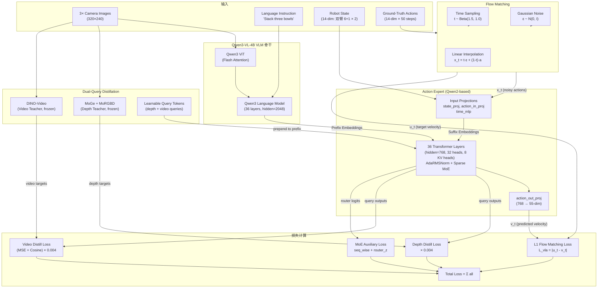
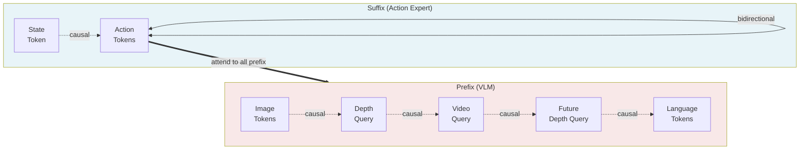
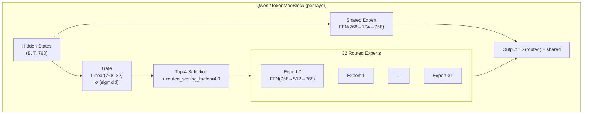
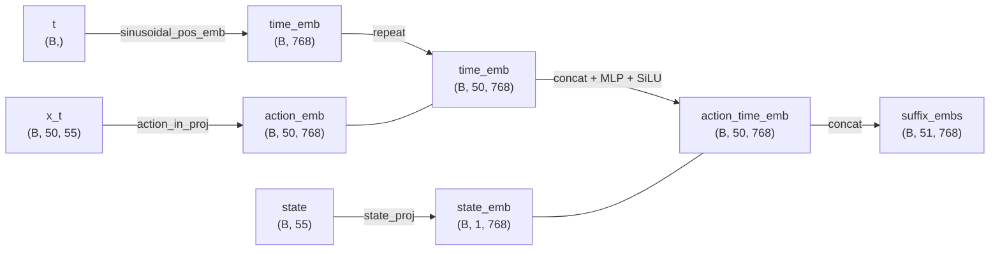
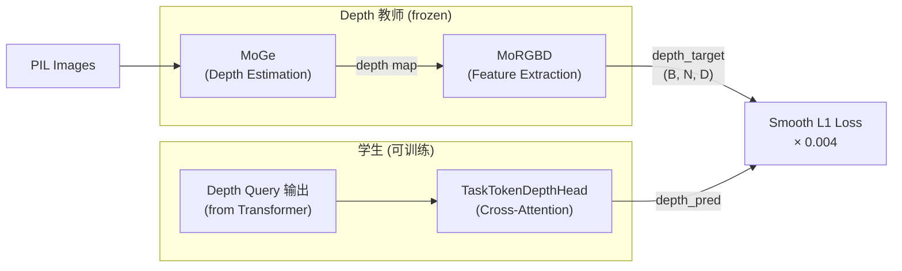
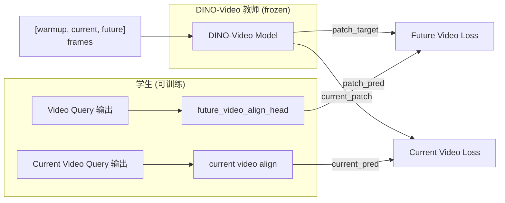
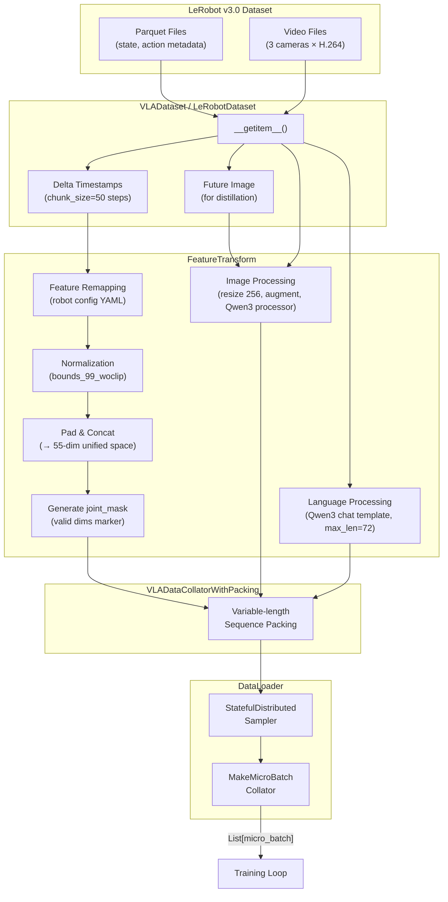
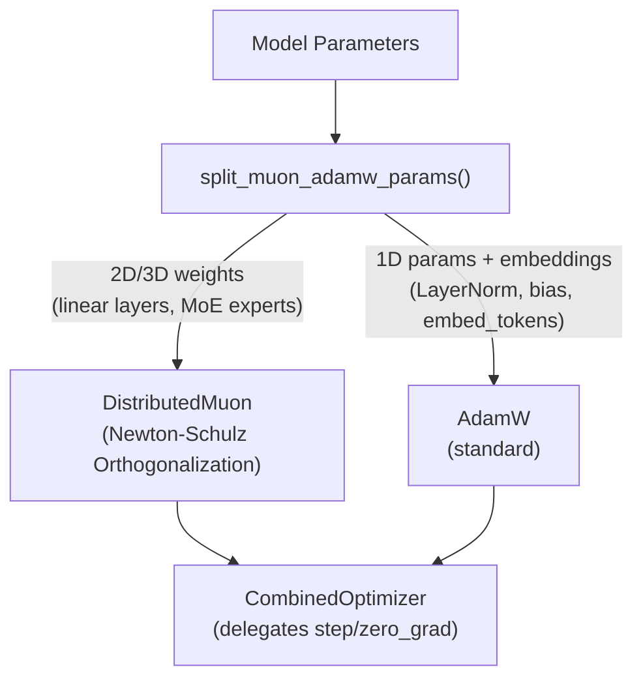
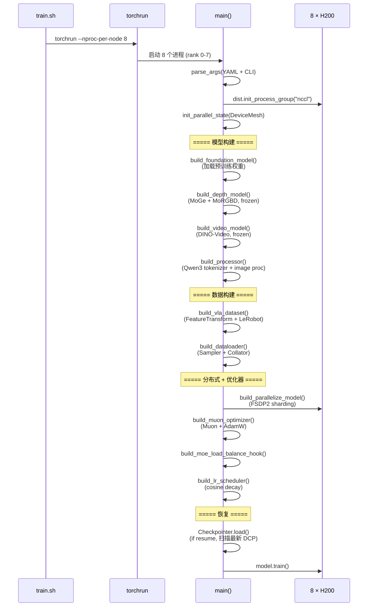
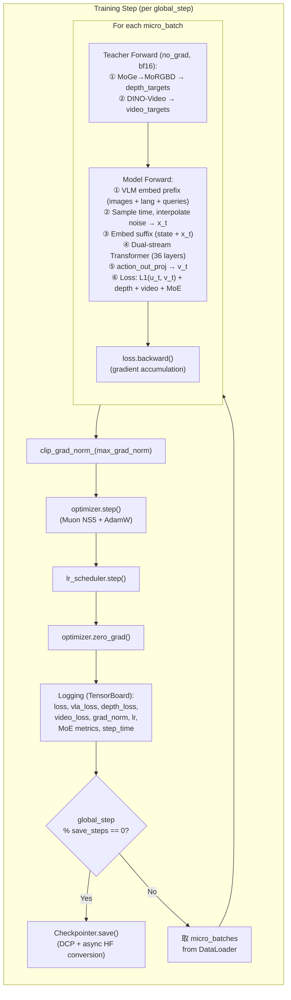

# LingBot-VLA 2.0 单任务微调方案 (Recovered) — stack_bowls_three

> 本文档从执行日志 `reprd_rbtwn_stackb3.md` 与代码库实际代码中恢复的微调设计方案.
> 涵盖模型架构、数据管线、训练配置设计依据、训练流程以及环境搭建.

---

## 1. 概述与目标

### 1.1 微调目标

在预训练的 [lingbot-vla-v2-6b](https://huggingface.co/robbyant/lingbot-vla-v2-6b) 基础上, 使用 RoboTwin 2.0 仿真平台的 `stack_bowls_three` (三碗堆叠) 单任务数据进行 post-training (fine-tune), 使模型在该任务上达到高成功率.

微调保留预训练阶段的全部模型组件 (VLM 骨干、Action Expert、Sparse MoE、Dual-Query Distillation), 仅缩小数据范围 (50 task → 1 task) 和训练规模 (32 GPU → 8 GPU), 其余训练策略沿用预训练配置.

### 1.2 关键配置总览

| 项目 | 值 |
|------|-----|
| 基础模型 | `robbyant/lingbot-vla-v2-6b` (HuggingFace) |
| 模型架构 | Qwen3-VL-4B VLM + 36-layer Action Expert + Sparse MoE (32E/4K) |
| 参数量 | ~6B (VLM 4B + Action Expert ~2B) |
| 微调数据 | `stack_bowls_three`, LeRobot v3.0, 50 ep, 23550 frames |
| 硬件 | 8 × NVIDIA H200 (143 GB VRAM each) |
| micro_batch_size | 16 |
| global_batch_size | 128 (= 16 × 8 GPU) |
| max_steps | 10000 (~54.6 epochs) |
| 优化器 | DistributedMuon + AdamW (CombinedOptimizer) |
| 学习率 | 1e-4 → 5e-5 (cosine decay) |
| 损失函数 | L1 Flow Matching + Depth 蒸馏 + Video 蒸馏 + MoE 辅助损失 |
| 分布式策略 | FSDP2 (per-module sharding, bf16 params, fp32 reduce) |
| Checkpoint | DCP (Distributed Checkpoint), 每 5000 步保存 |

### 1.3 关键路径速查

| 类型 | 路径 |
|------|------|
| 代码仓库 | `/home/physical/SRC/Robot/lingbot-vla-v2` |
| 预训练 VLA 权重 | `/mnt/r/CKPT/lingbot-vla-v2-6b/hf_ckpt/` |
| Qwen3 tokenizer | `/mnt/r/CKPT/Qwen3-VL-4B-Instruct/` |
| MoGe 深度模型 | `/mnt/r/CKPT/moge-2-vitb-normal/moge2-vitb-normal.pt` |
| Depth 教师 (MoRGBD) | `/mnt/r/CKPT/lingbot-vla-v2-6b/depth/model.pt` |
| DINO-Video 教师 | `/mnt/r/CKPT/lingbot-vla-v2-6b/dino_video/teacher_step_10000.pth` |
| 训练数据 | `/mnt/r/DATA/RoboTwin-Clean/stack_bowls_three/` |
| Norm stats | `assets/norm_stats/robotwin.json` (50-task 全局统计) |
| 训练配置 | `configs/vla/robotwin/stack_bowls_three_ft.yaml` |
| Robot 特征映射 | `configs/robot_configs/robotwin.yaml` |
| 训练输出 | `/mnt/r/CKPT/lingbot-vla-v2-ft-stack_bowls_three/` |
| 虚拟环境 | `/mnt/r/VENV/lbvla2/` (Python 3.12.13) |

---

## 2. 模型架构概览

LingBot-VLA v2 是一个 Vision-Language-Action (VLA) 基础模型, 由三大核心组件构成:

1. **Qwen3-VL-4B VLM 骨干** — 编码图像和语言指令
2. **Action Expert** — 36 层 Transformer + Sparse MoE, 通过 Flow Matching 去噪生成动作
3. **Dual-Query Distillation** — 从 Depth 和 Video 教师模型蒸馏几何与时序先验

训练时, VLM 与 Action Expert 以**双流注意力**方式联合前向传播; 教师模型冻结, 只提供蒸馏目标.

### 2.0 整体架构图



**关键代码入口**:
- 模型定义: [modeling_lingbot_vla_v2.py](lingbotvla/models/vla/lingbot_vla/modeling_lingbot_vla_v2.py) — `LingbotVlaV2Policy` (L1198), `FlowMatchingV2` (L429), `QwenvlWithExpertV2Model` (L121)
- 训练入口: [train_lingbotvla.py](tasks/vla/train_lingbotvla.py) — `main()` (L332)

### 2.1 双流注意力机制

LingBot-VLA v2 采用**双流 (Dual-Stream) 注意力**设计: VLM 骨干和 Action Expert 各自维护独立的 FFN/MoE 层, 但**共享注意力的 Key-Value**. 具体地, 每一层 Transformer 中:

1. 分别从 VLM 流 (prefix) 和 Action Expert 流 (suffix) 计算各自的 $Q, K, V$
2. 将两个流的 $K, V$ 拼接, 形成全局 KV
3. 各流使用全局 KV 进行注意力计算 (受掩码约束)
4. 注意力输出拆回各自的流, 分别通过各自的 FFN/MoE 层

#### Token 排列与注意力掩码

```
Prefix (VLM 流):
  [img_tokens (N_img)] [depth_query (8)] [video_query (8)] [future_depth_query (8)] [lang_tokens (≤72)]

Suffix (Action Expert 流):
  [state_token (1)] [noisy_action_tokens (50)]
```

注意力掩码结构:



| 区域 | 注意力模式 | 说明 |
|------|-----------|------|
| Prefix → Prefix | **Causal** (`vlm_causal=true`) | 图像 token 间 causal, query 和语言 token 也 causal |
| Suffix: State → State | **Causal** | State token 只能看到自己 |
| Suffix: Actions → Actions | **Bidirectional** | 动作 token 间全双向注意力 (flow matching 需要) |
| Suffix → Prefix | **Full cross-attention** | 所有 suffix token 可看到所有 prefix token |
| Prefix → Suffix | **Blocked** | Prefix token 不能看 suffix token |

这一设计使得:
- VLM 可以像标准语言模型一样处理图像和语言 (causal)
- 动作 token 可以利用所有视觉和语言信息 (cross-attention)
- 动作 token 间的双向注意力让 flow matching 的去噪过程可以利用全序列上下文

**代码位置**: 掩码构建在 [modeling_lingbot_vla.py:1161-1168](lingbotvla/models/vla/lingbot_vla/modeling_lingbot_vla.py#L1161-L1168) (`embed_suffix`), 双流 forward 在 [modeling_lingbot_vla_v2.py:311](lingbotvla/models/vla/lingbot_vla/modeling_lingbot_vla_v2.py#L311) (`QwenvlWithExpertV2Model.forward`).

**位置编码**: 使用 Qwen3 的 **mRoPE (Multimodal Rotary Position Embedding)** — 3D 位置编码 (temporal, height, width), 对图像 token 使用空间坐标, 对文本和动作 token 使用序列坐标. 代码位置: [modeling_lingbot_vla_v2.py:831](lingbotvla/models/vla/lingbot_vla/modeling_lingbot_vla_v2.py#L831) (`_build_full_position_ids`).

**注意力实现**: `attention_implementation=flex_cached` — 使用 PyTorch FlexAttention, 第 0 层构建 `BlockMask` 并缓存, 后续层复用, 避免重复构建掩码的开销. 代码位置: [flex_attention.py](lingbotvla/models/vla/lingbot_vla/flex_attention.py).

### 2.2 Sparse MoE 设计

Action Expert 的每一层 Transformer (共 36 层) 都将标准 MLP 替换为 **Sparse Mixture-of-Experts (MoE)** 层, 采用 DeepSeek-V3 风格的设计:



| 参数 | 值 | 说明 |
|------|-----|------|
| `token_num_experts` | 32 | 每层路由专家数 |
| `token_top_k` | 4 | 每 token 激活的专家数 |
| `token_moe_intermediate_size` | 512 | 路由专家 FFN 中间维度 |
| `token_shared_intermediate_size` | 704 | 共享专家 FFN 中间维度 |
| `router_activation` | `sigmoid` | 路由激活函数 (非 softmax) |
| `routed_scaling_factor` | 4.0 | 路由权重缩放因子 |
| `use_shared_expert_gate` | `false` | 共享专家无门控 (直接加) |
| `moe_implementation` | `fused` | Triton 融合核实现 |
| `token_moe_layers` | `[0..35]` | 全部 36 层都用 MoE |

#### 负载均衡策略

| 机制 | 参数 | 微调值 | 说明 |
|------|------|--------|------|
| Loss-free bias | `bias_update_speed` | **0** | 微调时冻结 bias, 沿用预训练学到的值 |
| Sequence-wise loss | `sequence_wise_loss_coeff` | 1e-3 | 每个序列内专家负载均衡辅助损失 |
| Router z-loss | `router_z_loss_coeff` | 1e-4 | 限制路由 logit 幅度, 防止路由坍缩 |

**Expert LR Scaling**: 路由专家参数使用放大的学习率:

$$\text{expert\_lr} = \text{lr} \times \sqrt{\frac{N_{\text{experts}}}{K_{\text{top}}}} = 10^{-4} \times \sqrt{\frac{32}{4}} \approx 2.83 \times 10^{-4}$$

其中 $N_{\text{experts}}=32$ 为专家总数, $K_{\text{top}}=4$ 为每 token 激活专家数. 这一缩放补偿了稀疏激活导致的每个专家参数更新频率低的问题.

**代码位置**: MoE 层安装在 [modeling_lingbot_vla_v2.py:170](lingbotvla/models/vla/lingbot_vla/modeling_lingbot_vla_v2.py#L170) (`_install_moe_blocks`), Expert LR scaling 在 [train_lingbotvla.py:69](tasks/vla/train_lingbotvla.py#L69) (`get_moe_param_groups`), 负载均衡 hook 在 [moe_load_balance.py](lingbotvla/models/vla/lingbot_vla/moe_load_balance.py) (`build_moe_load_balance_hook`).

### 2.3 Flow Matching 训练机制

LingBot-VLA v2 使用 **Flow Matching** 进行动作生成: 将动作预测建模为从噪声到真实动作的概率流 ODE, 训练时学习速度场 (velocity field), 推理时通过 Euler 积分逐步去噪.

#### 训练时流程

**Step 1 — 时间采样**: 从 Beta 分布采样时间步 $t$:

$$t \sim \text{Beta}(1.5, 1.0) \times 0.999 + 0.001 \in [0.001, 1.0]$$

Beta(1.5, 1.0) 分布偏向较大的 $t$ 值 (接近纯噪声), 使模型更多地学习去噪的早期阶段. 加 0.001 的偏移避免 $t=0$ 的退化情况.

**代码**: [modeling_lingbot_vla.py:1055-1058](lingbotvla/models/vla/lingbot_vla/modeling_lingbot_vla.py#L1055-L1058)
```python
def sample_time(self, bsize, device):
    time_beta = sample_beta(1.5, 1.0, bsize, device)
    time = time_beta * 0.999 + 0.001
    return time.to(dtype=torch.float32, device=device)
```

**Step 2 — 噪声插值**: 在真实动作 $a$ 和高斯噪声 $\varepsilon \sim \mathcal{N}(0, I)$ 之间进行线性插值:

$$x_t = t \cdot \varepsilon + (1 - t) \cdot a$$

其中 $x_t$ 是时间步 $t$ 处的带噪动作. 当 $t \to 0$ 时 $x_t \to a$ (纯动作), 当 $t \to 1$ 时 $x_t \to \varepsilon$ (纯噪声).

**Step 3 — 目标速度 (velocity target)**: 模型需要学习的速度场为:

$$u_t = \varepsilon - a$$

这是从动作到噪声的方向向量, 与时间无关.

**代码**: [modeling_lingbot_vla_v2.py:792-794](lingbotvla/models/vla/lingbot_vla/modeling_lingbot_vla_v2.py#L792-L794)
```python
time_expanded = time[:, None, None]
x_t = time_expanded * noise + (1 - time_expanded) * actions
u_t = noise - actions
```

**Step 4 — 损失计算**: 模型输出预测速度 $v_t$, 与目标 $u_t$ 计算 L1 损失:

$$\mathcal{L}_{\text{vla}} = \frac{1}{|\mathcal{M}|} \sum_{(i,j) \in \mathcal{M}} |u_t^{(i,j)} - v_t^{(i,j)}|$$

其中 $\mathcal{M}$ 为 `joint_mask` 指定的有效维度集合 (55 维 unified space 中实际使用的维度).

**代码**: [modeling_lingbot_vla_v2.py:908-911](lingbotvla/models/vla/lingbot_vla/modeling_lingbot_vla_v2.py#L908-L911) (flow matching loss), [modeling_lingbot_vla_v2.py:1290-1298](lingbotvla/models/vla/lingbot_vla/modeling_lingbot_vla_v2.py#L1290-L1298) (joint mask application)
```python
# Flow matching loss
if loss_type == "L1_fm":
    losses = F.l1_loss(u_t, v_t, reduction="none")

# Joint mask application (in LingbotVlaV2Policy.forward)
masked_losses = losses * joint_mask
loss_vla = masked_losses.sum() / joint_mask.sum().clamp(min=1)
```

**L1 vs MSE**: RoboTwin 仿真数据使用 `L1_fm` (L1 损失), 而真实机器人数据使用 `fm` (MSE 损失). L1 对异常值更鲁棒, 适合仿真数据中动作分布较尖锐的场景.

#### Suffix Embedding 构建

State 和 noisy actions 在进入 Action Expert 前经过投影:



其中 `sinusoidal_pos_emb` 使用参数 `min_period=4e-3, max_period=4.0`, 使 $t \in [0.001, 1.0]$ 范围内的时间步获得丰富的频率表示.

**代码**: [modeling_lingbot_vla.py:1126-1169](lingbotvla/models/vla/lingbot_vla/modeling_lingbot_vla.py#L1126-L1169) (`embed_suffix`)

#### AdaRMSNorm 时间步条件

当 `adanorm_time=true` 时, Action Expert 的 RMSNorm 层被替换为 **AdaRMSNorm**, 将时间步 embedding 作为条件信号注入:

$$\text{AdaRMSNorm}(x, t) = \text{RMSNorm}(x) \odot (1 + \gamma(t))$$

其中 $\gamma(t)$ 是时间步 $t$ 经过线性变换得到的 scale 向量, $\odot$ 表示逐元素乘. 这使 Action Expert 能根据去噪进度动态调整内部表示, 类似 Diffusion Transformer (DiT) 中的 AdaLN.

### 2.4 双查询蒸馏 (Dual-Query Distillation)

LingBot-VLA v2 通过在 Transformer prefix 中插入**可学习的 query token**, 从冻结的教师模型蒸馏几何和时序先验. 这是论文的核心创新之一.

#### 2.4.1 Query Token 设计

每种蒸馏任务有独立的 learnable embedding:

| Query 类型 | 参数 | shape | 说明 |
|-----------|------|-------|------|
| `depth_align_embs` | Current depth | (256, 2560) | 当前帧深度查询 |
| `future_depth_align_embs` | Future depth | (256, 2560) | 未来帧深度查询 |
| `future_video_align_embs` | Future video | (256, 2560) | 未来帧视频查询 |
| `current_video_align_embs` | Current video | (256, 2560) | 当前帧视频查询 |

其中 `num_backbone_tokens=256` 是原始 query 数, `dim_out=2560` 是 VLM hidden dimension. 每组 query 经过 reshape + mean pooling 压缩为 `num_task_tokens=8` 个 token:

$$\text{query\_tokens} = \text{mean}(\text{reshape}(W_{256 \times 2560}, [8, 32, 2560]), \text{dim}=1) \in \mathbb{R}^{8 \times 2560}$$

当 `share_future_depth_query=true` 且 `use_shared_future_task_proj=true` 时, future depth 和 future video 的 query 共享并通过线性投影融合:

$$q_{\text{future}} = \text{Linear}([q_{\text{f\_depth}}; q_{\text{f\_video}}]) \in \mathbb{R}^{8 \times 2560}$$

类似地, `use_current_shared_task_proj=true` 时 current depth 和 current video 也共享:

$$q_{\text{current}} = \text{Linear}([q_{\text{c\_depth}}; q_{\text{c\_video}}]) \in \mathbb{R}^{8 \times 2560}$$

#### 2.4.2 Prefix 中的 Query 排列

```
[image_tokens] [current_shared_query (8)] [future_video_query (8)?] [future_shared_query (8)] [language_tokens]
```

这些 query token 参与 Transformer 的注意力计算, 通过与 image/language token 的交互学习到蒸馏信号.

#### 2.4.3 Depth 蒸馏



- **MoGe**: 单目深度估计模型, 从 RGB 图像预测深度图
- **MoRGBD**: 从深度图提取特征 token (B, N, D)
- **TaskTokenDepthHead**: 交叉注意力头, 将 query token 输出与 image embedding 结合, 预测 depth 特征
- **Current + Future**: 分别对当前帧和未来帧计算 depth target, 各自有独立的蒸馏损失

损失权重:
- $\alpha_{\text{depth}} = 0.004$ (current depth)
- $\alpha_{\text{f\_depth}} = 0.004$ (future depth)

**代码**: `get_depth_target()` 在 [module_utils.py](lingbotvla/models/vla/vision_models/module_utils.py), `depth_emb_forward()` 在 [modeling_lingbot_vla.py](lingbotvla/models/vla/lingbot_vla/modeling_lingbot_vla.py), depth head 在 [depth_head.py](lingbotvla/models/vla/vision_models/align_heads/depth_head.py).

#### 2.4.4 Video 蒸馏



Video 蒸馏使用 DINO-Video 教师模型, 输入 `[warmup, current, future]` 三帧 (当 `use_warmup_frame=true`):

| 损失分量 | 权重 | 公式 |
|---------|------|------|
| MSE loss | 1.0 | $\|\hat{f} - f^*\|_2^2$ |
| Cosine loss | 0.2 | $1 - \cos(\hat{f}, f^*)$ |
| CLS loss | 0 (禁用) | — |

总 video 蒸馏损失:

$$\mathcal{L}_{\text{f\_video}} = (\mathcal{L}_{\text{MSE}} \times 1.0 + \mathcal{L}_{\text{cosine}} \times 0.2 + \mathcal{L}_{\text{current\_video}}) \times 0.004$$

其中 $\hat{f}$ 为学生预测的特征, $f^*$ 为教师模型输出的目标特征.

**代码**: `get_video_target()` 在 [module_utils.py](lingbotvla/models/vla/vision_models/module_utils.py), `video_emb_forward()` 和 `current_video_emb_forward()` 在 [modeling_lingbot_vla.py](lingbotvla/models/vla/lingbot_vla/modeling_lingbot_vla.py).

### 2.5 总损失

训练时的总损失为:

$$\boxed{\mathcal{L}_{\text{total}} = \mathcal{L}_{\text{vla}} + \alpha_d \mathcal{L}_{\text{depth}} + \alpha_{fd} \mathcal{L}_{\text{f\_depth}} + \alpha_{fv} \mathcal{L}_{\text{f\_video}} + \beta_s \mathcal{L}_{\text{seq\_wise}} + \beta_z \mathcal{L}_{\text{router\_z}}}$$

| 符号 | 含义 | 值 |
|------|------|-----|
| $\mathcal{L}_{\text{vla}}$ | Flow matching 动作预测损失 (L1) | — |
| $\mathcal{L}_{\text{depth}}$ | 当前帧深度蒸馏 (smooth L1) | — |
| $\mathcal{L}_{\text{f\_depth}}$ | 未来帧深度蒸馏 | — |
| $\mathcal{L}_{\text{f\_video}}$ | 未来帧视频蒸馏 (MSE + cosine) | — |
| $\mathcal{L}_{\text{seq\_wise}}$ | MoE 序列级负载均衡辅助损失 | — |
| $\mathcal{L}_{\text{router\_z}}$ | MoE 路由 z-loss | — |
| $\alpha_d, \alpha_{fd}, \alpha_{fv}$ | 蒸馏损失权重 | 0.004 |
| $\beta_s$ | seq_wise 损失系数 | $10^{-3}$ |
| $\beta_z$ | router z-loss 系数 | $10^{-4}$ |

**代码**: [modeling_lingbot_vla_v2.py:1305-1312](lingbotvla/models/vla/lingbot_vla/modeling_lingbot_vla_v2.py#L1305-L1312)
```python
total_loss = (
    loss_vla
    + loss_depth
    + loss_future_depth
    + loss_future_video
    + seq_wise_loss
    + router_z_loss
)
```

---

## 3. 数据管线

### 3.1 数据源

| 属性 | 值 |
|------|-----|
| 数据集 | `stack_bowls_three` (RoboTwin 2.0 仿真) |
| 格式 | LeRobot v3.0 (Parquet + Video) |
| Episodes | 50 |
| 总帧数 | 23,550 |
| 相机数 | 3 (cam_high, cam_left_wrist, cam_right_wrist) |
| 图像分辨率 | 320 × 240 |
| State/Action dim | 14 (双臂: 6 joint + 1 gripper per arm) |
| 控制频率 | 由 LeRobot 元数据指定 (通常 10-50 Hz) |

### 3.2 数据处理流水线



### 3.3 Feature Transform 详解

Feature Transform 是连接 LeRobot 原始数据格式与模型 55 维 unified action space 的关键桥梁.

#### 3.3.1 特征重映射 (Feature Remapping)

RoboTwin 的原始 state/action 为 14 维向量 (双臂各 7 维: 6 关节角 + 1 夹爪). 通过 robot config YAML ([configs/robot_configs/robotwin.yaml](configs/robot_configs/robotwin.yaml)) 映射到模型的**标准化关节名**:

```yaml
# configs/robot_configs/robotwin.yaml
states:
  - observation.state.arm.position:      # 14-dim
      origin_keys:
        - observation.state: {start: 0, end: 6}    # 左臂 6 关节
        - observation.state: {start: 7, end: 13}   # 右臂 6 关节

  - observation.state.effector.position: # 2-dim
      origin_keys:
        - observation.state: {start: 6, end: 7}    # 左夹爪
        - observation.state: {start: 13, end: 14}   # 右夹爪

actions:
  - action.arm.position: {origin_keys: [...]}      # 同理
  - action.effector.position: {origin_keys: [...]}  # 同理

images:
  - observation.images.camera_top:        {origin_keys: observation.images.cam_high}
  - observation.images.camera_wrist_left: {origin_keys: observation.images.cam_left_wrist}
  - observation.images.camera_wrist_right:{origin_keys: observation.images.cam_right_wrist}
```

映射后的关节结构:

| 标准关节名 | 维度 | 来源 |
|-----------|------|------|
| `arm.position` | 14 | state[0:6] + state[7:13] |
| `effector.position` | 2 | state[6:7] + state[13:14] |

**代码**: [utils.py:66](lingbotvla/data/vla_data/utils.py#L66) (`FeatureTransform.__init__`), [utils.py:375](lingbotvla/data/vla_data/utils.py#L375) (`FeatureTransform.apply`)

#### 3.3.2 归一化 (Normalization)

使用 `bounds_99_woclip` 方案, 基于预计算的 q01/q99 分位数将数值映射到 $[-1, 1]$:

$$\hat{x} = \frac{x - q_{01}}{q_{99} - q_{01}} \times 2 - 1$$

其中 $q_{01}$ 和 $q_{99}$ 分别是该维度在训练数据上的第 1 和第 99 百分位数. **不做 clipping** (即 $\hat{x}$ 可以超出 $[-1, 1]$), 以保留极端值的信息.

归一化统计量来自 `assets/norm_stats/robotwin.json`, 这是覆盖 50 个 RoboTwin 任务的全局统计, `stack_bowls_three` 是其中之一.

**代码**: [transform.py:42](lingbotvla/data/vla_data/transform.py#L42) (`Normalizer` class)

#### 3.3.3 Pad & Concat (→ 55 维 unified space)

训练配置中定义了模型的关节空间:

```yaml
# stack_bowls_three_ft.yaml
joints:
  - arm.position: 14       # max_dim=14
  - end.position: 14       # max_dim=14 (未使用, 全零 padding)
  - effector.position: 2   # max_dim=2
# → total: 14 + 14 + 2 = 30
# action_dim / max_action_dim = 55 (配置值)
```

每个关节先 pad 到其 `max_dim`, 然后所有关节拼接. 最终向量为 55 维 (不足部分用零填充). 同时生成 `joint_mask` (shape `[B, 50, 55]`): 有效维度为 1, padding 维度为 0. 损失计算时只对 `joint_mask=1` 的维度计算.

**代码**: [utils.py:546](lingbotvla/data/vla_data/utils.py#L546) (`pad_and_concat`)

### 3.4 Action Chunking

每次取 `chunk_size=50` 步动作序列 (通过 LeRobot 的 `delta_timestamps` 机制). 模型一次预测 50 步动作, 推理时使用前 `use_length=20` 步 (每 20 步重新推理一次).

### 3.5 图像预处理

1. **Resize** to `img_size=256` (model 输入分辨率)
2. **数据增广**: brightness / contrast / saturation jittering
3. **Qwen3-VL Image Processor**: ImageNet 归一化, 计算 `grid_thw` (temporal, height, width 网格参数), 生成 ViT 输入 tensor
4. **Depth 蒸馏**: 使用 PIL 原图 (resize 到 224×224), 直接送入 MoGe/MoRGBD

当 `use_future_image=true` 时, 额外取 `chunk_size-1` 步后的未来帧, 用于 depth 和 video 蒸馏的 future target 计算.

### 3.6 语言指令处理

使用 Qwen3 chat template 将语言指令 tokenize:

- `prompt_type=global`: 使用任务级全局指令 (如 "Stack three bowls")
- `tokenizer_max_length=72`: 最大 token 长度, 不足补 padding, 超出截断

### 3.7 DataLoader 与 Packing

| 组件 | 类 | 说明 |
|------|-----|------|
| Dataset | `VLADataset` | 单任务数据集, 包裹 `LeRobotDataset` |
| Collator | `VLADataCollatorWithPacking` | 变长序列 packing, 减少 padding 浪费 |
| Micro-batch | `MakeMicroBatchCollator` | 将 global batch 切分为 micro-batch 用于 gradient accumulation |
| Sampler | `StatefulDistributedSampler` | FSDP2 分布式采样, 支持断点续训 (保存/恢复 sampler state) |

DataLoader 参数: `num_workers=8`, `pin_memory=True`, `drop_last=True`.

Gradient accumulation: `global_batch_size / (micro_batch_size × dp_size) = 128 / (16 × 8) = 1` (本配置无 accumulation).

**代码**: Dataset 在 [base_dataset.py:152](lingbotvla/data/vla_data/base_dataset.py#L152), Collator 在 [data_collator.py:283](lingbotvla/data/multimodal/data_collator.py#L283), DataLoader 在 [data_loader.py](lingbotvla/data/data_loader.py).

---

## 4. 训练配置设计

### 4.1 超参数选择与依据

| 参数 | 预训练值 (50 task / 32 GPU) | 微调值 (1 task / 8 GPU) | 微调选择依据 |
|------|--------------------------|------------------------|-------------|
| `micro_batch_size` | 32 | **16** | H200 143GB, gradient checkpointing 后实测 ~57GB, batch=16 充足 |
| `global_batch_size` | 1024 | **128** | 16 × 8 GPU = 128, 无 gradient accumulation |
| `max_steps` | 50000 | **10000** | 单任务 23550 frames, 每 epoch ~183 steps, 10000 steps ≈ 54.6 epochs |
| `save_steps` | 10000 | **5000** | 增加中间 checkpoint 频率, 可在 step 5000 处检查 |
| `lr` | 1e-4 | **1e-4** | 沿用预训练学习率 (post_training=true 模式) |
| `lr_min` | 5e-5 | **5e-5** | cosine decay 终点 |
| `loss_type` | L1_fm | **L1_fm** | RoboTwin 仿真数据统一用 L1 |
| `use_compile` | true | **false** | 微调发现 torch.compile 导致 rank0 静默崩溃, 禁用 |
| `enable_gradient_checkpointing` | false | **true** | 8 GPU 场景, 通过重计算换显存 |
| `norm_stats` | robotwin.json | **robotwin.json** | 使用 50-task 全局统计 (stack_bowls_three 是其子集) |
| `optimizer` | muon | **muon** | DistributedMuon + AdamW |
| `freeze_vision_encoder` | false | **false** | 全参数微调 (VLM ViT 也参与训练) |
| `moe_monitor_interval` | 1000 | **500** | 微调训练短, 增加 MoE 监控密度 |

### 4.2 优化器: DistributedMuon + AdamW

LingBot-VLA v2 使用 **CombinedOptimizer**, 将两种优化器组合:



#### Muon 优化器

Muon (Momentum + Orthogonalization via Newton-Schulz) 是一种新型优化器, 对 2D/3D 权重矩阵的梯度进行正交化处理后再更新:

1. **梯度收集**: 对 FSDP2 分片的参数, 将同 shape 的参数 mega-batch 为单个 tensor, 一次 NCCL all-gather
2. **Newton-Schulz 正交化**: 5 步 quintic Newton-Schulz 迭代, 系数 $a=3.4445, b=-4.7750, c=2.0315$:

$$X_0 = \frac{G}{\|G\|_F}$$
$$A_k = X_k X_k^T$$
$$X_{k+1} = a \cdot X_k + (b \cdot A_k + c \cdot A_k^2) X_k$$

最终 $X_5$ 近似 $G$ 的最近正交矩阵. 对 3D MoE expert stacks (shape `[E, M, K]`) 使用 batched 版本.

3. **动量更新**: 标准动量 (momentum=0.95)

**代码**: [muon.py:80-125](lingbotvla/optim/muon.py#L80-L125) (`batched_newton_schulz`), [muon.py:259](lingbotvla/optim/muon.py#L259) (`DistributedMuon`), [optimizer.py:192](lingbotvla/optim/optimizer.py#L192) (`CombinedOptimizer`).

#### Expert LR Scaling

路由专家参数使用放大学习率, 非专家参数 (gate, shared expert, VLM) 使用基础学习率:

| 参数组 | LR | 原因 |
|--------|-----|------|
| Routed expert weights (`.layers.*.mlp.experts.*`) | $2.83 \times 10^{-4}$ | 补偿 top-4/32 稀疏激活频率 |
| Gate, shared expert, VLM, projections | $1 \times 10^{-4}$ | 基础学习率 |
| 1D params, embeddings (AdamW) | $1 \times 10^{-4}$ | 基础学习率 |

### 4.3 学习率调度

**Cosine decay with warmup**:

$$\text{lr}(t) = \text{lr}_{\min} + \frac{1}{2}(\text{lr} - \text{lr}_{\min})(1 + \cos(\pi \cdot \frac{t - t_w}{T - t_w}))$$

其中 $t_w$ 为 warmup 结束步数 ($t_w = T \times \text{lr\_warmup\_ratio}$), $T=10000$ 为总步数, $\text{lr}=10^{-4}$, $\text{lr}_{\min}=5 \times 10^{-5}$.

**代码**: [lr_scheduler.py](lingbotvla/optim/lr_scheduler.py) (`build_lr_scheduler`)

### 4.4 分布式策略

| 维度 | 配置 | 说明 |
|------|------|------|
| Data Parallel | FSDP2 | per-module sharding, 8 GPU |
| Module Sharding | `module_fsdp_enable=true` | 按 `_no_split_modules` 分片 |
| VLM Sharding | `vlm_fsdp=true` | VLM 的 Qwen3VLTextDecoderLayer + VisionBlock 也参与 FSDP |
| Mixed Precision | bf16 params + fp32 reduce | `enable_fp32=true` |
| Gradient Checkpointing | `enable_gradient_checkpointing=true` | 重计算中间激活, 节省显存 |
| Expert Parallel | 1 (未启用) | 8 GPU 无 EP |
| Tensor Parallel | 1 (未启用) | — |
| torch.compile | **false** | 微调时禁用, 见 Error-6 |

FSDP2 sharding 策略: 对 `Qwen2DecoderLayer` (Action Expert), `FixQwen2RMSNorm`, `FixAdaRMSNorm` 单独分片; VLM 侧对 `Qwen3VLTextDecoderLayer` 和 `Qwen3VLVisionBlock` 分片.

**代码**: [torch_parallelize.py](lingbotvla/distributed/torch_parallelize.py) (`build_parallelize_model`)

### 4.5 梯度管理

- `max_grad_norm`: 默认梯度裁剪范数
- `decayed_max_grad_norm=1.0`: 在 `stable_train_steps=100000` 步后切换 (本微调 10000 步不会触发)
- FSDP2 使用 `clip_grad_norm_()` 进行全局梯度裁剪
- 当使用 Expert Parallel 时, 调用自定义 `ep_fsdp2_clip_grad_norm` 保证跨 mesh 梯度范数正确计算

---

## 5. 训练流程

### 5.1 初始化序列



### 5.2 单步训练流程



### 5.3 Checkpoint 管理

| 特性 | 说明 |
|------|------|
| 格式 | PyTorch Distributed Checkpoint (DCP) |
| 存储 | `single_file_per_rank=True` — 每个 GPU rank 一个文件 |
| 保存间隔 | 每 5000 步 (step 5000, 10000) |
| 保存内容 | model, optimizer, lr_scheduler, dataloader state, RNG state |
| 路径 | `{output_dir}/checkpoints/global_step_{step}/` |
| Auto-resume | 扫描 checkpoints/ 目录, 按 step 降序尝试加载 |
| HF 转换 | `AsyncHFCheckpointSaver` 后台线程将 DCP 转换为 HuggingFace safetensors 格式 |

**代码**: [checkpointer.py](lingbotvla/checkpoint/checkpointer.py) (`Checkpointer`), HF 转换在 [async_hf_checkpoint.py](lingbotvla/utils/async_hf_checkpoint.py) (`AsyncHFCheckpointSaver`).

---

## 6. 环境搭建

### 6.1 虚拟环境方案

使用 Python 3.12 venv (非 conda), 路径: `/mnt/r/VENV/lbvla2/`.

```bash
# 获取 Python 3.12
conda create -n py312 python=3.12 -y

# 创建 venv
source /mnt/r/miniforge3/etc/profile.d/conda.sh && conda activate py312
python -m venv /mnt/r/VENV/lbvla2
source /mnt/r/VENV/lbvla2/bin/activate
pip install -U pip setuptools wheel
```

### 6.2 依赖安装

```bash
# PyTorch (CUDA 12.8)
pip install torch==2.8.0 torchvision==0.23.0 torchaudio==2.8.0 \
    torchdata==0.11.0 torchcodec==0.6.0

# 项目依赖
pip install -r requirements.txt
pip install -r requirements-depth.txt
pip install -r requirements.txt          # 重新钉住核心版本

# 特殊处理
pip install numpydantic==1.9.0 --no-deps
pip install --no-build-isolation flash-attn==2.8.3
pip install --no-deps "lerobot @ https://github.com/huggingface/lerobot/archive/refs/tags/v0.4.2.tar.gz"

# Editable installs
pip install -e . --no-deps                                              # lingbotvla
pip install -e lingbotvla/models/vla/vision_models/lingbot-depth --no-deps  # depth model
pip install -e lingbotvla/models/vla/vision_models/MoGe                    # MoGe

# 版本钉固
pip install huggingface_hub==0.34.0
pip install numpy==1.26.4    # MoGe 会升级 numpy 到 2.x, 需钉回
```

### 6.3 关键版本

| 包 | 版本 | 说明 |
|----|------|------|
| Python | 3.12.13 | 项目要求 |
| torch | 2.8.0+cu128 | CUDA 12.8 |
| flash-attn | 2.8.3 | FlexAttention 后端 |
| transformers | 4.57.3 | Qwen3-VL 支持 |
| numpy | 1.26.4 | MoGe 兼容性要求 |
| lerobot | 0.4.2 | v3.0 数据格式 |
| huggingface_hub | 0.34.0 | 模型加载 |

---

## 7. 数据准备

### 7.1 权重下载

```bash
export HF_HOME=/mnt/r/CKPT/hf_home
python3 scripts/download_hf_model.py --repo_id robbyant/lingbot-vla-v2-6b \
    --local_dir /mnt/r/CKPT
python3 scripts/download_hf_model.py --repo_id Qwen/Qwen3-VL-4B-Instruct \
    --local_dir /mnt/r/CKPT
python3 scripts/download_hf_model.py --repo_id Ruicheng/moge-2-vitb-normal \
    --local_dir /mnt/r/CKPT
```

**注意**: HuggingFace 仓库的文件布局可能与代码假设的路径不一致, 需要创建 symlink:

```bash
# VLA 权重: 代码期望 model_path 下有 safetensors 文件
mkdir -p /mnt/r/CKPT/lingbot-vla-v2-6b/hf_ckpt
# symlink model-*.safetensors, config.json, tokenizer* 等到 hf_ckpt/

# MoGe: 代码期望文件名为 moge2-vitb-normal.pt
ln -sfn /mnt/r/CKPT/moge-2-vitb-normal/model.pt \
        /mnt/r/CKPT/moge-2-vitb-normal/moge2-vitb-normal.pt
```

### 7.2 数据集格式转换

LeRobot 0.4.2 (`CODEBASE_VERSION=v3.0`) 不接受 v2.1 数据集, 需要转换:

```bash
python -m lerobot.datasets.v30.convert_dataset_v21_to_v30 \
    --repo-id=stack_bowls_three \
    --root=/mnt/r/DATA/RoboTwin-Clean \
    --push-to-hub=false
```

转换后:
- 当前数据: `/mnt/r/DATA/RoboTwin-Clean/stack_bowls_three/` → **v3.0**
- 备份: `/mnt/r/DATA/RoboTwin-Clean/stack_bowls_three_old/` → 原 v2.1

### 7.3 归一化统计量

使用仓库自带的 50-task 全局统计 `assets/norm_stats/robotwin.json`.

> **为何不用单任务统计?** `scripts/compute_norm_stats.py` 在 `num_workers > 1` 时存在多进程死锁问题 (fork Pool + 视频元数据), 且单任务统计量被全局统计覆盖 (stack_bowls_three 是 50 个任务之一). 使用全局统计不影响归一化效果.

### 7.4 训练配置创建

基于 `configs/vla/robotwin/robotwin.yaml` 创建单任务微调配置 `configs/vla/robotwin/stack_bowls_three_ft.yaml`, 主要差异见 [Section 4.1](#41-超参数选择与依据).

完整配置文件内容见 [stack_bowls_three_ft.yaml](configs/vla/robotwin/stack_bowls_three_ft.yaml) (141 行).

---

## 8. 运行与监控

### 8.1 启动训练

```bash
source /mnt/r/VENV/lbvla2/bin/activate
cd /home/physical/SRC/Robot/lingbot-vla-v2

export CUDA_VISIBLE_DEVICES=0,1,2,3,4,5,6,7
export PYTHONFAULTHANDLER=1
export TORCH_SHOW_CPP_STACKTRACES=1
export PYTHONUNBUFFERED=1

setsid bash -c 'bash train.sh tasks/vla/train_lingbotvla.py \
    ./configs/vla/robotwin/stack_bowls_three_ft.yaml \
    --data.norm_stats_file assets/norm_stats/robotwin.json \
    --train.use_compile false \
    > /mnt/r/CKPT/lingbot-vla-v2-ft-stack_bowls_three/train_stdout.log 2>&1' </dev/null &
```

`train.sh` 内部执行:
```bash
torchrun --nnodes=1 --nproc-per-node 8 --node-rank 0 \
    --master-addr=0.0.0.0 --master-port=62500 \
    tasks/vla/train_lingbotvla.py \
    ./configs/vla/robotwin/stack_bowls_three_ft.yaml \
    --data.norm_stats_file assets/norm_stats/robotwin.json \
    --train.use_compile false
```

### 8.2 监控命令

```bash
# 最新训练步数
rg -N 'Step [0-9]+/183' /mnt/r/CKPT/lingbot-vla-v2-ft-stack_bowls_three/train_stdout.log | tail -3

# 进程检查
pgrep -af 'torchrun.*train_lingbotvla|tasks/vla/train_lingbotvla'

# 显存监控
nvidia-smi --query-gpu=index,memory.used,utilization.gpu --format=csv

# TensorBoard
tensorboard --logdir /mnt/r/CKPT/lingbot-vla-v2-ft-stack_bowls_three/runs --port 6006
```

### 8.3 预期训练指标

基于实际运行观测:

| Step | Loss | VLA_Loss | Depth_Loss | FutureVideo_Loss | StepTime |
|------|------|----------|------------|------------------|----------|
| 1 | 0.3850 | 0.3506 | 3.92 | 0.76 | ~19.8s (含初始化) |
| 25 | 0.1597 | 0.1430 | 1.81 | 0.38 | ~3.7s |
| 50 | 0.0991 | 0.0859 | 1.39 | 0.29 | ~3.7s |
| 61 | 0.0869 | 0.0745 | 1.29 | 0.26 | ~3.7s |

- **显存**: ~57 GB / 143 GB per GPU (batch=16, gradient checkpointing, 充足)
- **每步时间**: ~3.7s (首步含初始化 ~20s)
- **总时长**: ~10 小时 (10000 × 3.7s)
- **每 epoch**: ~183 步 (23550 / 128)
- **总 epochs**: ~54.6 (10000 / 183)

### 8.4 TensorBoard 监控指标

| 指标组 | 关键指标 | 说明 |
|--------|---------|------|
| `training/` | loss, vla_loss, depth_loss, future_depth_loss, future_video_loss | 主要损失曲线 |
| `training/` | sequence_wise_loss, router_z_loss | MoE 辅助损失 |
| `training/` | grad_norm, lr, expert_lr | 梯度与学习率 |
| `moe_summary/` | maxvio_avg, minvio_avg, load_cv | MoE 负载均衡健康度 |
| `moe_expert_selection_bar/` | layerXX (每 500 步) | 每层专家选择分布 |
| `moe_topksigmoid_rank0/` | layerXX (每 500 步) | 路由 sigmoid 值分布 |
| `align/` | depth, video, current_video 损失细项 | 蒸馏损失分解 |

---

## 9. 关键代码路径参考

| 文件 | 关键类/函数 | 职责 |
|------|-----------|------|
| [train.sh](train.sh) | — | torchrun 启动包装, GPU 自动检测 |
| [tasks/vla/train_lingbotvla.py](tasks/vla/train_lingbotvla.py) | `main()`, `Arguments`, `get_moe_param_groups()` | 训练入口, 配置解析, MoE LR 分组 |
| [lingbotvla/models/vla/lingbot_vla/modeling_lingbot_vla_v2.py](lingbotvla/models/vla/lingbot_vla/modeling_lingbot_vla_v2.py) | `LingbotVlaV2Policy`, `FlowMatchingV2`, `QwenvlWithExpertV2Model` | V2 模型架构, 双流 forward, MoE 安装 |
| [lingbotvla/models/vla/lingbot_vla/modeling_lingbot_vla.py](lingbotvla/models/vla/lingbot_vla/modeling_lingbot_vla.py) | `FlowMatchingV1`, `sample_time()`, `embed_suffix()`, depth/video heads | V1 基类, flow matching 核心逻辑 |
| [lingbotvla/models/vla/lingbot_vla/qwen2_action_expert.py](lingbotvla/models/vla/lingbot_vla/qwen2_action_expert.py) | `Qwen2ForCausalLM`, `Qwen2TokenMoeBlock`, `Qwen2FusedExperts` | Action Expert 架构, MoE 实现 |
| [lingbotvla/models/vla/lingbot_vla/configuration_lingbot_vla.py](lingbotvla/models/vla/lingbot_vla/configuration_lingbot_vla.py) | `LingbotVLAV2Config` | V2 模型配置 (默认超参) |
| [lingbotvla/models/auto.py](lingbotvla/models/auto.py) | `build_foundation_model()`, `build_processor()` | 模型 & 处理器工厂函数 |
| [lingbotvla/models/config_registry.py](lingbotvla/models/config_registry.py) | `_ConfigRegistry` | config_key → config class 注册表 |
| [lingbotvla/data/vla_data/base_dataset.py](lingbotvla/data/vla_data/base_dataset.py) | `VLADataset`, `LeRobotDataset` | 数据集类 |
| [lingbotvla/data/vla_data/utils.py](lingbotvla/data/vla_data/utils.py) | `FeatureTransform`, `pad_and_concat()` | 特征映射 + pad 到 unified space |
| [lingbotvla/data/vla_data/transform.py](lingbotvla/data/vla_data/transform.py) | `Normalizer` | 归一化 (bounds_99_woclip 等) |
| [lingbotvla/data/multimodal/data_collator.py](lingbotvla/data/multimodal/data_collator.py) | `VLADataCollatorWithPacking` | 变长序列 packing |
| [lingbotvla/data/data_loader.py](lingbotvla/data/data_loader.py) | `build_dataloader()` | DataLoader + Sampler 构建 |
| [lingbotvla/optim/muon.py](lingbotvla/optim/muon.py) | `DistributedMuon`, `batched_newton_schulz()` | Muon 优化器 (NS5 正交化) |
| [lingbotvla/optim/optimizer.py](lingbotvla/optim/optimizer.py) | `build_muon_optimizer()`, `CombinedOptimizer` | 优化器构建 + 组合封装 |
| [lingbotvla/optim/lr_scheduler.py](lingbotvla/optim/lr_scheduler.py) | `build_lr_scheduler()` | cosine/constant LR 调度 |
| [lingbotvla/distributed/torch_parallelize.py](lingbotvla/distributed/torch_parallelize.py) | `build_parallelize_model()` | FSDP2 模型分片 |
| [lingbotvla/distributed/parallel_state.py](lingbotvla/distributed/parallel_state.py) | `ParallelState`, `init_parallel_state()` | DeviceMesh 管理 |
| [lingbotvla/checkpoint/checkpointer.py](lingbotvla/checkpoint/checkpointer.py) | `Checkpointer.save()`, `.load()` | DCP 存取 |
| [lingbotvla/utils/async_hf_checkpoint.py](lingbotvla/utils/async_hf_checkpoint.py) | `AsyncHFCheckpointSaver` | 异步 DCP→HF 转换 |
| [lingbotvla/models/vla/vision_models/module_utils.py](lingbotvla/models/vla/vision_models/module_utils.py) | `build_depth_model()`, `build_video_model()`, `get_depth_target()`, `get_video_target()` | 教师模型加载与目标计算 |
| [lingbotvla/models/vla/lingbot_vla/moe_load_balance.py](lingbotvla/models/vla/lingbot_vla/moe_load_balance.py) | `build_moe_load_balance_hook()` | MoE loss-free 负载均衡 |
| [lingbotvla/schedulers/flow_match.py](lingbotvla/schedulers/flow_match.py) | `FlowMatchScheduler` | 推理时 flow matching 调度 |
| [configs/vla/robotwin/stack_bowls_three_ft.yaml](configs/vla/robotwin/stack_bowls_three_ft.yaml) | — | 微调训练 YAML 配置 |
| [configs/robot_configs/robotwin.yaml](configs/robot_configs/robotwin.yaml) | — | RoboTwin 特征映射 |
| [configs/vla/Training_Config.md](configs/vla/Training_Config.md) | — | 全参数参考文档 |
| [scripts/compute_norm_stats.py](scripts/compute_norm_stats.py) | — | 归一化统计量计算 |

---

## 10. 参考

- **论文**: [From Foundation to Application: Improving VLA Models in Practice](https://arxiv.org/abs/2607.06403) ([HTML](https://arxiv.org/html/2607.06403v1))
- **项目主页**: https://technology.robbyant.com/lingbot-vla-v2
- **GitHub**: https://github.com/Robbyant/lingbot-vla-v2
- **模型权重**: https://huggingface.co/robbyant/lingbot-vla-v2-6b
- **LeRobot**: https://github.com/huggingface/lerobot (v0.4.2)
- **Muon Optimizer**: PyTorch 内置 `torch.optim._muon` (torch ≥ 2.9), 本项目使用自实现 `DistributedMuon` (兼容 torch 2.8)
- **DeepSeek-V3 MoE**: [DeepSeek-V3 Technical Report](https://arxiv.org/abs/2412.19437) — sigmoid routing, loss-free balancing
- **Flow Matching**: [Flow Matching for Generative Modeling](https://arxiv.org/abs/2210.02747) — 概率流 ODE 框架
- **执行日志**: `b/d/reprd_rbtwn_stackb3.md` (本方案恢复的源)
